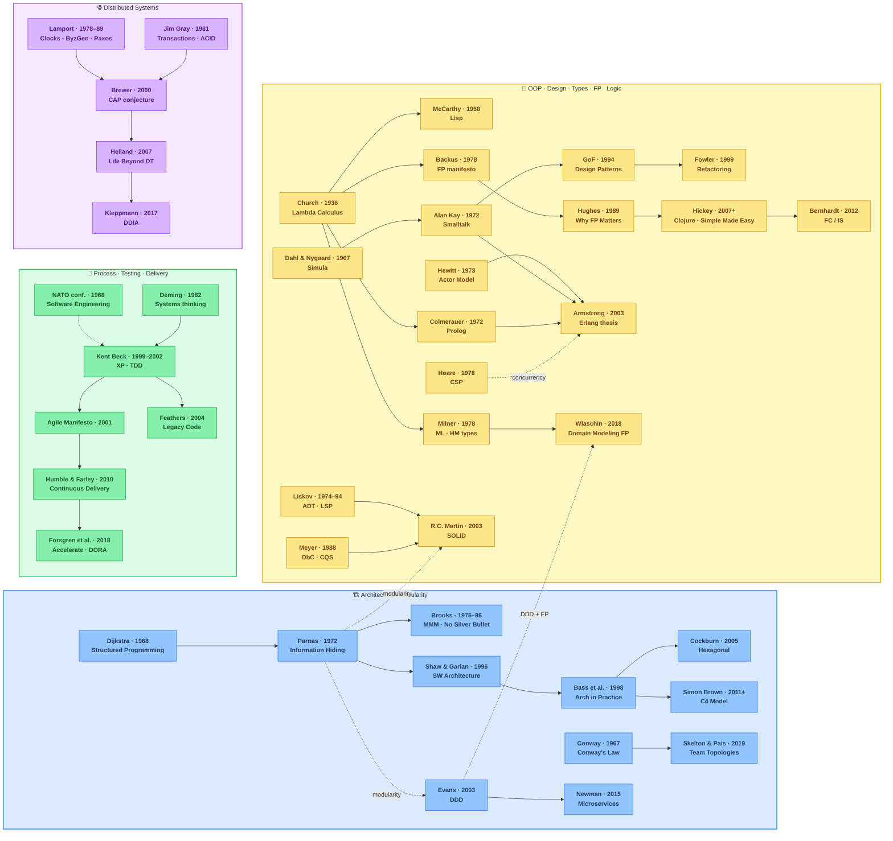

# Software Atlas

A navigable knowledge map of software engineering — ideas, authors, works, languages, paradigms, architecture, and practices.

📖 **Website:** [akardapolov.github.io/software-atlas](https://akardapolov.github.io/software-atlas)

---

## What is this?

Software Atlas is a structured, interconnected reference on how
software development thinking evolved — from lambda calculus (1936)
to modern distributed systems and DevOps practices.

It is **not** a textbook. It is a **navigable map**:

- **Authors** — who shaped the field, with biography cards
- **Works** — papers, books, and talks that became canon
- **Languages** — programming languages as embodiments of ideas
- **Topics** — paradigms, architecture, design, types, FP, testing, delivery, distributed systems
- **Examples** — runnable, comparable code in multiple languages
- **Maps** — visual diagrams showing how everything connects
- **Reading paths** — guided sequences for deep dives

📖 **Documentation site:** [software-atlas.github.io](https://software-atlas.github.io) _(work in progress)_

---

### The Atlas Approach

Software Atlas is organized as a connected map of software ideas.

Instead of treating software knowledge as a single linear curriculum or a fixed taxonomy, the atlas shows how concepts relate to each other across time, context, and practice.

The goal is practical: to help readers move between:

- origins and predecessors
- related ideas and parallel developments
- concrete embodiments in languages, tools, and styles
- trade-offs and design choices
- historical context and later refinements

In this view, a topic is often easier to understand when you can see not only what it is, but also:

- where it came from
- what it reacted to
- what it influenced
- how it was applied in practice
- which neighboring ideas solve similar problems differently

Software knowledge in the atlas is therefore treated as a **graph of connected entities**, not as a single hierarchy.

### What counts as an entity

The atlas includes a small set of entity types:

- **ideas** — concepts, principles, patterns, and models
- **authors** — people who introduced, refined, or popularized ideas
- **works** — papers, books, and talks
- **languages** — programming languages as concrete embodiments of ideas
- **practices** — methods, workflows, and engineering habits

### Typical relationships

Common relationship types include:

- **influenced by**
- **extended by**
- **contrasts with**
- **implemented in**
- **popularized by**
- **applied in**
- **historically preceded by**

These links are meant to support navigation and comparison.  
Some are strong and well documented; others are editorial and meant as helpful context rather than strict historical claims.

### Inclusion policy

The atlas is **selective, not exhaustive**.

An item is usually included when it:

- introduced a new conceptual model,
- formalized an existing idea,
- embodied an idea in a language or tool,
- or significantly popularized it in practice.

This means the atlas is curated. It reflects editorial judgment, and not every connection is treated as equally strong or equally important.

### What the atlas is for

The atlas is meant to support:

- exploration
- comparison
- historical understanding
- cross-linking between theory and practice
- guided reading paths

It is **not** meant to replace textbooks, primary sources, or careful study.  
It is a map for orientation, not a complete theory of software development.

---

## Overview map

The main lineage graph. Four subgraphs represent the primary
**tracks** of the atlas — not strictly disjoint domains, but
convenient lenses for navigation. Dotted edges mark cross-track
connections.

> For a more detailed version with 7 tracks and type annotations see
> [Detailed overview](docs/maps/index.md).



### Overview timeline: Major lineages × era

```mermaid
timeline
    title Overview · Major lineages × era

    section 1936–1967 · Foundations
        FP                        : λ-calculus (Church 1936)
                                  : Lisp (McCarthy 1958)
        OOP                       : Simula (Dahl & Nygaard 1967)
        Architecture              : Conway's Law (1967)

    section 1968–1989 · Formalization
        Process                   : NATO conference — software engineering (1968)
                                  : Royce — phased lifecycle (1970)
        Architecture              : Information Hiding (Parnas 1972)
                                  : Mythical Man-Month (Brooks 1975)
        OOP                       : Smalltalk (Kay 1972)
                                  : Design by Contract (Meyer 1988)
        Types                     : Abstract Data Types (Liskov 1974)
                                  : ML / Hindley–Milner (Milner 1978)
                                  : LSP introduced (Liskov 1987)
        FP                        : FP Manifesto (Backus 1978)
                                  : Why FP Matters (Hughes 1989)
        Concurrency               : Actor Model (Hewitt 1973)
                                  : CSP (Hoare 1978)
                                  : Erlang (Armstrong 1986)
        Logic                     : Prolog (Colmerauer 1972)
        Distributed               : Logical Clocks (Lamport 1978)
                                  : Byzantine Generals (Lamport et al. 1982)
                                  : ACID (Gray 1983)

    section 1990–2005 · Consolidation
        FP                        : Haskell 1.0 (1990)
        Types                     : LSP formalized (Liskov & Wing 1994)
        OOP                       : Design Patterns (GoF 1994)
                                  : Refactoring (Fowler 1999)
                                  : SOLID principles (Martin, 1990s–2000s)
        Architecture              : Shaw & Garlan / Bass et al. (1996 / 1998)
                                  : DDD (Evans 2003)
                                  : Hexagonal Architecture (Cockburn 2005)
        Process                   : Scrum (Schwaber & Sutherland 1995)
                                  : XP / TDD (Beck 1999 / 2002)
                                  : Agile Manifesto (2001)
        Distributed               : Paxos (Lamport 1989; published 1998)
                                  : CAP conjecture (Brewer 2000; formalized 2002)

    section 2006–present · Scaling & operations
        FP                        : Clojure (Hickey 2007)
        Types                     : Ownership / affine types (Rust 2010)
        Architecture              : Microservices (~2011–2015)
                                  : C4 Model (Brown 2011+)
                                  : Team Topologies (Skelton & Pais 2019)
        Process                   : DevOps movement (2009)
                                  : Continuous Delivery (Humble & Farley 2010)
                                  : SRE / DORA (2016 / 2018)
        Concurrency               : Go / channels (2009)
        Distributed               : Dynamo / cloud era (Amazon 2007)
                                  : CRDTs (Shapiro et al. 2011)
                                  : Raft (Ongaro & Ousterhout 2014)
```



> 🔍 **Detailed maps:** [Detailed overview](docs/maps/index.md) ·
> [Ideas evolution](docs/maps/ideas-evolution.md) ·
> [Languages genealogy](docs/maps/languages-genealogy.md) ·
> [Paradigms](docs/maps/paradigms-map.md)

---

## Topics

| # | Topic                                                      | Key ideas                                                              | Details                            |
|---|------------------------------------------------------------|------------------------------------------------------------------------|------------------------------------|
| 1 | [**Paradigms**](docs/topics/paradigms/)                    | Imperative↔Declarative, Procedural/OOP/FP/Logic, Sequential/Concurrent | How we think about computation     |
| 2 | [**Architecture & Modularity**](docs/topics/architecture/) | Layered, Hexagonal, DDD, Microservices, C4                             | How we structure systems           |
| 3 | [**OOP & Design**](docs/topics/design/)                    | SOLID, GoF patterns, Refactoring, DbC                                  | How we design components           |
| 4 | [**Type Systems**](docs/topics/types/)                     | Static/dynamic, nominal/structural, ADTs, generics                     | How types help us reason           |
| 5 | [**Functional Programming**](docs/topics/functional/)      | Purity, immutability, composition, monads                              | How we avoid accidental complexity |
| 6 | [**Concurrency**](docs/topics/concurrency/)                | Threads, CSP, Actors, async/await                                      | How we handle parallelism          |
| 7 | [**Process & Testing**](docs/topics/process/)              | Agile, XP, TDD, CI/CD, DevOps                                          | How we build and ship              |
| 8 | [**Distributed Systems**](docs/topics/distributed/)        | Clocks, CAP, consensus, consistency, streaming                         | How we scale across machines       |

---

## Languages

| Language       | Year | Creator(s)                | Style / model                | Typing             | Page                            | Examples                  |
|----------------|------|---------------------------|------------------------------|--------------------|---------------------------------|---------------------------|
| **Lisp**       | 1958 | John McCarthy             | Functional, symbolic         | Dynamic            | [→](docs/languages/lisp/)       | [→](examples/lisp/)       |
| **Simula**     | 1967 | Dahl, Nygaard             | OOP                          | Static             | [→](docs/languages/simula/)     | —                         |
| **Smalltalk**  | 1972 | Alan Kay et al.           | OOP, message passing         | Dynamic            | [→](docs/languages/smalltalk/)  | —                         |
| **C**          | 1972 | Dennis Ritchie            | Imperative, procedural       | Static, weak       | [→](docs/languages/c/)          | [→](examples/c/)          |
| **ML**         | 1978 | Robin Milner              | Functional                   | Static, inferred   | [→](docs/languages/ml/)         | —                         |
| **Erlang**     | 1986 | Joe Armstrong             | Functional, concurrent       | Dynamic            | [→](docs/languages/erlang/)     | [→](examples/erlang/)     |
| **Haskell**    | 1990 | Committee                 | Functional, pure             | Static, inferred   | [→](docs/languages/haskell/)    | [→](examples/haskell/)    |
| **Python**     | 1991 | Guido van Rossum          | Multi-paradigm               | Dynamic, strong    | [→](docs/languages/python/)     | [→](examples/python/)     |
| **Java**       | 1995 | James Gosling             | OOP, imperative              | Static, nominal    | [→](docs/languages/java/)       | [→](examples/java/)       |
| **Clojure**    | 2007 | Rich Hickey               | Functional, Lisp             | Dynamic, strong    | [→](docs/languages/clojure/)    | [→](examples/clojure/)    |
| **Go**         | 2009 | Pike, Thompson, Griesemer | Imperative, concurrent (CSP) | Static, structural | [→](docs/languages/go/)         | [→](examples/go/)         |
| **Rust**       | 2010 | Graydon Hoare             | Multi-paradigm               | Static, affine     | [→](docs/languages/rust/)       | [→](examples/rust/)       |
| **TypeScript** | 2012 | Anders Hejlsberg          | Multi-paradigm               | Static, structural | [→](docs/languages/typescript/) | [→](examples/typescript/) |

> 📊 **Visual:** [Language genealogy map](docs/maps/languages-genealogy.md)

---

## Authors

| Author                | Years     | Known for                           | Related                  | Page                                       |
|-----------------------|-----------|-------------------------------------|--------------------------|--------------------------------------------|
| Alan Turing           | 1912–1954 | Turing machine, computability       | Foundations              | [→](docs/authors/alan-turing.md)           |
| Alonzo Church         | 1903–1995 | Lambda calculus                     | FP, types                | [→](docs/authors/alonzo-church.md)         |
| John McCarthy         | 1927–2011 | Lisp, AI                            | FP, Lisp                 | [→](docs/authors/john-mccarthy.md)         |
| Ole-Johan Dahl        | 1931–2002 | Simula, OOP                         | OOP                      | [→](docs/authors/ole-johan-dahl.md)        |
| Kristen Nygaard       | 1926–2002 | Simula, OOP                         | OOP                      | [→](docs/authors/kristen-nygaard.md)       |
| Ivan Sutherland       | 1938–     | Sketchpad, computer graphics        | GUI, OOP                 | [→](docs/authors/ivan-sutherland.md)       |
| Christopher Alexander | 1936–2022 | Pattern language, architecture      | Design patterns          | [→](docs/authors/christopher-alexander.md) |
| Dan Ingalls           | 1944–     | Smalltalk, design principles        | Smalltalk, design        | [→](docs/authors/dan-ingalls.md)           |
| Edsger Dijkstra       | 1930–2002 | Structured programming              | Architecture             | [→](docs/authors/edsger-dijkstra.md)       |
| David Maciver         | 1960–     | QuickCheck, property testing        | FP, testing              | [→](docs/authors/david-maciver.md)         |
| David Parnas          | 1941–     | Information hiding, modularity      | Architecture             | [→](docs/authors/david-parnas.md)          |
| Meir Lehman           | 1942–     | Lehman's laws, software evolution   | Process                  | [→](docs/authors/meir-lehman.md)           |
| Barbara Liskov        | 1939–     | CLU, ADT, LSP                       | Types, OOP               | [→](docs/authors/barbara-liskov.md)        |
| Bjarne Stroustrup     | 1950–     | C++, language design                | C++, OOP                 | [→](docs/authors/bjarne-stroustrup.md)     |
| Brad Cox              | 1961–     | Objective-C                         | Objective-C, OOP         | [→](docs/authors/brad-cox.md)              |
| Carl Hewitt           | 1940–2022 | Actor Model                         | Concurrency, distributed | [→](docs/authors/carl-hewitt.md)           |
| Seymour Papert        | 1928–2016 | Logo, constructionism, Mindstorms   | Education, AI            | [→](docs/authors/seymour-papert.md)        |
| Tony Hoare            | 1934–     | CSP, null reference, quicksort      | Concurrency, types       | [→](docs/authors/tony-hoare.md)            |
| Luca Cardelli         | 1954–     | Type systems, objects               | Types, OOP               | [→](docs/authors/luca-cardelli.md)         |
| Fred Brooks           | 1931–2022 | MMM, No Silver Bullet               | Architecture             | [→](docs/authors/fred-brooks.md)           |
| Alan Kay              | 1940–     | Smalltalk, OOP, messaging           | OOP, design              | [→](docs/authors/alan-kay.md)              |
| Grady Booch           | 1955–     | OOAD, UML                           | OOP, design              | [→](docs/authors/grady-booch.md)           |
| Ivar Jacobson         | 1933–     | OOSE, use cases                     | Process, architecture    | [→](docs/authors/ivar-jacobson.md)         |
| James Rumbaugh        | 1947–     | OMT, UML                            | OOP, design              | [→](docs/authors/james-rumbaugh.md)        |
| Erich Gamma           | 1961–     | Design Patterns (GoF), frameworks   | Design, patterns         | [→](docs/authors/erich-gamma.md)           |
| Ralph Johnson         | 1955–     | Design Patterns (GoF), patterns     | Design, patterns         | [→](docs/authors/ralph-johnson.md)         |
| John Vlissides        | 1957–     | Design Patterns (GoF), patterns     | Design, patterns         | [→](docs/authors/john-vlissides.md)        |
| Rebecca Wirfs-Brock   | 1953–     | Designing OO, responsibility-driven | OOP, design              | [→](docs/authors/rebecca-wirfs-brock.md)   |
| Robin Milner          | 1934–2010 | ML, type inference, π-calculus      | Types, FP                | [→](docs/authors/robin-milner.md)          |
| Alain Colmerauer      | 1941–2017 | Prolog, logic programming           | LP, FP                   | [→](docs/authors/alain-colmerauer.md)      |
| John Backus           | 1924–2007 | Fortran, FP manifesto               | FP                       | [→](docs/authors/john-backus.md)           |
| James Gosling         | 1955–     | Java, JVM                           | Java, OOP                | [→](docs/authors/james-gosling.md)         |
| Guido van Rossum      | 1956–     | Python, Python                      | Python, FP               | [→](docs/authors/guido-van-rossum.md)      |
| Yukihiro Matsumoto    | 1965–     | Ruby, Ruby                          | OOP, FP                  | [→](docs/authors/yukihiro-matsumoto.md)    |
| Leslie Lamport        | 1941–     | Logical clocks, Paxos, LaTeX        | Distributed              | [→](docs/authors/leslie-lamport.md)        |
| Jim Gray              | 1944–2007 | Transactions, ACID                  | Distributed, DB          | [→](docs/authors/jim-gray.md)              |
| Bertrand Meyer        | 1950–     | Eiffel, DbC, CQS, OOSC              | OOP, design              | [→](docs/authors/bertrand-meyer.md)        |
| Kurt Gödel            | 1906–1978 | Incompleteness theorems             | Foundations, logic       | [→](docs/authors/kurt-godel.md)            |
| John Hughes           | 1958–     | Why FP Matters, QuickCheck          | FP, testing              | [→](docs/authors/john-hughes.md)           |
| Koen Claessen         | 1961–     | QuickCheck, property testing        | FP, testing              | [→](docs/authors/koen-claessen.md)         |
| Kent Beck             | 1961–     | XP, TDD, JUnit, SUnit               | Process, testing         | [→](docs/authors/kent-beck.md)             |
| Ward Cunningham       | 1944–     | Wiki, technical debt, CRC cards     | Process, design          | [→](docs/authors/ward-cunningham.md)       |
| Martin Fowler         | 1963–     | Refactoring, EAA patterns           | Design, architecture     | [→](docs/authors/martin-fowler.md)         |
| Robert C. Martin      | 1952–     | SOLID, Clean Code                   | Design, OOP              | [→](docs/authors/robert-c-martin.md)       |
| Michael Feathers      | 1964–     | Legacy code, characterization tests | Testing                  | [→](docs/authors/michael-feathers.md)      |
| Mike Cohn             | 1961–     | User stories, INVEST                | Process                  | [→](docs/authors/mike-cohn.md)             |
| Eric Evans            | —         | DDD                                 | Architecture, design     | [→](docs/authors/eric-evans.md)            |
| Alistair Cockburn     | 1953–     | Hexagonal architecture, Agile       | Architecture             | [→](docs/authors/alistair-cockburn.md)     |
| Joe Armstrong         | 1950–2019 | Erlang, let-it-crash                | Concurrency, FP          | [→](docs/authors/joe-armstrong.md)         |
| Rich Hickey           | 1961–     | Clojure, Simple Made Easy           | FP, design               | [→](docs/authors/rich-hickey.md)           |
| David MacIver         | 1960–     | QuickCheck, property testing        | FP, testing              | [→](docs/authors/david-maciver.md)         |
| Sandi Metz            | 1965–     | POODR, Practical OO in Ruby         | OOP, design              | [→](docs/authors/sandi-metz.md)            |
| Scott Wlaschin        | —         | Domain Modeling Made Functional     | FP, DDD                  | [→](docs/authors/scott-wlaschin.md)        |
| Gary Bernhardt        | —         | FC/IS, Boundaries talk              | Design, FP               | [→](docs/authors/gary-bernhardt.md)        |
| Martin Kleppmann      | —         | DDIA                                | Distributed              | [→](docs/authors/martin-kleppmann.md)      |
| Eric Brewer           | —         | CAP conjecture, CAP theorem         | Distributed              | [→](docs/authors/eric-brewer.md)           |
| Diego Ongaro          | —         | Raft consensus algorithm            | Distributed              | [→](docs/authors/diego-ongaro.md)          |
| Sam Newman            | —         | Microservices                       | Architecture             | [→](docs/authors/sam-newman.md)            |
| Simon Brown           | —         | C4 Model, software architecture     | Architecture             | [→](docs/authors/simon-brown.md)           |
| Matthew Skelton       | —         | Team Topologies                     | Process, architecture    | [→](docs/authors/matthew-skelton.md)       |
| Manuel Pais           | —         | Team Topologies                     | Process, architecture    | [→](docs/authors/manuel-pais.md)           |
| Jez Humble            | —         | Continuous Delivery                 | Delivery                 | [→](docs/authors/jez-humble.md)            |
| David Farley          | —         | Continuous Delivery                 | Delivery                 | [→](docs/authors/david-farley.md)          |
| Nicole Forsgren       | —         | Accelerate, DORA                    | Process, delivery        | [→](docs/authors/nicole-forsgren.md)       |
| Gene Kim              | —         | Accelerate, DORA                    | Process, delivery        | [→](docs/authors/gene-kim.md)              |
| Steve Smith           | —         | DORA metrics, DevOps                | Process, SRE             | [→](docs/authors/steve-smith.md)           |

> 📊 **Full list with influence graph:** [Authors index](docs/authors/)

---

## Key works

### 📄 Papers

| Year | Author(s)               | Title                                                          | Topic                  | Local                                                                 | Page                                             |
|------|-------------------------|----------------------------------------------------------------|------------------------|-----------------------------------------------------------------------|--------------------------------------------------|
| 1936 | Church                  | Lambda calculus                                                | FP foundations         | —                                                                     | [→](docs/works/papers/church-1936-lambda.md)     |
| 1968 | Dijkstra                | Go To Considered Harmful                                       | Structured programming | [pdf](https://dl.acm.org/doi/10.1145/362929.362947)                   | [→](docs/works/papers/dijkstra-1968-goto.md)     |
| 1972 | Parnas                  | On the Criteria To Be Used in Decomposing Systems into Modules | Modularity             | [pdf](https://dl.acm.org/doi/10.1145/361598.361623)                   | [→](docs/works/papers/parnas-1972-modules.md)    |
| 1973 | Hewitt, Bishop, Steiger | A Universal Modular ACTOR Formalism                            | Concurrency            | —                                                                     | [→](docs/works/papers/hewitt-1973-actors.md)     |
| 1978 | Backus                  | Can Programming Be Liberated…?                                 | FP                     | [pdf](https://dl.acm.org/doi/10.1145/359576.359579)                   | [→](docs/works/papers/backus-1978-liberated.md)  |
| 1978 | Hoare                   | CSP                                                            | Concurrency            | [pdf](https://dl.acm.org/doi/10.1145/359576.359585)                   | [→](docs/works/papers/hoare-1978-csp.md)         |
| 1978 | Lamport                 | Time, Clocks, and the Ordering of Events…                      | Distributed            | [pdf](https://lamport.azurewebsites.net/pubs/time-clocks.pdf)         | [→](docs/works/papers/lamport-1978-clocks.md)    |
| 1989 | Hughes                  | Why Functional Programming Matters                             | FP                     | [pdf](https://www.cs.kent.ac.uk/people/staff/dat/miranda/whyfp90.pdf) | [→](docs/works/papers/hughes-1989-why-fp.md)     |
| 1994 | Liskov & Wing           | A Behavioral Notion of Subtyping                               | Types, OOP             | [pdf](https://www.cs.cmu.edu/~wing/publications/LiskovWing94.pdf)     | [→](docs/works/papers/liskov-1994-subtyping.md)  |
| 2000 | Brewer                  | CAP conjecture (keynote)                                       | Distributed            | —                                                                     | [→](docs/works/papers/brewer-2000-cap.md)        |
| 2002 | Amazon                  | Dynamo: Amazon's Highly Available Key-value Store              | Distributed            | —                                                                     | [→](docs/works/papers/dynamo-2007-paper.md)      |
| 2007 | Helland                 | Life Beyond Distributed Transactions                           | Distributed            | —                                                                     | [→](docs/works/papers/helland-2007-beyond-dt.md) |
### 📚 Books

| Year | Author(s)              | Title                                                           | Topic                         | Page                                                                 |
|------|------------------------|-----------------------------------------------------------------|-------------------------------|----------------------------------------------------------------------|
| 1936 | Church                 | The Calculi of Lambda-Conversion                                | FP foundations                | [→](docs/works/books/church-1941-calculi.md)                         |
| 1975 | Brooks                 | The Mythical Man-Month                                          | Architecture, process         | [→](docs/works/books/brooks-1975-mmm.md)                             |
| 1980 | Papert                 | Mindstorms                                                      | Education, AI                 | [→](docs/works/books/papert-1980-mindstorms.md)                      |
| 1988 | Hoare                  | Communicating Sequential Processes                              | Concurrency                   | [→](docs/works/books/hoare-1985-csp-book.md)                         |
| 1991 | Jacobson               | Object-Oriented Software Engineering                            | Process, architecture         | [→](docs/works/books/jacobson-1992-oose.md)                          |
| 1992 | Martin                 | Agile Software Development: Principles, Patterns, and Practices | Process                       | [→](docs/works/books/martin-1996-agile-ppp.md)                       |
| 1992 | Metz                   | Practical Object-Oriented Design in Ruby (POODR)                | Design                        | [→](docs/works/books/metz-2012-poodr.md)                             |
| 1994 | GoF                    | Design Patterns                                                 | Design                        | [→](docs/works/books/gof-1994-design-patterns.md)                    |
| 1994 | Cohn                   | User Stories Applied                                            | Process                       | [→](docs/works/books/cohn-2004-user-stories.md)                      |
| 1995 | Stroustrup             | The C++ Programming Language                                    | C++, OOP                      | [→](docs/works/books/stroustrup-1997-cpp-pl.md)                      |
| 1999 | Fowler                 | Refactoring                                                     | Design                        | [→](docs/works/books/fowler-1999-refactoring.md)                     |
| 1999 | Fowler                 | Patterns of Enterprise Application Architecture                 | Architecture                  | [→](docs/works/papers/fowler-2002-poeaa.md)                          |
| 2000 | Rumbaugh               | Object Modeling Technique                                       | OOP, design                   | [→](docs/works/books/rumbaugh-1991-omt.md)                           |
| 2002 | Beck                   | Test-Driven Development: By Example                             | Testing                       | [→](docs/works/books/beck-2002-tdd.md)                               |
| 2002 | Beck & Cunningham      | Using CRC Cards                                                 | Design                        | [→](docs/works/books/beck-cunningham-1989-crc.md)                    |
| 2003 | Evans                  | Domain-Driven Design                                            | Architecture                  | [→](docs/works/books/evans-2003-ddd.md)                              |
| 2003 | Wirfs-Brock            | Designing Object-Oriented Software                              | OOP, design                   | [→](docs/works/books/wirfs-brock-1990-designing-oo.md)               |
| 2003 | Armstrong              | Making Reliable Distributed Systems in Erlang                   | Concurrency, FP               | [→](docs/works/books/armstrong-2003-erlang-thesis.md)                |
| 2003 | Wirfs-Brock & McKim    | Object Design: Roles, Responsibilities, and Collaborations      | OOP, design                   | [→](docs/works/books/wirfs-brock-2003-object-design.md)              |
| 2004 | Feathers               | Working Effectively with Legacy Code                            | Testing                       | [→](docs/works/books/feathers-2004-legacy.md)                        |
| 2005 | Martin                 | UML Distilled                                                   | OOP, design                   | [→](docs/works/books/martin-2003-uml.md)                             |
| 2006 | Martin                 | Clean Code                                                      | Design                        | [→](docs/works/books/martin-2008-clean-code.md)                      |
| 2007 | Gosling                | The Java Language Specification                                 | Java                          | [→](docs/works/books/gosling-2000-java-pl.md)                        |
| 2010 | Humble & Farley        | Continuous Delivery                                             | Delivery                      | [→](docs/works/books/humble-2010-cd.md)                              |
| 2011 | Alexander              | A Pattern Language                                              | Design patterns, architecture | [→](docs/works/books/alexander-1979-timeless-way.md)                 |
| 2012 | Metz                   | Practical Object-Oriented Design in Ruby (2018)                 | Design                        | [→](docs/works/books/metz-2018-poodr.md)                             |
| 2012 | Cardelli & Abadi       | A Theory of Objects                                             | Types, OOP                    | [→](docs/works/books/cardelli-abadi-1996-theory-objects.md)          |
| 2012 | Gamma et al.           | Frameworks and Patterns                                         | Design                        | [→](docs/works/papers/gamma-1993-ecoop-patterns.md)                  |
| 2014 | Gosling et al.         | The Java Language Specification (Java 7)                        | Java                          | [→](docs/works/papers/gosling-1996-jls.md)                           |
| 2014 | Ongaro & Ousterhout    | Elements of Distributed Systems                                 | Distributed                   | [→](docs/works/books/ongaro-ousterhout-2014-elements-distributed.md) |
| 2015 | Newman                 | Building Microservices                                          | Architecture                  | [→](docs/works/books/newman-2015-microservices.md)                   |
| 2016 | Google                 | Site Reliability Engineering                                    | SRE, operations               | [→](docs/works/books/google-2016-sre.md)                             |
| 2017 | Kleppmann              | Designing Data-Intensive Applications                           | Distributed                   | [→](docs/works/books/kleppmann-2017-ddia.md)                         |
| 2018 | Forsgren, Humble & Kim | Accelerate                                                      | Delivery                      | [→](docs/works/books/forsgren-2018-accelerate.md)                    |
| 2018 | Wlaschin               | Domain Modeling Made Functional                                 | FP, DDD                       | [→](docs/works/books/wlaschin-2018-dmf.md)                           |
| 2018 | Ousterhout             | A Philosophy of Software Design                                 | Design                        | [→](docs/works/books/ousterhout-2018-philosophy.md)                  |
| 2019 | Skelton & Pais         | Team Topologies                                                 | Architecture, process         | [→](docs/works/books/skelton-2019-team-topologies.md)                |

### 🎤 Talks

| Year | Author    | Title                        | Topic            | Page                                                  |
|------|-----------|------------------------------|------------------|-------------------------------------------------------|
| 2011 | Hickey    | Simple Made Easy             | Design, FP       | [→](docs/works/talks/hickey-2011-simple-made-easy.md) |
| 2012 | Bernhardt | Boundaries                   | FP, architecture | [→](docs/works/talks/bernhardt-2012-boundaries.md)    |
| 2013 | MacIver   | QuickCheck, property testing | FP, testing      | [→](docs/works/talks/maciver-2013-hypothesis.md)      |

> 📖 **Full bibliography:** [Bibliography](docs/references/bibliography.md) ·
> **Open-access links:** [Open access](docs/references/open-access-links.md)

---

## Code examples

Each language directory contains numbered examples progressing from
basics to more idiomatic features. The goal is not only to show syntax,
but to compare how different languages express the same core ideas.

| #  | Example           | C | Java | Python | Haskell | Go | Rust | Erlang | Clojure | TS |
|----|-------------------|---|------|--------|---------|----|------|--------|---------|----|
| 01 | Hello, World      | ✅ | ✅    | ✅      | ✅       | ✅  | ✅    | ✅      | ✅       | ✅  |
| 02 | Variables & types | ✅ | ✅    | ✅      | ✅       | ✅  | ✅    | ✅      | ✅       | ✅  |
| 03 | Functions         | ✅ | ✅    | ✅      | ✅       | ✅  | ✅    | ✅      | ✅       | ✅  |
| 04 | Control flow      | ✅ | ✅    | ✅      | ✅       | ✅  | ✅    | ✅      | ✅       | ✅  |
| 05 | Data structures   | ✅ | ✅    | ✅      | ✅       | ✅  | ✅    | ✅      | ✅       | ✅  |
| 06 | OOP / modules     | ✅ | ✅    | ✅      | ✅       | ✅  | ✅    | ✅      | ✅       | ✅  |
| 07 | FP features       | ✅ | ✅    | ✅      | ✅       | ✅  | ✅    | ✅      | ✅       | ✅  |
| 08 | Error handling    | ✅ | ✅    | ✅      | ✅       | ✅  | ✅    | ✅      | ✅       | ✅  |
| 09 | Concurrency       | ✅ | ✅    | ✅      | ✅       | ✅  | ✅    | ✅      | ✅       | ✅  |
| 10 | Testing           | ✅ | ✅    | ✅      | ✅       | ✅  | ✅    | ✅      | ✅       | ✅  |

✅ = done · 🔲 = planned

> 📁 **All examples:** [`examples/`](examples/)

---

## Reading paths

Guided sequences for focused study.

| Path                         | Focus                                    | Start         | End            | Page                                                 |
|------------------------------|------------------------------------------|---------------|----------------|------------------------------------------------------|
| 🏗 **Architecture**          | Modularity → Hexagonal → DDD             | Dijkstra 1968 | Skelton 2019   | [→](docs/reading-paths/architecture-path.md)         |
| 🧩 **OOP & Design**          | Simula → Smalltalk → GoF → SOLID         | Dahl 1967     | Metz 2012      | [→](docs/reading-paths/oop-and-design-path.md)       |
| λ **Functional Programming** | Lambda calculus → ML → Haskell → Clojure | Church 1936   | Wlaschin 2018  | [→](docs/reading-paths/fp-path.md)                   |
| 🧪 **Testing & Delivery**    | XP → TDD → CI/CD → DORA                  | Beck 1999     | Forsgren 2018  | [→](docs/reading-paths/testing-and-delivery-path.md) |
| 🌐 **Distributed Systems**   | Clocks → ACID → CAP → Streaming          | Lamport 1978  | Kleppmann 2017 | [→](docs/reading-paths/distributed-systems-path.md)  |

---

## Chronological highlights

```mermaid
timeline
    title Key milestones in software development
    1936 : Church — Lambda calculus
    1958 : McCarthy — Lisp
    1967 : Dahl & Nygaard — Simula
         : Conway — Conway's Law
    1968 : Dijkstra — Go To Considered Harmful
         : NATO Software Engineering Conference
    1972 : Kay — Smalltalk
         : Parnas — Information Hiding
         : Ritchie — C language
         : Colmerauer — Prolog
    1973 : Hewitt — Actor Model
    1974 : Liskov — CLU / ADT
    1978 : Backus — FP manifesto
         : Hoare — CSP
         : Milner — ML
         : Lamport — Logical Clocks
    1981 : Gray — Transaction Processing / ACID
    1982 : Lamport et al. — Byzantine Generals
    1986 : Brooks — No Silver Bullet
         : Armstrong — Erlang
    1988 : Meyer — OOSC / DbC / CQS
    1989 : Hughes — Why FP Matters
         : Lamport — Paxos (circulated; published 1998)
    1990 : Haskell 1.0
    1994 : GoF — Design Patterns
         : Liskov & Wing — Behavioral Subtyping (LSP formalized)
    1995 : Java 1.0
         : Schwaber & Sutherland — Scrum
    1996 : Shaw & Garlan — Software Architecture
    1999 : Beck — Extreme Programming
         : Fowler — Refactoring
    2000 : Brewer — CAP conjecture
    2001 : Agile Manifesto
    2002 : Beck — Test-Driven Development (book)
         : Gilbert & Lynch — CAP theorem formalized
    2003 : Evans — Domain-Driven Design
         : Armstrong — Erlang thesis
         : R.C. Martin — SOLID principles
    2005 : Cockburn — Hexagonal Architecture
    2007 : Hickey — Clojure
         : Amazon — Dynamo paper
         : Helland — Life Beyond Distributed Transactions
    2009 : Go language
         : DevOps movement
    2010 : Humble & Farley — Continuous Delivery
         : Rust announced
    2011 : Hickey — Simple Made Easy
         : Brown — C4 Model
         : Shapiro et al. — CRDTs
    2012 : Bernhardt — Boundaries talk
         : TypeScript announced
    2014 : Ongaro & Ousterhout — Raft
    2017 : Kleppmann — DDIA
    2018 : Forsgren — Accelerate / DORA
         : Wlaschin — Domain Modeling Made Functional
    2019 : Skelton & Pais — Team Topologies
```



> 📊 **Full interactive timeline:** [Master timeline](docs/maps/master-timeline.md)

---

## Glossary

Unified list of abbreviations and terms used in the maps and text above.

| Term      | Full name                                                                                            | Meaning                                                                                                                        |
|-----------|------------------------------------------------------------------------------------------------------|--------------------------------------------------------------------------------------------------------------------------------|
| **ACID**  | Atomicity, Consistency, Isolation, Durability                                                        | Properties that guarantee reliable database transactions.                                                                      |
| **ADT**   | Abstract Data Type                                                                                   | A type defined by its operations, not its representation (Liskov / CLU).                                                       |
| **C4**    | Context, Containers, Components, Code                                                                | Lightweight software architecture visualization model (Simon Brown).                                                           |
| **CAP**   | Consistency, Availability, Partition tolerance                                                       | During a network partition one must choose between C and A. Conjecture by Brewer (2000), formalized by Gilbert & Lynch (2002). |
| **CMM**   | Capability Maturity Model                                                                            | Process maturity framework (SEI, late 1980s).                                                                                  |
| **CRDT**  | Conflict-free Replicated Data Type                                                                   | Data structures that converge across replicas without coordination.                                                            |
| **CQRS**  | Command Query Responsibility Segregation                                                             | Separating write and read models at the architecture level.                                                                    |
| **CSP**   | Communicating Sequential Processes                                                                   | Formal model of concurrency via message-passing channels (Hoare 1978).                                                         |
| **DbC**   | Design by Contract                                                                                   | Method of specifying component obligations via pre/postconditions (Meyer 1988).                                                |
| **CQS**   | Command–Query Separation                                                                             | A method should either change state or return a value, never both (Meyer). Precursor to CQRS.                                  |
| **DDD**   | Domain-Driven Design                                                                                 | Approach to modeling complex systems around the business domain (Evans 2003).                                                  |
| **DDIA**  | Designing Data-Intensive Applications                                                                | Book by Kleppmann (2017) synthesizing modern distributed-systems knowledge.                                                    |
| **DORA**  | DevOps Research and Assessment                                                                       | Research program and metrics for delivery performance (Forsgren et al.).                                                       |
| **ES**    | Event Sourcing                                                                                       | Storing state as an append-only sequence of domain events.                                                                     |
| **FC/IS** | Functional Core / Imperative Shell                                                                   | Architecture pattern: pure logic inside, side-effects at the boundary (Bernhardt 2012).                                        |
| **FP**    | Functional Programming                                                                               | Programming paradigm emphasizing pure functions, immutability, and composition.                                                |
| **GoF**   | Gang of Four                                                                                         | Authors of *Design Patterns* (1994): Gamma, Helm, Johnson, Vlissides.                                                          |
| **HM**    | Hindley–Milner                                                                                       | Type inference algorithm for parametric polymorphism (basis of ML, Haskell).                                                   |
| **LP**    | Logic Programming                                                                                    | Paradigm where programs are facts + rules; execution is proof search (Prolog, Datalog).                                        |
| **LSP**   | Liskov Substitution Principle                                                                        | Subtypes must be substitutable for their base types. Introduced 1987, formalized 1994.                                         |
| **MMM**   | The Mythical Man-Month                                                                               | Book by Fred Brooks (1975) on the non-linear cost of adding people to a late project.                                          |
| **NATO**  | North Atlantic Treaty Organization                                                                   | In this atlas: the 1968 NATO conference that coined the term *software engineering*.                                           |
| **OOP**   | Object-Oriented Programming                                                                          | Programming paradigm centered on objects, messages, and encapsulation.                                                         |
| **REST**  | Representational State Transfer                                                                      | Architectural style for networked applications (Fielding 2000).                                                                |
| **SDLC**  | Software Development Life Cycle                                                                      | General term for the phases of software planning, creation, and maintenance.                                                   |
| **SOLID** | Single Responsibility, Open/Closed, Liskov Substitution, Interface Segregation, Dependency Inversion | Five OOP design principles (R.C. Martin; acronym crystallized early 2000s).                                                    |
| **SRE**   | Site Reliability Engineering                                                                         | Engineering discipline applying software practices to operations (Google; public book 2016).                                   |
| **TDD**   | Test-Driven Development                                                                              | Write a failing test first, make it pass, refactor. Practiced in XP from late 1990s; book by Beck 2002.                        |
| **XP**    | Extreme Programming                                                                                  | Agile methodology emphasizing feedback, simplicity, and technical practices (Beck 1999).                                       |

---

## Local library

This repository includes local copies of **open-access papers only**.
Commercial books are referenced by citation and official sources.

See [Copyright policy](library/README.md) for details.

| Category               | Location                           | Count |
|------------------------|------------------------------------|-------|
| Open-access papers     | `library/open-access-papers/`      | —     |
| Personal reading notes | [`library/notes/`](library/notes/) | —     |

---

## Repository structure

```text
software-atlas/
├── README.md              ← you are here
├── .gitignore
├── CONTRIBUTING.md
├── LICENSE
├── index.html
├── pom.xml
├── docs/
│   ├── index.md
│   ├── maps/              ← visual diagrams and timelines
│   │   ├── index.md       ← maps index and detailed overview
│   │   ├── architecture-map.md
│   │   ├── concurrency-map.md
│   │   ├── ideas-evolution.md
│   │   ├── languages-genealogy.md
│   │   ├── master-timeline.md
│   │   ├── paradigms-map.md
│   │   └── process-map.md
│   ├── topics/            ← knowledge organized by topic
│   ├── languages/         ← language pages
│   ├── authors/           ← author biography cards
│   ├── works/             ← papers, books, talks
│   ├── reading-paths/     ← guided study sequences
│   ├── glossary/          ← terms dictionary
│   └── references/        ← bibliography and links
├── examples/              ← runnable code by language
├── library/               ← copyright policy
│   └── README.md
├── templates/             ← page templates for contributors
│   ├── author-template.md
│   ├── language-template.md
│   └── work-paper-template.md
```

---

## Contributing

See [CONTRIBUTING.md](CONTRIBUTING.md).

This is primarily a personal knowledge base, but corrections,
suggestions, and additions are welcome.

---

## License

Content: [CC BY-SA 4.0](https://creativecommons.org/licenses/by-sa/4.0/)
Code examples: [MIT](LICENSE)

---

<p align="center">
  <i>
    "The purpose of abstraction is not to be vague,
    but to create a new semantic level in which one can be
    absolutely precise."
  </i>
  <br/>— Edsger Dijkstra
</p>