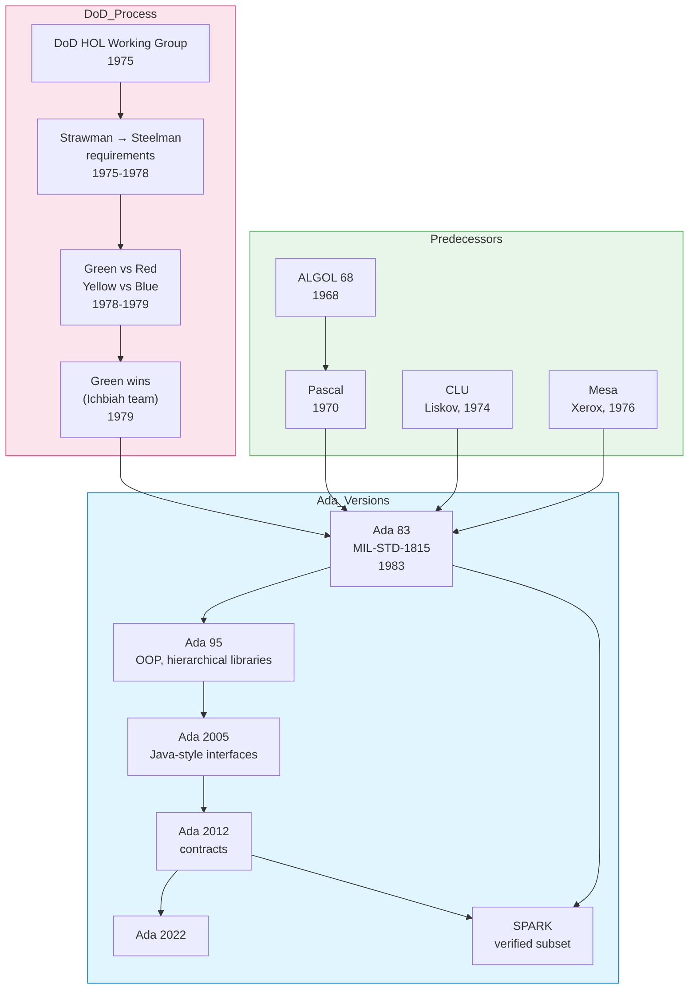

# Ada

| | |
|---|---|
| **Year** | 1983 (Ada 83 / MIL-STD-1815); current standard: Ada 2022 |
| **Creator(s)** | Jean Ichbiah (lead) and team at CII Honeywell Bull, on commission from the US Department of Defense |
| **Paradigm(s)** | Imperative, structured, OOP, concurrent, generic |
| **Typing** | Static, strong, nominal; explicit ranges; contract-based since Ada 2012 |
| **Platform** | Mission-critical embedded systems, avionics, rail, defence, space |
| **Key features** | Strong typing with subranges, tasks, packages, generics, exceptions, contracts (Ada 2012), SPARK formal subset |
| **Legacy** | Reference language for safety-critical software; named after Ada Lovelace, the first programmer |

---

## Contents

1. [Overview](#overview)
2. [Historical Context](#historical-context)
3. [Key Ideas](#key-ideas)
   - [Strong Typing and Subtypes](#strong-typing-and-subtypes)
   - [Packages](#packages)
   - [Tasks and Concurrency](#tasks-and-concurrency)
   - [Generics](#generics)
   - [Contracts and SPARK](#contracts-and-spark)
4. [Language Versions](#language-versions)
5. [Where Ada Lives Today](#where-ada-lives-today)
6. [Influence](#influence)
7. [Strengths and Weaknesses](#strengths-and-weaknesses)
8. [Code Examples](#code-examples)
9. [Related Authors](#related-authors)
10. [Related Topics](#related-topics)
11. [Further Reading](#further-reading)

---

## Overview

Ada is a strongly typed, structured, statically-checked programming language
designed for **building software where failure is not an option**. Commissioned
by the **US Department of Defense (DoD)** in the late 1970s, Ada was created
to replace the **hundreds of incompatible programming languages** then in use
across DoD systems — a fragmentation crisis that was costing billions and
causing real safety incidents.

Ada's distinctive contributions:
- **Strong, explicit typing** — even integer types are distinct unless explicitly compatible
- **Built-in concurrency** — `task` and `protected` types as language primitives
- **Packages with separate spec/body** — encapsulation and information hiding from day one
- **Generics** — type-safe parametric code
- **Contracts** (Ada 2012) — preconditions, postconditions, type invariants checked at runtime or proven statically via SPARK

Ada was named in honour of **Ada Lovelace** (1815–1852), the mathematician who
wrote what is considered the **first algorithm intended for a machine**
(Babbage's Analytical Engine). The original standard, **MIL-STD-1815**, takes
its number from her birth year.

Despite never achieving mainstream use, Ada quietly powers systems that many
millions depend on every day: **Boeing 777 flight control, the Eurofighter,
Paris Métro line 14, NASA's Mars Curiosity rover, ESA's Ariane rockets**.

## Historical Context



### The Fragmentation Crisis

By 1975, the **DoD inventory contained over 450 programming languages and
dialects** in active use across weapons systems, simulators, and embedded
controllers. Maintenance costs were enormous. Errors caused by language
mismatches were causing incidents.

The **High-Order Language Working Group (HOLWG)**, chaired by William
Whitaker, was formed to specify a single language for all DoD embedded
systems. Their requirement documents — issued in increasingly mature drafts
named **Strawman** (1975), **Woodenman** (1975), **Tinman** (1976),
**Ironman** (1977), and finally **Steelman** (1978) — set out perhaps the
most demanding language specification ever attempted.

### The Competition

The DoD ran a public competition. Four teams produced candidate designs,
named by colour:

| Codename | Team | Lead designer | Outcome |
|----------|------|---------------|---------|
| **Green** | CII Honeywell Bull (France) | **Jean Ichbiah** | Winner |
| **Red** | Intermetrics (USA) | Benjamin Brosgol | Runner-up |
| **Yellow** | SRI International | — | Eliminated |
| **Blue** | SofTech | — | Eliminated |

In May 1979 the **Green** language was selected. After three years of further
refinement, **Ada 83** was published as **ANSI/MIL-STD-1815** in February 1983.

### Mandate and Backlash

In 1987 the DoD issued the **"Ada Mandate"**: any new DoD software project
above 30% custom code had to be written in Ada. The mandate was controversial
and was rescinded in 1997 — by then, however, Ada had embedded itself in the
**aerospace, rail, and defence** industries, where it remains today.

## Key Ideas

### Strong Typing and Subtypes

Ada distinguishes between **types** that are structurally identical but
semantically different. You cannot accidentally add metres to seconds:

```ada
type Metres   is new Integer;
type Seconds  is new Integer;

Distance : Metres  := 100;
Time     : Seconds := 30;

-- Distance := Distance + Time;   -- compile error: incompatible types
Speed : Float := Float (Distance) / Float (Time);   -- explicit conversion
```

**Subtypes** add ranges that are checked at runtime (or proven away by the
compiler):

```ada
subtype Day_Of_Month is Integer range 1 .. 31;
subtype Month_Number is Integer range 1 .. 12;

D : Day_Of_Month := 15;
-- D := 32;   -- raises Constraint_Error
```

This kind of **value-range typing** anticipates dependent types and refinement
types in modern research languages.

### Packages

Ada's package system separates **specification** (what users see) from
**body** (the implementation):

```ada
-- File: stack.ads (specification)
package Stack is
    procedure Push (Item : Integer);
    function  Pop  return Integer;
    function  Empty return Boolean;
private
    Max_Size : constant := 100;
    Items : array (1 .. Max_Size) of Integer;
    Top   : Integer := 0;
end Stack;

-- File: stack.adb (body)
package body Stack is
    procedure Push (Item : Integer) is
    begin
        Top := Top + 1;
        Items (Top) := Item;
    end Push;

    function Pop return Integer is
        Result : Integer := Items (Top);
    begin
        Top := Top - 1;
        return Result;
    end Pop;

    function Empty return Boolean is (Top = 0);
end Stack;
```

This explicit separation — predating C/C++ headers' uneasy approximation —
gave Ada **clean modular compilation** in 1983, when most languages had no
real module system at all.

### Tasks and Concurrency

Ada has **concurrent programming built into the language**, not relegated to
a library. A `task` is a thread of execution; **rendezvous** is the primary
synchronisation primitive:

```ada
task Producer is
    entry Send (Item : Integer);
end Producer;

task body Producer is
    Buffer : Integer;
begin
    loop
        accept Send (Item : Integer) do
            Buffer := Item;
        end Send;
        -- process Buffer
    end loop;
end Producer;
```

Ada 95 added **protected objects** for shared-state synchronisation, similar
to monitors:

```ada
protected Counter is
    procedure Increment;
    function  Value return Integer;
private
    N : Integer := 0;
end Counter;
```

For safety-critical code where every line must be reasoned about, having
concurrency primitives in the **standard, certified compiler** — rather than
in a third-party library — is a substantial advantage.

### Generics

Ada had **generics** before C++ had templates:

```ada
generic
    type Element is private;
package Generic_Stack is
    procedure Push (Item : Element);
    function  Pop  return Element;
end Generic_Stack;

-- Instantiation
package Integer_Stack is new Generic_Stack (Element => Integer);
package String_Stack  is new Generic_Stack (Element => String);
```

Unlike C++ templates, Ada generics are **explicitly instantiated and
type-checked at the generic level** — there is no surprise behaviour from
SFINAE or substitution-failure tricks.

### Contracts and SPARK

Ada 2012 added **contract-based programming** — preconditions, postconditions,
type invariants — directly into the language:

```ada
function Sqrt (X : Float) return Float
    with Pre  => X >= 0.0,
         Post => Sqrt'Result * Sqrt'Result <= X * (1.0 + 1.0e-6) and
                 Sqrt'Result * Sqrt'Result >= X * (1.0 - 1.0e-6);
```

**SPARK** — a verifiable subset of Ada developed by AdaCore — extends
contracts with **formal proof**. SPARK programs can be mathematically proven
free of runtime errors and conformant to their specifications. SPARK is used
in:
- **NVIDIA security firmware** (root-of-trust)
- **CubeSat flight software** (CHEOPS satellite)
- **Rail control systems** (Paris Métro line 14, fully driverless since 1998)

## Language Versions

| Version | Year | Key features |
|---------|------|--------------|
| **Ada 83** | 1983 | Initial standard; packages, generics, tasks, exceptions |
| **Ada 95** | 1995 | First **internationally standardised OOP language**; tagged types, protected objects, hierarchical libraries |
| **Ada 2005** | 2005 | Interfaces (Java-style), container library, real-time annexes |
| **Ada 2012** | 2012 | **Contract-based programming**: pre/post/invariants, expression functions |
| **Ada 2022** | 2022 | Parallel constructs, lambda expressions, big numerics, image attributes |

Ada 95 was notably the **first ISO-standardised object-oriented language**,
beating C++ (which was standardised as ISO C++ in 1998).

## Where Ada Lives Today

| Domain | Examples |
|--------|----------|
| **Civil aviation** | Boeing 777 (cockpit displays), Airbus A330/A340, Eurofighter |
| **Space** | NASA Mars Pathfinder & Curiosity, ESA Ariane 4/5/6, ATV |
| **Rail** | Paris Métro line 14 (fully autonomous), London Tube TBTC, TGV signalling |
| **Defence** | F-22, Typhoon, Patriot missile systems |
| **Medical devices** | Several certified pacemakers and infusion pumps |
| **Cryptography** | Some HSMs and certified secure elements |

For any **DO-178C Level A** (catastrophic-failure-prone) avionics software
or **EN 50128 SIL 4** rail signalling, Ada/SPARK is one of a small handful of
viable language options because of its certified compilers and verifiable
semantics.

## Influence

### Languages Directly Inspired

| Language | Ada contribution |
|----------|------------------|
| **C++** | Stroustrup studied Ada's strict typing and generics |
| **Java** | Packages, exceptions, JavaDoc-style spec/impl separation |
| **Eiffel** | Bertrand Meyer extended contracts further (Design by Contract) |
| **Rust** | Strong typing, ownership thinking; trait bounds resemble generics |
| **Swift** | Optional types and explicit error handling echo Ada's strict checks |

### Concepts Pioneered or Standardised

| Concept | Ada's role | Modern equivalent |
|---------|-----------|-------------------|
| **Built-in tasking** | Ada 83 | Go goroutines, Rust async tasks |
| **Generic packages** | Ada 83 | C++ templates, Java/C# generics |
| **Contract-based programming** | Ada 2012 | Eiffel, Clojure spec, Rust `assert!`, refinement types |
| **Hierarchical libraries** | Ada 95 | Java packages, .NET namespaces |
| **Range-checked subtypes** | Ada 83 | Rust `NonZeroU32`, refinement types in research |

## Strengths and Weaknesses

### Strengths

- **Safety-first design** — the language actively prevents common bug classes
- **Mature standardisation** — ISO standard, certified compilers, decades of stability
- **Concurrency built in** — tasks and protected objects since 1983
- **SPARK provability** — formal verification on real systems
- **Long-life maintenance** — codebases from the 1980s still compile and run

### Weaknesses

- **Verbose syntax** — explicit declarations, separate spec/body files
- **Steep learning curve** — strict typing punishes casual experimentation
- **Tooling and ecosystem** — far smaller than C, C++, Rust, Java
- **Cultural inertia** — perceived (often unfairly) as a "DoD-only" language
- **Niche adoption** — outside safety-critical domains, hard to justify the on-ramp

## Code Examples

See [examples/ada/](../../../examples/ada/index.md) for runnable code *(planned)*.

A complete "Hello, World!" with strong typing:

```ada
with Ada.Text_IO; use Ada.Text_IO;

procedure Hello is
    type Greeting is new String (1 .. 13);
    Message : constant Greeting := "Hello, World!";
begin
    Put_Line (String (Message));
end Hello;
```

A factorial with contracts (Ada 2012+):

```ada
function Factorial (N : Natural) return Positive
    with Pre  => N <= 12,
         Post => Factorial'Result >= 1
is
begin
    if N = 0 then
        return 1;
    else
        return N * Factorial (N - 1);
    end if;
end Factorial;
```

## Related Authors

- Ada Lovelace — namesake; first programmer *(profile pending)*
- Jean Ichbiah — Ada 83 chief designer *(profile pending)*
- [Bertrand Meyer](../../authors/bertrand-meyer.md) — extended contract programming in Eiffel
- [Tony Hoare](../../authors/tony-hoare.md) — wrote a famous critique of Ada's complexity

## Related Topics

- [Type Systems](../../topics/types/index.md) — Ada's strong typing model
- [Concurrency](../../topics/concurrency/index.md) — tasks and protected objects
- [Testing](../../topics/testing/index.md) — SPARK and formal verification
- [Paradigms](../../topics/paradigms/index.md) — Ada as multi-paradigm

## Further Reading

- *Reference Manual for the Ada Programming Language* — MIL-STD-1815A (1983)
- ISO/IEC 8652:2012 — *Programming Languages — Ada*
- Barnes — *Programming in Ada 2012* (2014)
- Barnes — *SPARK: The Proven Approach to High Integrity Software* (2012)
- McCormick, Singhoff, Hugues — *Building Parallel, Embedded, and Real-Time Applications with Ada* (2011)
- Hoare — [The Emperor's Old Clothes](https://dl.acm.org/doi/10.1145/358549.358561) (Turing Award lecture, 1980) — Ada critique

## Quotes

> "Do not allow this language in its present state to be used in applications
> where reliability is critical, i.e., nuclear power stations, cruise missiles,
> early warning systems, anti-ballistic missile defense systems."
> — Tony Hoare, *The Emperor's Old Clothes* (1980), warning against Ada's complexity

> "I knew, when I designed Ada, that I would not satisfy everybody."
> — Jean Ichbiah

> "The use of COBOL cripples the mind; its teaching should, therefore, be
> regarded as a criminal offense. The same goes, mutatis mutandis, for the
> use of Ada."
> — Edsger Dijkstra (with characteristic understatement)

---

See [Languages Index](../index.md) for other language profiles.
