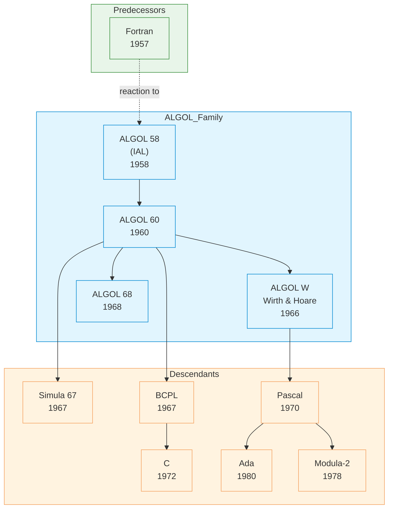

# ALGOL

| | |
|---|---|
| **Year** | 1958 (ALGOL 58), 1960 (ALGOL 60), 1968 (ALGOL 68) |
| **Creator(s)** | International committee (ACM/GAMM): Backus, Bauer, Naur, Perlis, Rutishauser, Samelson, van Wijngaarden, others |
| **Paradigm(s)** | Imperative, structured, procedural |
| **Typing** | Static |
| **Platform** | Mainframes (IBM, Burroughs, Elliott, etc.) |
| **Key features** | Block structure, lexical scoping, recursion, BNF grammar, call-by-name |
| **Legacy** | Grandfather of structured programming; defined "what a language report should look like" |

---

## Contents

1. [Overview](#overview)
2. [Historical Context](#historical-context)
3. [Key Ideas](#key-ideas)
   - [Block Structure](#block-structure)
   - [Lexical Scoping](#lexical-scoping)
   - [Recursion](#recursion)
   - [BNF Grammar](#bnf-grammar)
   - [Call-by-Name vs Call-by-Value](#call-by-name-vs-call-by-value)
4. [Language Versions](#language-versions)
5. [Influence](#influence)
6. [Strengths and Weaknesses](#strengths-and-weaknesses)
7. [Code Examples](#code-examples)
8. [Related Authors](#related-authors)
9. [Related Topics](#related-topics)
10. [Further Reading](#further-reading)

---

## Overview

ALGOL (ALGOrithmic Language) is a family of imperative programming languages
developed in the late 1950s and 1960s by an international committee. ALGOL 60,
the most influential dialect, became the **lingua franca for publishing
algorithms** in academic literature for over two decades and introduced ideas
that shape almost every modern language.

ALGOL's revolutionary ideas:
- **Block structure** — nested `begin ... end` scopes
- **Lexical scoping** — variables visible by program structure, not call order
- **Recursive procedures** — first practical, standardised support
- **Formal grammar (BNF)** — first language defined by a precise syntactic specification
- **Pass-by-name and pass-by-value** parameter modes

While ALGOL itself was rarely used commercially, it served as the **theoretical
substrate** for nearly every imperative language that followed: Pascal, C,
Simula, BCPL, B, Ada, Modula, and indirectly Java, C#, Python, and most
mainstream languages today.

## Historical Context



### Origins

ALGOL emerged in 1958 from a joint effort between the **ACM** (USA) and **GAMM**
(Germany/Switzerland) to create a universal algorithmic language. Fortran (1957)
was tied to IBM hardware and aimed at numerical computation; ALGOL set out to be
**machine-independent** and **mathematically rigorous**.

A key meeting in Zurich in 1958 produced the **ALGOL 58** (originally called
*IAL* — International Algebraic Language) report. Two years later, the
**ALGOL 60 Report**, edited by Peter Naur, defined the language with
unprecedented precision using **Backus-Naur Form (BNF)**. The report itself
became a model for later language specifications.

### Why ALGOL Mattered

- **Communications of the ACM** mandated ALGOL for publishing algorithms
- Tony Hoare developed and published **Quicksort** in ALGOL 60
- Edsger Dijkstra wrote his **structured programming** essays around ALGOL
- Niklaus Wirth and Tony Hoare designed **ALGOL W** as a cleaner successor
- Ole-Johan Dahl and Kristen Nygaard built **Simula** on top of ALGOL 60

## Key Ideas

### Block Structure

ALGOL introduced **nested blocks** delimited by `begin` and `end`. Each block
can declare its own local variables, which are invisible outside it.

```algol
begin
    integer x;
    x := 10;
    begin
        integer y;
        y := x + 5;       comment y is local to inner block;
    end;
    comment y no longer exists here;
end
```

This was a radical departure from Fortran's flat namespace, and it became the
template for every block-structured language since.

### Lexical Scoping

Variable resolution follows **textual nesting**, not the dynamic call chain.
A procedure declared inside another procedure can access its enclosing
variables — the foundation of closures, even if ALGOL didn't quite expose them
as first-class values.

```algol
begin
    integer counter;
    counter := 0;

    procedure increment;
    begin
        counter := counter + 1;     comment refers to outer counter;
    end;

    increment;
    increment;
    comment counter is now 2;
end
```

### Recursion

ALGOL 60 was among the **first widely-used languages** to support recursive
procedure calls properly. Fortran initially did not. The recursive `quicksort`
implementation Hoare wrote in ALGOL became iconic:

```algol
procedure quicksort(A, lo, hi);
    integer array A; integer lo, hi;
begin
    integer p;
    if lo < hi then
    begin
        p := partition(A, lo, hi);
        quicksort(A, lo, p - 1);
        quicksort(A, p + 1, hi);
    end
end;
```

### BNF Grammar

The ALGOL 60 Report formalised the language's syntax using **Backus-Naur Form**,
a notation that today underlies every parser generator and language reference.

```bnf
<if statement> ::= if <Boolean expression> then <statement>
                 | if <Boolean expression> then <statement> else <statement>

<for statement> ::= for <variable> := <for list> do <statement>
```

**Why BNF mattered:**
- Eliminated ambiguity in language specifications
- Enabled the first compiler-compiler tools
- Became the basis for context-free grammar theory
- Still used in ECMA, ISO, and IETF standards today

### Call-by-Name vs Call-by-Value

ALGOL 60 introduced two parameter passing modes. **Call-by-name** is unusual:
the argument expression is re-evaluated each time the parameter is referenced,
effectively macro-expanded into the procedure body.

```algol
procedure swap(a, b);
    integer a, b;
begin
    integer temp;
    temp := a;
    a := b;
    b := temp;
end;
```

A famous pitfall — **Jensen's Device** — exploits call-by-name to compute sums
or integrals by passing an expression containing the loop variable:

```algol
real procedure sum(i, n, expr);
    integer i, n;
    real expr;     comment passed by name;
begin
    real s;
    s := 0;
    for i := 1 step 1 until n do
        s := s + expr;        comment expr re-evaluated each iteration;
    sum := s;
end;
```

Call-by-name was elegant but expensive and confusing. **Pascal, C, and most
descendants dropped it** in favour of value and reference semantics — but
modern languages with lazy evaluation (Haskell) and macros revived the idea.

## Language Versions

| Version | Year | Key features |
|---------|------|--------------|
| **ALGOL 58 (IAL)** | 1958 | First proposal; block structure, recursion ideas |
| **ALGOL 60** | 1960 | BNF grammar, call-by-name, lexical scope; **the canonical ALGOL** |
| **ALGOL W** | 1966 | Wirth/Hoare cleanup; precursor to Pascal |
| **ALGOL 68** | 1968 | Orthogonal design, user-defined types, concurrency; controversial complexity |

ALGOL 68 was technically ambitious — orthogonal type system, parallel
constructs, operator overloading — but its dense formal definition (using
**van Wijngaarden grammars**) alienated implementers. Wirth left the committee
in protest and went on to design **Pascal** as a leaner alternative.

## Influence

### Languages Directly Inspired

| Language | ALGOL contribution |
|----------|--------------------|
| **Simula** | Built on ALGOL 60; added classes (Dahl, Nygaard) |
| **Pascal** | Block structure, types, control flow (Wirth) |
| **C** | Block structure via BCPL; structured control flow |
| **BCPL** → **B** → **C** | Direct lineage of structured imperative |
| **Ada** | Strong typing, packages, structured control flow |
| **CPL** | British answer to ALGOL, predecessor of BCPL |
| **Modula-2** | Wirth's continuation of the ALGOL/Pascal tradition |

### Concepts Pioneered

| Concept | Origin | Modern equivalent |
|---------|--------|-------------------|
| **Block structure** | ALGOL 58/60 | `{ }` blocks in C, Java, Go, etc. |
| **Lexical scoping** | ALGOL 60 | Closures in JavaScript, Python, Lisp |
| **BNF grammar** | ALGOL 60 report | Every language standard since |
| **Recursive procedures** | ALGOL 60 | Standard in all modern languages |
| **`if-then-else`** | ALGOL 60 | Universal control structure |
| **`for` loop with explicit step** | ALGOL 60 | Iteration syntax in Pascal, Ada, Fortran 90+ |

### Academic Impact

For nearly two decades (roughly 1960–1980), ALGOL was the language of
**computer science research**:

- **CACM Algorithms section** — published thousands of algorithms in ALGOL
- **Structured programming movement** — Dijkstra's "GoTo Considered Harmful" (1968) used ALGOL examples
- **Compiler theory** — Knuth's 1968 paper *Semantics of Context-Free Languages* responded to ALGOL 60 ambiguities

> "Here is a language so far ahead of its time that it was not only an
> improvement on its predecessors but also on nearly all its successors."
> — Tony Hoare on ALGOL 60

## Strengths and Weaknesses

### Strengths

- **Mathematically rigorous** — first language with a formal specification
- **Influential** — shaped the entire imperative tradition
- **Block structure** — clean nesting and scoping
- **Portable design** — explicitly machine-independent
- **Academically dominant** — standard for algorithm publication

### Weaknesses

- **No standard I/O** — each implementation invented its own (a major adoption blocker)
- **Call-by-name confusion** — elegant but error-prone
- **Limited string handling** — focus on numerical work
- **ALGOL 68 over-engineered** — split the community
- **Lost commercial battle** — Fortran (numerics) and COBOL (business) dominated industry use

## Code Examples

See [examples/algol/](../../../examples/algol/index.md) for runnable code *(planned)*.

A flavour of ALGOL 60:

```algol
begin
    integer i, n;
    real array A[1:100];

    n := 10;
    for i := 1 step 1 until n do
        A[i] := i * i;

    comment Print the array;
    for i := 1 step 1 until n do
        outreal(1, A[i]);
end
```

## Related Authors

- [John Backus](../../authors/john-backus.md) — ALGOL committee, BNF (also Fortran)
- [Tony Hoare](../../authors/tony-hoare.md) — Quicksort in ALGOL 60, ALGOL W
- [Edsger Dijkstra](../../authors/edsger-dijkstra.md) — ALGOL implementation, structured programming
- [Ole-Johan Dahl](../../authors/ole-johan-dahl.md) — built Simula on ALGOL 60
- [Kristen Nygaard](../../authors/kristen-nygaard.md) — Simula co-creator

## Related Topics

- [Paradigms](../../topics/paradigms/index.md) — ALGOL as the imperative archetype
- [Type Systems](../../topics/types/index.md) — early static typing
- [OOP & Design](../../topics/design/index.md) — Simula extended ALGOL into OOP

## Further Reading

- Naur (ed.) — *Revised Report on the Algorithmic Language ALGOL 60* (1963)
- van Wijngaarden et al. — *Revised Report on ALGOL 68* (1976)
- Hoare — *Hints on Programming Language Design* (1973)
- Wirth — *Recollections about the Development of Pascal* (1993)
- Knuth — *The Remaining Trouble Spots in ALGOL 60* (CACM, 1967)

## Quotes

> "ALGOL was a great improvement on its successors."
> — Alan Perlis

> "Here is a language so far ahead of its time that it was not only an
> improvement on its predecessors but also on nearly all its successors."
> — Tony Hoare, *Hints on Programming Language Design*

---

See [Languages Index](../index.md) for other language profiles.
