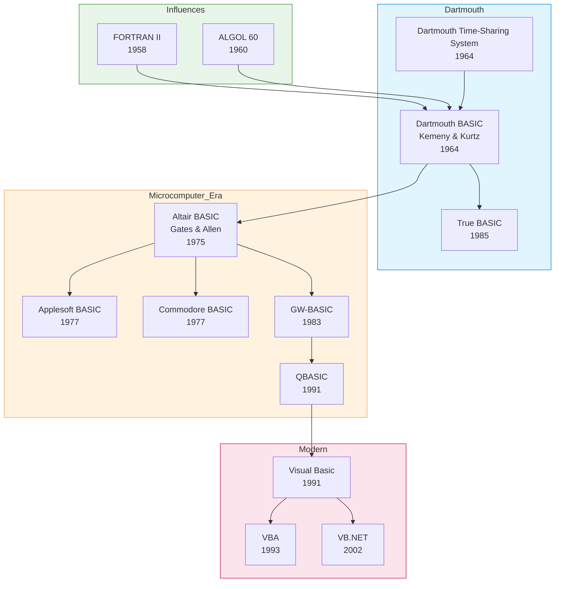

# BASIC

| | |
|---|---|
| **Year** | 1964 (Dartmouth BASIC); current heir: Visual Basic .NET |
| **Creator(s)** | John G. Kemeny and Thomas E. Kurtz at Dartmouth College |
| **Paradigm(s)** | Imperative, procedural; OOP and event-driven in modern dialects |
| **Typing** | Originally weakly typed with sigils; modern dialects fully static |
| **Platform** | Time-sharing systems → microcomputers → Windows / .NET |
| **Key features** | Designed for beginners, interactive REPL/interpreter, line numbers, simple I/O |
| **Legacy** | Democratised programming; gateway language for two generations of developers |

---

## Contents

1. [Overview](#overview)
2. [Historical Context](#historical-context)
3. [Key Ideas](#key-ideas)
   - [Designed for Beginners](#designed-for-beginners)
   - [Interactive Computing](#interactive-computing)
   - [Line Numbers and GOTO](#line-numbers-and-goto)
   - [Microcomputer Era](#microcomputer-era)
   - [Visual Basic and Event-Driven Programming](#visual-basic-and-event-driven-programming)
4. [Major Dialects](#major-dialects)
5. [Influence](#influence)
6. [Strengths and Weaknesses](#strengths-and-weaknesses)
7. [Code Examples](#code-examples)
8. [Related Authors](#related-authors)
9. [Related Topics](#related-topics)
10. [Further Reading](#further-reading)

---

## Overview

BASIC (**B**eginner's **A**ll-purpose **S**ymbolic **I**nstruction **C**ode)
was created in 1964 by **John Kemeny** and **Thomas Kurtz** at Dartmouth
College with a single goal: let **liberal-arts students** use computers.
At a time when programming meant punched cards, FORTRAN, and nights waiting
for batch jobs to return, BASIC offered something radical — an **interactive
language for non-experts**.

What made BASIC matter:
- **First language designed for novices** — readable English-like keywords
- **Time-sharing from day one** — students typed `RUN` and got results immediately
- **Simple enough to fit on a microcomputer** — Microsoft's first product was Altair BASIC (1975)
- **Ubiquitous on home computers** — Apple, Commodore, IBM PC all shipped BASIC in ROM
- **Lifelong on-ramp** — Visual Basic, VBA, and now VB.NET still descend from it

For an entire generation of programmers — born roughly 1960–1985 — **typing
`10 PRINT "HELLO"` on a home computer was their first contact with code**.
That cultural footprint matters as much as any technical contribution.

## Historical Context



### Dartmouth Origins (1964)

Kemeny and Kurtz built **Dartmouth BASIC** alongside the **Dartmouth
Time-Sharing System (DTSS)**. Their pedagogical principles ([later codified](https://dtss.dartmouth.edu/)
by Kurtz) read like a modern UX manifesto:

1. Be easy for beginners to learn
2. Be a general-purpose language for advanced users too
3. Allow advanced features to be added without confusing beginners
4. Be interactive
5. Provide clear, friendly error messages
6. Respond quickly on small programs
7. Require no understanding of computer hardware
8. Shield the user from the operating system

Dartmouth's BASIC was **free for everyone on campus** and explicitly used by
non-CS students — economists, sociologists, English majors. By 1968 over 80%
of Dartmouth undergraduates had used a computer, an unprecedented figure.

### Microcomputer Era (1975–1990)

When the **Altair 8800** launched in 1975, a 19-year-old Bill Gates and a
22-year-old Paul Allen wrote **Altair BASIC** — Microsoft's first product.
Within a few years BASIC was burned into the ROM of nearly every home computer:

- **Apple II** — Integer BASIC, then Applesoft BASIC (Microsoft)
- **Commodore PET / VIC-20 / C64** — Commodore BASIC (Microsoft-derived)
- **TRS-80** — Level I/II BASIC (Microsoft)
- **IBM PC** — Cassette BASIC (in ROM), then GW-BASIC, then QBasic

For millions of users, the boot screen *was* a BASIC prompt. You **could not
*not* program** the machine when you turned it on.

### The Visual Basic Era (1991+)

In 1991 Microsoft released **Visual Basic 1.0**, marrying BASIC syntax to
Alan Cooper's drag-and-drop GUI builder ("Project Ruby"). VB became the
default tool for **Windows business application development** through the
1990s — millions of programmers wrote VB without ever opening a "real" IDE.

**VBA (Visual Basic for Applications)**, introduced in 1993, embedded VB into
Word, Excel, Access, and Outlook. It is the reason **Excel macros are still
written in BASIC today**, three decades later.

**VB.NET** (2002) modernised the language for the .NET runtime — fully
typed, OOP, with garbage collection — but kept the BASIC heritage visible in
keywords like `Dim`, `End Sub`, `Module`.

## Key Ideas

### Designed for Beginners

BASIC's syntax was deliberately built around English keywords:

```basic
10 LET X = 5
20 IF X > 0 THEN PRINT "POSITIVE"
30 FOR I = 1 TO 10
40   PRINT I
50 NEXT I
60 END
```

Compared to FORTRAN's column rules or ALGOL's `begin/end`, this looked like
written instructions. **No type declarations, no semicolons, no compilation
step** — type a line, hit RUN, see output.

### Interactive Computing

Dartmouth BASIC ran on a **time-sharing system** — multiple students at
teletypes shared one mainframe. The shell offered immediate feedback:

```text
] 10 PRINT 2 + 2
] RUN
 4
]
```

This loop — type, run, see — is now universal (Python REPL, JavaScript console,
Jupyter), but in 1964 it was a revelation. **Edit-compile-link-run** was the
norm; BASIC skipped three of those steps.

### Line Numbers and GOTO

Early BASIC used **explicit line numbers** as both labels and a primitive
edit mechanism — retyping line `30` overwrote it. Combined with `GOTO`, this
gave the famous "spaghetti BASIC" style:

```basic
10 PRINT "GUESS A NUMBER"
20 INPUT N
30 IF N = 7 THEN GOTO 60
40 PRINT "WRONG"
50 GOTO 10
60 PRINT "RIGHT!"
70 END
```

By the 1980s structured BASIC dialects (QuickBASIC, Turbo BASIC, True BASIC)
introduced `WHILE`, `IF...THEN...ELSE...END IF`, named subroutines, and
removed the need for line numbers — bringing BASIC into structured-programming
norms decades after the rest of the field.

### Microcomputer Era

Microsoft's **6502 BASIC** (a few KB of code) shipped on the Apple II,
Commodore PET, and Atari 8-bit machines. Compactness mattered — early home
computers had **4 to 64 KB of total RAM**, and the BASIC interpreter had to
fit in ROM with room left over for user programs.

This forced design choices that lingered for decades:
- Single-letter variable names were faster
- Two-character names (`A1`, `B2`) were the maximum for some dialects
- `?` was a shorthand for `PRINT`
- Tokenising keywords reduced program memory use

```basic
10 ? "HELLO"
20 ? "FROM 1981"
```

### Visual Basic and Event-Driven Programming

Visual Basic transformed BASIC again — into an **event-driven, GUI-first**
language. You drew a form, double-clicked a button, and wrote the handler:

```vb
Private Sub Button1_Click()
    MsgBox "Hello, World!"
End Sub
```

VB's **rapid application development** model influenced Delphi, C# Windows
Forms, JavaScript event handlers, and modern web frameworks. Many corporate
internal tools written in VB6 between 1995 and 2008 are **still in production
today**, often patched by VB.NET successors or unsupported VB6 specialists.

## Major Dialects

| Dialect | Year | Platform | Notable for |
|---------|------|----------|-------------|
| **Dartmouth BASIC** | 1964 | DTSS mainframe | The original |
| **HP Time-Shared BASIC** | 1968 | HP 2000 | Widely used in schools |
| **Altair BASIC** | 1975 | Altair 8800 | Microsoft's first product |
| **Applesoft BASIC** | 1977 | Apple II | Floating-point, ROM-based |
| **Commodore BASIC 2.0** | 1977 | C64, VIC-20 | Iconic 8-bit dialect |
| **GW-BASIC** | 1983 | MS-DOS | Standard PC BASIC |
| **QuickBASIC / QBasic** | 1985/1991 | MS-DOS | Structured, fast compilation |
| **True BASIC** | 1985 | Cross-platform | Kemeny/Kurtz's modernisation |
| **Visual Basic 1.0–6.0** | 1991–1998 | Windows | GUI programming for the masses |
| **VBA** | 1993 | Office | Excel macros, still ubiquitous |
| **VB.NET** | 2002 | .NET | Modern, fully OOP, currently maintained |
| **FreeBASIC / QB64** | 2000s | Cross-platform | Modern open-source BASIC |

## Influence

### Languages and Tools Inspired

| Language / Tool | BASIC contribution |
|-----------------|--------------------|
| **Microsoft as a company** | Founded by writing Altair BASIC |
| **Visual Studio** | RAD/IDE concepts originated in VB |
| **VBA / Office macros** | Brought scripting to non-programmers |
| **Python interactive shell** | Carries BASIC's "type and run" spirit |
| **Educational languages** (Logo, Scratch) | Followed BASIC's beginner-focus principle |

### Concepts Pioneered or Popularised

| Concept | BASIC's role | Modern equivalent |
|---------|--------------|-------------------|
| **Interactive REPL for beginners** | Dartmouth, 1964 | Python, Jupyter, Node.js |
| **Programming on home computers** | Altair / Apple II / C64 | Today's accessible coding tools |
| **Form-based GUI builder** | Visual Basic | WinForms, Delphi, Tkinter, Qt Designer |
| **End-user programming** | VBA in Office | Google Apps Script, Excel formulas |

### Cultural Impact

BASIC was the **first language for an enormous fraction of working programmers
born 1960–1985**:
- Bill Gates, Paul Allen — wrote Altair BASIC and built Microsoft
- Linus Torvalds — first programmed in BASIC on a Commodore VIC-20
- Jamie Zawinski, John Carmack, and many others started here

Whether or not BASIC was a "good" first language remained controversial.
Edsger Dijkstra famously declared:

> "It is practically impossible to teach good programming to students who have
> had a prior exposure to BASIC: as potential programmers they are mentally
> mutilated beyond hope of regeneration."
> — Edsger Dijkstra (1975)

But for millions of users, BASIC was simply the door through which they
walked into computing.

## Strengths and Weaknesses

### Strengths

- **Approachable** — readable keywords, no boilerplate
- **Interactive** — instant feedback loop
- **Ubiquitous** — shipped with virtually every home computer 1977–1995
- **Rapid GUI development** — Visual Basic dominated business tools for a decade
- **Still alive** — VBA in Excel, VB.NET on .NET, FreeBASIC for hobbyists

### Weaknesses

- **Encouraged unstructured code** — `GOTO`, line numbers, global state in early dialects
- **Dialect fragmentation** — hundreds of incompatible variants
- **Limited modern relevance** — eclipsed by Python for beginner education
- **Performance** — interpreted dialects were slow; compiled ones rarely matched C
- **Reputation problem** — Dijkstra's verdict shaped academic disdain for decades

## Code Examples

See [examples/basic/](../../../examples/basic/index.md) for runnable code *(planned)*.

Classic 1980s home-computer BASIC:

```basic
10 INPUT "WHAT IS YOUR NAME"; N$
20 PRINT "HELLO, "; N$
30 FOR I = 1 TO 10
40   PRINT I; " ";
50 NEXT I
60 PRINT
70 END
```

Modern VB.NET:

```vb
Module HelloWorld
    Sub Main()
        Console.Write("What is your name? ")
        Dim name As String = Console.ReadLine()
        Console.WriteLine($"Hello, {name}!")
        For i As Integer = 1 To 10
            Console.Write($"{i} ")
        Next
        Console.WriteLine()
    End Sub
End Module
```

## Related Authors

- John Kemeny — Dartmouth BASIC co-creator *(profile pending)*
- Thomas Kurtz — Dartmouth BASIC co-creator *(profile pending)*

## Related Topics

- [Paradigms](../../topics/paradigms/index.md) — imperative and event-driven styles
- [OOP & Design](../../topics/design/index.md) — VB.NET as fully OOP BASIC

## Further Reading

- Kemeny & Kurtz — *Back to BASIC* (1985)
- Kurtz — *BASIC* in *History of Programming Languages II* (1996)
- Lien — *The BASIC Handbook* (1981) — encyclopaedia of dialect differences
- Microsoft — *Visual Basic .NET Language Specification*

## Quotes

> "Anyone could learn it in a few hours."
> — John Kemeny, on the design goal of Dartmouth BASIC

> "It is practically impossible to teach good programming to students who have
> had a prior exposure to BASIC."
> — Edsger Dijkstra (1975)

> "I learned BASIC. And I loved it."
> — Linus Torvalds, on his Commodore VIC-20

---

See [Languages Index](../index.md) for other language profiles.
