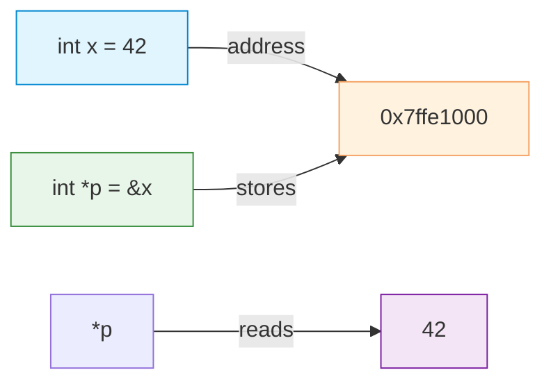

# Pointers

| Section | Content |
| :--- | :--- |
| **Description** | Pointers are variables that store memory addresses. They are the cornerstone of C, enabling direct memory manipulation, dynamic data structures, and efficient parameter passing. |
| **API Purpose** | Direct memory access, dynamic allocation, pass-by-reference semantics, and building complex data structures. |
| **Terminology** | Address-of (`&`), dereference (`*`), pointer arithmetic, null pointer, void pointer, function pointer, double pointer. |
| **Notes** | C has no bounds checking — pointer arithmetic can access invalid memory, leading to undefined behavior. The `NULL` macro represents a null pointer constant. `void*` is a generic pointer that can point to any data type. |



## Basic Pointer Operations

```c
int x = 42;
int *p = &x;    // p stores the address of x

printf("x = %d\n", x);      // 42
printf("*p = %d\n", *p);    // 42 (dereference)
printf("p = %p\n", (void*)p); // address of x

*p = 100;       // modify x through p
printf("x = %d\n", x);      // 100
```

## Pointer Arithmetic

```c
int arr[] = {10, 20, 30, 40, 50};
int *p = arr;       // points to arr[0]

printf("%d\n", *p);       // 10
printf("%d\n", *(p + 1)); // 20
printf("%d\n", *(p + 2)); // 30

p++;                // now points to arr[1]
printf("%d\n", *p);       // 20

// Pointer arithmetic scales by sizeof(type)
// p + 1 adds sizeof(int) bytes, not 1 byte
```

## Pointers and Arrays

```c
int arr[5] = {1, 2, 3, 4, 5};

// Arrays decay to pointers in most contexts
int *p = arr;       // same as &arr[0]

// Equivalent access methods
arr[2] == *(arr + 2) == *(p + 2) == p[2]  // all give 3
```

## Pointers as Function Parameters

```c
// Pass by value — original not modified
void increment_by_value(int n) {
    n++;  // only local copy changes
}

// Pass by pointer — original modified
void increment_by_pointer(int *p) {
    (*p)++;  // modifies the original
}

int main() {
    int x = 5;
    increment_by_value(x);
    printf("%d\n", x);  // 5 (unchanged)

    increment_by_pointer(&x);
    printf("%d\n", x);  // 6 (modified)
}
```

## Void Pointers

```c
void *vp;
int x = 42;
char c = 'A';

vp = &x;    // can point to any type
vp = &c;

// Must cast before dereferencing
int *ip = (int*)vp;
printf("%d\n", *ip);
```

---

Examples: [Variables & Types](../../../examples/c/02-variables-and-types/README.md)
