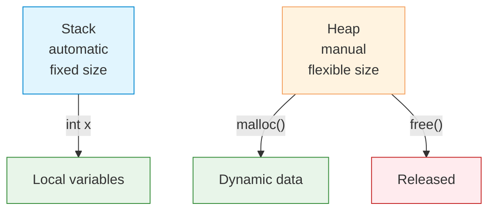

# Memory Management

| Section | Content |
| :--- | :--- |
| **Description** | C provides manual memory management through `malloc`, `calloc`, `realloc`, and `free`. The programmer is fully responsible for allocating and deallocating memory, with no garbage collector to clean up. |
| **API Purpose** | Dynamic memory allocation for data structures whose size is not known at compile time. |
| **Terminology** | `malloc`, `calloc`, `realloc`, `free`, heap, stack, memory leak, dangling pointer, double free, fragmentation. |
| **Notes** | Always check `malloc` return value for `NULL`. Every `malloc` must have a corresponding `free`. Use `valgrind` to detect memory leaks. `calloc` initializes memory to zero; `malloc` does not. |



## malloc and free

```c
#include <stdlib.h>

int main() {
    // Allocate memory for 10 integers
    int *arr = malloc(10 * sizeof(int));
    if (arr == NULL) {
        fprintf(stderr, "Memory allocation failed\n");
        return 1;
    }

    // Use the memory
    for (int i = 0; i < 10; i++) {
        arr[i] = i * i;
    }

    // Must free when done
    free(arr);
    arr = NULL;  // avoid dangling pointer
}
```

## calloc — Zero-Initialized Allocation

```c
// Allocate and initialize to zero
int *arr = calloc(10, sizeof(int));  // 10 elements, all 0

// Equivalent to:
int *arr2 = malloc(10 * sizeof(int));
memset(arr2, 0, 10 * sizeof(int));
```

## realloc — Resize Allocation

```c
int *arr = malloc(5 * sizeof(int));
// ... fill arr ...

// Grow to 10 elements
int *new_arr = realloc(arr, 10 * sizeof(int));
if (new_arr != NULL) {
    arr = new_arr;
} else {
    // realloc failed, original arr is still valid
    free(arr);
    return 1;
}
```

## Common Bugs

| Bug | Cause | Prevention |
|-----|-------|------------|
| **Memory leak** | `malloc` without `free` | Always pair allocate/free |
| **Dangling pointer** | Use after `free` | Set pointer to `NULL` after `free` |
| **Double free** | `free` same memory twice | Set pointer to `NULL` after `free` |
| **Buffer overflow** | Write past allocated size | Track sizes, use safe functions |
| **NULL dereference** | Forget to check `malloc` return | Always check for `NULL` |

## Stack vs Heap

| Aspect | Stack | Heap |
|--------|-------|------|
| Management | Automatic | Manual (`malloc`/`free`) |
| Size | Limited (typically 1-8 MB) | Large (process memory limit) |
| Speed | Fast allocation | Slower allocation |
| Lifetime | Function scope | Programmer-controlled |
| Fragmentation | No | Possible |

```c
void example() {
    int stack_var;           // stack — automatic
    int *heap_var = malloc(sizeof(int));  // heap — manual
    free(heap_var);
}
```

---

Examples: [Variables & Types](../../../examples/c/02-variables-and-types/README.md)
