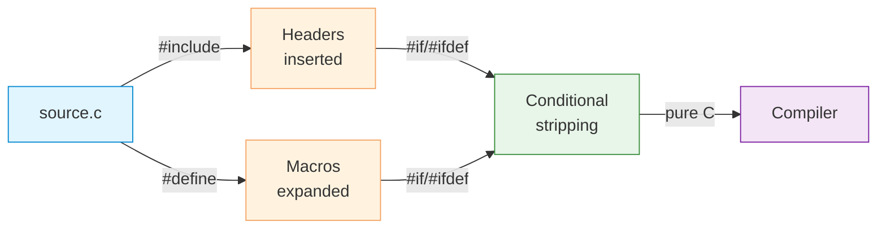

# Preprocessor

| Section | Content |
| :--- | :--- |
| **Description** | The C preprocessor runs before compilation, performing text substitution, file inclusion, and conditional compilation. It is a purely textual processing step with no understanding of C syntax. |
| **API Purpose** | Code reuse via headers, conditional compilation for platforms/configurations, and compile-time constants. |
| **Terminology** | `#include`, `#define`, `#ifdef`, `#ifndef`, `#if`, `#elif`, `#else`, `#endif`, `#pragma`, macro, token pasting (`##`), stringification (`#`). |
| **Notes** | Macros can cause subtle bugs due to lack of type safety and multiple evaluation of arguments. Prefer `const`, `enum`, and `inline` functions over macros when possible. Parenthesize macro parameters and the entire expression. |



## #include

```c
// System header — search system paths
#include <stdio.h>
#include <stdlib.h>

// User header — search current directory first
#include "myheader.h"
```

## #define — Object-like Macros

```c
// Constant (prefer const/enum in modern C)
#define MAX_SIZE 100
#define PI 3.14159

// String macro
#define VERSION "1.0.0"

// Conditional compilation
#define DEBUG

int arr[MAX_SIZE];  // expanded to int arr[100];
```

## #define — Function-like Macros

```c
// Parenthesize parameters and entire expression!
#define MAX(a, b) ((a) > (b) ? (a) : (b))
#define SQUARE(x) ((x) * (x))

int m = MAX(3, 5);        // ((3) > (5) ? (3) : (5))
int s = SQUARE(3 + 2);    // ((3 + 2) * (3 + 2)) = 25

// Without parens: SQUARE(3 + 2) => 3 + 2 * 3 + 2 = 11 (WRONG!)
```

## Conditional Compilation

```c
#ifdef DEBUG
    printf("Debug: x = %d\n", x);
#endif

#ifndef MAX_SIZE
    #define MAX_SIZE 100
#endif

#if defined(DEBUG) && DEBUG > 1
    printf("Verbose debug\n");
#elif defined(DEBUG)
    printf("Debug\n");
#else
    // Release build
#endif
```

## Advanced Macros

```c
// Stringification: #x becomes "x"
#define STR(x) #x
printf("%s\n", STR(hello));  // "hello"

// Token pasting: a ## b becomes ab
#define CONCAT(a, b) a ## b
int xy = 10;
printf("%d\n", CONCAT(x, y));  // xy, prints 10

// Multiline macro with backslash
#define LOG(fmt, ...) \
    do { \
        fprintf(stderr, "[%s:%d] " fmt "\n", \
                __FILE__, __LINE__, ##__VA_ARGS__); \
    } while (0)

LOG("Value: %d", 42);
// [file.c:10] Value: 42
```

## Predefined Macros

| Macro | Description |
|-------|-------------|
| `__FILE__` | Current source file name |
| `__LINE__` | Current line number |
| `__DATE__` | Compilation date |
| `__TIME__` | Compilation time |
| `__func__` | Current function name (C99) |

---

Examples: [Control Flow](../../../examples/c/04-control-flow/README.md)
