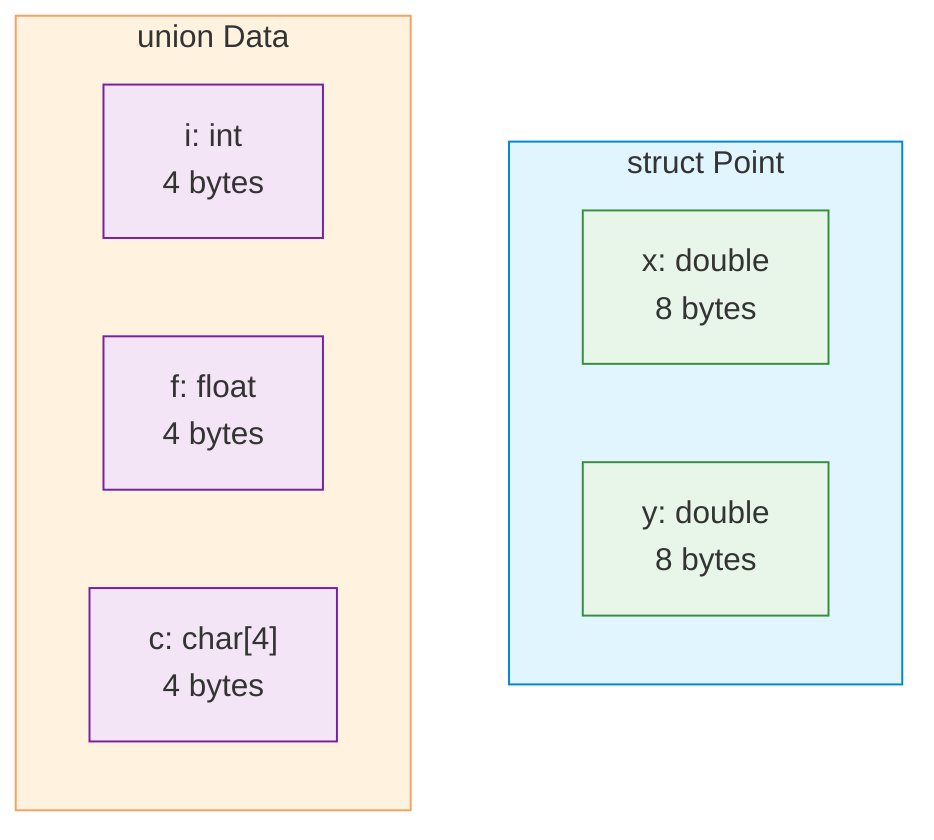

# Structs and Unions

| Section | Content |
| :--- | :--- |
| **Description** | `struct` groups related variables of different types into a single unit. `union` stores different types in the same memory location, with only one member active at a time. Both are fundamental for data organization in C. |
| **API Purpose** | Grouping related data, creating composite types, and implementing tagged unions for type-variant data. |
| **Terminology** | `struct`, `union`, `typedef`, bit-field, padding, alignment, flexible array member, tagged union. |
| **Notes** | Struct members have independent memory locations. Union members share memory — size equals largest member. Be aware of padding for alignment; use `#pragma pack` or `__attribute__((packed))` to control it. |



## Struct Basics

```c
struct Point {
    double x;
    double y;
};

struct Point p1 = {1.0, 2.0};
struct Point p2 = {.y = 3.0, .x = 2.0};  // designated initializer (C99)

p1.x = 5.0;
struct Point *pp = &p1;
pp->y = 10.0;   // arrow operator for pointer access
```

## typedef

```c
// Create alias for struct
typedef struct {
    char name[50];
    int age;
} Person;

Person alice = {"Alice", 30};
```

## Nested Structs

```c
typedef struct {
    struct Point top_left;
    struct Point bottom_right;
} Rectangle;

Rectangle r = {
    .top_left = {0.0, 0.0},
    .bottom_right = {100.0, 100.0}
};
```

## Unions

```c
union Data {
    int i;
    float f;
    char str[20];
};

union Data d;
d.i = 10;       // valid
d.f = 3.14;     // overwrites i — now only f is valid

printf("Size: %zu\n", sizeof(union Data));  // 20 (largest member)
```

## Tagged Union (Discriminated Union)

```c
typedef enum { INT, FLOAT, STRING } DataType;

typedef struct {
    DataType type;
    union {
        int i;
        float f;
        char str[20];
    } value;
} Variant;

void print_variant(const Variant *v) {
    switch (v->type) {
        case INT:    printf("int: %d\n", v->value.i); break;
        case FLOAT:  printf("float: %f\n", v->value.f); break;
        case STRING: printf("string: %s\n", v->value.str); break;
    }
}
```

## Bit-fields

```c
// Pack flags into bits
struct Flags {
    unsigned int is_visible : 1;
    unsigned int is_enabled : 1;
    unsigned int priority   : 4;  // 0-15
    unsigned int            : 2;  // padding
};

struct Flags f = {1, 0, 5};
printf("Size: %zu\n", sizeof(struct Flags));  // typically 4 bytes
```

---

Examples: [Data Structures](../../../examples/c/05-data-structures/README.md)
