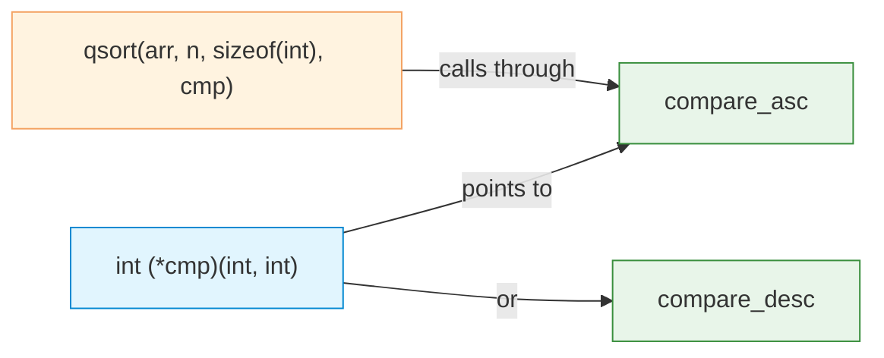

# Function Pointers

| Section | Content |
| :--- | :--- |
| **Description** | Function pointers store the address of a function, enabling runtime polymorphism, callback mechanisms, and plugin architectures. They are essential for implementing event-driven programming and higher-order functions in C. |
| **API Purpose** | Callbacks, dynamic dispatch, sorting with custom comparators, plugin systems, and state machines. |
| **Terminology** | Function pointer, callback, `typedef` for function pointer, pointer to function, array of function pointers. |
| **Notes** | The syntax for function pointer declarations is complex. Use `typedef` to simplify. Function pointers can be passed as arguments, stored in arrays, and returned from functions (though returning function pointers has tricky syntax). |



## Declaration and Usage

```c
int add(int a, int b) { return a + b; }
int sub(int a, int b) { return a - b; }

int main() {
    // Declare function pointer
    int (*operation)(int, int);

    operation = add;     // or &add
    printf("%d\n", operation(3, 2));  // 5

    operation = sub;
    printf("%d\n", operation(3, 2));  // 1
}
```

## typedef for Clarity

```c
// Define a type for function pointer
typedef int (*BinaryOp)(int, int);

int apply(BinaryOp op, int a, int b) {
    return op(a, b);
}

int main() {
    printf("%d\n", apply(add, 5, 3));   // 8
    printf("%d\n", apply(sub, 5, 3));   // 2
}
```

## qsort with Custom Comparator

```c
#include <stdlib.h>

int compare_asc(const void *a, const void *b) {
    int x = *(const int*)a;
    int y = *(const int*)b;
    return (x > y) - (x < y);  // returns -1, 0, or 1
}

int compare_desc(const void *a, const void *b) {
    return compare_asc(b, a);  // reverse
}

int arr[] = {3, 1, 4, 1, 5, 9, 2, 6};
qsort(arr, 8, sizeof(int), compare_asc);
```

## Array of Function Pointers

```c
typedef void (*CommandFunc)(void);

void cmd_help()  { printf("Help\n"); }
void cmd_quit()  { printf("Quit\n"); }
void cmd_list()  { printf("List\n"); }

CommandFunc commands[] = {cmd_help, cmd_quit, cmd_list};

// Dispatch by index
commands[0]();  // "Help"

// Or with names
typedef struct {
    const char *name;
    CommandFunc func;
} Command;

Command cmd_table[] = {
    {"help", cmd_help},
    {"quit", cmd_quit},
    {"list", cmd_list},
    {NULL, NULL}
};
```

---

Examples: [Functions](../../../examples/c/03-functions/README.md)
