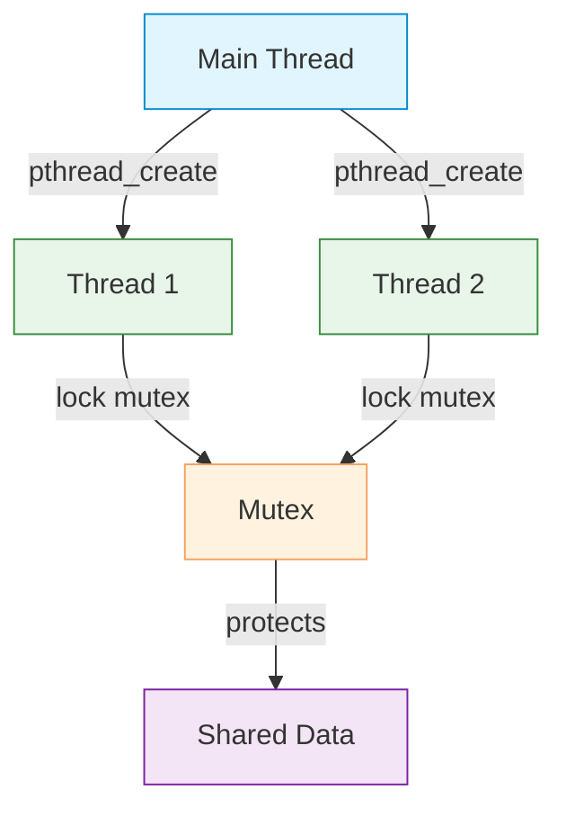

# Concurrency

| Section | Content |
| :--- | :--- |
| **Description** | C provides concurrency through POSIX threads (pthreads) on Unix-like systems and Windows threads on Windows. The C11 standard introduced `<threads.h>` for portable threading, though pthreads remain more widely used. |
| **API Purpose** | Parallel execution for CPU-bound tasks, responsive I/O handling, and multi-core utilization. |
| **Terminology** | `pthread_create`, `pthread_join`, `mutex`, `condition variable`, `pthread_mutex_lock`, `pthread_cond_wait`, `thread-local storage`, `atomic`. |
| **Notes** | C has no built-in memory safety for shared state. Race conditions, deadlocks, and data races are the programmer's responsibility to prevent. Use mutexes to protect shared data. C11 `_Atomic` provides atomic operations. |



## pthread Basics

```c
#include <pthread.h>
#include <stdio.h>

void *thread_func(void *arg) {
    int num = *(int*)arg;
    printf("Hello from thread %d\n", num);
    return NULL;
}

int main() {
    pthread_t tid;
    int arg = 1;

    pthread_create(&tid, NULL, thread_func, &arg);
    pthread_join(tid, NULL);  // wait for thread to finish

    printf("Thread finished\n");
    return 0;
}

// Compile with: gcc -pthread program.c
```

## Mutex for Shared State

```c
#include <pthread.h>

pthread_mutex_t mutex = PTHREAD_MUTEX_INITIALIZER;
int counter = 0;

void *increment(void *arg) {
    for (int i = 0; i < 100000; i++) {
        pthread_mutex_lock(&mutex);
        counter++;
        pthread_mutex_unlock(&mutex);
    }
    return NULL;
}

int main() {
    pthread_t t1, t2;
    pthread_create(&t1, NULL, increment, NULL);
    pthread_create(&t2, NULL, increment, NULL);
    pthread_join(t1, NULL);
    pthread_join(t2, NULL);
    printf("Counter: %d\n", counter);  // 200000
}
```

## Condition Variables

```c
pthread_mutex_t mutex = PTHREAD_MUTEX_INITIALIZER;
pthread_cond_t cond = PTHREAD_COND_INITIALIZER;
int ready = 0;

void *worker(void *arg) {
    pthread_mutex_lock(&mutex);
    while (!ready) {
        pthread_cond_wait(&cond, &mutex);  // atomically unlock and wait
    }
    printf("Worker proceeding\n");
    pthread_mutex_unlock(&mutex);
    return NULL;
}

void *signaler(void *arg) {
    pthread_mutex_lock(&mutex);
    ready = 1;
    pthread_cond_broadcast(&cond);  // wake all waiters
    pthread_mutex_unlock(&mutex);
    return NULL;
}
```

## C11 Threads (Portable)

```c
#include <threads.h>

int thread_func(void *arg) {
    printf("C11 thread running\n");
    return 0;
}

int main() {
    thrd_t tid;
    thrd_create(&tid, thread_func, NULL);
    thrd_join(tid, NULL);
}
```

## Comparison

| Feature | pthreads | C11 threads |
|---------|----------|-------------|
| Portability | Unix/Linux/macOS | C11 standard (limited support) |
| Maturity | Mature, widely used | Newer, less adoption |
| Features | Rich (rwlocks, barriers) | Basic (mutex, condvar) |

---

Examples: [Concurrency](../../../examples/c/08-concurrency/README.md)
