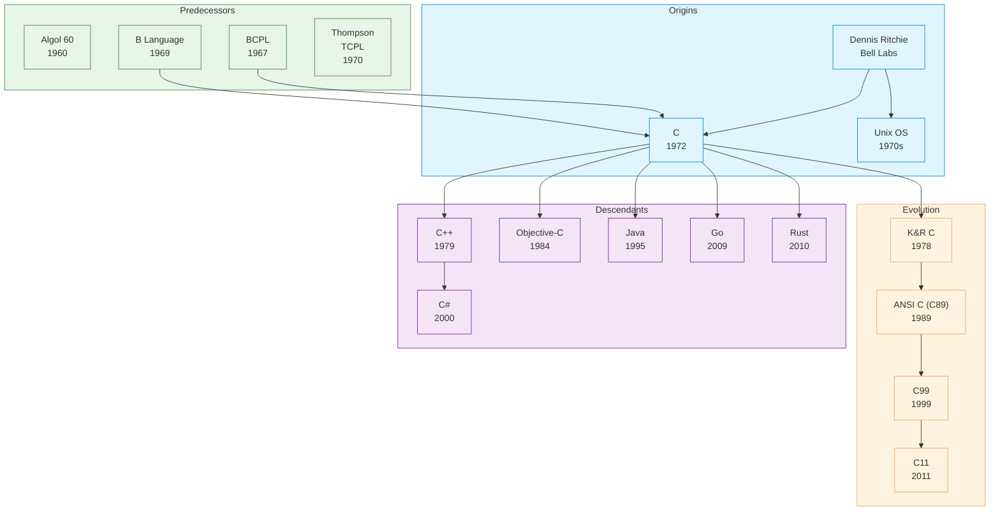

# C

| | |
|---|---|
| **Year** | 1972 |
| **Creator(s)** | Dennis Ritchie (Bell Labs) |
| **Paradigm(s)** | Imperative, procedural |
| **Typing** | Static, weak |
| **Platform** | Native (compiled) |
| **Key features** | Pointers, manual memory, low-level access |
| **Current standard** | C18 (ISO/IEC 9899:2018) |

---

## Contents

1. [Overview](#overview)
2. [Historical Context](#historical-context)
3. [Key Ideas](#key-ideas)
   - [Pointers and Manual Memory Management](#pointers-and-manual-memory-management)
   - [Structs and Manual Layout](#structs-and-manual-layout)
   - [Preprocessor](#preprocessor)
   - [Structured Programming](#structured-programming)
   - [Standard Library (stdio.h)](#standard-library-stdioh)
4. [Language Features](#language-features)
   - [Variables and Types](#variables-and-types)
   - [Functions](#functions)
   - [Control Flow](#control-flow)
   - [Arrays and Strings](#arrays-and-strings)
5. [Ecosystem and Tools](#ecosystem-and-tools)
6. [Influence](#influence)
7. [Strengths and Weaknesses](#strengths-and-weaknesses)
8. [Code Examples](#code-examples)
9. [Related Authors](#related-authors)
10. [Related Topics](#related-topics)
11. [Further Reading](#further-reading)

---

## Overview

C is a general-purpose, procedural programming language created by
Dennis Ritchie at Bell Labs in 1972. It became one of
the most influential languages in history, serving as a foundation for:
- **Unix** — the operating system was written in C
- **Many modern languages** — C++, Java, Python, Go, Rust all trace to C
- **Systems programming** — embedded systems, operating systems, firmware

C's distinctive characteristics:
- **Low-level access** — direct memory and hardware manipulation
- **Explicit control** — manual memory management, no GC
- **Efficiency** — maps closely to hardware, minimal runtime
- **Portability** — available on virtually every platform

## Historical Context



### Predecessor Languages

| Language | Contribution to C |
|----------|---------------------|
| **B** (Ken Thompson, 1969) | Syntax, basic types |
| **BCPL** (Martin Richards, 1967) | Types, operators |
| **Algol 60** | Structured programming, block syntax |
| **PDP-11 assembly** | Low-level access patterns |

### Language Standards

| Version | Year | Key features |
|---------|-------|---------------|
| K&R C | 1978 | Kernighan & Ritchie definition |
| ANSI C (C89) | 1989 | Standardised by ANSI |
| C99 | 1999 | New features (C++-style comments, `inline`) |
| C11 | 2011 | Threading support, atomic operations |

## Key Ideas

### Pointers and Manual Memory Management

C gives direct control over memory:

```c
// Pointer arithmetic
int arr[5];
int *p = arr;
for (int i = 0; i < 5; i++) {
    *(p + i) = i * 2;  // Pointer arithmetic
}

// Manual allocation
int *x = malloc(sizeof(int));
*x = 42;
free(x);  // Must free manually

// No bounds checking by default
char buffer[10];
strcpy(buffer, "This string is way too long and will overflow");  // Danger!
```

**Why pointers?**
- **Direct hardware mapping** — pointers map to memory addresses
- **Flexible data structures** — linked lists, trees via pointer manipulation
- **Pass by reference** — avoid copying large structures
- **Arrays vs pointers** — arrays decay to pointers in functions

### Structs and Manual Layout

C defines structure explicitly:

```c
struct Point {
    double x;
    double y;
};

struct Rectangle {
    struct Point top_left;
    struct Point bottom_right;
};
```

The compiler doesn't add hidden fields — memory layout is
completely under programmer control.

### Preprocessor

C's preprocessor enables conditional compilation:

```c
// Conditional compilation
#ifdef DEBUG
    printf("Debug mode\n");
#else
    printf("Release mode\n");
#endif

// Macros
#define MAX(a, b) ((a) > (b) ? (a) : (b))

// Include headers
#include <stdio.h>
#include "myheader.h"
```

**Use carefully** — macros can cause subtle bugs.

### Structured Programming

After Dijkstra's "Go To Considered Harmful," C adopted
structured constructs:

```c
// Instead of goto, use:
if (condition) {
    // code
} else {
    // other code
}

// Instead of unstructured jumps, use loops
for (int i = 0; i < 10; i++) {
    // iteration
}

while (condition) {
    // controlled repetition
}

// Functions replace code duplication
int square(int x) {
    return x * x;
}
```

### Standard Library (stdio.h)

Minimal but powerful:

```c
// I/O
printf("Hello, %s!\n", name);
scanf("%d", &value);

// File operations
FILE *f = fopen("file.txt", "r");
char line[256];
while (fgets(line, sizeof(line), f)) {
    // process line
}
fclose(f);

// Utilities
int len = strlen(string);
int compare = strcmp(s1, s2);
int copy = strcpy(dest, src);
```

## Language Features

### Variables and Types

```c
// Basic types
int integer = 42;
float floating = 3.14;
char character = 'A';
const int constant = 100;
volatile int register_value;  // Tells compiler not to optimize

// Type qualifiers
unsigned int ui = 10;     // Only positive
long int large = 1000000;  // Bigger range
short int small = 5;       // Smaller range, saves memory

// Arrays decay to pointers
int arr[10];
int *ptr = arr;  // arr is treated as &arr[0]
```

### Functions

```c
// Function declaration and definition
int add(int a, int b);           // Declaration
int add(int a, int b) {          // Definition
    return a + b;
}

// Pass by value vs pointer
void increment_by_value(int x) {
    x++;  // Only local copy modified
}

void increment_by_pointer(int *p) {
    (*p)++;  // Original value modified
}
```

### Control Flow

```c
// Loops
for (int i = 0; i < 10; i++) {
    // body
}

while (condition) {
    // body
}

do {
    // body
} while (condition);

// Switch statement
switch (value) {
    case 1:
        // case 1
        break;
    case 2:
        // case 2
        break;
    default:
        // default case
        break;
}
```

### Arrays and Strings


```c
// Array declaration and initialization
int arr[5] = {1, 2, 3, 4, 5};
int arr2D[3][2] = { {1, 2}, {3, 4}, {5, 6} };

// C strings are null-terminated
char str[] = "Hello";
size_t len = strlen(str);  // Manual length calculation
strcpy(dest, str);       // Must ensure dest has space
```


## Ecosystem and Tools

| Tool | Purpose |
|-------|---------|
| **gcc** | GNU C Compiler (most widely used) |
| **clang** | LLVM-based C compiler |
| **make** | Build tool |
| **gdb** | GNU Debugger |
| **valgrind** | Memory leak detection |
| **cmake** | Cross-platform build system |

### Compilation

```bash
# Compile single file
gcc main.c -o program

# Compile with optimization
gcc -O2 main.c -o program

# Compile with warnings
gcc -Wall -Wextra main.c -o program

# Generate debug symbols
gcc -g main.c -o program
```

## Influence

### Languages Inspired by C

| Language | C influence |
|-----------|-----------------|
| **C++** | Direct superset, added classes, templates |
| **Objective-C** | C with Smalltalk-style objects |
| **Java** | C++-like syntax without pointers |
| **Python** | Written in C, Python C API |
| **Go** | C-like syntax, safer memory management |
| **Rust** | Low-level access, but safer ownership model |
| **JavaScript** | Syntax from C (curly braces, semicolons) |
| **PHP** | Written in C, C-like syntax |
| **Perl** | Written in C, influenced by C syntax |

### Systems and Applications

| Area | C's role |
|-------|------------|
| **Unix** | Unix OS written entirely in C |
| **Linux kernel** | Written in C |
| **Windows** | Win32 API is C-based |
| **Embedded systems** | Microcontrollers, firmware |
| **Game development** | Performance-critical engines |
| **Drivers** | OS and hardware drivers |

## Code Examples

See [examples/c/](../../../examples/c/) for runnable code:

| Example | Description |
|---------|-------------|
| [01 Hello World](../../../examples/c/01-hello-world/) | Basic program, compilation, `printf` |
| [02 Variables & Types](../../../examples/c/02-variables-and-types/) | Pointers, arrays, structures |
| [03 Functions](../../../examples/c/03-functions/) | Parameters, return values, recursion |
| [04 Control Flow](../../../examples/c/04-control-flow/) | Loops, conditionals, switch |
| [05 Data Structures](../../../examples/c/05-data-structures/) | Linked lists, arrays, structs |

## Strengths and Weaknesses

### Strengths

- **Portability** — available on virtually every platform
- **Efficiency** — minimal runtime, close to hardware
- **Control** — direct memory and hardware manipulation
- **Predictable** — no hidden allocation, no GC pauses
- **Small runtime** — useful for embedded systems
- **Industry standard** — most OS APIs are C-based

### Weaknesses

- **Manual memory management** — leaks, dangling pointers, buffer overflows
- **Undefined behavior** — compiler may do anything for bugs
- **Unsafe by default** — no bounds checking, no string safety
- **Complexity** — manual resource management increases cognitive load
- **Verbosity** — requires explicit declarations, boilerplate code

## Related Authors

- [Dennis Ritchie](../authors/dennis-ritchie.md) — creator of C
- [Ken Thompson](../authors/ken-thompson.md) — created B, Unix co-creator
- [Bjarne Stroustrup](../authors/bjarne-stroustrup.md) — created C++
- [Brian Kernighan](../authors/brian-kernighan.md) — K&R C co-author

## Related Topics

- [Architecture](../topics/architecture/) — C in systems programming |
- [Type Systems](../topics/types/) — static vs dynamic typing |
- [Paradigms](../topics/paradigms/) — procedural programming |
- [Distributed](../topics/distributed/) — C in low-level networking |

## Further Reading

- Kernighan & Ritchie — *The C Programming Language* (1978)
- K&R — *The C Programming Language* (1988) — Reference manual
- Harbison & Steele — *C: A Reference Manual* (1995)
- King — *C Programming: A Modern Approach* (2008)

## Quotes

> "C makes it easy to shoot yourself in the foot; C++ makes it harder, but when you do, you blow off your whole leg."
> — Bjarne Stroustrup

> "Debugging is twice as hard as writing the code in the first place."
> — Brian Kernighan

> "The only way to write fast software is to use assembly."
> — Ken Thompson

---

See [Languages Index](../languages/) for other language profiles.
