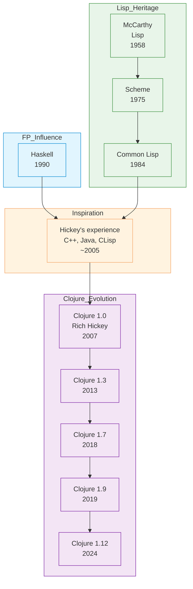

# Clojure

| | |
|---|---|
| **Year** | 2007 |
| **Creator(s)** | Rich Hickey |
| **Paradigm(s)** | Functional, Lisp |
| **Typing** | Dynamic (strong) |
| **Platform** | Java Virtual Machine (JVM) |
| **Key features** | Immutable data, STM, homoiconicity, REPL |
| **Current version** | Clojure 1.12 (2024) |

---

## Contents

1. [Overview](#overview)
2. [Historical Context](#historical-context)
3. [Key Ideas](#key-ideas)
   - [Immutability](#immutability)
   - [Software Transactional Memory (STM)](#software-transactional-memory-stm)
   - [Homoiconicity and Macros](#homoiconicity-and-macros)
   - [Seqs and Laziness](#seqs-and-laziness)
   - [Protocols](#protocols)
   - [Core.async](#coreasync)
4. [Language Features](#language-features)
   - [Core Data Types](#core-data-types)
   - [Functions](#functions)
   - [Namespaces and 'require'](#namespaces-and-require)
5. [Ecosystem and Tools](#ecosystem-and-tools)
6. [Influence](#influence)
7. [Strengths and Weaknesses](#strengths-and-weaknesses)
8. [Code Examples](#code-examples)
9. [Related Authors](#related-authors)
10. [Related Topics](#related-topics)
11. [Further Reading](#further-reading)

---

## Overview

Clojure is a modern, functional Lisp designed for practical
concurrent programming on the JVM. Created by Rich Hickey in 2007,
it combines the power and expressiveness of Lisp with modern
software engineering best practices.

Clojure's distinctive features:
- **Immutable data structures** by default — persistent, structural sharing
- **Software Transactional Memory (STM)** — composable concurrency without locks
- **Homoiconicity** — code is data, enabling powerful macros
- **JVM interop** — seamless access to Java ecosystem
- **Simplicity-focused** — "simple not easy" philosophy

Clojure influenced a generation of developers to reconsider
state-oriented OOP in favor of functional, data-oriented programming.

## Historical Context



### Design Philosophy

Rich Hickey spent two years designing Clojure before its
release, drawing on:

| Aspect | Hickey's observation | Clojure's choice |
|---------|---------------------|-----------------|
| **State in OOP** | Intertwines data with behavior | **Values** — separate data from functions |
| **Concurrency** | Locks are hard and error-prone | **STM** — composable transactions |
| **Data structures** | Mutation complicates reasoning | **Immutability** — persistent, efficient structures |
| **Tooling** | Multiple tools required | **REPL-first** — built-in, simple |
| **Integration** | Languages exist in silos | **JVM** — access to all Java libraries |

### Language Evolution

| Version | Year | Key features |
|---------|-------|---------------|
| 1.0 | 2007 | Initial release |
| 1.2 | 2009 | Protocols (type abstraction) |
| 1.3 | 2013 | Core.async (CSP), Reader macros |
| 1.5 | 2014 | Transducers, reducers (data processing) |
| 1.7 | 2018 | Spec (data validation) |
| 1.9 | 2019 | Java 17+ interop improvements |
| 1.10+ | 2020+ | Performance improvements, Java 21 support |

## Key Ideas

### Immutability

All core data structures are immutable by default:

```clojure
;; Vectors (indexed collection)
(def my-vector [1 2 3 4 5])
(assoc my-vector 2 99)  ;; Returns [1 99 3 4 5]
;; Original unchanged!

;; Maps (key-value pairs)
(def my-map {:name "Alice" :age 30})
(update my-map :age 31)  ;; Returns new map
;; Original unchanged!
```

**Why immutability?**
- **Thread-safe** — no need for locks for data access
- **Predictable** — functions don't have side effects
- **Efficient** — structural sharing (most memory reused)
- **Debuggable** — data never changes unexpectedly

### Software Transactional Memory (STM)

Clojure's approach to concurrency without explicit locks:

```clojure
(def account (ref 100))

;; STM transaction — all updates succeed or none do
(dosync
  (alter account + 10)
  (alter account2 - 5))

;; Reads see consistent state within transaction
@account  ;; Result depends on timing
```

STM enables:
- **Composable operations** — combine transactions freely
- **No deadlock risk** — STM handles conflicts automatically
- **Retry semantics** — failed transactions are retried automatically

### Homoiconicity and Macros

Like all Lisps, code is data:

```clojure
;; This is data
(def my-list [1 2 3])

;; This is code (macro)
(defmacro unless [condition body]
  `(if (not ~condition) ~body))

;; Now 'unless' is part of the language!
(unless (< 5 10)
  (println "This will print"))

;; Code as data — analyzing code programmatically
(def my-code '(defn foo [x] (+ x 1)))
(:arglists (second my-code))  ;; => [[x]]
```

### Seqs and Laziness

Clojure introduces **seq abstraction** — sequences can be
lazy:

```clojure
;; Range is lazy (doesn't allocate all numbers)
(take 5 (range))  ;; First 5 numbers, never computes all
(take 5 (drop 1000 (range 1000000)))  ;; Efficient!

;; Custom lazy sequence
(defn lazy-fib [a b]
  (lazy-seq
    (cons a (lazy-fib b (+ a b))))

(take 10 (lazy-fib 0 1))  ;; Never computes more than needed
```

### Protocols

Clojure's version of polymorphism:

```clojure
;; Define protocol (interface)
(defprotocol Drawable
  (draw [this]))

;; Implement for different types
(defrecord Circle [radius]
  Drawable
  (draw [this] (println "Circle of radius" (:radius this))))

(defrecord Rectangle [width height]
  Drawable
  (draw [this] (println "Rectangle" (:width this) "x" (:height this))))

;; Function works on any Drawable
(draw-all [shapes]
  (doseq [s shapes]
    (draw s)))
```

### Core.async

CSP (Communicating Sequential Processes) in Clojure:

```clojure
(require '[clojure.core.async :as async])

;; Channel
(def my-chan (async/chan))

;; Go block — like goroutine
(async/go
  (dotimes [i 10]
    (async/>! my-chan i)))

;; Take from channel
(async/<!
  (println "Received:" (async/<! my-chan)))
```

## Language Features

### Core Data Types

| Type | Syntax | Characteristics |
|------|--------|---------------|
| **List** | `(1 2 3)` | Linked list, sequential |
| **Vector** | `[1 2 3]` | Array-like, indexed access |
| **Map** | `{:a 1 :b 2}` | Hash map, key-value pairs |
| **Set** | `#{1 2 3}` | Unique values, unordered |
| **Keyword** | `:name` | Named keys, optimized for maps |

### Functions

```clojure
;; Function definition
(defn greet [name]
  (str "Hello, " name "!"))

;; Multi-arity functions
(defn greet
  ([] "Hello, world!")
  ([name] (str "Hello, " name "!")))

;; Destructuring in parameters
(defn process-person [{:keys [name age]}]
  (str name " is " age " years old"))

;; Anonymous functions
(map (fn [x] (* x 2)) [1 2 3])
;; Or shorthand #(* % 2)
```

### Namespaces and 'require'

```clojure
;; Define namespace
(ns my-app.core
  (:require [clojure.string :as str]
            [clojure.set :as set]))

;; Use required functions
(str/join "-" ["one" "two" "three"])
(set/union #{1 2 3} #{2 3 4})
```

## Ecosystem and Tools

### Build Tools

| Tool | Purpose |
|-------|---------|
| **deps.edn** | CLI tools (deps, clj) |
| **Leiningen** | Classic build tool |
| **Boot** | Functional build tool |

### Libraries

| Library | Purpose |
|----------|---------|
| **core.async** | Asynchronous programming (CSP) |
| **Spec** | Data validation, generative testing |
| **Pedestal** | Web applications |
| **Re-frame** | Frontend framework |
| **Datomic** | Database (values-oriented) |

## Influence

### Languages Inspired

| Language | Clojure influence |
|-----------|-----------------|
| **ClojureScript** | Clojure that compiles to JavaScript |
| **Jule** | Lisp on JVM, immutable focus |
| **Babashka** | Clojure compilation to native |
| **Fennel** | Lisp-1 on Lua, Clojure-inspired |
| **Racket** | Adopted spec-like validation (Typed Racket) |

### Design Philosophy Impact

Clojure's "simple ≠ easy" philosophy influenced:

- **React** — functional components as pure functions of props
- **Redux** — single immutable state, actions as data
- **Immer** — immutable updates in JavaScript
- **Java 8+** — streams, optionals influenced by FP

## Code Examples

See [examples/clojure/](../../../examples/clojure/) for runnable code:

| Example | Description |
|---------|-------------|
| [01 Hello World](../../../examples/clojure/01-hello-world/) | Basic syntax, REPL |
| [02 Variables & Types](../../../examples/clojure/02-variables-and-types/) | Dynamic typing, keywords, symbols |
| [03 Functions](../../../examples/clojure/03-functions/) | Arity, destructuring, higher-order functions |
| [04 Control Flow](../../../examples/clojure/04-control-flow/) | Conditionals, recursion, loops |
| [05 Data Structures](../../../examples/clojure/05-data-structures/) | Vectors, maps, sets, seq operations |
| [06 OOP/Modules](../../../examples/clojure/06-oop-modules/) | Protocols, records, namespaces |

## Strengths and Weaknesses

### Strengths

- **Simplicity** — small core, predictable semantics
- **Immutability** — thread-safe, easier reasoning
- **JVM ecosystem** — access to all Java libraries
- **Concise syntax** — less boilerplate than Java
- **REPL-driven** — fast feedback, exploratory programming
- **Macros** — powerful meta-programming

### Weaknesses

- **Learning curve** — Lisp syntax, new concepts (STM, transducers)
- **Startup time** — JVM initialization can be slow
- **Tooling complexity** — multiple build tools
- **Dynamic typing** — runtime errors vs compile-time safety
- **Industry adoption** — smaller than JavaScript, Python, Java

## Related Authors

- [Rich Hickey](../authors/rich-hickey.md) — creator
- [John McCarthy](../authors/john-mccarthy.md) — Lisp heritage
- [Joe Armstrong](../authors/joe-armstrong.md) — concurrency influence
- [John Hughes](../authors/john-hughes.md) — functional programming influence

## Related Topics

- [Functional Programming](../topics/functional/) — Clojure as practical FP
- [Lisp](../lisp/) — Clojure as modern Lisp dialect
- [Concurrency](../topics/concurrency/) — STM, core.async
- [Type Systems](../topics/types/) — dynamic vs static typing

## Further Reading

- Hickey — [Simple Made Easy](../works/talks/hickey-2011-simple-made-easy.md) (2011)
- Hickey — [Are We There Yet?](../works/talks/hickey-2009-are-we-there-yet.md) (2009)
- Fogus & Houser — *Clojure Programming* (2014)
- Grandstaff — *Elements of Clojure* (2012)
- Rathore — *Clojure in Action* (2010)

## Quotes

> "Simplicity is a prerequisite for reliability."
> — Rich Hickey (echoing Edsger Dijkstra)

> "State. You're doing it wrong."
> — Rich Hickey

> "If you want everything to be familiar, you will never learn anything new."
> — Rich Hickey

> "Simple is often erroneously mistaken for easy. 'Easy' means 'near.' Simple is a opposite of complex."
> — Rich Hickey

---

See [Languages Index](../languages/) for other language profiles.
