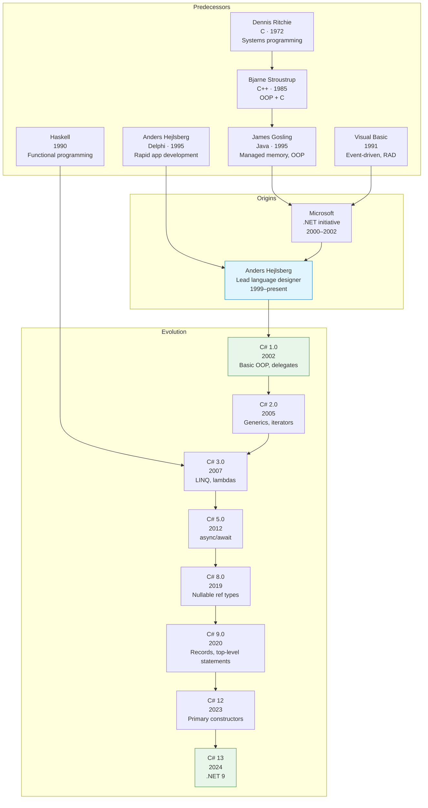
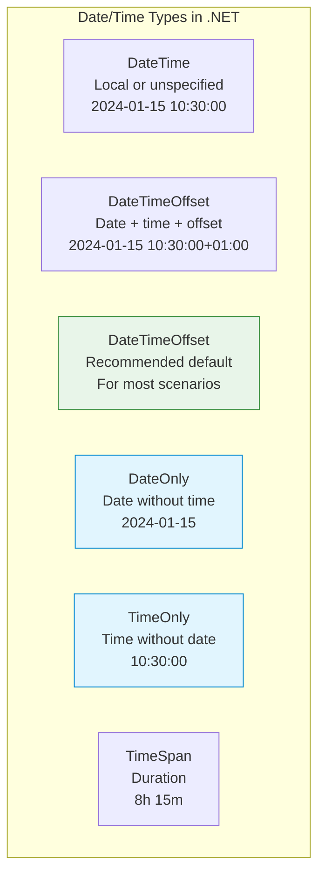
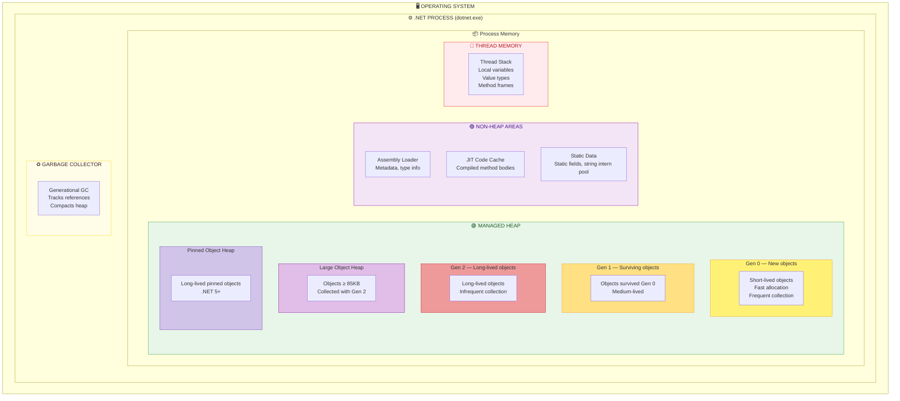
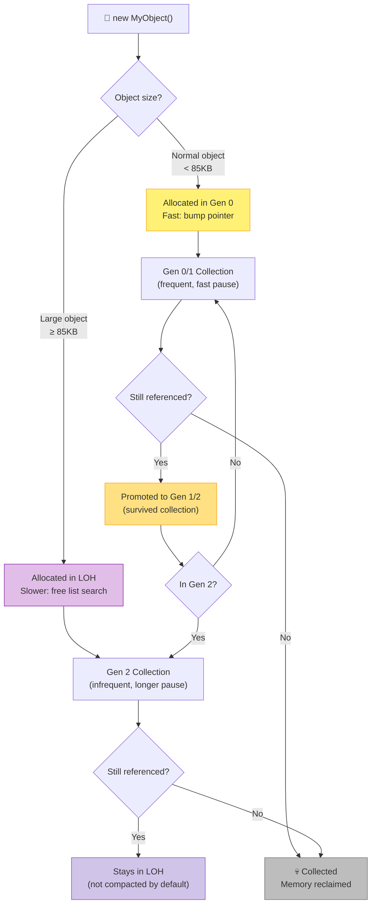
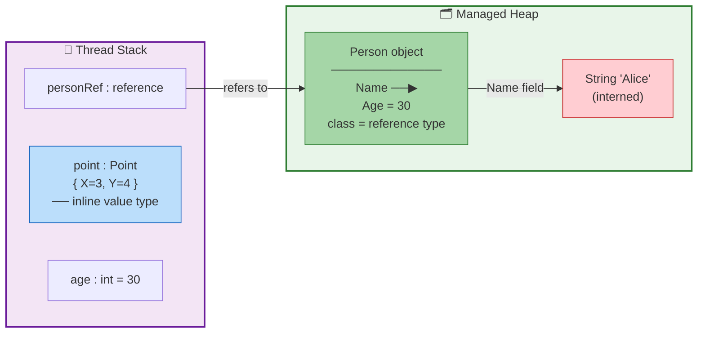

# C#

| | |
|---|---|
| **Year** | 2000 (announced) · 2002 (1.0 release) |
| **Creator(s)** | Anders Hejlsberg (Microsoft) |
| **Paradigm(s)** | Object-oriented, imperative, functional, component-oriented |
| **Typing** | Static, nominal, strong |
| **Platform** | .NET (CLR / bytecode, now cross-platform) |
| **Key features** | Properties, LINQ, async/await, reified generics, records, pattern matching, nullable reference types, delegates |
| **Current version** | C# 13 (.NET 9, 2024) |
| **Official site** | [dotnet.microsoft.com/languages/csharp](https://dotnet.microsoft.com/languages/csharp) |

---

## Contents

1. [Overview](#overview)
2. [Historical Context](#historical-context)
3. [Language Evolution](#language-evolution)
4. [Core Features](#core-features)
   - [Classes, Structs, and Objects](#classes-structs-and-objects)
   - [Interfaces](#interfaces)
   - [Properties](#properties)
   - [Delegates and Events](#delegates-and-events)
   - [Exception Handling](#exception-handling)
5. [Key Features In Depth](#key-features-in-depth)
   - [Generics](#generics)
   - [LINQ](#linq)
   - [Lambdas and Anonymous Methods](#lambdas-and-anonymous-methods)
   - [Nullable Value Types and Nullable Reference Types](#nullable-value-types-and-nullable-reference-types)
   - [Records](#records)
   - [Pattern Matching](#pattern-matching)
   - [Async/Await](#asyncawait)
   - [Span&lt;T&gt; and Memory&lt;T&gt;](#spant-and-memoryt)
   - [Unsafe Code and Pointers](#unsafe-code-and-pointers)
   - [Extension Methods](#extension-methods)
   - [Expression Trees](#expression-trees)
   - [Working with Dates and Times](#working-with-dates-and-times)
6. [Other Language Features](#other-language-features)
7. [Runtime Memory Layout](#runtime-memory-layout)
8. [C# Memory Model](#c-memory-model)
9. [Ecosystem and Tools](#ecosystem-and-tools)
10. [Influence](#influence)
11. [Strengths and Weaknesses](#strengths-and-weaknesses)
12. [Code Examples](#code-examples)
13. [Related Authors](#related-authors)
14. [Related Topics](#related-topics)
15. [Further Reading](#further-reading)
16. [Quotes](#quotes)

---

## Overview

C# is a **modern, multi-paradigm programming language** designed by Anders Hejlsberg at Microsoft, first released in 2002 as part of the .NET Framework. It combines the power of C-style syntax with managed memory safety, rich type system features, and a vast cross-platform ecosystem.

C#'s core design philosophy:

- **Productivity** — features that reduce boilerplate: properties, LINQ, async/await, records, pattern matching
- **Type safety** — static typing with null-safety analysis, strong generics, and compile-time checks
- **Performance** — value types (`struct`), `Span<T>` for zero-copy operations, unsafe code when needed, modern GC
- **Evolvability** — regular language releases with backward-compatible additions
- **Cross-platform** — from Windows-only (.NET Framework) to running on Linux, macOS, containers, and WebAssembly (.NET 5+)

C# powers:

- **Enterprise backends** — ASP.NET Core, microservices, cloud-native apps
- **Web applications** — Blazor (WebAssembly and server-rendered)
- **Desktop applications** — WPF, WinForms, .NET MAUI (cross-platform)
- **Game development** — Unity engine (primary scripting language)
- **Mobile apps** — .NET MAUI, Xamarin
- **Cloud and AI** — Azure SDK, ML.NET

---

## Historical Context



| Year | Event | Note |
|------|-------|------|
| 2000 | C# and .NET announced at PDC | Microsoft's response to Java and the JVM |
| 2002 | **C# 1.0 released** with .NET Framework 1.0 | Basic OOP, delegates, events, properties |
| 2003 | C# approved as ECMA-334 standard | Formal standardization begins |
| 2005 | **C# 2.0** — Generics, iterators, nullable value types | Reified generics (types preserved at runtime) |
| 2007 | **C# 3.0** — LINQ, lambdas, extension methods, `var` | Query integration into the language |
| 2010 | C# 4.0 — `dynamic`, optional parameters, covariance/contravariance | COM interop improvements |
| 2012 | **C# 5.0** — async/await | Cooperative asynchronous programming |
| 2015 | C# 6.0 — String interpolation, null-conditional, expression-bodied members | Quality-of-life improvements |
| 2016 | **.NET Core 1.0** released | Open-source, cross-platform rewrite |
| 2017 | C# 7.0 — Tuples, pattern matching (introduced), ref returns | Value semantics and performance focus |
| 2019 | **C# 8.0** — Nullable reference types, default interface methods, async streams | Major null-safety and async improvements |
| 2020 | **C# 9.0** — Records, init-only properties, top-level statements | Immutability and conciseness |
| 2020 | **.NET 5** released — unified platform | Single .NET replacing Framework and Core |
| 2021 | C# 10.0 — File-scoped namespaces, global usings, record structs | Further boilerplate reduction |
| 2022 | C# 11.0 — Generic math, raw string literals, required members | Advanced generic and string features |
| 2023 | C# 12.0 — Primary constructors, collection expressions | More concise syntax |
| 2024 | **C# 13.0** — `params` collections, `lock` object, `field` keyword | .NET 9 release |

The name "C#" is a musical reference: the sharp symbol (♯) indicates the note is a semitone higher than C, suggesting C# is an evolution of C/C++.

---

## Language Evolution

| Version | Year | Key additions |
|---------|------|---------------|
| **1.0** | 2002 | Classes, structs, interfaces, delegates, events, properties, exception handling |
| **2.0** | 2005 | **Generics**, nullable value types (`T?`), iterators (`yield return`), anonymous methods, partial classes, static classes |
| **3.0** | 2007 | **LINQ**, lambda expressions, anonymous types, auto-implemented properties, extension methods, `var`, object/collection initializers, expression trees |
| **4.0** | 2010 | `dynamic`, optional/named parameters, covariance/contravariance (`in`/`out` on interfaces), COM interop |
| **5.0** | 2012 | **Async/await**, caller info attributes |
| **6.0** | 2015 | Expression-bodied members, null-conditional `?.`, string interpolation, `using static`, exception filters |
| **7.0** | 2017 | **Tuples**, **pattern matching** (introduced), `ref` returns/locals, local functions, `out` variables, throw expressions, discards |
| **7.1–7.3** | 2017–2018 | Async Main, default literal, `in` parameters, `readonly struct`, blittable structs |
| **8.0** | 2019 | **Nullable reference types**, default interface methods, async streams (`IAsyncEnumerable`), ranges/indexes, switch expressions, `using` declarations |
| **9.0** | 2020 | **Records**, init-only properties, top-level statements, target-typed `new`, `with` expressions, covariant returns |
| **10.0** | 2021 | File-scoped namespaces, global usings, record structs, constant interpolated strings, `CallerArgumentExpression` |
| **11.0** | 2022 | Generic math (`INumber<T>`), raw string literals, required members, UTF-8 string literals, `file` access modifier |
| **12.0** | 2023 | Primary constructors, collection expressions, inline arrays |
| **13.0** | 2024 | `params` collections, `lock` object, `field` keyword, partial properties, `allows ref struct` |

---

## Core Features

### Classes, Structs, and Objects

C# is fundamentally class-based, with two categories of types: **reference types** (classes, stored on the heap) and **value types** (structs, stored on the stack or inline).

```csharp
// Reference type — allocated on the heap
class Animal
{
    // Auto-implemented property (C# 3.0+)
    public string Name { get; set; }
    public int Age { get; set; }

    public Animal(string name, int age)
    {
        Name = name;
        Age = age;
    }

    public virtual void Speak()
    {
        Console.WriteLine($"{Name} makes a sound");
    }
}

// Single inheritance only
class Dog : Animal
{
    public string Breed { get; set; }

    public Dog(string name, int age, string breed) : base(name, age)
    {
        Breed = breed;
    }

    public override void Speak()
    {
        Console.WriteLine($"{Name} barks");
    }
}
```

**Value types** (`struct`) are lightweight, stack-allocated types ideal for small, immutable data:

```csharp
// Value type — allocated on the stack (or inline in objects)
readonly struct Point
{
    public double X { get; }
    public double Y { get; }

    public Point(double x, double y)
    {
        X = x;
        Y = y;
    }

    public double DistanceFromOrigin => Math.Sqrt(X * X + Y * Y);
}

Point p = new Point(3, 4);   // Stack allocation
Console.WriteLine(p.DistanceFromOrigin);  // 5
```

Key differences:

| Aspect | `class` (reference) | `struct` (value) |
|--------|---------------------|------------------|
| Storage | Heap | Stack (or inline) |
| Inheritance | Single class, multiple interfaces | No inheritance (except `object`) |
| Default | `null` | Zero-initialized (e.g., `default(Point)`) |
| Assignment | Copies reference | Copies entire value |
| Mutability | Typically mutable | Design for immutability |

---

### Interfaces

Interfaces define contracts that classes and structs can implement. C# supports multiple interface implementation.

```csharp
interface IDrawable
{
    void Draw();

    // Default interface method (C# 8.0)
    string Describe() => "A drawable shape";
}

interface IResizable
{
    void Resize(double factor);
}

class Circle : IDrawable, IResizable
{
    public double Radius { get; set; }

    public void Draw() => Console.WriteLine($"Drawing circle r={Radius}");
    public void Resize(double factor) => Radius *= factor;
}

// Polymorphic use
static void RenderAll(IEnumerable<IDrawable> shapes)
{
    foreach (var shape in shapes)
        shape.Draw();
}
```

**Explicit interface implementation** resolves naming conflicts when a class implements multiple interfaces with the same member:

```csharp
class ConsoleWriter : IOutput, IError
{
    void IOutput.Write(string msg) => Console.WriteLine($"OUT: {msg}");
    void IError.Write(string msg) => Console.Error.WriteLine($"ERR: {msg}");
}
```

**Variance** on generic interfaces (`IEnumerable<out T>`, `IComparer<in T>`) allows safe co- and contravariant usage.

---

### Properties

Properties are first-class language features that replace getter/setter methods with a concise syntax.

```csharp
class Person
{
    // Auto-implemented property (C# 3.0)
    public string Name { get; set; }

    // Init-only property (C# 9.0) — set only during initialization
    public DateTime DateOfBirth { get; init; }

    // Computed property with expression body (C# 6.0)
    public int Age => DateTime.Now.Year - DateOfBirth.Year;

    // Required property (C# 11) — must be set at object creation
    public required string Email { get; set; }

    // Full property with backing field
    private int _score;
    public int Score
    {
        get => _score;
        set => _score = Math.Max(0, value);  // Validation in setter
    }
}

// Object initializer
var person = new Person
{
    Name = "Alice",
    DateOfBirth = new DateTime(1990, 5, 23),
    Email = "alice@example.com"
};
```

---

### Delegates and Events

**Delegates** are type-safe function pointers. They enable callbacks, event-driven programming, and functional patterns.

```csharp
// Custom delegate type
delegate void Notify(string message);

// Built-in delegate types (C# 3.0+)
Action<string> action = msg => Console.WriteLine(msg);
Func<int, int, int> add = (a, b) => a + b;
Predicate<int> isEven = n => n % 2 == 0;

// Multicast delegate
Notify combined = action;
combined += msg => File.AppendAllText("log.txt", msg);
combined("Hello");  // Calls both handlers
```

**Events** build on delegates with publisher/subscriber semantics:

```csharp
class Button
{
    // Event declaration
    public event EventHandler? Clicked;

    public void Press()
    {
        // Safe invocation with null-conditional
        Clicked?.Invoke(this, EventArgs.Empty);
    }
}

var button = new Button();
button.Clicked += (sender, e) => Console.WriteLine("Button pressed!");
button.Press();  // Output: Button pressed!
```

---

### Exception Handling

C# uses a unified exception model — there are no checked exceptions (unlike Java). All exceptions derive from `System.Exception`.

```csharp
// Basic try/catch/finally
try
{
    var content = File.ReadAllText("data.txt");
    Process(content);
}
catch (FileNotFoundException e)
{
    Console.WriteLine($"File not found: {e.FileName}");
}
catch (IOException e)
{
    Console.WriteLine($"I/O error: {e.Message}");
}
finally
{
    cleanup();  // Always runs
}
```

**Exception filters** (`when` clause) allow conditional catch blocks:

```csharp
try
{
    riskyOperation();
}
catch (HttpRequestException e) when (e.StatusCode == HttpStatusCode.NotFound)
{
    // Only catches 404 errors
    ShowNotFoundPage();
}
catch (HttpRequestException e) when (e.StatusCode == HttpStatusCode.Unauthorized)
{
    // Only catches 401 errors
    RedirectToLogin();
}
```

**Using declarations** (C# 8.0) for automatic resource disposal:

```csharp
// using declaration — disposes at end of enclosing scope
using var reader = new StreamReader("data.txt");
string line = reader.ReadLine();
// reader.Dispose() called automatically
```

**Custom exception:**

```csharp
class InsufficientFundsException : Exception
{
    public decimal Amount { get; }

    public InsufficientFundsException(decimal amount)
        : base($"Insufficient funds: needed {amount:C}")
    {
        Amount = amount;
    }
}
```

---

## Key Features In Depth

### Generics

C# generics are **reified** — type parameters are preserved at runtime. `List<int>` and `List<string>` are distinct types in the CLR.

```csharp
// Generic class
public class Box<T>
{
    public T Value { get; set; }

    public Box(T value) => Value = value;
}

Box<string> strBox = new Box<string>("hello");
Box<int> intBox = new Box<int>(42);

// Type information preserved at runtime
Console.WriteLine(strBox.GetType());  // Box`1[System.String]
Console.WriteLine(intBox.GetType());  // Box`1[System.Int32]
```

#### Generic constraints

```csharp
// T must have a parameterless constructor
public T Create<T>() where T : new() => new T();

// T must be a reference type
public void Process<T>(T item) where T : class { }

// T must be a value type (non-nullable)
public T Max<T>(T a, T b) where T : struct, IComparable<T>
    => a.CompareTo(b) >= 0 ? a : b;

// T must implement an interface
public void Sort<T>(List<T> list) where T : IComparable<T>
    => list.Sort();
```

#### Variance

```csharp
// Covariant — can return T (producer)
IEnumerable<string> strings = new List<string> { "a", "b" };
IEnumerable<object> objects = strings;  // OK: string is object

// Contravariant — can accept T (consumer)
IComparer<object> objectComparer = Comparer<object>.Default;
IComparer<string> stringComparer = objectComparer;  // OK: can compare strings as objects
```

| Variance | Keyword | Direction | Example |
|----------|---------|-----------|---------|
| Covariant | `out T` | Return only | `IEnumerable<out T>` |
| Contravariant | `in T` | Accept only | `IComparer<in T>` |
| Invariant | `T` | Both | `List<T>` |

---

### LINQ

**Language Integrated Query** (C# 3.0) provides a unified syntax for querying any data source: in-memory collections, databases (via Entity Framework), XML, and more.

#### Query syntax

```csharp
var adults = from p in people
             where p.Age >= 18
             orderby p.Name
             select p.Name;
```

#### Method syntax (equivalent)

```csharp
var adults = people
    .Where(p => p.Age >= 18)
    .OrderBy(p => p.Name)
    .Select(p => p.Name);
```

#### Deferred execution

LINQ queries are not executed until enumerated:

```csharp
var query = numbers.Where(n => n > 5);  // No execution yet

foreach (var n in query)  // Execution happens here
    Console.WriteLine(n);
```

#### Standard operators

```csharp
// Filtering and projection
var evenSquares = numbers
    .Where(n => n % 2 == 0)
    .Select(n => n * n);

// Aggregation
int sum = numbers.Sum();
int max = numbers.Max();
double avg = numbers.Average();

// Grouping
var byAge = people.GroupBy(p => p.Age / 10 * 10);

// Set operations
var unique = list1.Distinct();
var intersection = list1.Intersect(list2);

// Partitioning
var firstFive = list.Take(5);
var rest = list.Skip(5);

// Quantifiers
bool anyNegative = numbers.Any(n => n < 0);
bool allPositive = numbers.All(n => n > 0);
```

#### LINQ to Objects pipeline

```csharp
var result = products
    .Where(p => p.Price > 100)
    .OrderByDescending(p => p.Price)
    .Take(10)
    .Select(p => new { p.Name, p.Price })
    .ToList();  // Forces execution
```

#### `IQueryable<T>` for remote sources

```csharp
// Translated to SQL by Entity Framework
var expensiveProducts = dbContext.Products
    .Where(p => p.Price > 1000)
    .OrderBy(p => p.Name)
    .ToListAsync();  // SQL: SELECT ... WHERE Price > 1000 ORDER BY Name
```

---

### Lambdas and Anonymous Methods

C# offers multiple ways to create function values:

```csharp
// Anonymous method (C# 2.0)
Func<int, int> square1 = delegate(int x) { return x * x; };

// Lambda expression (C# 3.0)
Func<int, int> square2 = x => x * x;

// Multiple parameters
Func<int, int, int> add = (a, b) => a + b;

// Statement lambda
Action<string> greet = name =>
{
    var msg = $"Hello, {name}!";
    Console.WriteLine(msg);
};

// Closure capture
int factor = 10;
Func<int, int> multiplier = x => x * factor;  // Captures 'factor'
```

---

### Nullable Value Types and Nullable Reference Types

#### Nullable value types (C# 2.0)

Value types can represent missing values:

```csharp
int? count = null;           // Nullable value type
int? count2 = 42;            // Has value

// Null-coalescing
int result = count ?? 0;     // 0 if count is null

// Null-coalescing assignment (C# 8.0)
count ??= 0;                 // Sets to 0 only if null

// Null-conditional access
int? length = name?.Length;  // null if name is null

// HasValue / Value
if (count.HasValue)
    Console.WriteLine(count.Value);
```

#### Nullable reference types (C# 8.0)

The compiler distinguishes nullable from non-nullable reference types at compile time:

```csharp
#nullable enable

string nonNull = "hello";    // Cannot be null (compile warning if assigned null)
string? maybeNull = null;    // Can be null

// Warnings:
// int len = maybeNull.Length;   // Warning: possible null reference

// Null-forgiving operator
string definitely = maybeNull!;  // Suppress warning (use with caution)
```

> Nullable reference types are **opt-in** (enabled via `#nullable enable` or project setting). The compiler emits warnings, not errors, for potential null dereferences.

---

### Records

**Records** (C# 9.0) provide concise syntax for immutable data types with value-based equality.

```csharp
// Record class — reference type with value semantics
public record Person(string Name, int Age);

// Record struct (C# 10.0) — value type record
public readonly record struct Point(double X, double Y);

// Usage
var alice = new Person("Alice", 30);
var bob = new Person("Bob", 25);

// Value equality (not reference equality)
Console.WriteLine(alice == bob);  // False
var alice2 = new Person("Alice", 30);
Console.WriteLine(alice == alice2);  // True

// Non-destructive mutation with 'with' expression
var olderAlice = alice with { Age = 31 };

// Deconstruction
var (name, age) = alice;
Console.WriteLine($"{name} is {age}");  // Alice is 30
```

#### Record inheritance

```csharp
public record Employee(string Name, int Age, string Department) : Person(Name, Age);

var emp = new Employee("Alice", 30, "Engineering");
```

#### `init` properties with records

```csharp
public record Product
{
    public required string Name { get; init; }
    public required decimal Price { get; init; }
    public string? Description { get; init; }
}
```

---

### Pattern Matching

C# has progressively expanded pattern matching since C# 7.0.

#### Type patterns

```csharp
object obj = "hello";

if (obj is string s)
    Console.WriteLine(s.Length);  // s is typed as string here

// Switch expression (C# 8.0)
string description = obj switch
{
    int i => $"integer: {i}",
    string s => $"string of length {s.Length}",
    null => "null",
    _ => "unknown"
};
```

#### Property patterns

```csharp
if (person is { Name: "Alice", Age: > 18 })
    Console.WriteLine("Adult Alice");
```

#### Positional patterns (with deconstruction)

```csharp
var point = new Point(3, 4);

string quadrant = point switch
{
    (0, 0) => "origin",
    (> 0, > 0) => "quadrant I",
    (< 0, > 0) => "quadrant II",
    (< 0, < 0) => "quadrant III",
    (> 0, < 0) => "quadrant IV",
    _ => "on axis"
};
```

#### List patterns (C# 11)

```csharp
int[] numbers = { 1, 2, 3 };

if (numbers is [1, 2, 3])
    Console.WriteLine("Exactly 1, 2, 3");

if (numbers is [1, .., 3])
    Console.WriteLine("Starts with 1, ends with 3");

if (numbers is [var first, .. var rest])
    Console.WriteLine($"First: {first}, Rest: {rest.Length}");
```

#### Relational and logical patterns

```csharp
string grade = score switch
{
    >= 90 => "A",
    >= 80 => "B",
    >= 70 => "C",
    >= 60 => "D",
    _ => "F"
};

// Logical patterns
if (value is > 0 and < 100)
    Console.WriteLine("In range");

if (value is not null)
    Console.WriteLine("Not null");
```

---

### Async/Await

C# 5.0 introduced `async`/`await` for asynchronous programming. The compiler transforms async methods into state machines.

```csharp
// Async method returning a Task
public async Task<string> FetchDataAsync(string url)
{
    using var client = new HttpClient();
    return await client.GetStringAsync(url);
}

// Async method returning a value
public async Task<int> CountItemsAsync()
{
    var items = await LoadItemsAsync();
    return items.Count;
}

// Async void — only for event handlers
public async void OnButtonClick(object sender, EventArgs e)
{
    var result = await FetchDataAsync("https://api.example.com");
    UpdateUI(result);
}
```

#### Async streams (C# 8.0)

```csharp
public async IAsyncEnumerable<int> GenerateNumbersAsync(
    [EnumeratorCancellation] CancellationToken ct = default)
{
    for (int i = 0; i < 10; i++)
    {
        await Task.Delay(100, ct);
        yield return i;
    }
}

// Consumption
await foreach (var number in GenerateNumbersAsync().WithCancellation(ct))
{
    Console.WriteLine(number);
}
```

#### `ValueTask<T>` for hot paths

```csharp
// ValueTask avoids Task allocation for synchronous fast paths
public ValueTask<int> GetCachedValueAsync()
{
    if (_cache.TryGetValue("key", out var value))
        return new ValueTask<int>(value);  // No allocation

    return new ValueTask<int>(LoadAsync());
}
```

#### `ConfigureAwait(false)`

```csharp
// Library code should use ConfigureAwait(false) to avoid capturing SynchronizationContext
public async Task<byte[]> DownloadAsync(string url)
{
    using var client = new HttpClient();
    return await client.GetByteArrayAsync(url).ConfigureAwait(false);
}
```

---

### Span&lt;T&gt; and Memory&lt;T&gt;

`Span<T>` (C# 7.2) provides a type-safe, stack-only view over contiguous memory without allocating.

```csharp
// Span over an array
int[] numbers = { 1, 2, 3, 4, 5 };
Span<int> slice = numbers.AsSpan(1, 3);  // [2, 3, 4]

// Span over stack-allocated memory
Span<byte> buffer = stackalloc byte[256];
FillBuffer(buffer);

// Span over string (ReadOnlySpan<char>)
ReadOnlySpan<char> text = "Hello, World!";
ReadOnlySpan<char> greeting = text.Slice(0, 5);  // "Hello" — no allocation

// Span in APIs for zero-copy operations
public int ParseNumber(ReadOnlySpan<char> input)
{
    return int.Parse(input);
}
```

`Memory<T>` is the heap-friendly alternative to `Span<T>`:

```csharp
// Memory can be stored on the heap
public async Task ProcessStreamAsync(Memory<byte> buffer, Stream stream)
{
    int read = await stream.ReadAsync(buffer);
    // Process buffer[0..read]
}
```

---

### Unsafe Code and Pointers

C# allows pointer arithmetic and direct memory access in `unsafe` contexts.

```csharp
unsafe
{
    int number = 42;
    int* ptr = &number;
    Console.WriteLine(*ptr);  // 42

    // Stack-allocated buffer
    byte* buffer = stackalloc byte[1024];
    buffer[0] = 0xFF;
}
```

**Pinning managed objects** with `fixed`:

```csharp
byte[] data = new byte[100];

unsafe
{
    fixed (byte* ptr = data)
    {
        // 'data' is pinned — GC won't move it
        NativeMethod(ptr, data.Length);
    }  // Unpinned here
}
```

**P/Invoke** for calling native libraries:

```csharp
[DllImport("user32.dll", CharSet = CharSet.Unicode)]
static extern int MessageBox(IntPtr hWnd, string text, string caption, uint type);

MessageBox(IntPtr.Zero, "Hello", "Title", 0);
```

---

### Extension Methods

Extension methods add functionality to existing types without inheritance.

```csharp
public static class StringExtensions
{
    // Extends string with a new method
    public static bool IsNullOrWhiteSpace(this string? str)
        => string.IsNullOrWhiteSpace(str);

    public static string ToSlug(this string str)
        => str.ToLowerInvariant()
              .Replace(' ', '-')
              .Replace("--", "-");
}

// Usage — looks like an instance method
var slug = "Hello World".ToSlug();  // "hello-world"
```

LINQ is implemented entirely as extension methods on `IEnumerable<T>`.

---

### Expression Trees

Expression trees represent code as data structures that can be inspected and transformed at runtime.

```csharp
// Regular lambda — compiled to delegate
Func<int, bool> isPositive = x => x > 0;

// Expression tree — compiled to data structure
Expression<Func<int, bool>> isPositiveExpr = x => x > 0;

// Inspect the expression tree
var parameter = isPositiveExpr.Parameters[0];      // x
var body = (BinaryExpression)isPositiveExpr.Body;  // x > 0
var left = (ParameterExpression)body.Left;         // x
var right = (ConstantExpression)body.Right;        // 0

// LINQ providers use expression trees to translate to SQL
IQueryable<Product> query = dbContext.Products
    .Where(p => p.Price > 100);  // 'p => p.Price > 100' is an expression tree
```

---

### Working with Dates and Times

.NET provides several date/time types for different use cases.



#### Choosing the right type

| Type | Use when | Example |
|------|----------|---------|
| **`DateTimeOffset`** | Default choice — unambiguous instant | `DateTimeOffset.UtcNow` |
| **`DateTime` (Utc)** | When offset is handled separately | `DateTime.UtcNow` |
| **`DateOnly`** | Birthdays, holidays, dates without time | `DateOnly.FromDateTime(DateTime.Now)` |
| **`TimeOnly`** | Opening hours, schedules | `TimeOnly.FromDateTime(DateTime.Now)` |
| **`TimeSpan`** | Durations, intervals | `TimeSpan.FromHours(8)` |

#### Common operations

```csharp
// Current time
DateTimeOffset now = DateTimeOffset.UtcNow;
DateTimeOffset local = DateTimeOffset.Now;

// Specific date
DateOnly birthday = new DateOnly(1990, 5, 23);

// Parsing
DateTimeOffset parsed = DateTimeOffset.Parse("2024-01-15T10:30:00+01:00");

// Formatting
string iso = now.ToString("O");  // 2024-01-15T10:30:00.0000000+00:00

// Timezone conversion
DateTimeOffset utc = DateTimeOffset.UtcNow;
DateTimeOffset tokyo = TimeZoneInfo.ConvertTimeBySystemTimeZoneId(utc, "Asia/Tokyo");

// Duration
TimeSpan duration = TimeSpan.FromDays(7);
DateTimeOffset future = now + duration;

// Comparison
bool isPast = birthday.ToDateTime(TimeOnly.MinValue) < DateTime.Now;
```

> For advanced date/time handling ( calendars, intervals, complex timezone rules), the [Noda Time](https://nodatime.org/) library is the de facto standard.

---

## Other Language Features

| Feature | Version | Description | Example |
|---------|---------|-------------|---------|
| **Tuples** | 7.0 | Lightweight named/unnamed groups | `(int x, int y) point = (1, 2);` |
| **Deconstruction** | 7.0 | Break tuples/records into variables | `var (x, y) = point;` |
| **Ranges and indexes** | 8.0 | `^` from-end, `..` range | `arr[^1]`, `arr[1..5]` |
| **Target-typed `new`** | 9.0 | `new()` without repeating type | `List<int> list = new();` |
| **Global usings** | 10.0 | Implicit usings across project | `global using System;` |
| **File-scoped namespaces** | 10.0 | Single namespace per file, no braces | `namespace MyApp;` |
| **Raw string literals** | 11.0 | Multi-line without escaping | `"""{ "key": "value" }"""` |
| **Collection expressions** | 12.0 | Unified initialization syntax | `int[] nums = [1, 2, 3];` |
| **Primary constructors** | 12.0 | Constructor params in class declaration | `class Person(string name);` |
| **`required` members** | 11.0 | Must be set at object initialization | `public required string Name { get; set; }` |
| **`init` accessors** | 9.0 | Set-only during initialization | `public string Name { get; init; }` |
| **`nameof`** | 6.0 | Compile-time string of identifier | `nameof(person.Name)` → `"Name"` |
| **Interpolated strings** | 6.0 | `$"Hello, {name}"` | |
| **`using` declarations** | 8.0 | `using var x = ...` (no braces) | |
| **`yield return`** | 2.0 | Iterator methods | `yield return item;` |
| **Exception filters** | 6.0 | `catch (Ex e) when (condition)` | |
| **Operator overloading** | 1.0 | Custom operators for types | `public static Point operator +(Point a, Point b)` |
| **Indexers** | 1.0 | Array-like access on objects | `public string this[int index] { get; }` |
| **Partial classes** | 2.0 | Split class across files | `partial class MyClass` |
| **Attributes** | 1.0 | Metadata on declarations | `[Obsolete("Use NewMethod")]` |

---

## Runtime Memory Layout

C# programs run on the **Common Language Runtime (CLR)**. Understanding memory layout is essential for performance tuning.

### CLR process memory overview



### Object lifecycle



### Value type vs reference type layout



### What goes where

| What | Where | Rationale |
|------|-------|-----------|
| `new MyClass()` | Gen 0 (heap) | All reference type instances |
| `new byte[100_000]` | LOH (heap) | Large objects ≥ 85KB |
| `new MyStruct()` | Stack (or inline) | Value type — no heap allocation |
| `int x = 42` (local) | Stack frame | Primitive local variable |
| Object reference (local) | Stack frame | The reference; object is on heap |
| `static readonly string X` | Static data / intern pool | Deduplicated string |
| JIT-compiled method | Code cache | After warm-up threshold |
| `stackalloc byte[100]` | Stack | Explicit stack allocation |
| `GC.AllocateArray<T>(pinned: true)` | POH | Pinned objects since .NET 5 |

### Garbage Collection modes

| Mode | Characteristics | Best for |
|------|-----------------|----------|
| **Workstation** | Single-threaded GC, smaller pauses | Desktop apps, low latency |
| **Server** | Multi-threaded GC, higher throughput | Server apps, high throughput |
| **Background** | Concurrent Gen 2 collection | Default since .NET 4.0 |
| **LOH compaction** | Optional since .NET 4.5.1 | When LOH fragmentation is an issue |

---

## C# Memory Model

The .NET memory model defines rules for visibility, ordering, and synchronization between threads.

### `volatile` keyword

`volatile` ensures reads and writes are not reordered by the compiler or CPU:

```csharp
class FlagExample
{
    private static volatile bool _ready;
    private static int _value;

    static void Writer()
    {
        _value = 42;
        _ready = true;   // volatile write — earlier writes are visible
    }

    static void Reader()
    {
        if (_ready)      // volatile read — sees all prior writes
            Console.WriteLine(_value);  // Guaranteed: 42
    }
}
```

### Synchronization primitives

| Mechanism | Purpose |
|-----------|---------|
| `lock` | Syntactic sugar for `Monitor.Enter/Exit` — mutual exclusion |
| `Interlocked` | Lock-free atomic operations (increment, compare-exchange) |
| `MemoryBarrier` / `Volatile.Read/Write` | Explicit memory barriers |
| `SpinLock` | Lightweight lock for very short critical sections |
| `ReaderWriterLockSlim` | Multiple readers, single writer |
| `SemaphoreSlim` | Limited concurrent access |
| `Mutex` | Cross-process synchronization |
| `AutoResetEvent` / `ManualResetEventSlim` | Signaling between threads |

### Concurrent collections

```csharp
var dict = new ConcurrentDictionary<string, int>();
dict.TryAdd("key", 1);
dict.AddOrUpdate("key", 1, (k, v) => v + 1);

var queue = new ConcurrentQueue<int>();
queue.Enqueue(42);
queue.TryDequeue(out var value);

var bag = new ConcurrentBag<int>();     // Thread-safe unordered collection
```

### Task Parallel Library (TPL)

```csharp
// Parallel loops
Parallel.For(0, 100, i => Process(i));
Parallel.ForEach(data, item => Process(item));

// PLINQ
var result = numbers
    .AsParallel()
    .Where(n => n > 100)
    .Select(n => n * n)
    .ToList();

// Task coordination
var task1 = Task.Run(() => FetchA());
var task2 = Task.Run(() => FetchB());
var results = await Task.WhenAll(task1, task2);
```

---

## Ecosystem and Tools

### Build and Dependency Management

| Tool | Role |
|------|------|
| **MSBuild** | Declarative build system (`.csproj`, `.sln`) |
| **`dotnet` CLI** | Build, run, test, pack, publish — cross-platform |
| **NuGet** | Package manager and repository |
| **Roslyn** | Open-source C# compiler platform, analyzers, source generators |

### Major Frameworks

| Framework | Domain |
|-----------|--------|
| **ASP.NET Core** | Web, REST APIs, microservices, gRPC, real-time (SignalR) |
| **Entity Framework Core** | ORM, database mapping |
| **Blazor** | Web UI — WebAssembly or server-rendered |
| **.NET MAUI** | Cross-platform mobile and desktop UI |
| **WPF** | Windows desktop (rich UI) |
| **WinForms** | Windows desktop (classic) |
| **Unity** | Game development (primary scripting language) |
| **Orleans** | Distributed actor framework |
| **MassTransit** | Message bus abstraction |

### Testing Ecosystem

| Tool | Role |
|------|------|
| **xUnit** | Primary modern testing framework |
| **NUnit** | Mature alternative with rich assertion library |
| **MSTest** | Microsoft's test framework |
| **FluentAssertions** | Fluent, readable assertion syntax |
| **Moq** | Mocking framework |
| **NSubstitute** | Friendly mocking alternative |
| **Bogus** | Fake data generation |
| **Shouldly** | Alternative assertion library |

### IDEs

| IDE | Notes |
|-----|-------|
| **Visual Studio** | Full-featured Windows IDE with deep debugging |
| **Rider** | JetBrains cross-platform IDE |
| **VS Code + C# Dev Kit** | Lightweight cross-platform |

---

## Influence

### Influenced by

| Language | What was borrowed |
|----------|-------------------|
| **Java** | Syntax, managed memory, single inheritance + interfaces |
| **C++** | Operator overloading, unsafe code, structs as value types |
| **Delphi** | Properties, events, rapid application development |
| **Haskell** | LINQ (monadic comprehensions), type inference, functional patterns |
| **Visual Basic** | Event-driven programming, component model |

### Influenced

| Language | Year | Relation |
|----------|------|----------|
| **Kotlin** | 2011 | Properties, data classes, null safety, extension methods, coroutines (async/await-inspired) |
| **TypeScript** | 2012 | Same creator (Hejlsberg); async/await, LINQ-like features, type system evolution |
| **Dart** | 2011 | Similar syntax, properties, async/await |
| **F#** | 2005 | Same platform (.NET); functional features influenced C# (LINQ, pattern matching) |
| **Swift** | 2014 | Optional chaining, properties, protocol extensions |
| **PowerShell** | 2006 | .NET-based scripting, pipeline semantics |

### C#'s Impact on Platform Design

- **CLR as compilation target** — F#, VB.NET, IronPython, PowerShell all compile to CLR bytecode
- **Roslyn compiler platform** — open-source compiler enabling real-time analyzers, code fixes, and source generators
- **Blazor** — bringing .NET to the browser via WebAssembly
- **Unity** — the dominant game engine uses C# as its primary scripting language

---

## Strengths and Weaknesses

### Strengths

| Strength | Detail |
|----------|--------|
| **Feature richness** | Regular language updates with modern features (records, pattern matching, async) |
| **Reified generics** | Type information preserved at runtime — no erasure |
| **Unified platform** | Single .NET runtime for web, desktop, mobile, cloud, games |
| **Tooling excellence** | Visual Studio, Rider, Roslyn analyzers, excellent debugging |
| **LINQ** | Powerful, composable query capabilities across any data source |
| **Async/await** | Mature, widely adopted asynchronous programming model |
| **Interop flexibility** | P/Invoke, COM interop, unsafe code for systems programming |
| **Performance options** | `Span<T>`, value types, struct-based high-performance code |
| **Cross-platform** | .NET 5+ runs on Windows, Linux, macOS, containers, WebAssembly |

### Weaknesses

| Weakness | Detail |
|----------|--------|
| **Windows heritage** | Some APIs and tools still feel Windows-centric |
| **GC pauses** | Non-deterministic garbage collection (though continuously improving) |
| **Complexity** | Large language with many features — steep learning curve |
| **Binary size** | Self-contained deployments can be large |
| **Breaking transitions** | Major .NET transitions (.NET Framework → .NET Core) caused ecosystem friction |
| **Null safety opt-in** | Nullable reference types are opt-in, not as strict as some languages |

---

## Code Examples

See [`examples/csharp/`](../../../examples/csharp/index.md) for runnable code.

| Example | Focus |
|---------|-------|
| [01 Hello World](../../../examples/csharp/01-hello-world/README.md) | Top-level statements, `Console.WriteLine` |
| [02 Variables & Types](../../../examples/csharp/02-variables-and-types/README.md) | Value types, reference types, `var`, tuples |
| [03 Functions](../../../examples/csharp/03-functions/README.md) | Methods, overloading, local functions |
| [04 OOP](../../../examples/csharp/04-oop/README.md) | Classes, structs, records, inheritance, interfaces |
| [05 LINQ](../../../examples/csharp/05-linq/README.md) | Query syntax, method syntax, deferred execution |

---

## Related Authors

- [Anders Hejlsberg](../../authors/anders-hejlsberg.md) — creator of C#, TypeScript, Delphi
- [James Gosling](../../authors/james-gosling.md) — Java, primary influence on C# syntax and design
- [Bjarne Stroustrup](../../authors/bjarne-stroustrup.md) — C++, syntactic ancestor
- [Ole-Johan Dahl](../../authors/ole-johan-dahl.md) — Simula, the OOP foundation
- [Don Syme](../../authors/don-syme.md) — F#, functional programming on .NET

---

## Related Topics

- [OOP & Design](../../topics/design/index.md) — SOLID, patterns in C#
- [Type Systems](../../topics/types/index.md) — static nominal typing, reified generics
- [Architecture](../../topics/architecture/index.md) — .NET in enterprise, microservices
- [Concurrency](../../topics/concurrency/index.md) — async/await, TPL, threading models
- [Testing](../../topics/testing/index.md) — xUnit, TDD in .NET
- [Process](../../topics/process/index.md) — CI/CD, build systems, delivery

---

## Further Reading

| Author | Title | Year | Focus |
|--------|-------|------|-------|
| Hejlsberg et al. | *The C# Programming Language* | 2003–2024 | Language specification |
| Albahari | *C# 12 in a Nutshell* | 2024 | Comprehensive reference |
| Wagner | *Effective C#* | 2023 | Idiomatic usage, best practices |
| Skeet | *C# in Depth* | 2019 | Deep dive into language features |
| Cleary | *Concurrency in C# Cookbook* | 2019 | Async, parallel, reactive programming |
| Richter | *CLR via C#* | 2012 | Runtime internals (foundational) |

---

## Quotes

> "C# is the language I always wanted to write."
> — Anders Hejlsberg

> "Language design is not just about solving today's problems, but about creating a foundation that can evolve."
> — Anders Hejlsberg

> "Simplicity is a great virtue but it requires hard work to achieve it and education to appreciate it."
> — Edsger Dijkstra

---

*See [Languages Index](../../languages/index.md) for other language profiles.*  
*See [Language Genealogy Map](../../maps/languages-genealogy.md) for the family tree.*
