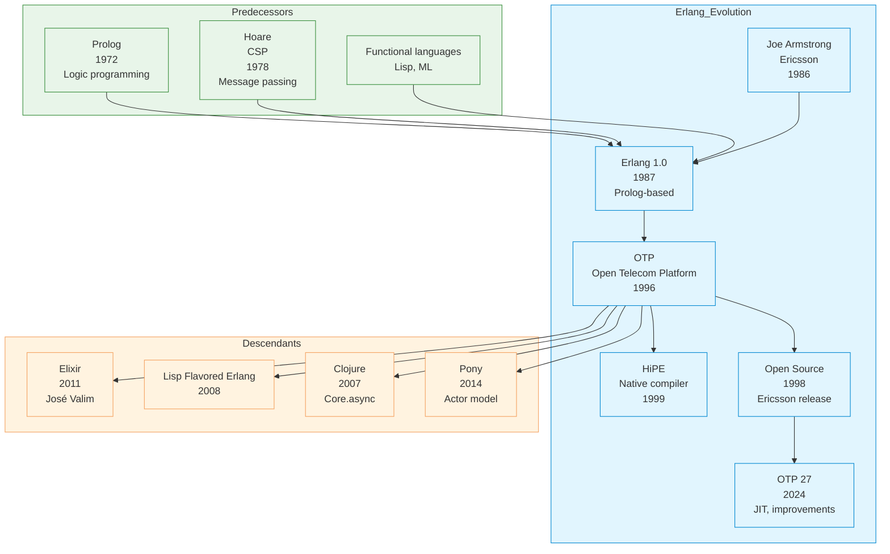

# Erlang

| | |
|---|---|
| **Year** | 1986 |
| **Creator(s)** | Joe Armstrong, Robert Virding, Mike Williams (Ericsson) |
| **Paradigm(s)** | Functional, concurrent, distributed |
| **Typing** | Dynamic |
| **Platform** | BEAM (formerly Erlang VM) |
| **Key features** | Lightweight processes, message passing, hot code swapping |
| **Current version** | OTP 27 (2024) |

---

## Contents

1. [Overview](#overview)
2. [Historical Context](#historical-context)
3. [Key Ideas](#key-ideas)
   - [Lightweight Processes](#lightweight-processes)
   - [Actor Model](#actor-model)
   - [Let It Crash](#let-it-crash)
   - [Hot Code Swapping](#hot-code-swapping)
   - [Immutable Data](#immutable-data)
4. [Core Features](#core-features)
   - [Pattern Matching](#pattern-matching)
   - [Recursion](#recursion)
   - [Higher-Order Functions](#higher-order-functions)
   - [Processes and Message Passing](#processes-and-message-passing)
   - [OTP (Open Telecom Platform)](#otp-open-telecom-platform)
5. [Language Features](#language-features)
   - [Modules and Functions](#modules-and-functions)
   - [Data Types](#data-types)
   - [List Comprehensions](#list-comprehensions)
   - [Binary Pattern Matching](#binary-pattern-matching)
6. [Ecosystem and Tools](#ecosystem-and-tools)
7. [Influence](#influence)
8. [Strengths and Weaknesses](#strengths-and-weaknesses)
9. [Code Examples](#code-examples)
10. [Related Authors](#related-authors)
11. [Related Topics](#related-topics)
12. [Further Reading](#further-reading)

---

## Overview

Erlang is a general-purpose, concurrent, functional programming language
and runtime system. Designed at Ericsson in 1986 for telecommunications
systems, Erlang excels at building **massively concurrent, distributed,
fault-tolerant** applications.

Erlang's distinctive characteristics:
- **Lightweight processes** — millions of concurrent processes
- **Actor model** — message passing for concurrency
- **"Let it crash"** — supervision trees for fault tolerance
- **Hot code swapping** — update running systems without downtime
- **Immutable data** — functional, side-effect-free
- **Distributed by design** — transparent distribution

Erlang powers:
- **Telecommunications** — Ericsson switches, WhatsApp
- **Web services** — Discord, Discord's Elixir-based infrastructure
- **Financial systems** — trading platforms, payment processing
- **IoT** — connected devices, sensor networks

---

## Historical Context



### Ericsson and Telecom

Erlang was born at Ericsson to solve telecom problems:
- **High availability** — 99.999% uptime required
- **Massive concurrency** — millions of simultaneous calls
- **Fault tolerance** — hardware failures must not bring down system
- **Real-time** — strict latency requirements

The solution wasn't a new language at first — it was a set of Prolog
libraries that evolved into Erlang.

---

## Key Ideas

### Lightweight Processes

Erlang processes are extremely lightweight:

```erlang
% Spawn a process (cost ~300 bytes)
Pid = spawn(fun() -> loop() end).

% Spawn millions
spawn_n(N) ->
    [spawn(fun() -> loop() end) || _ <- lists:seq(1, N)].
% spawn_n(1_000_000) works on modern hardware

% Processes are isolated
% Crash in one doesn't affect others
```

**Process characteristics:**
- ~300 bytes memory per process
- No shared memory
- Preemptive scheduling
- Millions possible on single machine

### Actor Model

Concurrency through message passing:

```erlang
% Spawn actor
Pid = spawn(fun() -> actor_loop() end).

% Send message
Pid ! {hello, world}.

% Receive message
receive
    {hello, Name} -> io:format("Hello ~p!~n", [Name]);
    {goodbye, _} -> io:format("Goodbye!~n")
end.

% Actor loop
actor_loop() ->
    receive
        {hello, Name} ->
            io:format("Hello ~p!~n", [Name]),
            actor_loop();  % Continue loop
        stop ->
            ok  % Exit loop
    end.
```

### Let It Crash

Embrace failure rather than prevent it:

```erlang
% Supervisor monitors children
% If child crashes, supervisor restarts it

-module(supervisor).
-behaviour(supervisor).

init([]) ->
    ChildSpec = #{
        id => my_worker,
        start => {my_worker, start_link, []},
        restart => permanent,
        shutdown => 5000,
        type => worker,
        modules => [my_worker]
    },
    {ok, { {one_for_one, 5, 10}, [ChildSpec] }}.

% If my_worker crashes, supervisor automatically restarts it
% Up to 5 times in 10 seconds, then gives up
```

**Why "let it crash"?**
- Easier than preventing all errors
- Supervisor handles recovery
- System self-heals
- Clean state after restart

### Hot Code Swapping

Update code without stopping the system:

```erlang
% Version 1
-module(my_module).
-export([process/1]).

process(Data) ->
    do_something_v1(Data).

% Load version 2
% In shell:
% c(my_module).  % Loads new code

% Running processes can be notified
sys:replace_state(Pid, fun(State) -> State end).

% Process can upgrade:
handle_info({code_change, OldVsn}, State) ->
    {noreply, upgrade_state(State, OldVsn)}.
```

### Immutable Data

All data is immutable:

```erlang
% Variables are single-assignment
X = 42.
% X = 43.  % Error: already bound

% List operations create new lists
List1 = [1, 2, 3].
List2 = [0 | List1].
% List1 is still [1,2,3]
% List2 is [0,1,2,3]

% No shared state = no race conditions
```

---

## Core Features

### Pattern Matching

```erlang
% Function clauses with patterns
factorial(0) -> 1;
factorial(N) when N > 0 -> N * factorial(N - 1).

% Pattern matching in case
case Point of
    {0, 0} -> origin;
    {X, 0} -> {on_x_axis, X};
    {0, Y} -> {on_y_axis, Y};
    {X, Y} -> {point, X, Y}
end.

% Pattern matching in receive
receive
    {From, {request, Key}} ->
        From ! {response, lookup(Key)};
    {From, {update, Key, Value}} ->
        From ! {ok, store(Key, Value)}
end.
```

### Recursion

```erlang
% Tail-recursive (no stack growth)
sum_list(List) -> sum_list(List, 0).

sum_list([], Acc) -> Acc;
sum_list([H | T], Acc) -> sum_list(T, Acc + H).

% List processing
map(_, []) -> [];
map(F, [H | T]) -> [F(H) | map(F, T)].

filter(_, []) -> [];
filter(P, [H | T]) ->
    case P(H) of
        true -> [H | filter(P, T)];
        false -> filter(P, T)
    end.

% Tree processing
tree_sum({leaf, Value}) -> Value;
tree_sum({node, Left, Right}) ->
    tree_sum(Left) + tree_sum(Right).
```

### Higher-Order Functions

```erlang
% Anonymous functions (funs)
Square = fun(X) -> X * X end.
Square(5).  % 25

% Functions as arguments
map(_, []) -> [];
map(F, [H | T]) -> [F(H) | map(F, T)].

% Using with lists module
lists:map(fun(X) -> X * X end, [1, 2, 3]).
% [1, 4, 9]

lists:filter(fun(X) -> X rem 2 =:= 0 end, [1, 2, 3, 4]).
% [2, 4]

lists:foldl(fun(X, Acc) -> X + Acc end, 0, [1, 2, 3]).
% 6
```

### Processes and Message Passing

```erlang
% Spawn and link
spawn_link(fun() -> worker() end).

% Send and receive with timeout
Pid ! {request, data},
receive
    {response, Result} ->
        handle_result(Result);
    {error, Reason} ->
        handle_error(Reason)
after 5000 ->
    timeout
end.

% Register process by name
register(my_server, Pid).
my_server ! {request, data}.

% Monitor process
Ref = monitor(process, Pid).
receive
    {'DOWN', Ref, process, Pid, Reason} ->
        process_died(Pid, Reason)
end.
```

### OTP (Open Telecom Platform)

OTP provides standard components for building robust systems:

```erlang
% GenServer behavior
-module(counter).
-behaviour(gen_server).

% API
start_link() ->
    gen_server:start_link({local, ?MODULE}, ?MODULE, [], []).

increment() ->
    gen_server:call(?MODULE, increment).

get() ->
    gen_server:call(?MODULE, get).

% Callbacks
init([]) ->
    {ok, 0}.  % Initial state

handle_call(increment, _From, Count) ->
    {reply, ok, Count + 1}.

handle_call(get, _From, Count) ->
    {reply, Count, Count}.

% Use it
counter:start_link().
counter:increment().
counter:get().  % 1
```

**OTP behaviors:**
- **gen_server** — generic server
- **gen_fsm** — finite state machine
- **gen_event** — event handler
- **supervisor** — process supervision
- **application** — application lifecycle

---

## Language Features

### Modules and Functions

```erlang
-module(my_module).
-export([public_function/1, public_function/2]).
-compile(export_all).  % Export all (for development)

% Public functions
public_function(Arg) ->
    private_function(Arg).

public_function(Arg1, Arg2) ->
    Arg1 + Arg2.

% Private functions (not exported)
private_function(X) ->
    X * 2.

% Module attributes
-author("joe@example.com").
-vsn("1.0.0").
```

### Data Types

```erlang
% Numbers
42.          % Integer
3.14.        % Float
2#1010.      % Binary (10)
16#FF.       % Hexadecimal (255)

% Atoms (constants)
hello.        % atom
'hello world'. % atom with spaces

% Tuples
{1, 2, 3}.
{point, 10, 20}.
{error, "failed"}.

% Lists
[1, 2, 3, 4].
[head | tail].
"hello" = [$h, $e, $l, $l, $o].  % Strings are lists

% Maps (since Erlang 17)
Map = #{key1 => value1, key2 => value2}.
maps:get(key1, Map).
maps:put(key3, value3, Map).

% Binaries (binary data)
<<1, 2, 3>>.
<<"hello">> = <<$h, $e, $l, $l, $o>>.

% Pids and Ports
Pid = spawn(fun() -> ok end).
Port = open_port({spawn, "ls"}, []).
```

### List Comprehensions

```erlang
% Basic comprehension
[X * 2 || X <- [1, 2, 3, 4, 5]].
% [2, 4, 6, 8, 10]

% With filter
[X || X <- [1, 2, 3, 4, 5], X rem 2 =:= 0].
% [2, 4]

% Multiple generators
[{X, Y} || X <- [1, 2], Y <- [a, b]].
% [{1,a}, {1,b}, {2,a}, {2,b}]

% Bit string comprehension
<< <<X:4>> || <<X:4>> <= <<1,2,3,4>> >>.
% <<1,2,3,4>>
```

### Binary Pattern Matching

```erlang
% Parse binary data
<<Type:8, Length:32, Data:Length/binary>> = Packet.

% Construct binary
MyPacket = <<1:8, 5:32, "hello"/binary>>.

% Segment options
<<X:8/little-integer>>.     % Little-endian
<<X:8/big-integer>>.       % Big-endian
<<X:8/native-integer>>.    % Native endianness

% Binary comprehension
<< <<X:8>> || <<X:4>> <= <<1,2,3,4,5,6,7,8>> >>.
% Packs 4-bit values into bytes
```

---

## Ecosystem and Tools

| Tool | Purpose |
|------|---------|
| **erl** | Erlang shell/REPL |
| **erlc** | Erlang compiler |
| **rebar3** | Build tool, package manager |
| **dialyzer** | Discrepancy analyzer (static typing) |
| **fprof** | Profiler |
| **observer** | GUI debugger/profiler |
| **wx** | GUI toolkit |

### Major Libraries

| Library | Purpose |
|---------|---------|
| **cowboy** | HTTP server |
| **ranch** | Socket acceptor pool |
| **gun** | HTTP client |
| **gproc** | Process registry |
| **lager** | Logging framework |
| **meck** | Mocking library |

---

## Influence

### Languages Directly Inspired

| Language | Erlang influence |
|-----------|-----------------|
| **Elixir** | Runs on BEAM, modern syntax |
| **LFE** (Lisp Flavored Erlang) | Lisp syntax on BEAM |
| **Clojure** | core.async (CSP) inspired by Erlang |
| **Pony** | Actor model, capabilities |
| **Akka** (Scala) | Actor model, supervision |
| **Orleans** (.NET) | Actor-based virtual actors |

### Architectural Influence

Erlang's design influenced modern distributed systems:
- **Microservices** — isolation, fault tolerance
- **Serverless** — stateless, ephemeral
- **Actor frameworks** — Akka, Orleans, Orleans
- **Supervision trees** — Kubernetes, Docker Compose

---

## Strengths and Weaknesses

### Strengths

| Strength | Detail |
|----------|--------|
| **Concurrency** | Millions of lightweight processes |
| **Fault tolerance** | Supervision trees, "let it crash" |
| **Hot code swapping** | Zero-downtime upgrades |
| **Distribution** | Transparent, built-in |
| **Reliability** | Proven in telecom, WhatsApp |
| **Simplicity** | Small language, powerful semantics |

### Weaknesses

| Weakness | Detail |
|----------|--------|
| **Syntax** | Prolog-based, unusual |
| **Performance** | Slower than C/Rust for CPU-bound |
| **Learning curve** | Actor model takes time |
| **Tooling** | Less mature than Java/Python |
| **Ecosystem** | Smaller than mainstream languages |
| **Static typing** | None (dialyzer is optional) |

---

## Code Examples

See [`examples/erlang/`](../../examples/erlang/) for runnable code:

| Example | Description |
|---------|-------------|
| [01 Hello World](../../examples/erlang/01-hello-world/) | Basic syntax, shell |
| [02 Variables & Types](../../examples/erlang/02-variables-and-types/) | Pattern matching, data types |
| [03 Functions](../../examples/erlang/03-functions/) | Recursion, higher-order |
| [04 Control Flow](../../examples/erlang/04-control-flow/) | case, if, receive |
| [05 Data Structures](../../examples/erlang/05-data-structures/) | Lists, maps, binaries |
| [06 OOP/Modules](../../examples/erlang/06-oop-modules/) | Modules, processes, OTP |

---

## Related Authors

- [Joe Armstrong](../../authors/joe-armstrong.md) — creator of Erlang
- [Robert Virding](../../authors/robert-virding.md) — co-creator |
- [Mike Williams](../../authors/mike-williams.md) — co-creator |
- [Tony Hoare](../../authors/tony-hoare.md) — CSP inspiration |
- [Carl Hewitt](../../authors/carl-hewitt.md) — Actor model |

---

## Related Topics

- [Concurrency](../../topics/concurrency/) — Actor model, supervision |
- [Distributed Systems](../../topics/distributed/) — Erlang's design philosophy |
- [Functional Programming](../../topics/functional/) — Erlang as functional language |

---

## Further Reading

| Author | Title | Year | Focus |
|--------|-------|------|-------|
| Armstrong | *Programming Erlang* | 2007 | Comprehensive guide |
| Cesarini & Thompson | *Erlang Programming* | 2009 | Practical |
| Logan & Merritt | *Designing for Scalability with Erlang/OTP* | 2016 | OTP patterns |
| Armstrong | *A History of Erlang* | 2010 | Historical perspective |

---

## Quotes

> "You wanted a banana but what you got was a gorilla holding the
> banana and the entire jungle."
> — Joe Armstrong, on Java class libraries

> "The problem with object-oriented languages is they've got all this
> implicit environment that they carry around with them. You wanted a
> banana but you got a gorilla holding the banana and the entire jungle."
> — Joe Armstrong

> "Make it work, make it right, make it fast."
> — Kent Beck (applied in Erlang community)

> "I invented the term 'Object-Oriented', and I can tell you I did not
> have C++ in mind."
> — Alan Kay (Erlang shares Smalltalk's message-passing philosophy)

---

*See [Languages Index](../languages/) for other language profiles.*
