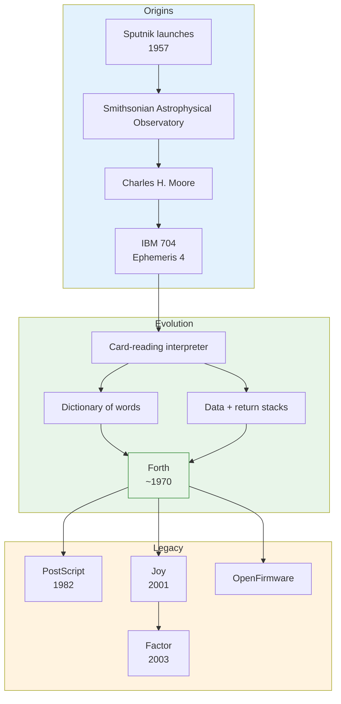

# Forth

| | |
|---|---|
| **Year** | 1970 |
| **Creator(s)** | Charles H. Moore |
| **Paradigm(s)** | Concatenative, stack-based, imperative |
| **Typing** | Dynamic / untyped |
| **Platform** | Bare metal, embedded, native |
| **Key features** | Data stack, return stack, dictionary, indirect threaded code, interactive compilation, extreme simplicity |
| **Major dialects** | Forth-83, ANS Forth, Gforth, SP-Forth, OpenFirmware Forth |

---

## Contents

1. [Overview](#overview)
2. [Historical Context](#historical-context)
3. [Key Ideas](#key-ideas)
   - [The Dictionary](#the-dictionary)
   - [Data Stack and Return Stack](#data-stack-and-return-stack)
   - [Concatenative Composition](#concatenative-composition)
   - [Keep It Simple](#keep-it-simple)
4. [Language Features](#language-features)
5. [Dialects and Variants](#dialects-and-variants)
6. [Influence](#influence)
7. [Strengths and Weaknesses](#strengths-and-weaknesses)
8. [Code Examples](#code-examples)
9. [Related Authors](#related-authors)
10. [Related Topics](#related-topics)
11. [Further Reading](#further-reading)

---

## Overview

Forth is a concatenative, stack-based programming language created by Charles H.
Moore. Unlike nearly every other language of its era, Forth was not designed by
a committee or a research lab; it grew out of one programmer's personal toolkit
for solving real problems on resource-constrained machines. It is both a
language and an interactive operating environment: the same interpreter that
reads words from the terminal can compile new words, inspect the dictionary, and
talk directly to hardware.

Forth's design priorities are radical simplicity, small runtime size, and direct
control. A complete Forth system can fit in a few kilobytes, which made it
attractive for embedded systems, boot loaders, astronomy, and later for printers,
blockchain virtual machines, and educational projects.

## Historical Context



Forth's story begins in the late 1950s at the Smithsonian Astrophysical
Observatory, where Charles H. Moore was working on satellite tracking after the
launch of Sputnik. He wrote a program called **Ephemeris 4** for the IBM 704 to
predict satellite positions for photographic tracking stations. To avoid the
costly cycle of recompiling Fortran every time an input format changed, Moore
built a tiny interpreter that read space-delimited words from punched cards.

That early interpreter already contained ideas that would become central to
Forth:
- reading "words" separated by whitespace;
- converting external numeric text into internal form;
- simple control structures such as `IF ... ELSE ...`.

Moore carried this interpreter with him through jobs at several organizations,
using it to implement cross-assemblers, editors, source-control systems, a 3D
animation program, a chess program, and even a version of Spacewar. Along the
way he borrowed ideas from ALGOL, JOVIAL, PL/I, Fortran, and various assemblers.

The name **Forth** came from "FOURTH," a term then used for fourth-generation
computers. File systems of the time limited file names to five characters, so
the "U" was dropped. The lower-case spelling "Forth" appeared later, once file
systems could distinguish case.

Three architectural decisions defined the language:
1. **The dictionary** — a lookup table mapping names to executable code. It was
   effectively an implementation of indirect threaded code five years before the
   term was coined.
2. **The data stack** — an implicit operand stack that makes argument passing
   and composition extremely compact.
3. **The return stack** — a separate stack for call frames, freeing procedures
   from having to balance the data stack across calls.

Moore eventually implemented Forth for at least eighteen different CPUs, writing
all the required tooling — cross-assemblers, drivers, editors — himself. His
guiding principle was "Keep it simple!" He saw mainstream software stacks as a
"Tower of Babel" that imposed cost, complexity, and bugs between the programmer
and the machine.

## Key Ideas

### The Dictionary

The dictionary is Forth's namespace and linking mechanism. Each entry, called a
"word," maps a name to a piece of code or data. Words are looked up at runtime,
and new words can be defined and compiled interactively. This makes Forth
naturally extensible: the language is built from the same mechanism used to
extend it.

### Data Stack and Return Stack

Forth uses an explicit parameter stack for computation. Instead of writing
`f(g(x))`, you write `x g f`. A separate return stack handles control flow,
allowing words to leave intermediate values on the data stack across calls.

### Concatenative Composition

Programs are sequences of words that transform the stack. Composition is
juxtaposition: `f g h` means "apply f, then g, then h." This is the original
concatenative style later explored by Joy and Factor.

### Keep It Simple

Moore repeatedly rewrote Forth to keep the system small, fast, and flexible. He
believed that many problems did not need the massive runtime stacks common in
mainstream computing.

## Language Features

- **Words and parsing** — the interpreter parses whitespace-delimited tokens and
  looks each up in the dictionary.
- **Stack effect comments** — documentation convention such as `( n -- n² )`.
- **Defining words** — `: SQUARE DUP * ;` defines a new word.
- **Immediate words** — words executed at compile time, enabling macros and
  control structures.
- **Interactive compilation** — new definitions are compiled immediately and can
  be tested without leaving the environment.

## Dialects and Variants

| Dialect | Year | Notes |
|---------|------|-------|
| fig-Forth | 1978 | Early influential implementation |
| Forth-83 | 1983 | Important standard before ANS |
| ANS Forth / Forth 200x | 1994+ | Modern standard |
| Gforth | 1992+ | Popular GNU implementation |
| SP-Forth | 1990s+ | Russian-developed implementation |
| OpenFirmware Forth | 1990s+ | Used in Apple and Sun boot firmware |

## Influence

Forth's direct descendants and influenced systems include:

| System / Language | Relation |
|-------------------|----------|
| PostScript | Direct descendant; stack-based page description language |
| PDF | Stack-based content streams inherit Forth-like execution |
| Joy | Concatenative language with formal combinators |
| Factor | Modern practical concatenative language |
| OpenFirmware | Boot firmware written in Forth |
| FreeBSD bootloader | Used a Forth interpreter (versions 3.1–12), later replaced by Lua |
| TON Blockchain | Uses a Forth-like language and stack machine |
| Bitcoin Script | Stack-based smart-contract language |
| Many embedded systems | Bare-metal Forth on microcontrollers |

The idea of a stack-based virtual machine also influenced JVM, .NET CLR, and
many other language runtimes, even when the surface syntax is unrelated.

## Strengths and Weaknesses

### Strengths

- **Tiny runtime** — runs on bare metal with minimal resources.
- **Interactive development** — compile and test words incrementally.
- **Extreme simplicity** — easy to implement from scratch in an evening.
- **Direct hardware control** — ideal for embedded and firmware.
- **Homoiconic in spirit** — programs are sequences of words, easy to parse and
  transform.

### Weaknesses

- **Stack-based thinking** has a steep learning curve.
- **Readability** suffers in large programs without discipline.
- **Fragmentation** across dialects and standards.
- **Ecosystem** is small compared to mainstream languages.

## Code Examples

```forth
\ Compute (3 + 4) * 2
3 4 + 2 *    \ stack: 14

\ Define a word
: SQUARE ( n -- n² ) DUP * ;
5 SQUARE     \ stack: 25

\ Conditional
: MAX ( a b -- max ) 2DUP > IF DROP ELSE NIP THEN ;
3 7 MAX      \ stack: 7
```

## Related Authors

- [Charles H. Moore](../../authors/charles-moore.md) — creator of Forth

## Related Topics

- [Concatenative Programming](../../topics/concepts/paradigms/index.md#applicative-vs-concatenative-style) — Forth as the canonical concatenative language
- [Languages Genealogy](../../maps/languages-genealogy.md) — language family tree
- [PostScript](https://en.wikipedia.org/wiki/PostScript) — direct descendant

## Further Reading

- Moore — *The Evolution of Forth* (1991)
- Brodie — *Starting Forth* (1981)
- [forth-standard.org](https://forth-standard.org/) — Forth 200x standard
- [concatenative.org](https://concatenative.org/) — community hub for concatenative languages

---

See [Languages Index](../index.md) for other language profiles.
