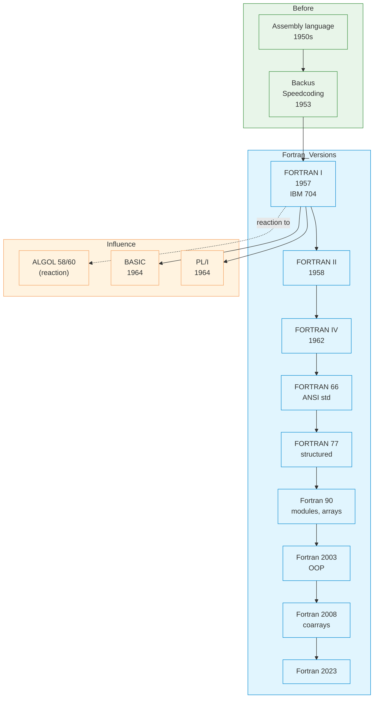

# Fortran

| | |
|---|---|
| **Year** | 1957 (FORTRAN I); current standard: Fortran 2023 |
| **Creator(s)** | John Backus and team at IBM |
| **Paradigm(s)** | Imperative, procedural, array-oriented; modular and OOP since Fortran 90/2003 |
| **Typing** | Static, explicit (with implicit-typing legacy) |
| **Platform** | Mainframes originally; today: HPC clusters, supercomputers, GCC/Intel/NVIDIA toolchains |
| **Key features** | Native arrays, complex numbers, formatted I/O, optimising compilers, coarrays for parallelism |
| **Legacy** | First high-level language; still dominant in scientific and high-performance computing |

---

## Contents

1. [Overview](#overview)
2. [Historical Context](#historical-context)
3. [Key Ideas](#key-ideas)
   - [High-Level Abstraction over Hardware](#high-level-abstraction-over-hardware)
   - [Native Arrays and Numerics](#native-arrays-and-numerics)
   - [Optimising Compilation](#optimising-compilation)
   - [Modules and Modern Fortran](#modules-and-modern-fortran)
4. [Language Versions](#language-versions)
5. [Where Fortran Lives Today](#where-fortran-lives-today)
6. [Influence](#influence)
7. [Strengths and Weaknesses](#strengths-and-weaknesses)
8. [Code Examples](#code-examples)
9. [Related Authors](#related-authors)
10. [Related Topics](#related-topics)
11. [Further Reading](#further-reading)

---

## Overview

Fortran (**FOR**mula **TRAN**slation) is the **oldest high-level programming
language still in active use**. Created by John Backus and his team at IBM
between 1954 and 1957, Fortran proved that a compiled language could match
hand-written assembly in performance — a claim widely doubted at the time.

Fortran's enduring contributions:
- **The first practical high-level language** — released in 1957
- **First optimising compiler** — Backus's team built the original compiler over three years
- **Native multidimensional arrays** with a numeric focus from day one
- **Complex numbers as a primitive type** — unique among early languages
- **Continuous evolution** — every standard since 1966 has modernised the language

Despite often being called a "legacy" language, Fortran has been **revised
roughly every decade** (66, 77, 90, 95, 2003, 2008, 2018, 2023) and remains
the lingua franca of **weather forecasting, computational physics, climate
modelling, and large-scale numerical simulation**.

## Historical Context



### Why Fortran Was Built

In 1953, John Backus proposed a project to IBM that sounded preposterous: a
language that would let scientists write **mathematical formulas directly**,
which a compiler would then translate into machine code that ran **as fast as
hand-written assembly**. The IBM 704 manual cost \$3 million; programmer time
cost more. If the compiled code was too slow, customers would reject it.

After three years and 18 person-years of work, the team — including Irving
Ziller, Robert Nelson, Sheldon Best, and Lois Haibt — released **FORTRAN I**
in 1957. The compiler used register allocation and loop optimisation
techniques that established the entire field of **compiler optimisation**.

### The Backus Paradox

John Backus, the father of Fortran, later helped design ALGOL and then
became a critic of imperative programming entirely. His 1977 Turing
Award lecture, ["Can Programming Be Liberated from the von Neumann Style?"](../../works/papers/backus-1978-liberated.md),
argued for functional programming — partly *against* the language he had
created. Few language designers have so publicly outgrown their own creation.

## Key Ideas

### High-Level Abstraction over Hardware

Fortran was the **first language designed to hide the machine**. A scientist
could write `Y = A * X + B` and trust that the compiler would emit competent
machine code. This was the founding bargain of high-level languages: trade
some efficiency for vastly more programmer productivity — a bargain that
turned out, for Fortran, to require **almost no efficiency loss at all**.

```fortran
! Compute the magnitude of a vector
real :: v(3), magnitude
v = [1.0, 2.0, 3.0]
magnitude = sqrt(sum(v**2))   ! whole-array operations
print *, magnitude
```

### Native Arrays and Numerics

Fortran treats arrays as **first-class objects**, not as pointer arithmetic.
Whole-array operations, slicing, reductions, and intrinsic functions like
`matmul` and `dot_product` are part of the language.

```fortran
real :: A(100, 100), B(100, 100), C(100, 100)
C = matmul(A, B)               ! intrinsic matrix multiply
C = A + 2.0 * B                ! whole-array arithmetic
C(:, 1) = 0.0                  ! whole-column assignment
```

This array model — combined with **column-major storage** and aggressive
optimisation — is why Fortran still beats most languages on dense numerical
linear algebra.

### Optimising Compilation

Fortran's design choices favour the optimiser:
- **No aliasing by default** — arguments are assumed independent (the historical reason `restrict` was needed in C)
- **Static array shapes** — sizes known at compile time enable unrolling and vectorisation
- **Pure functions and `pure`/`elemental` annotations** — allow parallelisation
- **Coarrays (Fortran 2008+)** — partitioned-global-address-space parallelism baked into the language

```fortran
elemental real function square(x)
    real, intent(in) :: x
    square = x * x
end function

! Apply elementally to a whole array
real :: arr(1000), out(1000)
out = square(arr)
```

### Modules and Modern Fortran

Fortran 90 introduced **modules** — namespaced collections of types,
constants, and procedures with explicit interfaces. Fortran 2003 added
**object-oriented programming** with type-bound procedures.

```fortran
module stats_mod
    implicit none
    private
    public :: mean

contains
    pure real function mean(x) result(m)
        real, intent(in) :: x(:)
        m = sum(x) / size(x)
    end function
end module

program demo
    use stats_mod
    real :: data(5) = [1.0, 2.0, 3.0, 4.0, 5.0]
    print *, mean(data)
end program
```

## Language Versions

| Version | Year | Key features |
|---------|------|--------------|
| **FORTRAN I** | 1957 | First release; arithmetic, DO loops, FORMAT |
| **FORTRAN II** | 1958 | SUBROUTINE, FUNCTION, COMMON blocks |
| **FORTRAN IV** | 1962 | Logical operators; the workhorse of the 1960s |
| **FORTRAN 66** | 1966 | First ANSI standard |
| **FORTRAN 77** | 1977 | Structured `IF-THEN-ELSE`, `CHARACTER` type, block IF |
| **Fortran 90** | 1990 | Free-form source, **modules**, dynamic arrays, derived types, whole-array ops |
| **Fortran 95** | 1995 | `FORALL`, `pure`/`elemental` procedures |
| **Fortran 2003** | 2003 | **Object-oriented programming**, C interoperability |
| **Fortran 2008** | 2008 | **Coarrays** for parallelism, submodules |
| **Fortran 2018** | 2018 | More coarray features, C descriptor interop |
| **Fortran 2023** | 2023 | Generic programming, conditional expressions |

The community distinguishes **"FORTRAN" (uppercase)** for FORTRAN 77 and earlier
fixed-form code, from **"Fortran" (mixed case)** for Fortran 90 and later
free-form, modular code.

## Where Fortran Lives Today

| Domain | Why Fortran |
|--------|-------------|
| **Climate / weather modelling** | NOAA, ECMWF, Met Office models written/maintained in Fortran |
| **Computational physics** | Quantum chemistry (Gaussian, NWChem), CFD, finite-element solvers |
| **Numerical libraries** | LAPACK, BLAS, ScaLAPACK — the math kernels behind NumPy, R, MATLAB |
| **High-performance computing** | Top500 supercomputer benchmarks dominated by Fortran codes |
| **Aerospace engineering** | Long-lived simulation codes from the 1970s–80s still in production |

When you call `numpy.linalg.solve` in Python, you are usually calling **LAPACK**,
written in Fortran, compiled by `gfortran` or Intel's compiler. Fortran's
"dead language" reputation is misleading — it is just **invisible** beneath
modern toolchains.

## Influence

### Languages Directly Inspired

| Language | Year | Fortran contribution |
|----------|------|----------------------|
| **ALGOL 58/60** | 1958/1960 | Designed partly as a *response* to Fortran's hardware coupling |
| **BASIC** | 1964 | Simplified, beginner-friendly Fortran-like syntax |
| **PL/I** | 1964 | IBM's attempt to merge Fortran + COBOL + ALGOL |
| **MATLAB** | 1984 | Cleve Moler wrapped LINPACK/EISPACK (Fortran) for interactive use |
| **NumPy / SciPy** | 2000s | Python ecosystems built on Fortran numerical kernels |

### Concepts Pioneered

| Concept | Origin | Modern equivalent |
|---------|--------|-------------------|
| **Optimising compilers** | FORTRAN I (1957) | Every modern compiler |
| **Formatted I/O** | FORTRAN I | `printf`, `format`, etc. |
| **DO loops** | FORTRAN I | `for` loops everywhere |
| **Subroutines and functions** | FORTRAN II | Universal |
| **Whole-array operations** | Fortran 90 | NumPy, MATLAB, APL, Julia broadcasting |
| **Coarrays** | Fortran 2008 | PGAS languages, MPI patterns |

## Strengths and Weaknesses

### Strengths

- **Performance** — decades of compiler tuning for numerical workloads
- **Native arrays and complex numbers** — built into the language
- **Stable evolution** — backwards compatibility across 60+ years
- **Massive scientific codebase** — irreplaceable in many fields
- **Modern features** — modules, OOP, parallelism in current standards

### Weaknesses

- **Legacy syntax** — pre-90 fixed-form code is famously cryptic (column 6 = continuation, columns 1–5 = labels)
- **Tooling lag** — fewer modern dev tools, less IDE support than mainstream languages
- **Strings and text processing** — improved but still awkward compared to Python or Perl
- **Steep on-ramp** — old codebases mix decades of language standards
- **Smaller community** — concentrated in scientific niches; fewer libraries for non-numerical tasks

## Code Examples

See [examples/fortran/](../../../examples/fortran/index.md) for runnable code *(planned)*.

A modern Fortran example computing pi via Monte Carlo:

```fortran
program monte_carlo_pi
    implicit none
    integer, parameter :: n = 1000000
    integer :: i, hits = 0
    real :: x, y

    call random_seed()
    do i = 1, n
        call random_number(x)
        call random_number(y)
        if (x*x + y*y <= 1.0) hits = hits + 1
    end do

    print '("pi ~ ", F8.6)', 4.0 * real(hits) / real(n)
end program
```

## Related Authors

- [John Backus](../../authors/john-backus.md) — Fortran creator; later FP advocate
- [Edsger Dijkstra](../../authors/edsger-dijkstra.md) — sharp critic of Fortran's design

## Related Topics

- [Paradigms](../../topics/paradigms/index.md) — Fortran as imperative archetype
- [Type Systems](../../topics/types/index.md) — early static typing with implicit defaults
- [Build Systems](../../topics/process/build-systems/index.md) — historical role of separate compilation

## Further Reading

- Backus — *The History of FORTRAN I, II, and III* (HOPL, 1978)
- Backus — [Can Programming Be Liberated from the von Neumann Style?](../../works/papers/backus-1978-liberated.md) (1978)
- Metcalf, Reid, Cohen — *Modern Fortran Explained* (2018)
- Curcic — *Modern Fortran: Building Efficient Parallel Applications* (2020)
- ISO/IEC 1539:2023 — *Fortran 2023 standard*

## Quotes

> "Much of my work has come from being lazy. I didn't like writing programs,
> and so, when I was working on the IBM 701, writing programs for computing
> missile trajectories, I started work on a programming system to make it
> easier to write programs."
> — John Backus

> "FORTRAN — the infantile disorder — by now nearly 20 years old, is hopelessly
> inadequate for whatever computer application you have in mind today: it is
> now too clumsy, too risky, and too expensive to use."
> — Edsger Dijkstra (1975)

> "I really didn't know what I was doing... Some of the things that I did
> turned out useful, and other things should be forgotten."
> — John Backus, on Fortran's design

---

See [Languages Index](../index.md) for other language profiles.
