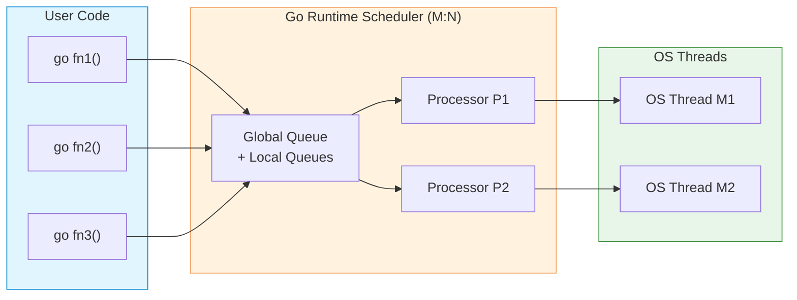

# Goroutines

| Section | Content |
| :--- | :--- |
| **Description** | Goroutines are lightweight threads managed by the Go runtime. They enable concurrent execution of functions with minimal memory overhead (starting at ~2KB stack vs ~1MB for OS threads). |
| **API Purpose** | Running concurrent tasks efficiently without the overhead of traditional OS threads. |
| **Terminology** | `go` keyword, goroutine, GMP model (Goroutine-Processor-Machine), scheduler, `runtime.GOMAXPROCS`. |
| **Notes** | Goroutines are multiplexed onto a smaller number of OS threads by the Go runtime scheduler. Since Go 1.14, the scheduler is preemptive, preventing goroutine starvation. |



## Syntax

```go
// Start a goroutine
func main() {
    go sayHello()        // runs concurrently
    go func(msg string) { // anonymous goroutine
        fmt.Println(msg)
    }("from anonymous")

    time.Sleep(time.Second) // wait for goroutines
}

func sayHello() {
    fmt.Println("Hello from goroutine")
}
```

## WaitGroup for Synchronization

```go
func main() {
    var wg sync.WaitGroup

    for i := 0; i < 3; i++ {
        wg.Add(1)
        go func(id int) {
            defer wg.Done()
            fmt.Printf("Worker %d done\n", id)
        }(i)
    }

    wg.Wait() // blocks until all goroutines finish
    fmt.Println("All done")
}
```

## GMP Model

| Component | Description |
|-----------|-------------|
| **G** (Goroutine) | Lightweight thread with its own stack |
| **M** (Machine) | OS thread that executes goroutines |
| **P** (Processor) | Logical processor with a local run queue |

The Go scheduler distributes goroutines across available `P`s, which bind to `M`s (OS threads). Work stealing balances load between processors.

---

Examples: [Concurrency](../../../examples/go/09-concurrency/README.md)
