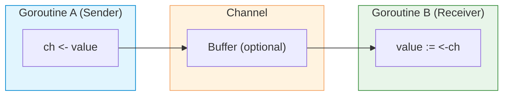

# Channels

| Section | Content |
| :--- | :--- |
| **Description** | Channels are typed conduits for communication between goroutines. They implement Hoare's Communicating Sequential Processes (CSP) model, enabling safe data exchange without explicit locking. |
| **API Purpose** | Synchronizing goroutines and passing data between them in a type-safe manner. |
| **Terminology** | `chan`, `make(chan T)`, buffered/unbuffered channel, `select`, `close`, `range` over channel. |
| **Notes** | Unbuffered channels synchronize sender and receiver (blocking). Buffered channels allow asynchronous sends up to capacity. Sending on a closed channel panics; receiving from a closed channel yields zero values. |



## Channel Types

```go
// Unbuffered channel — synchronous
ch := make(chan int)       // sender blocks until receiver is ready

// Buffered channel — asynchronous up to capacity
chBuf := make(chan int, 3) // sender blocks only when buffer is full
```

## Basic Operations

```go
func main() {
    ch := make(chan string)

    go func() {
        ch <- "hello" // send
    }()

    msg := <-ch // receive
    fmt.Println(msg) // "hello"
}
```

## Select Statement

`select` multiplexes multiple channel operations:

```go
func main() {
    ch1 := make(chan string)
    ch2 := make(chan string)

    go func() { ch1 <- "from ch1" }()
    go func() { ch2 <- "from ch2" }()

    select {
    case msg1 := <-ch1:
        fmt.Println(msg1)
    case msg2 := <-ch2:
        fmt.Println(msg2)
    case <-time.After(time.Second):
        fmt.Println("timeout")
    default:
        fmt.Println("no channels ready")
    }
}
```

## Range and Close

```go
func producer(ch chan<- int) {
    for i := 0; i < 5; i++ {
        ch <- i
    }
    close(ch) // signal no more values
}

func consumer(ch <-chan int) {
    for v := range ch { // range closes automatically when ch is closed
        fmt.Println(v)
    }
}
```

## Directional Channels

| Type | Syntax | Usage |
|------|--------|-------|
| Bidirectional | `chan T` | Send and receive |
| Send-only | `chan<- T` | Can only send |
| Receive-only | `<-chan T` | Can only receive |

```go
func sendOnly(ch chan<- int) { ch <- 42 }
func recvOnly(ch <-chan int) int { return <-ch }
```

---

Examples: [Concurrency](../../../examples/go/09-concurrency/README.md)
