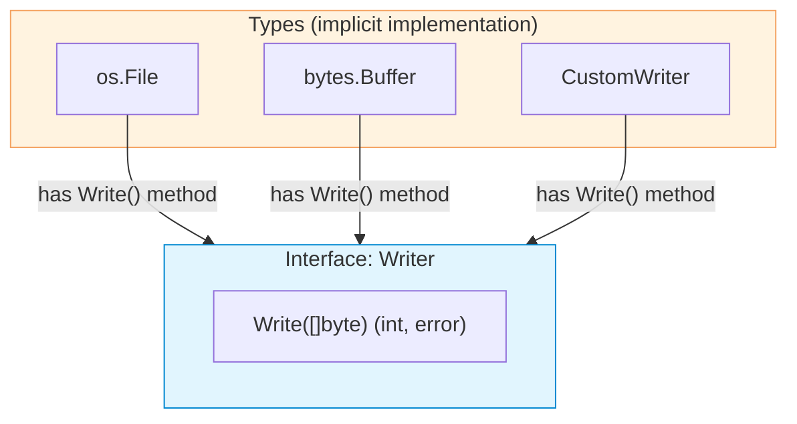

# Interfaces

| Section | Content |
| :--- | :--- |
| **Description** | Interfaces in Go define method sets that types implicitly satisfy. There is no `implements` keyword — any type with the required methods automatically implements the interface (structural typing). |
| **API Purpose** | Decoupling code through abstraction, enabling polymorphism, and writing testable code with mock implementations. |
| **Terminology** | Interface type, method set, empty interface (`any`), type assertion, type switch, interface embedding, structural typing. |
| **Notes** | The empty interface (`interface{}` or `any`) accepts any type. Type assertions and type switches allow runtime type inspection. Interfaces are satisfied implicitly, not explicitly. |



## Basic Interface

```go
// Interface definition
type Writer interface {
    Write([]byte) (int, error)
}

// Type implicitly implements Writer by having Write method
type StringWriter struct {
    data string
}

func (sw *StringWriter) Write(p []byte) (int, error) {
    sw.data += string(p)
    return len(p), nil
}

// Usage — no explicit implements declaration needed
func writeData(w Writer, data []byte) error {
    _, err := w.Write(data)
    return err
}
```

## Empty Interface (`any`)

```go
// any is an alias for interface{}
func printAnything(v any) {
    fmt.Printf("value: %v, type: %T\n", v, v)
}

printAnything(42)
printAnything("hello")
printAnything([]int{1, 2, 3})
```

## Type Assertions and Type Switches

```go
func describe(v any) {
    // Type assertion
    if s, ok := v.(string); ok {
        fmt.Printf("string: %s\n", s)
        return
    }

    // Type switch
    switch val := v.(type) {
    case int:
        fmt.Printf("int: %d\n", val)
    case float64:
        fmt.Printf("float: %f\n", val)
    case []int:
        fmt.Printf("slice of ints: %v\n", val)
    default:
        fmt.Printf("unknown: %T\n", val)
    }
}
```

## Interface Embedding

```go
// Compose interfaces from smaller ones
type Reader interface {
    Read([]byte) (int, error)
}

type ReadWriter interface {
    Reader         // embed Reader
    Writer         // embed Writer
}
```

## Common Standard Interfaces

| Interface | Methods | Usage |
|-----------|---------|-------|
| `io.Reader` | `Read([]byte) (int, error)` | Reading data |
| `io.Writer` | `Write([]byte) (int, error)` | Writing data |
| `io.Closer` | `Close() error` | Resource cleanup |
| `fmt.Stringer` | `String() string` | String representation |
| `error` | `Error() string` | Error interface |

---

Examples: [OOP/Modules](../../../examples/go/06-oop-modules/README.md)
