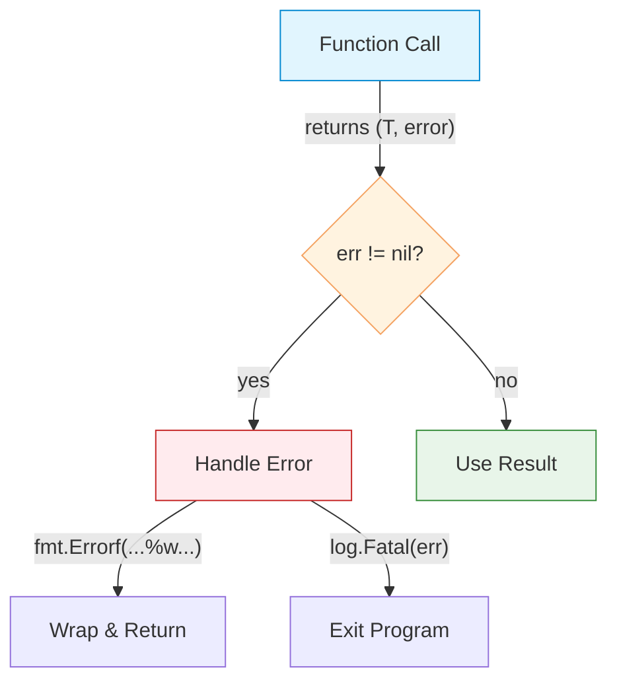

# Error Handling

| Section | Content |
| :--- | :--- |
| **Description** | Go uses explicit error returns instead of exceptions. Functions that may fail return an `error` as the last value. Callers must check errors explicitly. |
| **API Purpose** | Making error handling visible and explicit in the control flow, avoiding hidden exception propagation. |
| **Terminology** | `error` interface, `errors.New`, `fmt.Errorf`, error wrapping (`%w`), `errors.Is`, `errors.As`, `panic`/`recover`. |
| **Notes** | Go distinguishes between expected errors (return values) and unexpected failures (`panic`). `panic` should be reserved for unrecoverable conditions. Error wrapping preserves error chains for inspection. |



## Basic Error Handling

```go
func divide(a, b float64) (float64, error) {
    if b == 0 {
        return 0, errors.New("division by zero")
    }
    return a / b, nil
}

func main() {
    result, err := divide(10, 0)
    if err != nil {
        fmt.Println("Error:", err)
        return
    }
    fmt.Println(result)
}
```

## Error Wrapping

```go
func readConfig(path string) (*Config, error) {
    data, err := os.ReadFile(path)
    if err != nil {
        // Wrap error with context
        return nil, fmt.Errorf("reading config %s: %w", path, err)
    }
    // ... parse config
}

// Checking wrapped errors
if errors.Is(err, os.ErrNotExist) {
    fmt.Println("Config file not found")
}

// Extracting specific error types
var parseErr *ParseError
if errors.As(err, &parseErr) {
    fmt.Println("Parse error:", parseErr.Line)
}
```

## Sentinel Errors

```go
var ErrNotFound = errors.New("not found")
var ErrInvalidInput = errors.New("invalid input")

func findUser(id string) (*User, error) {
    // ...
    if user == nil {
        return nil, ErrNotFound
    }
    return user, nil
}

// Check with errors.Is
if errors.Is(err, ErrNotFound) {
    fmt.Println("User not found")
}
```

## Panic and Recover

```go
// Panic — unrecoverable error
func mustNotFail() {
    panic("something went terribly wrong")
}

// Recover — catch panic (use sparingly)
func safeCall() {
    defer func() {
        if r := recover(); r != nil {
            fmt.Println("Recovered from panic:", r)
        }
    }()
    mustNotFail()
}
```

> **Best Practice:** Only use `panic` for programmer errors (e.g., nil pointer dereference, array out of bounds). For expected errors, return `error` values.

---

Examples: [Error Handling](../../../examples/go/08-error-handling/README.md)
