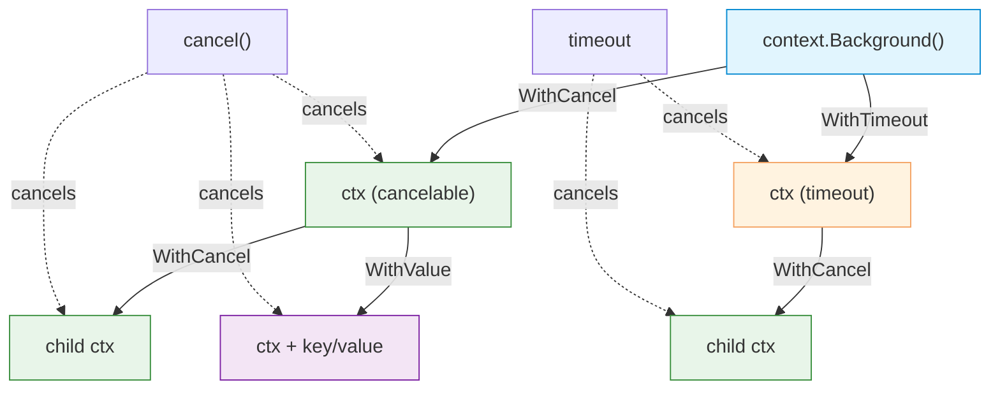

# Context

| Section | Content |
| :--- | :--- |
| **Description** | The `context` package provides a way to carry deadlines, cancellation signals, and request-scoped values across API boundaries and goroutines. It is essential for building robust, cancellable concurrent programs. |
| **API Purpose** | Propagating cancellation, timeouts, and request metadata through call chains and goroutine hierarchies. |
| **Terminology** | `context.Context`, `context.Background`, `context.TODO`, `context.WithCancel`, `context.WithTimeout`, `context.WithDeadline`, `context.WithValue`. |
| **Notes** | Contexts form a tree where cancelling a parent cancels all children. `context.WithValue` should be used sparingly — prefer explicit function parameters. Context is the first parameter convention in Go. |



## Cancellation

```go
func main() {
    ctx, cancel := context.WithCancel(context.Background())
    defer cancel()

    go worker(ctx)

    time.Sleep(2 * time.Second)
    cancel() // signal worker to stop
    time.Sleep(500 * time.Millisecond)
}

func worker(ctx context.Context) {
    for {
        select {
        case <-ctx.Done():
            fmt.Println("Worker shutting down:", ctx.Err())
            return
        default:
            fmt.Println("Working...")
            time.Sleep(500 * time.Millisecond)
        }
    }
}
```

## Timeout

```go
func fetchWithTimeout(url string) error {
    ctx, cancel := context.WithTimeout(context.Background(), 3*time.Second)
    defer cancel()

    req, err := http.NewRequestWithContext(ctx, "GET", url, nil)
    if err != nil {
        return err
    }

    resp, err := http.DefaultClient.Do(req)
    if err != nil {
        return err // may return context.DeadlineExceeded
    }
    defer resp.Body.Close()
    return nil
}
```

## Values

```go
// Store request-scoped values (use sparingly)
type key string
const userKey key = "user"

func WithUser(ctx context.Context, userID string) context.Context {
    return context.WithValue(ctx, userKey, userID)
}

func UserFromContext(ctx context.Context) (string, bool) {
    userID, ok := ctx.Value(userKey).(string)
    return userID, ok
}
```

> **Best Practice:** Pass `context.Context` as the first parameter to functions. Do not store contexts in structs — pass them explicitly.

---

Examples: [Concurrency](../../../examples/go/09-concurrency/README.md)
