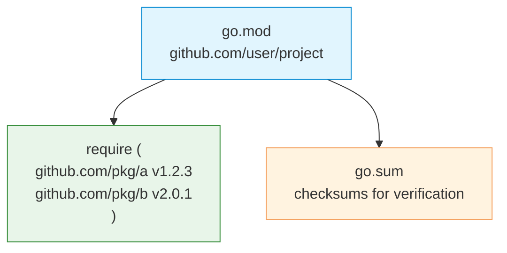

# Modules

| Section | Content |
| :--- | :--- |
| **Description** | Go modules provide dependency management and versioning. Introduced in Go 1.11 and stabilized in Go 1.14, modules replaced the older GOPATH-based workflow. |
| **API Purpose** | Declaring module identity, managing external dependencies with semantic versioning, and ensuring reproducible builds. |
| **Terminology** | `go.mod`, `go.sum`, module path, semantic versioning, indirect dependency, `replace` directive, `go get`, `go mod tidy`. |
| **Notes** | `go.mod` declares module path and direct dependencies. `go.sum` records expected cryptographic checksums of dependencies. Use `go mod tidy` to clean up unused dependencies. |



## go.mod Structure

```gomod
module github.com/example/myapp

go 1.21

require (
    github.com/gin-gonic/gin v1.9.1
    github.com/stretchr/testify v1.8.4
)

require (
    github.com/bytedance/sonic v1.9.1 // indirect
    github.com/chenzhuoyu/base64x v0.0.0-20221115062448-fe3a3abad311 // indirect
)
```

## Common Commands

```bash
# Initialize a new module
go mod init github.com/user/project

# Add a dependency
go get github.com/pkg/example@v1.2.3

# Update to latest version
go get -u github.com/pkg/example

# Clean up unused dependencies
go mod tidy

# Download dependencies
go mod download

# Verify checksums
go mod verify

# Vendor dependencies (optional)
go mod vendor
```

## Replace Directive

```gomod
// Local development override
replace github.com/example/lib => ../lib

// Fork override
replace github.com/original/pkg => github.com/fork/pkg v1.0.0
```

## Version Selection

| Version Format | Meaning |
|----------------|---------|
| `v1.2.3` | Exact version |
| `v1.2.4-pre.1` | Pre-release |
| `v0.0.0-20230101-hash` | Pseudo-version (unreleased commits) |

> **Semantic Import Versioning:** Major version >= 2 requires a `/vN` suffix in the import path (e.g., `github.com/pkg/v3`).

---

Examples: [OOP/Modules](../../../examples/go/06-oop-modules/README.md)
