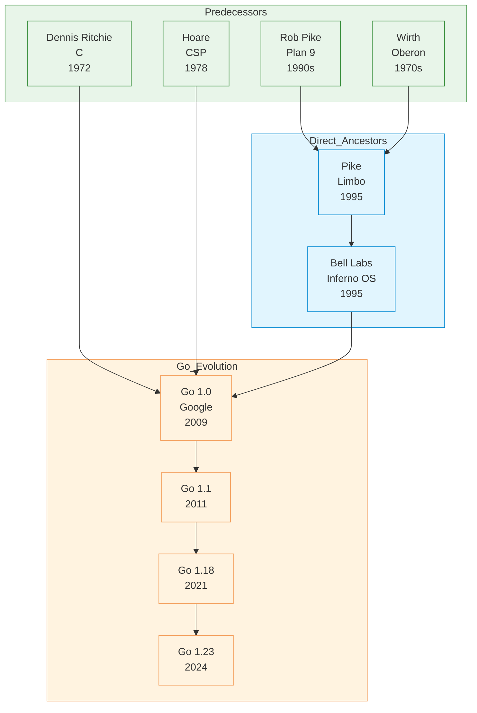
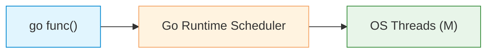
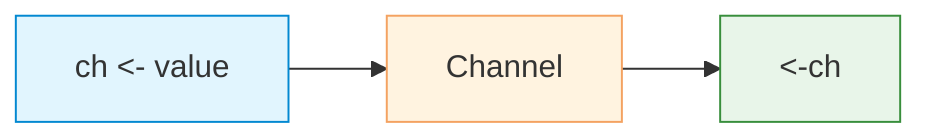
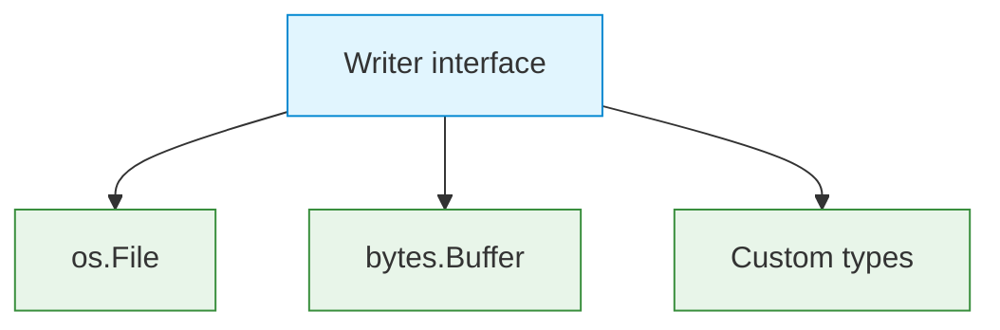

# Go

| | |
|---|---|
| **Year** | 2009 |
| **Creator(s)** | Robert Griesemer, Rob Pike, Ken Thompson |
| **Paradigm(s)** | Imperative, concurrent (CSP) |
| **Typing** | Static, inferred, structural |
| **Platform** | Native (compiled) |
| **Key features** | Goroutines, channels, GC, interfaces |
| **Current version** | Go 1.23 (2024) |

---

## Contents

1. [Overview](#overview)
2. [Historical Context](#historical-context)
3. [Key Ideas](#key-ideas)
   - [Goroutines](#goroutines)
   - [Scheduling Model](#scheduling-model)
   - [Channels (CSP)](#channels-csp)
   - [Error Handling](#error-handling)
   - [Interfaces](#interfaces)
   - [Pointers vs Values](#pointers-vs-values)
4. [Key Features In Depth](#key-features-in-depth)
   - [01. Goroutines](#01-goroutines)
   - [02. Channels](#02-channels)
   - [03. Interfaces](#03-interfaces)
   - [04. Error Handling](#04-error-handling)
   - [05. Generics](#05-generics)
   - [06. Context](#06-context)
   - [07. Modules](#07-modules)
5. [Language Features](#language-features)
   - [Defer](#defer)
   - [select](#select)
   - [Built-in Profiling](#built-in-profiling)
6. [Ecosystem and Tools](#ecosystem-and-tools)
7. [Influence](#influence)
8. [Strengths and Weaknesses](#strengths-and-weaknesses)
9. [Code Examples](#code-examples)
10. [Related Authors](#related-authors)
11. [Related Topics](#related-topics)
12. [Further Reading](#further-reading)

---

## Overview

Go is a statically typed, compiled language designed at Google for
simplicity, efficiency, and modern concurrent programming. Its
distinctive feature is built-in concurrency via **goroutines** and
**channels**, implementing Hoare's CSP directly in the language.

Go's design philosophy:
- **Simplicity over features** — minimal language, fast compilation
- **Explicit is better than implicit** — clear error handling, no hidden magic
- **CSP for concurrency** — goroutines + channels for safe parallelism
- **Fast compilation** — binary-only compilation, no runtime for users

Go became popular for:
- **Cloud-native development** — efficient, single binary deployments
- **Microservices** — language designed for concurrent network services
- **DevOps tooling** — Docker, Kubernetes written in Go

## Historical Context



### Design Philosophy

Go was explicitly designed to address problems with existing languages:

| Problem | Traditional solution | Go's solution |
|----------|---------------------|---------------|
| **Slow builds** | Separate compile/link steps | `go build` — single command, fast |
| **Implicit dependencies** | Search PATH, classpath | `go.mod` — explicit, reproducible |
| **Complex type systems** | Generics, inheritance | Minimal features, clear semantics |
| **Hard concurrency** | Threads, locks, race conditions | Goroutines, channels (CSP) |
| **Fat binaries** | Runtime, garbage collection | Static binary, minimal runtime |

### Language Evolution

| Version | Year | Key features |
|---------|-------|---------------|
| 1.0 | 2009 | Initial release |
| 1.1 | 2011 | Race detector, improvements |
| 1.4 | 2012 | `go` tool improvements |
| 1.5 | 2015 | `vendor` directory |
| 1.7 | 2016 | `context` package, HTTP/2 |
| 1.8 | 2017 | WebAssembly support |
| 1.18 | 2021 | Generics (parameterized types) |
| 2.0 | 2023 | Profiles, toolchain improvements |

## Key Ideas

### Goroutines

Lightweight threads managed by Go runtime:

```go
// Spawning goroutine is cheap
go func() {
    fmt.Println("Hello from goroutine!")
}()

// Channel communication
ch := make(chan int)
go func() {
    ch <- 42  // Send
}()
result := <-ch  // Receive (blocks until available)
```

**Why goroutines?**
- **Lightweight** — 2KB stack vs ~1MB for OS thread
- **Fast spawn** — thousands per goroutine per core
- **Scheduled by runtime** — preemptive since Go 1.14 (2020); was cooperative before
- **Communicate via channels** — no shared memory access needed

### Scheduling Model

Go runtime implements an **M:N scheduler**: many goroutines (G) are multiplexed
onto a smaller pool of OS threads (M), executed on logical processors (P).
This lets a single Go process run millions of goroutines cheaply.

The scheduling discipline has evolved:

| Version | Year | Behaviour |
|---|---|---|
| Go ≤ 1.13 | 2009–2019 | **Cooperative** — yield only at function calls, channel ops, blocking syscalls. CPU-tight loops without function calls could starve other goroutines. |
| Go ≥ 1.14 | 2020+ | **Preemptive** — runtime sends a signal (SIGURG on Unix) to interrupt a goroutine that has been running too long, even inside a tight loop. |

In practice goroutines now behave much like preemptive OS threads, but with
1000× less overhead per task.

→ [Scheduling: Preemptive vs Cooperative](../../topics/concurrency/index.md#scheduling-preemptive-vs-cooperative)

### Channels (CSP)

Direct implementation of Hoare's Communicating Sequential Processes:

```go
// Unbuffered channel (synchronous)
ch := make(chan int)
ch <- value    // Blocks until receiver ready
result := <-ch   // Blocks until sender ready

// Buffered channel (asynchronous)
ch := make(chan int, 10)
ch <- value    // Non-blocking if buffer not full

// Select (multiplex multiple channels)
select {
case v1 := <-ch1:
    fmt.Println("Received from ch1:", v1)
case v2 := <-ch2:
    fmt.Println("Received from ch2:", v2)
}
```

### Error Handling

Explicit, return-based error handling:

```go
// Function returns error
result, err := someFunction()
if err != nil {
    // Must handle error
    log.Fatal(err)
}

// Multiple return values (idiomatic)
func readFile(path string) ([]byte, error) {
    data, err := os.ReadFile(path)
    return data, err  // Caller checks err
}

// Error wrapping
if err != nil {
    return fmt.Errorf("read failed: %w", err)
}
```

No exceptions, no try/catch — errors are values.

### Interfaces

Structural typing via interfaces:

```go
// Interface definition (implicitly satisfied)
type Writer interface {
    Write([]byte) (int, error)
}

// Any type with Write method implements Writer
type MyWriter struct{}
func (m MyWriter) Write(p []byte) (int, error) {
    return len(p), nil
}

// No "implements" keyword needed
var w Writer = MyWriter{}
w.Write([]byte("hello"))  // Works!
```

### Pointers vs Values

Explicit distinction between value and pointer semantics:

```go
// Value (passed by value)
func increment(n int) int {
    n++  // Only modifies local copy
    return n
}

// Pointer (passed by reference)
func increment(p *int) {
    *p++  // Modifies original
}

// New() returns pointer
x := new(int)       // Pointer to int
var y int               // Zero value
```

---

## Key Features In Depth

### 01. Goroutines

| Section | Content |
| :--- | :--- |
| **Description** | Lightweight threads managed by the Go runtime with minimal memory overhead. |
| **API Purpose** | Running concurrent tasks efficiently. |
| **Terminology** | `go` keyword, GMP model, scheduler. |



Read more: **[Detailed description and examples](./01-goroutines.md)**  
Examples: [Concurrency](../../../examples/go/09-concurrency/README.md)

---

### 02. Channels

| Section | Content |
| :--- | :--- |
| **Description** | Typed conduits for communication between goroutines implementing Hoare's CSP. |
| **API Purpose** | Synchronizing goroutines and passing data safely. |
| **Terminology** | `chan`, buffered/unbuffered, `select`, `close`. |



Read more: **[Detailed description and examples](./02-channels.md)**  
Examples: [Concurrency](../../../examples/go/09-concurrency/README.md)

---

### 03. Interfaces

| Section | Content |
| :--- | :--- |
| **Description** | Method sets that types implicitly satisfy — no `implements` keyword needed. |
| **API Purpose** | Decoupling code through structural typing abstraction. |
| **Terminology** | Method set, empty interface (`any`), type assertion, type switch. |



Read more: **[Detailed description and examples](./03-interfaces.md)**  
Examples: [OOP/Modules](../../../examples/go/06-oop-modules/README.md)

---

### 04. Error Handling

| Section | Content |
| :--- | :--- |
| **Description** | Explicit error returns instead of exceptions; errors are values. |
| **API Purpose** | Visible, explicit error handling in control flow. |
| **Terminology** | `error` interface, `errors.New`, `fmt.Errorf`, `%w` wrapping, `panic`/`recover`. |

Read more: **[Detailed description and examples](./04-error-handling.md)**  
Examples: [Error Handling](../../../examples/go/08-error-handling/README.md)

---

### 05. Generics

| Section | Content |
| :--- | :--- |
| **Description** | Type parameters (Go 1.18+) for reusable, type-safe code. |
| **API Purpose** | Writing generic data structures and algorithms. |
| **Terminology** | Type parameter, type constraint, `any`, `comparable`, `constraints.Ordered`. |

Read more: **[Detailed description and examples](./05-generics.md)**  
Examples: [FP Features](../../../examples/go/07-fp-features/README.md)

---

### 06. Context

| Section | Content |
| :--- | :--- |
| **Description** | Carrying deadlines, cancellation signals, and request-scoped values across API boundaries. |
| **API Purpose** | Propagating cancellation and timeouts through call chains. |
| **Terminology** | `context.Context`, `WithCancel`, `WithTimeout`, `WithValue`. |

Read more: **[Detailed description and examples](./06-context.md)**  
Examples: [Concurrency](../../../examples/go/09-concurrency/README.md)

---

### 07. Modules

| Section | Content |
| :--- | :--- |
| **Description** | Dependency management with `go.mod` and semantic versioning. |
| **API Purpose** | Reproducible builds and versioned dependency management. |
| **Terminology** | `go.mod`, `go.sum`, module path, `go get`, `go mod tidy`. |

Read more: **[Detailed description and examples](./07-modules.md)**  
Examples: [OOP/Modules](../../../examples/go/06-oop-modules/README.md)

---

## Language Features

### Defer

Execute code when function exits:

```go
func processFile(path string) error {
    f, err := os.Open(path)
    if err != nil {
        return err
    }
    defer f.Close()  // Always runs, even on panic/return

    // ... use f ...
    return nil
}
```

Used for: cleanup, resource release, unlocking mutexes.

### select

Multiplex multiple channels:

```go
select {
case <-ch1:
    // Handle ch1
case <-ch2:
    // Handle ch2
case <-time.After(5 * time.Second):
    // Timeout
}
```

### Built-in Profiling

```go
// CPU profiling
go tool pprof -cpuprofile=cpu.prof ./binary

// Memory profiling
go tool pprof -memprofile=mem.prof ./binary

// Goroutine blocking profiler
go test -blockprofile=block.prof
```

## Ecosystem and Tools

| Tool | Purpose |
|-------|---------|
| **go** | Build, run, test, manage dependencies |
| **go.mod** | Module definition, dependency management |
| **go test** | Built-in testing framework |
| **go fmt** | Code formatting (enforced style) |
| **go vet** | Static analysis |

### Package Management

```bash
# Initialize module
go mod init github.com/user/project

# Add dependency
go get github.com/pkg/lib

# Tidy dependencies
go mod tidy

# Build for specific platforms
GOOS=linux GOARCH=amd64 go build
```

## Influence

### Languages Inspired

| Language | Go influence |
|-----------|-----------------|
| **Rust** | Error handling, concurrency primitives |
| **Zig** | Comptime, error handling |
| **V** | Simple, fast compilation |
| **Nim** | Pythonic syntax, compiled |

### DevOps Ecosystem

| Tool | Language | Impact |
|-------|-----------|---------|
| Docker | Go | Container revolution |
| Kubernetes | Go | Container orchestration |
| Prometheus | Go | Monitoring |
| Terraform | Go | Infrastructure as code |
| etcd | Go | Distributed coordination |
| gRPC | Go | RPC framework |

## Code Examples

See [`examples/go/`](../../../examples/go/index.md) for runnable code:

| Example                                                                       | Description                                    |
|-------------------------------------------------------------------------------|------------------------------------------------|
| [01 Hello World](../../../examples/go/01-hello-world/README.md)               | Package, entry point, basic syntax             |
| [02 Variables & Types](../../../examples/go/02-variables-and-types/README.md) | Type inference, zero values, pointers          |
| [03 Functions](../../../examples/go/03-functions/README.md)                   | Multiple returns, defer, error handling        |
| [04 Control Flow](../../../examples/go/04-control-flow/README.md)             | For/range loops, select statements             |
| [05 Data Structures](../../../examples/go/05-data-structures/README.md)       | Slices, maps, structs                          |
| [06 OOP/Modules](../../../examples/go/06-oop-modules/README.md)               | Interfaces, methods, packages                  |
| [07 FP Features](../../../examples/go/07-fp-features/README.md)               | First-class functions, closures, generics      |
| [08 Error Handling](../../../examples/go/08-error-handling/README.md)         | Multi-return values, error type, panic/recover |
| [09 Concurrency](../../../examples/go/09-concurrency/README.md)               | Goroutines, channels, select                   |
| [10 Testing](../../../examples/go/10-testing/README.md)                       | testing package, table-driven tests            |

## Strengths and Weaknesses

### Strengths

- **Fast compilation** — single binary, no runtime for users
- **Built-in concurrency** — goroutines + channels are easy and safe
- **Simple toolchain** — `go build`, no complex build configs
- **Static binaries** — single file deployment, cross-compilation
- **Explicit errors** — clear flow, no hidden exceptions
- **Strong standard library** — HTTP, JSON, crypto, testing

### Weaknesses

- **No generics until 1.18** — required code duplication for containers
- **Error handling verbosity** — `if err != nil` boilerplate
- **Missing features** — no inheritance, limited generics (pre-1.18)
- **Interface complexity** — implicit satisfaction can be surprising
- **Package discovery** — no central repository like npm/pip

## Related Authors

- [Ken Thompson](../../authors/ken-thompson.md) — co-creator, Unix, C influence
- [Rob Pike](../../authors/rob-pike.md) — co-creator, Plan 9, Unix experience
- [Robert Griesemer](../../authors/robert-griesemer.md) — co-creator, language design
- [Tony Hoare](../../authors/tony-hoare.md) — CSP (channels foundation)

## Related Topics

- [Concurrency](../../topics/concurrency/index.md) — CSP, goroutines, channels |
- [Type Systems](../../topics/types/index.md) — static typing, interfaces |
- [Distributed Systems](../../topics/distributed/index.md) — Go's role in cloud-native |
- [Process](../../topics/process/index.md) — Go's tooling impact |

## Further Reading

- Go Team — [Effective Go](https://go.dev/doc/effective_go.html)
- Donovan & Kernighan — *The Go Programming Language* (2015)
- Dietsch, Chansall & Kennedy — *Concurrency in Go* (2014)

## Quotes

> "Software engineering is what happens to programming when you add time and other people."
> — Rob Pike

> "Clear is better than clever."
> — Go community proverb

> "Don't communicate by sharing memory; share memory by communicating."
> — Hoare's CSP, Go philosophy

---

See [Languages Index](../languages/index.md) for other language profiles.
