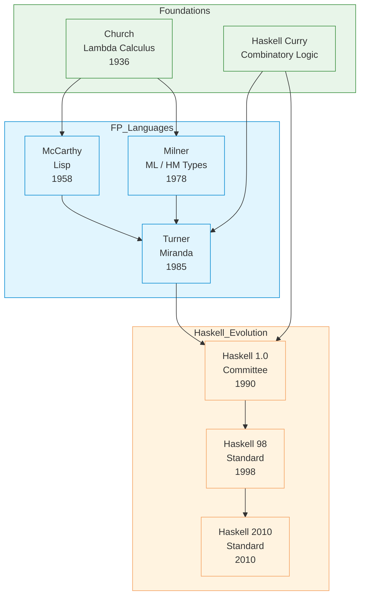

# Haskell

| | |
|---|---|
| **Year** | 1990 |
| **Creator(s)** | Committee (Haskell 1.0) |
| **Paradigm(s)** | Functional, pure, lazy |
| **Typing** | Static, inferred (Hindley–Milner) |
| **Platform** | Native (GHC, GHCJS) |
| **Key features** | Type classes, monads, lazy evaluation, pure functions |
| **Current version** | GHC 9.8+ (2024) |

---

## Contents

1. [Overview](#overview)
2. [Historical Context](#historical-context)
3. [Key Ideas](#key-ideas)
   - [Purity](#purity)
   - [Type Classes](#type-classes)
   - [Monads](#monads)
   - [Lazy Evaluation](#lazy-evaluation)
   - [Pattern Matching](#pattern-matching)
4. [Language Features](#language-features)
   - [Type Inference](#type-inference)
   - [Algebraic Data Types](#algebraic-data-types)
   - [List Comprehensions](#list-comprehensions)
5. [Ecosystem and Tools](#ecosystem-and-tools)
6. [Influence](#influence)
7. [Strengths and Weaknesses](#strengths-and-weaknesses)
8. [Code Examples](#code-examples)
9. [Related Authors](#related-authors)
10. [Related Topics](#related-topics)
11. [Further Reading](#further-reading)

---

## Overview

Haskell is a **purely functional, statically typed, lazily evaluated**
language named after logician Haskell Curry. Designed by a committee in
1990, it brought together decades of research into a practical,
expressive language.

Haskell's distinctive features influenced many modern languages:
- **Type classes** — ad-hoc polymorphism adopted by Swift, Rust, others
- **Monads** — structured side effects used throughout FP
- **Pattern matching** — expressive destructuring now in Rust, F#, Scala
- **Lazy evaluation** — infinite data structures as first-class citizens

Haskell remains a research language that influences industry practice:
- Used in teaching at universities worldwide
- Influenced language design of Rust, Swift, Scala, F#
- Powers GHC (Glasgow Haskell Compiler) — an important research platform

## Historical Context



### Predecessor Languages

| Language | Contribution to Haskell |
|----------|----------------------|
| **ML** (Milner, 1978) | Type inference, algebraic data types, pattern matching |
| **Miranda** (Turner, 1985) | Lazy evaluation, cleaner syntax |
| **Clean** (1990s) | Uniqueness types |
| **Idris** (later) | Dependent types inspiration for modern Haskell |

### Language Standards

| Version | Year | Key features |
|---------|-------|---------------|
| Haskell 1.0 | 1990 | Initial definition, pure functional |
| Haskell 1.1–1.4 | 1990s | Various revisions |
| Haskell 98 | 1998 | First standardised version, widely adopted |
| Haskell 2010 | 2010 | FFI improvements, modern syntax |

## Key Ideas

### Purity

Haskell is **pure** — functions have no side effects:

```haskell
-- Pure function (no side effects)
add :: Int -> Int -> Int
add x y = x + y

-- Side effects must be explicit in IO type
printResult :: Int -> IO ()
printResult x = putStrLn ("Result: " ++ show x)
```

Purity enables:
- **Referential transparency** — same input always gives same output
- **Equational reasoning** — substitute equals for equals
- **Optimization opportunities** — compiler can reorder freely

### Type Classes

Haskell's most influential innovation — ad-hoc polymorphism via
**type classes**:

```haskell
-- Type class defines interface
class Show a where
  show :: a -> String

-- Different types can implement it
instance Show Int where
  show x = ...

instance Show Bool where
  show True = "true"
  show False = "false"

-- Function works for any Show type
display :: Show a => a -> String
display x = "Value: " ++ show x
```

This inspired similar features in:
- **Rust** — traits
- **Swift** — protocols
- **Scala** — traits (similar mechanism)
- **TypeScript** — nominal + structural typing

### Monads

Monads structure side effects (IO, state, errors) in pure language:

```haskell
-- IO Monad: sequencing actions
main :: IO ()
main = do
  putStrLn "What's your name?"
  name <- getLine
  putStrLn ("Hello, " ++ name ++ "!")

-- Maybe Monad: handling absence
safeDivide :: Int -> Int -> Maybe Int
safeDivide _ 0 = Nothing
safeDivide x y = Just (x `div` y)

-- List Monad: chaining computations that may fail
findPath :: Graph -> Node -> Maybe [Node]
findPath graph start end = ...
```

Monads made pure FP practical — enabling **structured side effects**
without sacrificing purity.

### Lazy Evaluation

Expressions are only evaluated when their results are needed:

```haskell
-- Infinite list — only computes needed elements
allNumbers :: [Int]
allNumbers = [0..]  -- Never terminates!

-- But we can use it!
take 5 allNumbers  -- [0,1,2,3,4]

-- Or process infinite streams
sumFirst100 :: Int
sumFirst100 = sum (take 100 allNumbers)
```

Lazy evaluation enables:
- **Infinite data structures** as first-class values
- **Modular composition** — producers and consumers decoupled
- **Better performance** — avoid computing unused values

### Pattern Matching

Expressive destructuring of data:

```haskell
-- Algebraic data type
data Shape = Circle Float
            | Rectangle Float Float
            | Triangle Float Float Float

-- Pattern matching
area :: Shape -> Float
area (Circle r)      = pi * r * r
area (Rectangle w h) = w * h
area (Triangle a b c) = triangleArea a b c
```

This pattern was adopted by:
- **Rust** — match expressions
- **F#** — pattern matching
- **Scala** — case expressions
- **Swift** — guard patterns

## Language Features

### Type Inference

Haskell uses **Hindley–Milner** type inference — types are
inferred but static:

```haskell
-- Type inferred: Int -> Int -> Int
square x = x * x

-- Type inferred: (a -> a) -> a -> a
compose f g x = f (g x)

-- Complex types inferred automatically
factorial :: Integer -> Integer
factorial n
  | n <= 1    = 1
  | otherwise   = n * factorial (n - 1)
```

### Algebraic Data Types

Sum and product types as first-class language features:

```haskell
-- Sum type: OR
data Maybe a = Just a | Nothing

-- Product type: AND
data Point = Point Float Float

-- Recursive type
data List a = Empty | Cons a (List a)

-- Parameterized type
data Tree a = Leaf | Node a (Tree a) (Tree a)
```

### List Comprehensions

Influenced by mathematical set notation, later adopted by Python:

```haskell
-- List comprehension
evens :: [Int] -> [Int]
evens xs = [x | x <- xs, even x]

-- With conditions
pairs :: [(Int, Int)]
pairs = [(x, y) | x <- [1..10], y <- [1..10], x + y == 10]

-- With generators
squares :: [Int]
squares = [x^2 | x <- [1..10]]
```

## Ecosystem and Tools

### Compiler: GHC

**GHC** (Glasgow Haskell Compiler) is the de facto standard:

- Highly optimized native code generation
- LLVM backend for performance
- Rich ecosystem of packages (Hackage)

### Package Manager: Cabal / Stack

- **Cabal** — original package manager
- **Stack** — modern tool for reproducible builds
- **Hackage** — central package repository (10,000+ packages)

## Influence

### Languages Inspired

| Language | Haskell influence |
|-----------|-----------------|
| Rust | Type classes, traits, pattern matching |
| Swift | Type classes, protocols, optionals (Maybe) |
| F# | Type classes, monadic computation expressions |
| Scala | Pattern matching, functional collections |
| Elm | Pure functional, syntax and semantics |
| PureScript | Types, functional features, Elm-style |
| Idris | Dependent types evolution |

### Industry Adoption

Haskell is used in production at:

| Company/Area | Use case |
|---------------|-----------|
| Facebook | Sigma (spam filter), Haxl (config) |
| Barclays | Domain-specific languages in banking |
| GitHub | Semantic (file indexing) |
| Standard Chartered | Financial trading systems |
| Research | Verified software (Cryptol, Agda) |

## Code Examples

See [examples/haskell/](../../../examples/haskell/index.md) for runnable code:

| Example | Description |
|---------|-------------|
| [01 Hello World](../../../examples/haskell/01-hello-world/index.md) | Basic IO action, type signatures |
| [02 Variables & Types](../../../examples/haskell/02-variables-and-types/index.md) | Type inference, basic types |
| [03 Functions](../../../examples/haskell/03-functions/index.md) | Pattern matching, guards |
| [04 Control Flow](../../../examples/haskell/04-control-flow/index.md) | Recursion, case expressions |
| [05 Data Structures](../../../examples/haskell/05-data-structures/index.md) | Lists, trees, pattern matching |
| [06 OOP/Modules](../../../examples/haskell/06-oop-modules/index.md) | Type classes, modules |

## Strengths and Weaknesses

### Strengths

- **Expressive type system** — catches bugs at compile time
- **Pure functions** — easier to reason about and test
- **High abstraction** — type classes, monads enable powerful abstractions
- **Lazy evaluation** — infinite data structures, modular programs
- **Concise syntax** — less boilerplate than many languages

### Weaknesses

- **Learning curve** — category theory background not required but helps
- **Performance** — lazy evaluation can cause space leaks
- **Debugging** — evaluation order differs from most languages
- **Tooling complexity** — Cabal/Stack have historically been complex
- **Industry adoption** — less than mainstream languages

## Related Authors

- [Haskell Curry](../authors/haskell-curry.md) — language namesake, combinatory logic
- [Robin Milner](../authors/robin-milner.md) — type inference foundation
- [Simon Peyton Jones](../authors/simon-peyton-jones.md) — GHC architect
- [Philip Wadler](../authors/philip-wadler.md) — monads, list comprehensions
- [John Hughes](../authors/john-hughes.md) — "Why FP Matters"
- [Koen Claessen](../authors/koen-claessen.md) — QuickCheck

## Related Topics

- [Functional Programming](../topics/functional/index.md) — Haskell as pure FP exemplar
- [Type Systems](../topics/types/index.md) — type classes, HM inference
- [Concurrency](../topics/concurrency/index.md) — STM, async patterns
- [Monads](../topics/monads/index.md) *(future topic)* — structured side effects

## Further Reading

- Peyton Jones (ed.) — *Haskell 98 Language and Libraries* (1999)
- O'Sullivan et al. — *Real World Haskell* (2008)
- Learn You a Haskell — *Learn You a Haskell for Great Good!* (2011)
- Hughes — ["Why Functional Programming Matters"](../works/papers/hughes-1989-why-fp.md) (1989)
- Claessen & Hughes — ["QuickCheck"](../works/papers/hughes-claessen-2000-quickcheck.md) (2000)

## Quotes

> "Haskell is a deep language. It's not designed to be easy to learn,
> it's designed to make you think about what programming means."
> — Anonymous Haskell programmer

> "Monads are just monoids in the category of endofunctors."
> — Category theory joke (but technically true)

---

See [Languages Index](../languages/index.md) for other language profiles.
