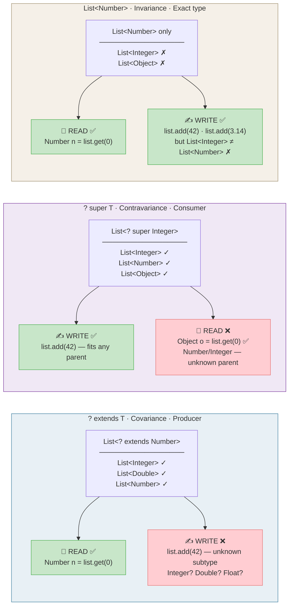

# Generics

Introduced in **Java 5 (2004)**. Generics allow classes, interfaces, and
methods to operate on types specified as parameters — providing type safety
without casting.

**Before generics (Java 1.4):**

```java
List list = new ArrayList();
list.add("hello");
list.add(42);                          // compiles — no type check!
String s = (String) list.get(1);       // ClassCastException at runtime
```

**With generics:**

```java
List<String> list = new ArrayList<>();
list.add("hello");
// list.add(42);                        // compile error — type-safe
String s = list.get(0);                // no cast needed
```

## Generic classes

```java
// A generic container
public class Box<T> {
    private T value;

    public Box(T value) { this.value = value; }
    public T get()      { return value; }

    @Override public String toString() {
        return "Box[" + value + "]";
    }
}

Box<String>  strBox = new Box<>("hello");
Box<Integer> intBox = new Box<>(42);

String s = strBox.get();   // no cast
int    n = intBox.get();   // auto-unboxing
```

## Generic methods

```java
// T is inferred from argument type at call site
public static <T> List<T> repeat(T element, int times) {
    List<T> result = new ArrayList<>();
    for (int i = 0; i < times; i++) result.add(element);
    return result;
}

List<String>  words = repeat("hi", 3);   // ["hi", "hi", "hi"]
List<Integer> nums  = repeat(0, 5);      // [0, 0, 0, 0, 0]
```

## Bounded type parameters and wildcards



## Summary Table: Variance in Java Generics

| Criteria             | `List<? extends Number>`                                                                              | `List<? super Integer>`                                                                               | `List<Number>`                                                                   |
|----------------------|-------------------------------------------------------------------------------------------------------|-------------------------------------------------------------------------------------------------------|----------------------------------------------------------------------------------|
| **Name**             | Covariance                                                                                            | Contravariance                                                                                        | Invariance                                                                       |
| **Role**             | Producer                                                                                              | Consumer                                                                                              | Producer + Consumer                                                              |
| **Input (examples)** | `List<Integer>` ✓<br/>`List<Double>` ✓<br/>`List<Number>` ✓<br/>`List<Object>` ✗<br/>`List<String>` ✗ | `List<Integer>` ✓<br/>`List<Number>` ✓<br/>`List<Object>` ✓<br/>`List<Double>` ✗<br/>`List<String>` ✗ | `List<Number>` ✓<br/>`List<Integer>` ✗<br/>`List<Object>` ✗<br/>`List<Double>` ✗ |
| **Write**            | ❌ Forbidden<br/>Compiler doesn't know<br/>the exact subtype                                           | ✅ Allowed<br/>`list.add(42)`<br/>Integer fits any ancestor                                            | ✅ Allowed<br/>`list.add(42)`<br/>`list.add(3.14)`                                |
| **Read**             | ✅ Allowed<br/>`Number n = list.get(0)`<br/>At least `T` is guaranteed                                 | ⚠️ Only `Object`<br/>`Object o = list.get(0)` ✅<br/>`Number n = list.get(0)` ❌                        | ✅ Allowed<br/>`Number n = list.get(0)`<br/>Exact type is known                   |
| **null in add()**    | ❌ add() unavailable                                                                                   | ✅ `list.add(null)`                                                                                    | ✅ `list.add(null)`                                                               |
| **Mnemonic (PECS)**  | **P**roducer — **E**xtends                                                                            | **C**onsumer — **S**uper                                                                              | —                                                                                |
| **Typical use-case** | Read data from collection                                                                             | Write data into collection                                                                            | Exact API contract                                                               |
| **Method example**   | `copy(List<? extends T> src)`                                                                         | `copy(List<? super T> dst)`                                                                           | `sort(List<T> list)`                                                             |
| **Kotlin analogue**  | `out T`                                                                                               | `in T`                                                                                                | `T`                                                                              |
| **C# analogue**      | `IEnumerable<out T>`                                                                                  | `IEnumerable<in T>`                                                                                   | `List<T>`                                                                        |

---

```java
// Upper bound: T must extend Comparable<T>
public static <T extends Comparable<T>> T max(T a, T b) {
    return a.compareTo(b) >= 0 ? a : b;
}

max(3, 7);               // 7
max("apple", "mango");   // "mango"

// Upper-bounded wildcard: read from collection of T or subtypes
public static double sumList(List<? extends Number> list) {
    return list.stream().mapToDouble(Number::doubleValue).sum();
}

// Lower-bounded wildcard: write Integer values into collection
public static void addNumbers(List<? super Integer> list) {
    list.add(1);
    list.add(2);
}
```

**PECS mnemonic:** **P**roducer **E**xtends, **C**onsumer **S**uper

- Use `<? extends T>` when you only **read** (produce) from a structure
- Use `<? super T>` when you only **write** (consume) into a structure
- If you both read and write, don't use wildcards (invariant)

```java
// Classic PECS example: Collections.copy()
public static <T> void copy(
    List<? super T> dest,      // Consumer → super (writes)
    List<? extends T> src      // Producer → extends (reads)
) {
    for (T item : src) {       // read from producer
        dest.add(item);        // write to consumer
    }
}

List<Integer> integers = List.of(1, 2, 3);
List<Number> numbers = new ArrayList<>();
copy(numbers, integers);  // ✅ integers produce, numbers consume
```

> See [Variance & Generics example](../../../examples/java/14-variance-generics/README.md) for comprehensive tests demonstrating invariance, covariance, and contravariance in Java generics.

## Things You Cannot Do Due to Type Erasure

**Seven things you cannot do because of type erasure in Java**

Java generics are implemented via type erasure: generic type parameters are removed at compile time. At runtime, `List<String>` and `List<Integer>` are both just `List`. This causes several restrictions.

**Arrays vs generics**
Arrays know their element type at runtime; generics do not. That's why some operations are forbidden.

**1. Cannot create an array of a parameterized type**
```java
List<String>[] array = new List<String>[10]; // compile error: generic array creation
```

**2. Cannot create an array from a type parameter**
```java
class Box<T> {
    T[] array = new T[10]; // error: cannot create array of T
}
```

**3. Cannot directly instantiate a type parameter**
```java
class Box<T> {
    T value = new T(); // error: cannot instantiate T
}
```

**4. Cannot overload methods if erasure makes signatures identical**
```java
void print(List<String> items) {}
void print(List<Integer> items) {} // error: both erasure to print(List)
```

**5. Cannot use `instanceof` with a concrete parameterized type**
```java
if (obj instanceof List<String>) // error: illegal generic type for instanceof
```

**6. Cannot get a `Class` literal for a parameterized type**
```java
Class<?> clazz = List<String>.class; // error: no such class
```

**7. Cannot create a parameterized exception class**
```java
class MyException<T> extends Exception { } // error: generic class may not extend Throwable
```
