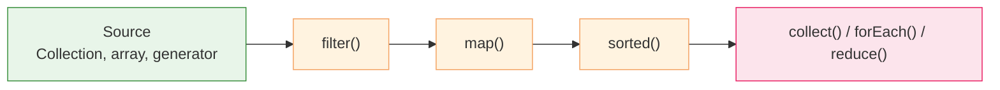
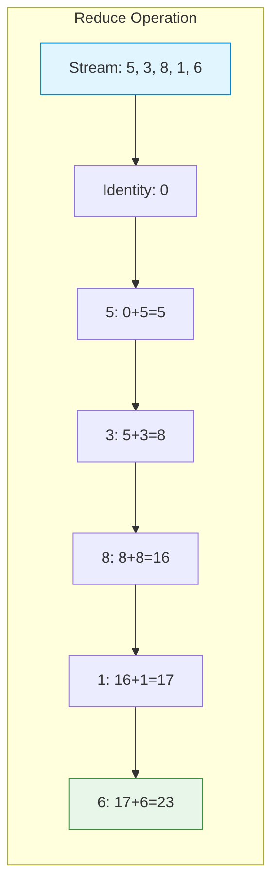
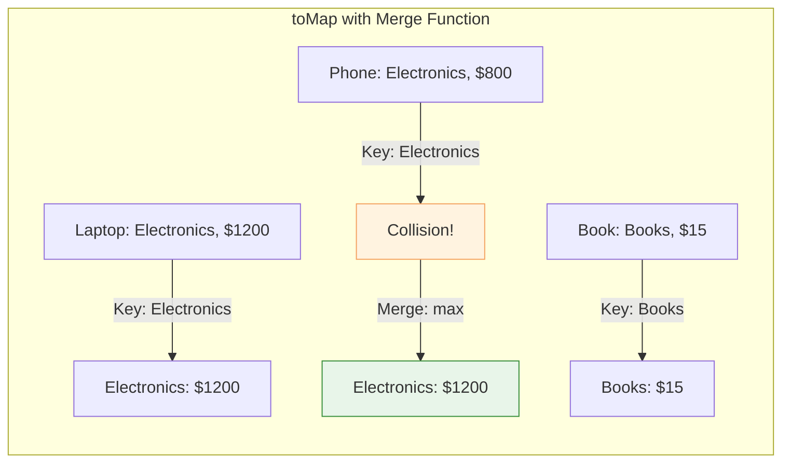

# Stream API

Introduced in **Java 8 (2014)**. Streams provide a declarative,
pipeline-based approach to processing sequences of data — inspired by
functional programming. Streams are **lazy**: intermediate operations
are not evaluated until a terminal operation is called.

## Stream pipeline anatomy



## Basic pipeline

```java
List<Integer> numbers = List.of(1, 2, 3, 4, 5, 6, 7, 8, 9, 10);

int sumOfEvenSquares = numbers.stream()
    .filter(n -> n % 2 == 0)      // keep 2, 4, 6, 8, 10
    .map(n -> n * n)              // square: 4, 16, 36, 64, 100
    .reduce(0, Integer::sum);     // sum: 220

System.out.println(sumOfEvenSquares);  // 220
```

## Collectors

`Collectors` provide flexible terminal aggregation:

```java
List<String> words = List.of("apple", "banana", "avocado", "blueberry", "cherry");

// Group by first letter
Map<Character, List<String>> byLetter = words.stream()
    .collect(Collectors.groupingBy(w -> w.charAt(0)));
// {a=[apple, avocado], b=[banana, blueberry], c=[cherry]}

// Count per group
Map<Character, Long> countByLetter = words.stream()
    .collect(Collectors.groupingBy(w -> w.charAt(0), Collectors.counting()));
// {a=2, b=2, c=1}

// Join to string
String joined = words.stream()
    .filter(w -> w.length() > 5)
    .collect(Collectors.joining(", ", "[", "]"));
// [banana, avocado, blueberry]
```

## FlatMap

Flatten nested structures:

```java
List<List<Integer>> nested = List.of(
    List.of(1, 2, 3),
    List.of(4, 5),
    List.of(6, 7, 8, 9)
);

List<Integer> flat = nested.stream()
    .flatMap(Collection::stream)   // flatten
    .filter(n -> n > 4)
    .collect(Collectors.toList()); // [5, 6, 7, 8, 9]
```

## Parallel streams

Transparent parallelism via the fork/join pool:

```java
long count = LongStream.rangeClosed(1, 1_000_000)
    .parallel()
    .filter(n -> n % 2 == 0)
    .count();
```

> ⚠️ Parallel streams benefit mainly for CPU-bound, stateless operations on
> large data sets. For I/O-bound work, prefer virtual threads (Java 21+).

## Advanced Stream Operations

**Reduce** combines stream elements into a single result:

```java
List<Integer> numbers = List.of(5, 3, 8, 1, 6);

// Sum reduction
int sum = numbers.stream().reduce(0, Integer::sum);        // 23

// Max reduction
int max = numbers.stream().reduce(Integer::max).orElse(0); // 8

// Concatenation
String joined = words.stream().reduce("", (s1, s2) -> s1 + s2);
```



**TakeWhile / DropWhile** (Java 9+) for conditional termination:

```java
List<Integer> nums = List.of(1, 2, 3, 4, 5, 4, 3, 2, 1);

// Take while predicate is true, then stop
List<Integer> taken = nums.stream()
    .takeWhile(n -> n < 4).toList();  // [1, 2, 3]

// Drop while predicate is true, then take rest
List<Integer> dropped = nums.stream()
    .dropWhile(n -> n < 4).toList(); // [4, 5, 4, 3, 2, 1]
```

**MapMulti** (Java 16+) for efficient one-to-many transformation:

```java
// More efficient than flatMap for custom transformations
List<Integer> expanded = List.of(1, 2, 3).stream()
    .<Integer>mapMulti((n, consumer) -> {
        consumer.accept(n);      // include n
        consumer.accept(n * 2);  // include n*2
    })
    .toList(); // [1, 2, 2, 4, 3, 6]
```

**Sorted** with custom comparators:

```java
// By length
List<String> byLength = words.stream()
    .sorted(Comparator.comparing(String::length)).toList();

// Multi-level: by length, then alphabetically
List<String> multi = words.stream()
    .sorted(Comparator.comparing(String::length)
        .thenComparing(Comparator.naturalOrder())).toList();
```

**Merge operations** for handling key collisions:

```java
// toMap with merge function - keep most expensive per category
Map<String, Double> maxPrice = products.stream()
    .collect(Collectors.toMap(
        Product::category,   // key
        Product::price,      // value
        Double::max));       // merge: keep higher price
```



---

## Examples

- [Streams Advanced example](../../../examples/java/11-streams-advanced/README.md) — reduce, mapMulti, takeWhile, collectors
- [FP Features example](../../../examples/java/07-fp-features/README.md) — Lambdas, method references, functional interfaces
