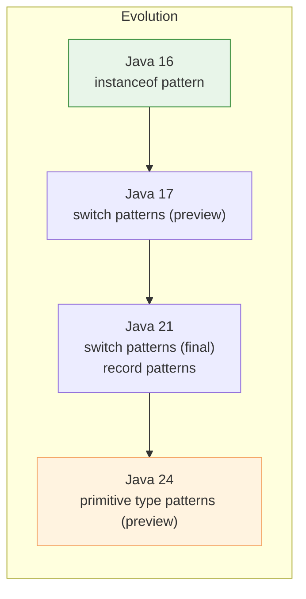

# Pattern Matching

Java has been progressively adding pattern matching since Java 14.



## `instanceof` patterns (Java 16)

```java
// Old style
if (obj instanceof String) {
    String s = (String) obj;
    System.out.println(s.length());
}

// Pattern matching — bind variable inline
if (obj instanceof String s) {
    System.out.println(s.length());   // s is already String here
}
```

## Switch patterns (Java 21)

```java
static String describe(Object obj) {
    return switch (obj) {
        case Integer i -> "integer: " + i;
        case String s  -> "string of length " + s.length();
        case null      -> "null";
        default        -> "unknown: " + obj;
    };
}
```

## Record patterns (Java 21)

Deconstruct records directly in patterns:

```java
record Point(int x, int y) {}
record ColoredPoint(Point p, String color) {}

static String describe(Object obj) {
    return switch (obj) {
        case Point(int x, int y)           -> "point at (" + x + "," + y + ")";
        case ColoredPoint(Point p, String c) -> "colored point: " + c;
        default                            -> "something else";
    };
}
```

## Guarded patterns (`when` clauses)

Add conditions to patterns (Java 21+):

```java
static String classify(Object obj) {
    return switch (obj) {
        case String s when s.length() > 5 -> "long string";
        case String s                     -> "short string";
        case Integer i when i > 0          -> "positive integer";
        case Integer i                     -> "non-positive integer";
        default                           -> "other";
    };
}
```

## Exhaustiveness with sealed classes

When `switch` is used with sealed types, the compiler verifies that all
permitted subtypes are covered — no `default` needed:

```java
sealed interface Shape permits Circle, Rectangle, Triangle {}

static double area(Shape shape) {
    return switch (shape) {  // compiler checks exhaustiveness
        case Circle c    -> Math.PI * c.radius() * c.radius();
        case Rectangle r -> r.w() * r.h();
        case Triangle t  -> 0.5 * t.b() * t.h();
    };
}
```

Adding a new subtype without updating the `switch` produces a **compile error**,
making the code maintainable and safe.
