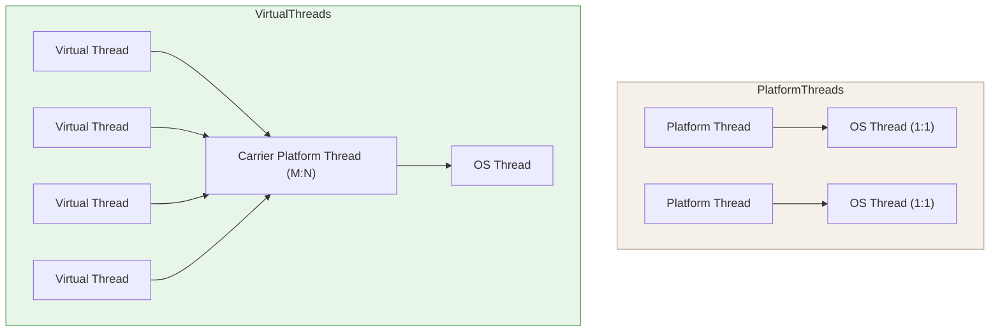

# Virtual Threads

Introduced in **Java 21** (Project Loom). Virtual threads are lightweight
threads managed by the JVM rather than mapped one-to-one to OS threads,
enabling high-throughput concurrency with familiar blocking code.



## Creating virtual threads

```java
// Traditional platform thread (OS-managed, higher per-thread overhead)
Thread platformThread = new Thread(() -> handleRequest());
platformThread.start();

// Virtual thread (cheap, JVM-scheduled)
Thread virtualThread = Thread.ofVirtual().start(() -> handleRequest());

// Using ExecutorService — same API, virtual threads underneath
try (var executor = Executors.newVirtualThreadPerTaskExecutor()) {
    for (int i = 0; i < 100_000; i++) {
        executor.submit(() -> {
            try {
                Thread.sleep(1000);   // illustrative blocking call
                return processRequest();
            } catch (InterruptedException e) {
                Thread.currentThread().interrupt();
                throw new RuntimeException(e);
            }
        });
    }
}  // executor.close() waits for submitted tasks to complete
```

> Virtual threads make the traditional one-request-per-thread style viable
> at much higher concurrency levels, especially for I/O-heavy workloads.

## Scheduling Model

Java has **two distinct scheduling models** depending on which thread type you use:

| Thread type | Mapping | Scheduler | Discipline |
|---|---|---|---|
| **Platform Thread** | 1:1 with OS thread | OS kernel | **Preemptive** — kernel can interrupt at any instruction |
| **Virtual Thread** | M:N over carrier threads | JVM scheduler (ForkJoinPool) | **Cooperative** — yields at blocking points (park/unpark, I/O) |

A virtual thread yields its carrier thread automatically whenever it would block
(`Thread.sleep`, blocking I/O, `LockSupport.park`, `Object.wait`).
Between such suspension points it runs uninterrupted on its carrier.

**Practical consequence:** a CPU-bound loop without blocking calls inside a virtual
thread **monopolises its carrier thread** — exactly the same trap as in any other
cooperative model (Kotlin coroutines, Python asyncio). For CPU-heavy workloads,
platform threads or `ForkJoinPool` are still the right tool.

→ [Scheduling: Preemptive vs Cooperative](../../topics/concurrency/index.md#scheduling-preemptive-vs-cooperative)

## Thread pinning

Virtual threads can get "pinned" to their carrier thread, preventing the carrier
from serving other virtual threads:

- Inside a `synchronized` block or method (monitor lock held).
- During a native method call.

```java
// ❌ Risk of pinning: virtual thread inside synchronized
synchronized (lock) {
    // Carrier thread is pinned here
    blockingIO();  // other virtual threads can't use this carrier
}

// ✅ Prefer ReentrantLock over synchronized with virtual threads
lock.lock();
try {
    blockingIO();  // virtual thread unparks, carrier is free
} finally {
    lock.unlock();
}
```

## When to use

| Scenario | Recommendation |
|---|---|
| I/O-bound workloads (HTTP, DB) | ✅ Virtual threads — massive scalability |
| CPU-bound computations | ❌ Platform threads or ForkJoinPool |
| Short-lived tasks | ✅ Virtual threads — cheap creation |
| Long-running background workers | Either — consider platform threads for stability |
