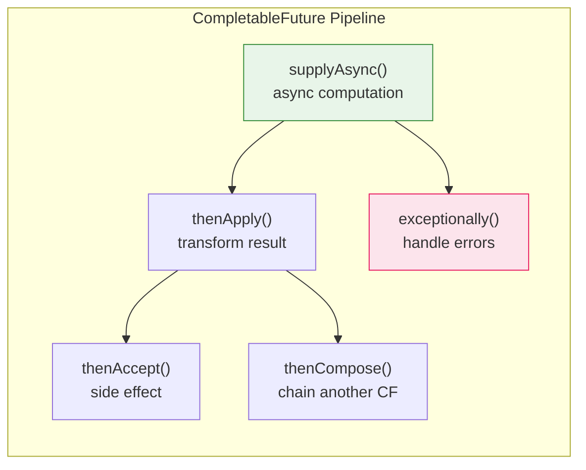
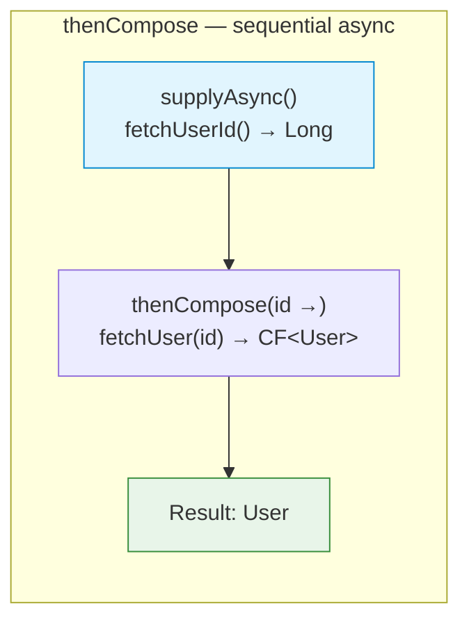
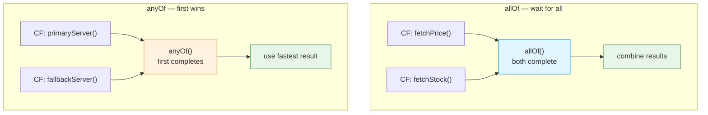
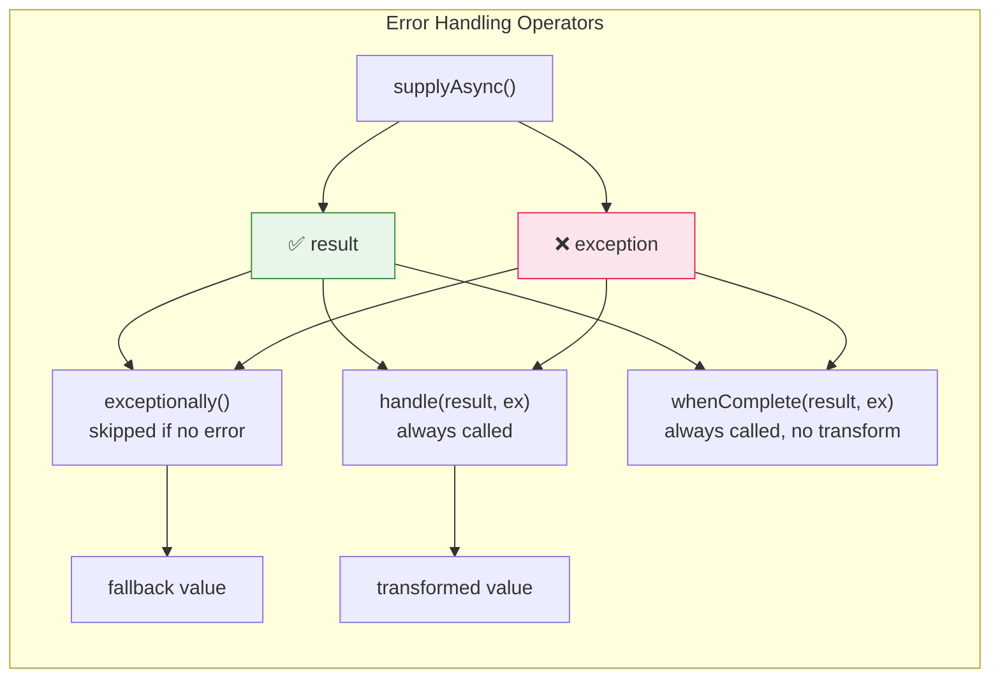
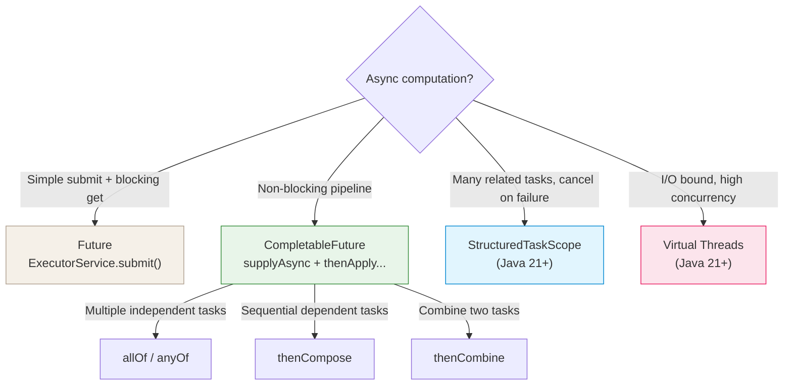

# Future and CompletableFuture

Java provides two generations of APIs for representing the result of an
asynchronous computation.

## Future (Java 5+)

`Future<T>` represents a pending result. The only way to get the value is
`get()` — which **blocks** the calling thread until the result is ready.

```java
ExecutorService executor = Executors.newFixedThreadPool(4);

Future<String> future = executor.submit(() -> {
    Thread.sleep(1000);
    return "result";
});

// Calling thread blocks here until computation completes
String result = future.get();          // throws checked exceptions
String result2 = future.get(2, TimeUnit.SECONDS); // with timeout
```

**`Future<T>` limitations:**

| Limitation                      | Description                                             |
|---------------------------------|---------------------------------------------------------|
| **Blocking only**               | `get()` blocks — no callback when done                  |
| **No composition**              | Cannot chain or combine multiple `Future`s              |
| **No error handling**           | Exceptions wrapped in `ExecutionException` from `get()` |
| **No manual completion**        | Cannot complete a `Future` from outside                 |
| **No cancellation propagation** | `cancel()` is best-effort; no downstream notification   |

## CompletableFuture (Java 8+)

`CompletableFuture<T>` implements both `Future<T>` and `CompletionStage<T>`.
It supports non-blocking callbacks, pipeline composition, combining multiple
futures, and manual completion.



### Creating a CompletableFuture

```java
// Async computation — runs in ForkJoinPool.commonPool() by default
CompletableFuture<String> cf = CompletableFuture.supplyAsync(() -> {
    return fetchDataFromNetwork();
});

// With custom executor
ExecutorService executor = Executors.newFixedThreadPool(4);
CompletableFuture<String> cf2 = CompletableFuture.supplyAsync(
    () -> fetchDataFromNetwork(),
    executor
);

// Manual completion — useful for bridging callback-based APIs
CompletableFuture<String> manual = new CompletableFuture<>();
someCallbackApi.fetch(result -> manual.complete(result));
someCallbackApi.onError(ex -> manual.completeExceptionally(ex));
```

### Non-blocking callbacks and transformation

```java
CompletableFuture<String> cf = CompletableFuture.supplyAsync(() -> "hello");

// thenApply — transform result (like Stream.map)
CompletableFuture<Integer> length = cf.thenApply(String::length);

// thenAccept — consume result, return void
cf.thenAccept(s -> System.out.println("Got: " + s));

// thenRun — run action after completion, ignores result
cf.thenRun(() -> System.out.println("Done"));

// Async variants — callback runs in a different thread
cf.thenApplyAsync(String::toUpperCase);
cf.thenApplyAsync(String::toUpperCase, executor);
```

> **`thenApply` vs `thenApplyAsync`**
> `thenApply(fn)` may run `fn` on the completing thread (the one that
> sets the result) or the calling thread if already done.
> `thenApplyAsync(fn)` always submits `fn` to the executor, guaranteeing
> it does not block the completing thread. Use `Async` variants when the
> callback does significant work.

### Chaining and composition

```java
// thenCompose — flat-map: chain dependent async operations
CompletableFuture<User> userFuture = CompletableFuture
    .supplyAsync(() -> fetchUserId())          // CF<Long>
    .thenCompose(id -> fetchUser(id));         // Long → CF<User>

// Equivalent imperative code:
// Long id = fetchUserId();
// User user = fetchUser(id);
```



### Combining multiple futures

```java
// thenCombine — combine two independent CFs when both complete
CompletableFuture<Integer> price = CompletableFuture.supplyAsync(() -> fetchPrice());
CompletableFuture<Integer> stock = CompletableFuture.supplyAsync(() -> fetchStock());

CompletableFuture<String> summary = price.thenCombine(stock,
    (p, s) -> "Price: " + p + ", Stock: " + s);

// allOf — wait for all to complete (returns CF<Void>)
CompletableFuture<Void> all = CompletableFuture.allOf(price, stock);
all.thenRun(() -> {
    int p = price.resultNow();    // safe: all are done
    int s = stock.resultNow();
    System.out.println(p + s);
});

// anyOf — complete when any one completes
CompletableFuture<Object> fastest = CompletableFuture.anyOf(
    CompletableFuture.supplyAsync(() -> fetchFromPrimary()),
    CompletableFuture.supplyAsync(() -> fetchFromFallback())
);
```



### Error handling

```java
CompletableFuture<String> cf = CompletableFuture.supplyAsync(() -> {
    if (Math.random() > 0.5) throw new RuntimeException("failed");
    return "ok";
});

// exceptionally — recover from error, provide fallback
CompletableFuture<String> withFallback = cf
    .exceptionally(ex -> "fallback: " + ex.getMessage());

// handle — process both result and exception
CompletableFuture<String> handled = cf
    .handle((result, ex) -> {
        if (ex != null) return "error: " + ex.getMessage();
        return "success: " + result;
    });

// whenComplete — side effect on completion (does not transform result)
cf.whenComplete((result, ex) -> {
    if (ex != null) log.error("Failed", ex);
    else metrics.recordSuccess();
});
```



### Timeouts (Java 9+)

```java
CompletableFuture<String> cf = CompletableFuture.supplyAsync(() -> slowOperation());

// Complete with exception after timeout
CompletableFuture<String> withTimeout = cf
    .orTimeout(3, TimeUnit.SECONDS);

// Complete with fallback value after timeout
CompletableFuture<String> withDefault = cf
    .completeOnTimeout("fallback", 3, TimeUnit.SECONDS);
```

## Comparison Table

| Feature | `Future` | `CompletableFuture` |
|---|---|---|
| Get result | `get()` — **blocks** | `get()`, `join()`, `resultNow()` |
| Non-blocking callback | ❌ | ✅ `thenApply`, `thenAccept` |
| Transform result | ❌ | ✅ `thenApply`, `thenCompose` |
| Combine futures | ❌ | ✅ `thenCombine`, `allOf`, `anyOf` |
| Error handling | `try/catch` around `get()` | ✅ `exceptionally`, `handle` |
| Manual completion | ❌ | ✅ `complete()`, `completeExceptionally()` |
| Timeout | `get(n, unit)` — blocks | ✅ `orTimeout()`, `completeOnTimeout()` |
| Custom executor | via `submit()` | ✅ `thenApplyAsync(fn, executor)` |
| Cancel | `cancel()` — best-effort | ✅ `cancel()` + upstream propagation |

## Common Pitfalls

**Blocking inside async pipeline — defeats the purpose:**

```java
// ❌ blocks a thread inside the pipeline
CompletableFuture.supplyAsync(() -> fetchA())
    .thenApply(a -> fetchB().get());  // blocks ForkJoinPool thread!

// ✅ use thenCompose to stay async
CompletableFuture.supplyAsync(() -> fetchA())
    .thenCompose(a -> fetchB());
```

**Missing exception handler — silent failure:**

```java
// ❌ if fetchData() throws, exception is swallowed silently
CompletableFuture.supplyAsync(() -> fetchData())
    .thenAccept(System.out::println);

// ✅ always handle exceptions at the end of a pipeline
CompletableFuture.supplyAsync(() -> fetchData())
    .thenAccept(System.out::println)
    .exceptionally(ex -> { log.error("Failed", ex); return null; });
```

**`join()` vs `get()`:**

```java
// get() — throws checked exceptions (must handle)
try {
    String result = cf.get();
} catch (InterruptedException | ExecutionException e) { ... }

// join() — throws unchecked CompletionException (convenient in streams)
String result = cf.join();

// resultNow() — Java 19+, only if already completed (throws if not)
String result = cf.resultNow();
```

## When to Use What



| Scenario | Recommended |
|---|---|
| Simple task + blocking result | `Future` via `ExecutorService` |
| Non-blocking pipeline | `CompletableFuture` |
| Fan-out / fan-in pattern | `CompletableFuture.allOf()` |
| Race pattern (first wins) | `CompletableFuture.anyOf()` |
| Sequential async steps | `thenCompose` chain |
| I/O-heavy, high concurrency | Virtual threads (Java 21+) |
| Structured task lifecycle | `StructuredTaskScope` (Java 21+) |
| Bridging callback APIs | `new CompletableFuture<>()` + `complete()` |
