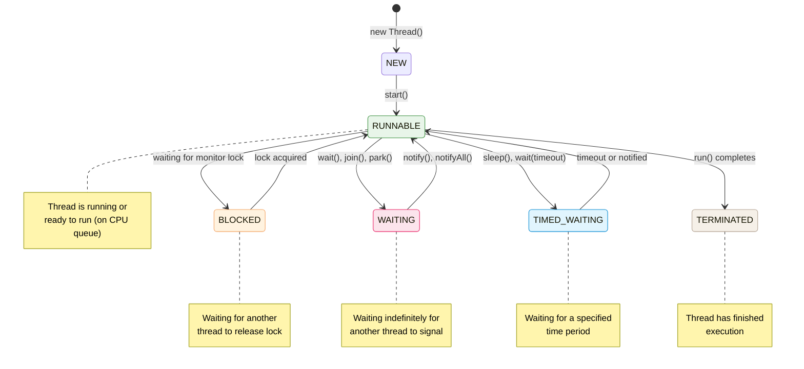

# Thread States

Java threads transition through six states during their lifecycle. Understanding
these states is essential for debugging concurrency issues.



## State overview

| State | Trigger | How to resume |
|---|---|---|
| **NEW** | `new Thread()` | `start()` |
| **RUNNABLE** | `start()` or resumed from another state | Running or ready to run |
| **BLOCKED** | Waiting for `synchronized` monitor lock | Lock released by holder |
| **WAITING** | `wait()`, `join()` without timeout, `LockSupport.park()` | `notify()`, `notifyAll()`, `unpark()`, target thread terminates |
| **TIMED_WAITING** | `sleep(ms)`, `wait(timeout)`, `join(timeout)` | Timeout expires or notified |
| **TERMINATED** | `run()` completes or uncaught exception | — |

## BLOCKED state

Occurs when a thread tries to acquire a monitor lock held by another thread:

```java
Object lock = new Object();

Thread t1 = new Thread(() -> {
    synchronized (lock) {
        Thread.sleep(1000);  // holds lock
    }
});

Thread t2 = new Thread(() -> {
    synchronized (lock) {
        // t2 becomes BLOCKED here, waiting for t1 to release lock
    }
});

t1.start();
t2.start();
```

> The `BLOCKED` state exclusively represents waiting for a `synchronized` monitor lock.
> Waiting for modern locks in `java.util.concurrent.locks` (like `ReentrantLock`)
> puts the thread in `WAITING` or `TIMED_WAITING`.

## WAITING state

Thread waits indefinitely for another thread's action. Always use `wait()`
inside a synchronized block and check condition in a while loop:

```java
synchronized (lock) {
    while (!condition) {              // while loop handles spurious wakeups
        lock.wait();                  // WAITING state
    }
    // process when condition is true
}

// In another thread:
synchronized (lock) {
    condition = true;
    lock.notify();                    // wakes one waiting thread
}
```

## TIMED_WAITING state

Thread waits for a specified time period:

```java
// Thread.sleep() - most common
Thread.sleep(3000);  // TIMED_WAITING for 3 seconds

// wait with timeout
synchronized (lock) {
    lock.wait(2000);  // TIMED_WAITING for 2 seconds
}

// join with timeout
Thread other = new Thread(() -> ...);
other.start();
other.join(1000);  // TIMED_WAITING for 1 second
```

## Producer-Consumer pattern

Classic synchronization pattern demonstrating state transitions:

```java
synchronized (lock) {
    while (available) {               // buffer is full
        lock.wait();                  // WAITING
    }
    buffer = item;                     // produce
    available = true;
    lock.notify();                     // wake consumer
}

// Consumer:
synchronized (lock) {
    while (!available) {              // buffer is empty
        lock.wait();                  // WAITING
    }
    item = buffer;                    // consume
    available = false;
    lock.notify();                     // wake producer
}
```

> ⚠️ Always use `while (condition)` with `wait()` to handle spurious wakeups.
> Never call `wait()`, `notify()`, or `notifyAll()` without holding the monitor lock.

## Diagnosing with thread dumps

```bash
# Generate a thread dump
jstack <pid>

# Or send SIGQUIT
kill -3 <pid>
```

A thread dump shows each thread's current state, stack trace, and what lock
it is waiting for — essential for diagnosing deadlocks.

## Deadlock example

```java
Object lockA = new Object();
Object lockB = new Object();

Thread t1 = new Thread(() -> {
    synchronized (lockA) {
        synchronized (lockB) { /* ... */ }  // BLOCKED if t2 holds lockB
    }
});

Thread t2 = new Thread(() -> {
    synchronized (lockB) {
        synchronized (lockA) { /* ... */ }  // BLOCKED if t1 holds lockA
    }
});
// Both threads BLOCKED forever → deadlock
```
