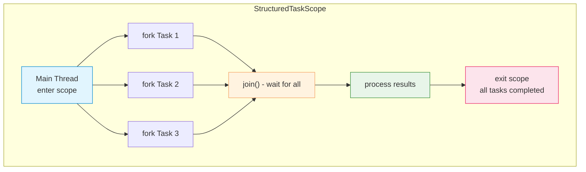

# Scoped Values and Structured Concurrency

**Final in Java 24** (Project Loom). These features together enable
cleaner, more structured concurrent programming.

## Scoped Values

Scoped values provide immutable, inheritable context for a bounded
execution scope — a disciplined alternative to many `ThreadLocal` use cases:

```java
private static final ScopedValue<String> USER = ScopedValue.newInstance();

ScopedValue.where(USER, "alice").run(() -> {
    // All code in this lambda can access USER.get()
    System.out.println("User: " + USER.get()); // alice

    // Child virtual threads inherit the scoped value
    Thread.ofVirtual().start(() -> {
        System.out.println("Child sees: " + USER.get()); // alice
    });
});
```

Scoped values vs ThreadLocal:

| Aspect | `ThreadLocal` | `ScopedValue` |
|---|---|---|
| Mutability | Mutable (can reassign) | Immutable (set once per scope) |
| Inheritance | Copies to child threads | Efficient, unidirectional inheritance |
| Cleanup | Manual `remove()` risk | Automatic on scope exit |
| Memory leaks | Common pitfall | Impossible — bounded by scope |

## Structured Concurrency

Structured concurrency treats related concurrent tasks as a single unit of work.
Forked tasks are automatically joined before scope exit.



## Scope types

```java
// 1. Basic scope - wait for all tasks
try (var scope = new StructuredTaskScope<String>()) {
    Future<String> f1 = scope.fork(() -> fetchUser());
    Future<String> f2 = scope.fork(() -> fetchOrders());
    scope.join();  // waits for both
    System.out.println(f1.resultNow() + ", " + f2.resultNow());
}

// 2. ShutdownOnFailure - fail fast
try (var scope = new StructuredTaskScope.ShutdownOnFailure()) {
    scope.fork(() -> serviceA());
    scope.fork(() -> serviceB());
    scope.join();
    scope.throwIfFailed();  // cancels remaining if any fail
}

// 3. ShutdownOnSuccess - first success wins
try (var scope = new StructuredTaskScope.ShutdownOnSuccess<String>()) {
    scope.fork(() -> primaryServer());
    scope.fork(() -> fallbackServer());
    scope.join();
    String result = scope.result();  // first successful
}

// 4. Timeout handling
try (var scope = new StructuredTaskScope<String>()) {
    Future<String> f = scope.fork(() -> longOperation());
    scope.joinUntil(Instant.now().plusSeconds(3));
    if (f.state() != Future.State.SUCCESS) {
        scope.shutdown();  // cancel timed-out tasks
    }
}
```

## Key principles

1. **Fork-join pairing** — every `fork()` has a matching `join()` before scope exit.
2. **Failure propagation** — if one task fails, remaining tasks are cancelled automatically.
3. **No orphaned tasks** — tasks cannot outlive their scope, preventing resource leaks.
4. **Composability** — nested scopes form a tree of concurrent work.

## Comparison with alternatives

| Approach | Use when | Limitation |
|---|---|---|
| `ExecutorService` | General-purpose threading | No automatic cancellation, task leakage risk |
| `CompletableFuture` | Non-blocking pipelines | Callback hell, no structured lifecycle |
| `StructuredTaskScope` | Related concurrent tasks | Java 21+, requires try-with-resources |
| Virtual threads | High-concurrency I/O | Inside structured scopes for best results |
