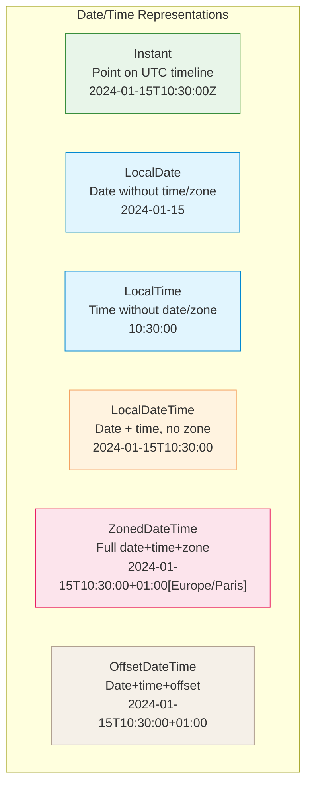
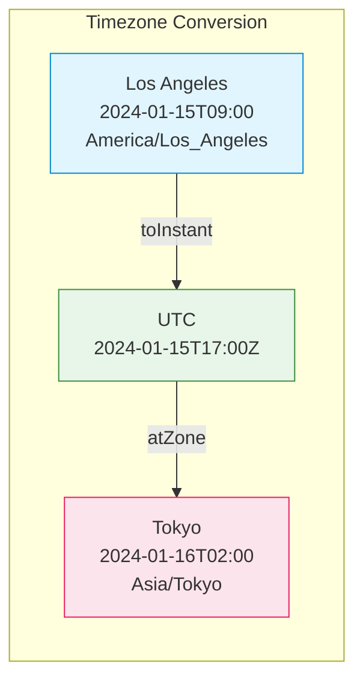
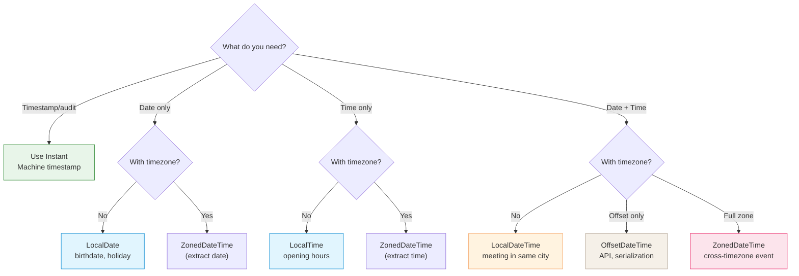

# Working with Dates and Times

Java has two distinct APIs for working with dates and times: the **legacy API** (pre-Java 8) and the **modern `java.time` API** (Java 8+).

## Legacy Date/Time API (avoid in new code)

Before Java 8, date/time handling was problematic:

```java
// Legacy API — mutable, thread-unsafe, confusing
java.util.Date date = new java.util.Date();
java.util.Calendar cal = java.util.Calendar.getInstance();
cal.set(2024, 0, 15);  // months are 0-based! January = 0

// SimpleDateFormat — not thread-safe
SimpleDateFormat sdf = new SimpleDateFormat("yyyy-MM-dd");
String formatted = sdf.format(date);
```

**Problems with legacy API:**

- **Mutability** — `Date` and `Calendar` are mutable, causing concurrency issues
- **Poor design** — months are 0-based, days are 1-based
- **Thread-safety** — `SimpleDateFormat` is not thread-safe
- **Mixing concerns** — `Date` conflates instant and local time

> ⚠️ Use legacy API only when required for backward compatibility with old libraries.

---

## Modern `java.time` API (Java 8+)

The `java.time` package provides immutable, thread-safe, well-designed date/time classes.



## Choosing the Right Type

| Type                 | Use when                                                  | Example                                        |
|----------------------|-----------------------------------------------------------|------------------------------------------------|
| **`Instant`**        | Timestamp on UTC timeline, logging, database audit fields | `Instant.now()`                                |
| **`LocalDate`**      | Date only, no time or timezone (birthdate, holiday)       | `LocalDate.of(1995, 5, 23)`                    |
| **`LocalTime`**      | Time only, no date or timezone (opening hours)            | `LocalTime.of(9, 30)`                          |
| **`LocalDateTime`**  | Date + time, no timezone (meeting in local context)       | `LocalDateTime.now()`                          |
| **`ZonedDateTime`**  | Full date+time+timezone (cross-timezone scheduling)       | `ZonedDateTime.now(ZoneId.of("Europe/Paris"))` |
| **`OffsetDateTime`** | Date+time+UTC offset (ISO-8601, APIs, serialization)      | `OffsetDateTime.now()`                         |

---

## Common Operations

### Creating dates

```java
// Current date/time
Instant now = Instant.now();                          // UTC timestamp
LocalDate today = LocalDate.now();                    // 2024-01-15
LocalDateTime dateTime = LocalDateTime.now();         // 2024-01-15T10:30:00

// Specific date/time
LocalDate birthday = LocalDate.of(1995, Month.MAY, 23);
LocalTime morning = LocalTime.of(9, 30, 0);
LocalDateTime meeting = LocalDateTime.of(2024, 1, 15, 14, 30);

// With timezone
ZonedDateTime parisTime = ZonedDateTime.now(ZoneId.of("Europe/Paris"));
ZonedDateTime specific = ZonedDateTime.of(
    LocalDateTime.of(2024, 1, 15, 10, 30),
    ZoneId.of("America/New_York")
);

// Parsing from string
LocalDate parsed = LocalDate.parse("2024-01-15");
Instant instant = Instant.parse("2024-01-15T10:30:00Z");
```

### Manipulating dates

```java
LocalDate date = LocalDate.of(2024, 1, 15);

// Adding/subtracting
LocalDate nextWeek = date.plusWeeks(1);               // 2024-01-22
LocalDate lastMonth = date.minusMonths(1);            // 2023-12-15
LocalDateTime later = dateTime.plusHours(3).plusMinutes(30);

// Using TemporalAdjusters
LocalDate firstDay = date.with(TemporalAdjusters.firstDayOfMonth());
LocalDate nextMonday = date.with(TemporalAdjusters.next(DayOfWeek.MONDAY));
LocalDate lastFriday = date.with(TemporalAdjusters.lastInMonth(DayOfWeek.FRIDAY));
```

### Comparing and measuring

```java
LocalDate start = LocalDate.of(2024, 1, 1);
LocalDate end = LocalDate.of(2024, 12, 31);

// Comparison
boolean isBefore = start.isBefore(end);               // true
boolean isAfter = start.isAfter(end);                 // false

// Duration between times (hours, minutes, seconds)
LocalTime t1 = LocalTime.of(9, 30);
LocalTime t2 = LocalTime.of(17, 45);
Duration duration = Duration.between(t1, t2);         // PT8H15M
long hours = duration.toHours();                      // 8

// Period between dates (years, months, days)
Period period = Period.between(start, end);           // P11M30D
int days = period.getDays();                          // 30
long totalDays = ChronoUnit.DAYS.between(start, end); // 365
```

### Formatting and parsing

```java
// Built-in formatters
LocalDate date = LocalDate.of(2024, 1, 15);
String iso = date.format(DateTimeFormatter.ISO_DATE); // "2024-01-15"

// Custom patterns
DateTimeFormatter formatter = DateTimeFormatter.ofPattern("dd/MM/yyyy");
String formatted = date.format(formatter);            // "15/01/2024"

// Parsing with custom format
LocalDate parsed = LocalDate.parse("15/01/2024", formatter);

// Localized formatting
DateTimeFormatter germanFormat =
    DateTimeFormatter.ofLocalizedDate(FormatStyle.LONG)
                     .withLocale(Locale.GERMANY);
String german = date.format(germanFormat);            // "15. Januar 2024"
```

---

## Timezone Handling



```java
// Convert between timezones
ZonedDateTime la = ZonedDateTime.of(
    LocalDateTime.of(2024, 1, 15, 9, 0),
    ZoneId.of("America/Los_Angeles")
);

ZonedDateTime tokyo = la.withZoneSameInstant(ZoneId.of("Asia/Tokyo"));
// 2024-01-16T02:00+09:00[Asia/Tokyo]

// To/from Instant (UTC timeline)
Instant instant = la.toInstant();
ZonedDateTime paris = instant.atZone(ZoneId.of("Europe/Paris"));
```

### Working with daylight saving time

```java
// DST transition example
ZoneId newYork = ZoneId.of("America/New_York");
ZonedDateTime beforeDST = ZonedDateTime.of(
    LocalDateTime.of(2024, 3, 10, 1, 30),  // Before DST
    newYork
);

ZonedDateTime afterDST = beforeDST.plusHours(2);      // Skips to 3:30
// DST transition at 2:00 AM — 2:00-2:59 doesn't exist!
```

---

## Interoperability: Legacy ↔ Modern

When working with legacy code or libraries:

```java
// Legacy → Modern
Date legacyDate = new Date();
Instant instant = legacyDate.toInstant();
LocalDateTime ldt = LocalDateTime.ofInstant(instant, ZoneId.systemDefault());

// Modern → Legacy
LocalDateTime modern = LocalDateTime.now();
Instant inst = modern.atZone(ZoneId.systemDefault()).toInstant();
Date legacy = Date.from(inst);

// Calendar → Modern
Calendar cal = Calendar.getInstance();
Instant calInstant = cal.toInstant();
ZonedDateTime zdt = ZonedDateTime.ofInstant(calInstant, ZoneId.systemDefault());
```

---

## Quick Decision Guide



**Rules of thumb:**

1. **Use `Instant`** for:
   - Database timestamps
   - Audit logs
   - Event timestamps in distributed systems

2. **Use `LocalDate`/`LocalTime`/`LocalDateTime`** for:
   - User-facing dates (birthdays, appointments)
   - Business logic without timezone concerns
   - Internal application state

3. **Use `ZonedDateTime`** for:
   - Cross-timezone scheduling
   - User-specific timezone display
   - Calendar applications

4. **Use `OffsetDateTime`** for:
   - REST API responses (ISO-8601)
   - Serialization/deserialization
   - When you need offset but not full zone rules

5. **Avoid legacy `Date`/`Calendar`** unless:
   - Interfacing with old libraries
   - Required by external APIs

---

## Common Patterns

### Birthday calculation

```java
public static int calculateAge(LocalDate birthDate) {
    return Period.between(birthDate, LocalDate.now()).getYears();
}

LocalDate birthday = LocalDate.of(1995, 5, 23);
int age = calculateAge(birthday);  // 28 (in 2024)
```

### Business days calculation

```java
public static long countBusinessDays(LocalDate start, LocalDate end) {
    return Stream.iterate(start, date -> date.plusDays(1))
        .limit(ChronoUnit.DAYS.between(start, end) + 1)
        .filter(date -> {
            DayOfWeek day = date.getDayOfWeek();
            return day != DayOfWeek.SATURDAY && day != DayOfWeek.SUNDAY;
        })
        .count();
}
```

### Recurring events

```java
// Every Monday at 10:00 for next 4 weeks
LocalDate start = LocalDate.now().with(TemporalAdjusters.next(DayOfWeek.MONDAY));
List<LocalDateTime> meetings = Stream.iterate(
        start.atTime(10, 0),
        dt -> dt.plusWeeks(1)
    )
    .limit(4)
    .toList();
```

### Database storage

```java
// Store as Instant (UTC) in database
Instant now = Instant.now();
// SQL: INSERT INTO events (timestamp) VALUES (?)
// Use PreparedStatement with Timestamp.from(now)

// Retrieve and convert to user's timezone
Instant dbInstant = resultSet.getTimestamp("timestamp").toInstant();
ZonedDateTime userTime = dbInstant.atZone(ZoneId.of("Europe/London"));
```

---

## Performance Considerations

- **`Instant`** — Most efficient, uses `long` seconds + `int` nanos
- **`LocalDate`** — Three `int` fields (year, month, day)
- **`ZonedDateTime`** — Heavier due to zone rules lookup
- **Immutability** — All `java.time` objects are immutable, safe for caching

**Avoid:**

```java
// ❌ Creating formatters repeatedly
for (LocalDate date : dates) {
    String s = date.format(DateTimeFormatter.ofPattern("yyyy-MM-dd"));
}

// ✅ Reuse formatter (thread-safe)
DateTimeFormatter formatter = DateTimeFormatter.ofPattern("yyyy-MM-dd");
for (LocalDate date : dates) {
    String s = date.format(formatter);
}
```
