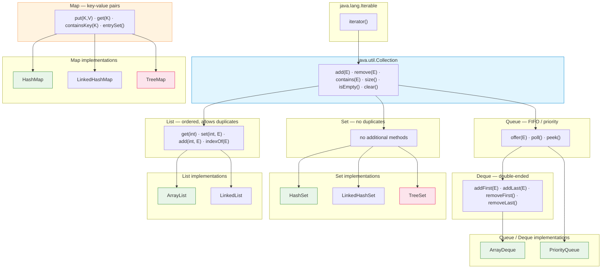
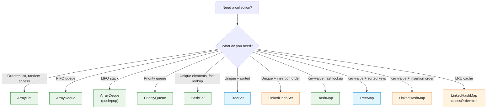

# Collections Framework

Introduced in **Java 1.2 (1998)**. The Collections Framework provides a unified
architecture for storing and manipulating groups of objects through a hierarchy
of interfaces and reusable implementations. It is the cornerstone of virtually
every Java application.

## Interface hierarchy



> `Map` does **not** extend `Collection`. It is a separate top-level interface
> in the framework.

---

## List — ordered sequence

| Implementation | Underlying structure | `get(i)` | `add/remove at end` | `add/remove at index` | Memory |
|---|---|---|---|---|---|
| **ArrayList** | Dynamic array | O(1) | O(1) amortized | O(n) | Compact |
| **LinkedList** | Doubly-linked list | O(n) | O(1) | O(n) search + O(1) update | Higher per element |

### ArrayList — default choice

```java
List<String> list = new ArrayList<>();
list.add("alpha");           // append — O(1) amortized
list.add(0, "beta");         // insert at index — O(n)
String s = list.get(0);      // random access — O(1)
list.remove("alpha");        // search + remove — O(n)
list.remove(0);              // remove by index — O(n)
```

> Prefer `ArrayList` over `LinkedList` in almost all cases. Modern CPU caches
> favor contiguous memory, and `ArrayList` outperforms `LinkedList` even for
> many insertion-heavy workloads.

### LinkedList — when you really need it

```java
Deque<String> deque = new LinkedList<>();
deque.addFirst("head");      // O(1)
deque.addLast("tail");       // O(1)
deque.removeFirst();         // O(1)
```

Use `LinkedList` only as a `Deque` when you need frequent `addFirst`/`removeFirst`
operations. Even then, `ArrayDeque` is usually faster.

---

## Set — unique elements

| Implementation | Ordering | Underlying structure | `add` / `contains` / `remove` | Notes |
|---|---|---|---|---|
| **HashSet** | Unordered | Hash table | O(1) average | Fastest general-purpose Set |
| **LinkedHashSet** | Insertion order | Hash table + linked list | O(1) average | Preserves insertion order |
| **TreeSet** | Sorted (natural or Comparator) | Red-black tree | O(log n) | Implements `NavigableSet` |

```java
Set<String> hash = new HashSet<>();
hash.add("b"); hash.add("a"); hash.add("c");
System.out.println(hash);     // [a, b, c] — arbitrary order

Set<String> linked = new LinkedHashSet<>();
linked.add("b"); linked.add("a"); linked.add("c");
System.out.println(linked);   // [b, a, c] — insertion order

Set<String> tree = new TreeSet<>();
tree.add("b"); tree.add("a"); tree.add("c");
System.out.println(tree);     // [a, b, c] — sorted

// TreeSet with custom Comparator
Set<String> desc = new TreeSet<>(Comparator.reverseOrder());
```

### TreeSet navigation operations

```java
NavigableSet<Integer> set = new TreeSet<>();
set.addAll(List.of(10, 20, 30, 40));

set.lower(25);       // 20   — strictly less
set.floor(20);       // 20   — less or equal
set.ceiling(20);     // 20   — greater or equal
set.higher(20);      // 30   — strictly greater

set.pollFirst();     // 10   — remove and return smallest
set.pollLast();      // 40   — remove and return largest

set.subSet(15, 35);  // [20, 30] — view, backed by original set
```

---

## Map — key-value pairs

| Implementation | Ordering | Underlying structure | `get` / `put` / `remove` | Notes |
|---|---|---|---|---|
| **HashMap** | Unordered | Hash table | O(1) average | Default Map implementation |
| **LinkedHashMap** | Insertion or access order | Hash table + linked list | O(1) average | Access-order enables LRU cache |
| **TreeMap** | Sorted by key | Red-black tree | O(log n) | Implements `NavigableMap` |

```java
Map<String, Integer> map = new HashMap<>();
map.put("one", 1);
map.put("two", 2);
Integer val = map.get("one");     // 1
map.containsKey("one");           // true
map.remove("one");                // removes and returns 1

// Iteration over entries (preferred over keySet for values access)
for (Map.Entry<String, Integer> e : map.entrySet()) {
    System.out.println(e.getKey() + " = " + e.getValue());
}

// Java 8+ iteration
map.forEach((k, v) -> System.out.println(k + " = " + v));
```

### LinkedHashMap as LRU cache

```java
// accessOrder = true — entries reordered on get/put
Map<String, String> cache = new LinkedHashMap<>(16, 0.75f, true) {
    @Override
    protected boolean removeEldestEntry(Map.Entry<String, String> eldest) {
        return size() > 100;     // max capacity 100
    }
};
```

### TreeMap navigation

```java
NavigableMap<String, Integer> map = new TreeMap<>();
map.put("a", 1); map.put("c", 3); map.put("e", 5);

map.lowerKey("c");        // "a"
map.floorKey("c");        // "c"
map.ceilingKey("c");      // "c"
map.higherKey("c");       // "e"

map.subMap("a", "e");     // {a=1, c=3} — from inclusive, to exclusive
map.headMap("c");         // {a=1}      — keys < "c"
map.tailMap("c");         // {c=3, e=5} — keys >= "c"
```

---

## Queue and Deque

| Implementation | Type | `offer` / `poll` | `peek` | Underlying |
|---|---|---|---|---|
| **ArrayDeque** | Deque (FIFO / LIFO) | O(1) | O(1) | Circular array |
| **PriorityQueue** | Priority queue | O(log n) | O(1) | Binary heap |
| **LinkedList** | Deque | O(1) | O(1) | Doubly-linked list |

> Never use the legacy `Stack` class. Use `ArrayDeque` for LIFO operations.

```java
// FIFO queue
Queue<String> queue = new ArrayDeque<>();
queue.offer("first");       // enqueue — O(1)
queue.offer("second");
String head = queue.poll(); // dequeue — O(1), returns "first"
String peek = queue.peek(); // inspect head — O(1)

// LIFO stack (prefer ArrayDeque over Stack class)
Deque<String> stack = new ArrayDeque<>();
stack.push("first");        // addFirst
stack.push("second");
String top = stack.pop();   // removeFirst — returns "second"
String peek2 = stack.peek();// inspect first

// Double-ended queue
Deque<String> deque = new ArrayDeque<>();
deque.addFirst("a");
deque.addLast("b");
deque.removeFirst();        // "a"
deque.removeLast();         // "b"
```

### PriorityQueue

```java
// Min-heap by default (natural ordering)
Queue<Integer> minHeap = new PriorityQueue<>();
minHeap.offer(30); minHeap.offer(10); minHeap.offer(20);
minHeap.poll();   // 10 — smallest first

// Max-heap
Queue<Integer> maxHeap = new PriorityQueue<>(Comparator.reverseOrder());

// Custom comparator (e.g., priority queue of tasks)
record Task(String name, int priority) {}
Queue<Task> tasks = new PriorityQueue<>(
    Comparator.comparingInt(Task::priority)
);
```

> `PriorityQueue` is **not thread-safe**. Use `PriorityBlockingQueue` from
> `java.util.concurrent` for concurrent access.

---

## Iterators

```java
List<String> list = List.of("a", "b", "c");

// Enhanced for-loop (uses Iterator internally)
for (String s : list) {
    System.out.println(s);
}

// Explicit iterator
Iterator<String> it = list.iterator();
while (it.hasNext()) {
    String s = it.next();
    if (s.equals("b")) {
        it.remove();   // safe removal during iteration
    }
}

// ListIterator — bidirectional, supports set/add
ListIterator<String> lit = list.listIterator();
while (lit.hasNext()) {
    int index = lit.nextIndex();
    String s = lit.next();
}
while (lit.hasPrevious()) {
    String s = lit.previous();
}
```

> Modifying a collection directly (e.g., `list.remove(...)`) while iterating
> over it with a standard `for` loop or enhanced `for` throws
> `ConcurrentModificationException`. Use `Iterator.remove()`,
> `removeIf()`, or iterate over a copy.

---

## Comparable and Comparator

### Natural ordering — Comparable

```java
public record Person(String name, int age) implements Comparable<Person> {
    @Override
    public int compareTo(Person other) {
        return Integer.compare(this.age, other.age);
    }
}

Set<Person> sorted = new TreeSet<>();
sorted.add(new Person("Alice", 30));
sorted.add(new Person("Bob", 25));   // Bob comes first
```

### Custom ordering — Comparator

```java
// Sort by name descending, then by age ascending
Comparator<Person> byNameDesc = Comparator
    .comparing(Person::name)
    .reversed()
    .thenComparingInt(Person::age);

List<Person> people = new ArrayList<>();
people.sort(byNameDesc);

// Inline with method reference
people.sort(Comparator.comparingInt(Person::age).reversed());

// Null-safe comparator
people.sort(Comparator.comparing(Person::name, Comparator.nullsFirst(String::compareTo)));
```

---

## Collections utility class

```java
List<String> list = new ArrayList<>();

Collections.sort(list);                        // sort (natural order)
Collections.sort(list, Comparator.reverseOrder());
Collections.reverse(list);                     // reverse in place
Collections.shuffle(list);                     // random shuffle
Collections.binarySearch(list, "key");         // binary search on sorted list

Collections.emptyList();                       // immutable empty list
Collections.singletonList("only");              // immutable single-element list
Collections.unmodifiableList(list);             // read-only view
Collections.synchronizedList(list);             // thread-safe wrapper

Collections.max(list);                         // maximum (natural order)
Collections.min(list);                         // minimum
Collections.frequency(list, "a");              // count occurrences
Collections.disjoint(listA, listB);            // no common elements?
Collections.copy(dest, src);                   // copy elements
Collections.fill(list, "x");                   // fill with value
Collections.nCopies(5, "x");                   // List with 5 "x" elements
```

> Prefer immutable factory methods from the `List`/`Set`/`Map` interfaces
> (Java 9+) over `Collections.unmodifiable*` when you control creation:
> `List.of(1, 2, 3)`, `Set.of("a", "b")`, `Map.of("k", "v")`.

---

## Time complexity summary

| Operation | ArrayList | LinkedList | HashSet / HashMap | TreeSet / TreeMap | ArrayDeque | PriorityQueue |
|---|---|---|---|---|---|---|
| **add / put** | O(1) amortized | O(1) | O(1) avg | O(log n) | O(1) | O(log n) |
| **remove** | O(n) | O(n) search | O(1) avg | O(log n) | O(1) | O(log n) |
| **get / contains** | O(1) | O(n) | O(1) avg | O(log n) | — | O(1) peek |
| **search by value** | O(n) | O(n) | — | — | — | — |
| **get first/last** | O(1) | O(1) | — | — | O(1) | O(1) peek |
| **insert at index** | O(n) | O(n) search | — | — | — | — |
| **space** | O(n) compact | O(n) high overhead | O(n) | O(n) | O(n) | O(n) |

> "avg" = average case. Hash-based structures degrade to O(n) in the worst
> case (hash collisions). Since Java 8, `HashMap` uses tree bins for
> collision-heavy buckets, keeping worst-case at O(log n).

---

## Choosing the right implementation



### Decision guide

| Requirement | Use | Avoid |
|---|---|---|
| Default List | `ArrayList` | `LinkedList`, `Vector` |
| Default Set | `HashSet` | — |
| Default Map | `HashMap` | `Hashtable` |
| Default Queue/Stack | `ArrayDeque` | `Stack`, `LinkedList` |
| Sorted collection | `TreeSet` / `TreeMap` | Sorting `ArrayList` manually |
| Preserve insertion order | `LinkedHashSet` / `LinkedHashMap` | — |
| LRU cache | `LinkedHashMap` with `removeEldestEntry` | Writing custom cache |
| Thread-safe collection | Classes from `java.util.concurrent` | `Collections.synchronized*` wrappers |
| Immutable collection | `List.of`, `Set.of`, `Map.of` (Java 9+) | `Collections.unmodifiable*` |

---

## Immutable collections (Java 9+)

```java
List<String> list = List.of("a", "b", "c");
Set<String> set = Set.of("a", "b", "c");
Map<String, Integer> map = Map.of("one", 1, "two", 2);

Map<String, Integer> map2 = Map.ofEntries(
    Map.entry("one", 1),
    Map.entry("two", 2)
);
```

> Immutable collections:
> - Do **not** allow `null` elements or keys/values
> - Are **not** modifiable — any mutation attempt throws `UnsupportedOperationException`
> - May be more memory-efficient than mutable counterparts
> - For large maps (>10 entries), use `Map.ofEntries()` instead of `Map.of()`

---

## Examples

- [Data Structures example](../../../examples/java/05-data-structures/README.md) — Lists, Sets, Maps, Queues, iteration
