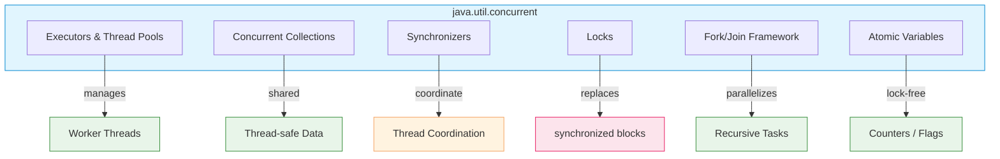
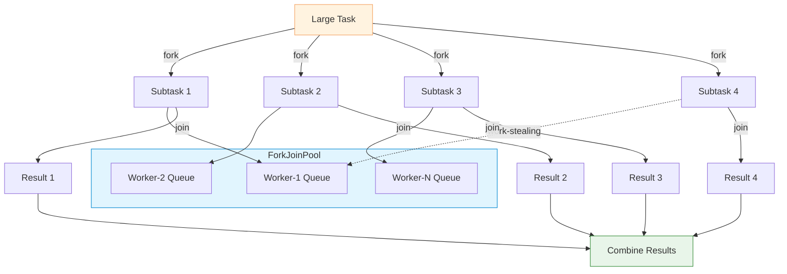

# Concurrency Utilities

Introduced in **Java 5 (2004)** as `java.util.concurrent`. The package provides
high-level concurrency building blocks: thread pools, non-blocking collections,
locks, synchronizers, and atomic variables. It eliminates the need for manual
`synchronized` / `wait` / `notify` in most scenarios.



---

## Executor Framework

The **Executor** framework decouples task submission from execution mechanics.
Instead of creating `Thread` objects directly, you submit `Runnable` or `Callable`
tasks to a managed thread pool.

### Creating thread pools

```java
// Fixed-size pool — ideal for CPU-bound workloads
ExecutorService fixed = Executors.newFixedThreadPool(4);

// Cached pool — creates threads as needed, reuses idle ones
ExecutorService cached = Executors.newCachedThreadPool();

// Single-threaded — sequential execution, useful for ordering guarantees
ExecutorService single = Executors.newSingleThreadExecutor();

// Work-stealing pool — ForkJoinPool under the hood (Java 8+)
ExecutorService steal = Executors.newWorkStealingPool();

// Scheduled execution
ScheduledExecutorService scheduled = Executors.newScheduledThreadPool(2);
scheduled.schedule(() -> System.out.println("delayed"), 5, TimeUnit.SECONDS);
scheduled.scheduleAtFixedRate(task, 0, 1, TimeUnit.SECONDS);
```

### Submitting tasks

```java
ExecutorService executor = Executors.newFixedThreadPool(4);

// Runnable — no return value
executor.execute(() -> System.out.println("task"));

// Callable — returns a value
Future<Integer> future = executor.submit(() -> 42);
Integer result = future.get();  // blocks until completion

// Submit multiple
List<Callable<Integer>> tasks = List.of(
    () -> compute(1), () -> compute(2), () -> compute(3)
);
List<Future<Integer>> futures = executor.invokeAll(tasks);
Integer any = executor.invokeAny(tasks);  // returns first successful result
```

### Shutting down

```java
executor.shutdown();           // graceful: reject new tasks, finish queued
if (!executor.awaitTermination(60, TimeUnit.SECONDS)) {
    executor.shutdownNow();    // force interrupt running tasks
}
```

> Always shut down `ExecutorService` explicitly. Unterminated pools prevent
> the JVM from exiting because their worker threads are non-daemon.

### ThreadPoolExecutor parameters

```java
ThreadPoolExecutor executor = new ThreadPoolExecutor(
    2,                      // corePoolSize
    8,                      // maximumPoolSize
    60L, TimeUnit.SECONDS,  // keepAliveTime
    new LinkedBlockingQueue<>(100),  // work queue
    new ThreadPoolExecutor.CallerRunsPolicy()  // rejection policy
);
```

| Parameter | Meaning |
|---|---|
| `corePoolSize` | Threads kept alive even when idle |
| `maximumPoolSize` | Upper bound on thread count |
| `keepAliveTime` | How long idle non-core threads survive |
| `workQueue` | Queue holding tasks awaiting execution |
| `rejectionPolicy` | Behavior when queue + threads are saturated |

**Rejection policies:**

| Policy | Behavior |
|---|---|
| `AbortPolicy` (default) | Throws `RejectedExecutionException` |
| `CallerRunsPolicy` | Runs the task in the caller's thread (backpressure) |
| `DiscardPolicy` | Silently drops the task |
| `DiscardOldestPolicy` | Drops the oldest queued task, then retries submit |

---

## Concurrent Collections

Thread-safe collections that do not rely on coarse-grained `synchronized` locks.

### ConcurrentHashMap

```java
Map<String, Integer> map = new ConcurrentHashMap<>();

map.put("key", 1);
map.putIfAbsent("key", 2);      // ignores if key exists — atomic
map.compute("key", (k, v) -> v + 1);           // atomic read-compute-write
map.computeIfAbsent("key2", k -> expensive()); // compute only if missing
map.computeIfPresent("key", (k, v) -> v + 1);  // compute only if present
map.merge("key", 1, Integer::sum);             // add to existing value

// Concurrent iteration — never throws ConcurrentModificationException
for (Map.Entry<String, Integer> e : map.entrySet()) {
    System.out.println(e.getKey());
}
```

> `ConcurrentHashMap` uses **lock stripping**: the map is divided into segments,
> and only the segment being modified is locked. Reads are lock-free. This allows
> much higher concurrency than `Collections.synchronizedMap(new HashMap<>())`.

| Operation | `HashMap` | `ConcurrentHashMap` | `Collections.synchronizedMap` |
|---|---|---|---|
| Thread-safe | No | Yes | Yes (coarse lock) |
| `null` keys/values | Allowed | **Not allowed** | Allowed |
| Iterator consistency | Fail-fast | Weakly consistent | Fail-fast |
| Concurrent reads | N/A | Lock-free | Blocked by writes |
| Size computation | O(1) | O(n), estimates available | O(1) |

### CopyOnWriteArrayList

```java
List<String> list = new CopyOnWriteArrayList<>();
list.add("a");
list.add("b");

// Iteration sees a snapshot — no ConcurrentModificationException
for (String s : list) {
    list.add("c");  // safe: iterator works on a copy
}
```

> Every mutating operation (`add`, `set`, `remove`) creates a **full copy** of
> the underlying array. Excellent for **read-heavy** workloads with rare writes.
> Terrible for write-heavy scenarios.

### BlockingQueue

```java
BlockingQueue<String> queue = new LinkedBlockingQueue<>(100);

// Producer
queue.put("item");          // blocks if queue is full
queue.offer("item", 5, TimeUnit.SECONDS);  // blocks with timeout

// Consumer
String item = queue.take(); // blocks if queue is empty
String item2 = queue.poll(5, TimeUnit.SECONDS);  // blocks with timeout
```

| Implementation | Capacity | Ordering | Use case |
|---|---|---|---|
| `LinkedBlockingQueue` | Optional bound | FIFO | Producer-consumer, thread pools |
| `ArrayBlockingQueue` | Fixed capacity | FIFO | Bounded buffering, backpressure |
| `PriorityBlockingQueue` | Unbounded | Priority (Comparator) | Scheduled task processing |
| `SynchronousQueue` | Zero capacity | — | Direct handoff between threads |
| `DelayQueue` | Unbounded | By delay expiration | Delayed task execution |
| `LinkedTransferQueue` | Unbounded | FIFO | Transfer semantics (Java 7+) |

### ConcurrentLinkedQueue / ConcurrentLinkedDeque

```java
Queue<String> queue = new ConcurrentLinkedQueue<>();
queue.offer("a");
queue.poll();  // non-blocking, returns null if empty
```

Lock-free queue based on **CAS** (compare-and-swap). No blocking operations —
`poll()` returns `null` instead of waiting. Use when you do not need blocking
semantics.

---

## Synchronizers

High-level coordination primitives for controlling thread execution flow.

### CountDownLatch — one-shot gate

```java
CountDownLatch latch = new CountDownLatch(3);

// Worker threads
for (int i = 0; i < 3; i++) {
    executor.execute(() -> {
        doWork();
        latch.countDown();  // decrement counter
    });
}

// Main thread waits until all workers finish
latch.await();              // blocks until count reaches 0
System.out.println("All done");
```

> `CountDownLatch` cannot be reset. For reusable coordination, use `CyclicBarrier`.

### CyclicBarrier — reusable synchronization point

```java
CyclicBarrier barrier = new CyclicBarrier(3);

for (int i = 0; i < 3; i++) {
    executor.execute(() -> {
        phase1();
        barrier.await();    // wait for all threads
        phase2();           // all threads proceed together
    });
}
```

> `CyclicBarrier` is **reusable** — after all parties arrive, it resets
> automatically. An optional `Runnable` action can execute when the barrier
> trips. If a waiting thread is interrupted, the barrier is **broken** and
> all other waiting threads receive `BrokenBarrierException`.

### Semaphore — limited permits

```java
Semaphore semaphore = new Semaphore(10);  // max 10 concurrent accesses

semaphore.acquire();     // obtain permit (blocks if none available)
try {
    useResource();
} finally {
    semaphore.release(); // always release in finally
}
```

> `Semaphore` can be **fair** (threads acquire permits in FIFO order) or
> **non-fair** (default, better throughput). A `Semaphore(1)` acts like a
> mutex but can be released by a thread other than the acquirer.

### Phaser — flexible, reusable barrier

```java
Phaser phaser = new Phaser(3);  // register 3 parties

for (int i = 0; i < 3; i++) {
    executor.execute(() -> {
        phaser.arriveAndAwaitAdvance();  // phase 0 barrier
        doPhase1();
        phaser.arriveAndAwaitAdvance();  // phase 1 barrier
        doPhase2();
        phaser.arriveAndDeregister();    // deregister on exit
    });
}
```

> `Phaser` is more flexible than `CyclicBarrier`:
> - Parties can **register** and **deregister** dynamically
> - Supports **multiple phases** (phase number increments each barrier)
> - Can query phase number, arrived parties, etc.

### Exchanger — two-way rendezvous

```java
Exchanger<String> exchanger = new Exchanger<>();

// Thread A
String received = exchanger.exchange("from A");  // blocks until Thread B exchanges

// Thread B
String received = exchanger.exchange("from B");  // both receive each other's data
```

> `Exchanger` is designed for a **pair** of threads to swap data at a
> rendezvous point. Rarely used but powerful for pipelined algorithms.

---

## Locks

More flexible and powerful than intrinsic `synchronized` blocks.

### ReentrantLock

```java
Lock lock = new ReentrantLock();

lock.lock();
try {
    // critical section
} finally {
    lock.unlock();  // mandatory in finally
}

// Timed and interruptible acquisition
if (lock.tryLock(5, TimeUnit.SECONDS)) {
    try {
        // critical section
    } finally {
        lock.unlock();
    }
} else {
    // could not acquire lock in time
}
```

**Advantages over `synchronized`:**

| Feature | `synchronized` | `ReentrantLock` |
|---|---|---|
| Try-lock with timeout | No | `tryLock(timeout)` |
| Interruptible waiting | No | `lock.lockInterruptibly()` |
| Fair ordering | No | Optional constructor flag |
| Multiple Condition queues | One per monitor | Multiple `Condition` objects |
| Lock status inspection | No | `isLocked()`, `getHoldCount()` |
| Performance (Java 6+) | Good | Comparable or better |

### ReadWriteLock

```java
ReadWriteLock rwLock = new ReentrantReadWriteLock();
Lock readLock = rwLock.readLock();
Lock writeLock = rwLock.writeLock();

// Multiple readers concurrently
readLock.lock();
try {
    return readData();
} finally {
    readLock.unlock();
}

// Exclusive writer
writeLock.lock();
try {
    modifyData();
} finally {
    writeLock.unlock();
}
```

> `ReadWriteLock` allows **multiple concurrent readers** or **one exclusive
> writer**. Best for **read-heavy** workloads. In write-heavy scenarios,
> reader starvation is possible (writers may wait indefinitely).

### StampedLock (Java 8+)

```java
StampedLock lock = new StampedLock();

// Optimistic read — no actual locking
long stamp = lock.tryOptimisticRead();
String value = readData();
if (!lock.validate(stamp)) {     // check if a write occurred
    stamp = lock.readLock();     // fallback to pessimistic read
    try {
        value = readData();
    } finally {
        lock.unlockRead(stamp);
    }
}

// Write lock
long ws = lock.writeLock();
try {
    writeData(newValue);
} finally {
    lock.unlockWrite(ws);
}
```

> `StampedLock` adds **optimistic reading**: a thread reads without locking,
> then validates that no write occurred. If validation fails, it falls back
> to a pessimistic read lock. Provides better throughput than
> `ReentrantReadWriteLock` for read-mostly data. Not reentrant.

### Condition — precise wait/notify

```java
Lock lock = new ReentrantLock();
Condition notFull = lock.newCondition();
Condition notEmpty = lock.newCondition();

// Producer
lock.lock();
try {
    while (queue.isFull()) {
        notFull.await();         // wait until not full
    }
    queue.add(item);
    notEmpty.signal();           // notify consumers
} finally {
    lock.unlock();
}

// Consumer
lock.lock();
try {
    while (queue.isEmpty()) {
        notEmpty.await();        // wait until not empty
    }
    item = queue.remove();
    notFull.signal();            // notify producers
} finally {
    lock.unlock();
}
```

> `Condition` replaces `Object.wait()`/`notify()`. A single `ReentrantLock`
> can have **multiple Condition objects**, enabling more precise signaling
> than a single `synchronized` monitor.

---

## Fork/Join Framework

Introduced in **Java 7**. Designed for **divide-and-conquer** algorithms that
split large tasks into smaller subtasks, process them in parallel, and
combine results.



### RecursiveTask (returns value)

```java
class SumTask extends RecursiveTask<Long> {
    private static final int THRESHOLD = 10_000;
    private final long[] array;
    private final int start, end;

    SumTask(long[] array, int start, int end) {
        this.array = array; this.start = start; this.end = end;
    }

    @Override
    protected Long compute() {
        if (end - start <= THRESHOLD) {
            // Base case: compute directly
            long sum = 0;
            for (int i = start; i < end; i++) sum += array[i];
            return sum;
        }

        // Split
        int mid = (start + end) / 2;
        SumTask left = new SumTask(array, start, mid);
        SumTask right = new SumTask(array, mid, end);

        left.fork();          // execute asynchronously
        long rightResult = right.compute();  // compute in current thread
        long leftResult = left.join();       // wait for forked task

        return leftResult + rightResult;
    }
}

// Usage
ForkJoinPool pool = new ForkJoinPool();
long result = pool.invoke(new SumTask(array, 0, array.length));
```

### RecursiveAction (no return value)

```java
class PrintTask extends RecursiveAction {
    private final int[] array;
    private final int start, end;

    @Override
    protected void compute() {
        if (end - start <= THRESHOLD) {
            for (int i = start; i < end; i++) System.out.println(array[i]);
            return;
        }
        int mid = (start + end) / 2;
        invokeAll(
            new PrintTask(array, start, mid),
            new PrintTask(array, mid, end)
        );
    }
}
```

### Work-stealing

`ForkJoinPool` uses a **work-stealing scheduler**: each worker thread maintains
its own deque of tasks. When a thread finishes its own tasks, it "steals" tasks
from the tail of another worker's deque. This minimizes contention because:
- Threads push/pop from their **own deque head** (lock-free)
- Stealing happens from the **tail** of another deque (infrequent)

> The `common pool` (`ForkJoinPool.commonPool()`) is used by `parallelStream()`
> and `CompletableFuture` async methods. Its default parallelism equals
> `Runtime.getRuntime().availableProcessors() - 1`.

---

## Atomic Variables

Lock-free operations via **compare-and-swap (CAS)** hardware primitives.

### Basic atomics

```java
AtomicInteger counter = new AtomicInteger(0);

counter.incrementAndGet();        // ++counter — atomic
counter.decrementAndGet();        // --counter — atomic
counter.addAndGet(5);             // counter += 5 — atomic
counter.compareAndSet(0, 1);      // if value == 0, set to 1

// LazySet: eventual visibility, cheaper than set()
counter.lazySet(42);
```

### AtomicReference

```java
AtomicReference<String> ref = new AtomicReference<>("old");

ref.set("new");
String current = ref.get();

// Atomic update with function
ref.updateAndGet(s -> s + "-suffix");

// CAS loop (what updateAndGet does internally)
for (;;) {
    String current = ref.get();
    String next = current + "-suffix";
    if (ref.compareAndSet(current, next)) {
        break;  // success
    }
    // else: retry with updated current value
}
```

### ABA problem and AtomicStampedReference

The **ABA problem**: thread A reads value `X`, thread B changes it to `Y` and
back to `X`, then thread A's CAS succeeds even though the value was modified.

```java
// Solution: version stamp
AtomicStampedReference<String> stamped =
    new AtomicStampedReference<>("A", 0);

int[] stampHolder = new int[1];
String value = stamped.get(stampHolder);
int stamp = stampHolder[0];

stamped.compareAndSet(value, "B", stamp, stamp + 1);
```

### LongAdder / LongAccumulator (Java 8+)

```java
// LongAdder: optimized for high-contention counters
LongAdder adder = new LongAdder();
adder.increment();       // very cheap under contention
adder.add(5);
long sum = adder.sum();  // read (slightly more expensive)

// LongAccumulator: generalized reduce operation
LongAccumulator acc = new LongAccumulator(Long::max, Long.MIN_VALUE);
acc.accumulate(42);
acc.accumulate(100);
long max = acc.get();    // 100
```

> `LongAdder` maintains **per-thread cells** that are summed on `sum()`.
> Under high contention it scales much better than `AtomicLong` because
> threads rarely collide on the same memory location.

### Atomic field updaters

```java
// Avoid object overhead of AtomicReference per field
class Counter {
    volatile int count;
}

AtomicIntegerFieldUpdater<Counter> updater =
    AtomicIntegerFieldUpdater.newUpdater(Counter.class, "count");

Counter c = new Counter();
updater.incrementAndGet(c);
```

> `Atomic*FieldUpdater` provides atomic operations on `volatile` fields
> without wrapping them in atomic objects. Useful for reducing memory
> overhead in large collections of objects.

---

## Choosing the right tool

| Scenario | Use | Avoid |
|---|---|---|
| Thread pool for tasks | `ExecutorService` | Creating `Thread` directly |
| Thread-safe Map | `ConcurrentHashMap` | `Collections.synchronizedMap` |
| Thread-safe List (rare writes) | `CopyOnWriteArrayList` | `Vector`, `Collections.synchronizedList` |
| Producer-consumer queue | `LinkedBlockingQueue`, `ArrayBlockingQueue` | Manual `wait`/`notify` |
| Wait for N tasks | `CountDownLatch` | Manual counter + `wait`/`notify` |
| Reusable barrier | `CyclicBarrier`, `Phaser` | `CountDownLatch` (one-shot) |
| Limit concurrent access | `Semaphore` | Manual permit counter |
| Read-heavy shared data | `ReadWriteLock`, `StampedLock` | `synchronized` on all ops |
| Fine-grained locking | `ReentrantLock` + `Condition` | Coarse `synchronized` |
| Divide-and-conquer parallel | `ForkJoinPool` | Manual thread splitting |
| Simple counter / flag | `AtomicInteger`, `AtomicBoolean` | `synchronized` |
| High-contention counter | `LongAdder` | `AtomicLong` |
| CAS with ABA protection | `AtomicStampedReference` | `AtomicReference` |

---

## Summary table

| Class / Interface | Since | Purpose | Key Methods |
|---|---|---|---|
| `ExecutorService` | 5 | Thread pool management | `execute`, `submit`, `invokeAll`, `shutdown` |
| `ThreadPoolExecutor` | 5 | Configurable thread pool | Constructor with core/max size, queue, policy |
| `ScheduledExecutorService` | 5 | Delayed / periodic tasks | `schedule`, `scheduleAtFixedRate` |
| `ConcurrentHashMap` | 5 | Thread-safe hash map | `putIfAbsent`, `compute`, `merge` |
| `CopyOnWriteArrayList` | 5 | Read-mostly list | `add`, `set`, `remove` (copies on write) |
| `BlockingQueue` | 5 | Blocking FIFO queue | `put`, `take`, `offer`, `poll` |
| `LinkedBlockingQueue` | 5 | Optional bound FIFO | `put`, `take` |
| `ArrayBlockingQueue` | 5 | Fixed capacity FIFO | `put`, `take` |
| `SynchronousQueue` | 5 | Direct handoff | `put`, `take` (always pairs) |
| `PriorityBlockingQueue` | 5 | Priority queue | `put`, `take` (ordered by Comparator) |
| `ConcurrentLinkedQueue` | 5 | Lock-free queue | `offer`, `poll` (non-blocking) |
| `CountDownLatch` | 5 | One-shot wait gate | `countDown`, `await` |
| `CyclicBarrier` | 5 | Reusable barrier | `await` |
| `Semaphore` | 5 | Limited permits | `acquire`, `release` |
| `Phaser` | 7 | Multi-phase barrier | `arriveAndAwaitAdvance`, `arriveAndDeregister` |
| `Exchanger` | 5 | Two-way data exchange | `exchange` |
| `ReentrantLock` | 5 | Explicit mutual exclusion | `lock`, `unlock`, `tryLock` |
| `ReadWriteLock` | 5 | Read / write separation | `readLock`, `writeLock` |
| `StampedLock` | 8 | Optimistic + pessimistic | `readLock`, `writeLock`, `tryOptimisticRead` |
| `Condition` | 5 | Precise wait/signal | `await`, `signal`, `signalAll` |
| `ForkJoinPool` | 7 | Divide-and-conquer | `invoke`, `submit` |
| `RecursiveTask` | 7 | Task returning value | `fork`, `join`, `compute` |
| `RecursiveAction` | 7 | Task without return | `fork`, `join`, `compute` |
| `AtomicInteger` | 5 | Lock-free int | `incrementAndGet`, `compareAndSet` |
| `AtomicLong` | 5 | Lock-free long | `incrementAndGet`, `compareAndSet` |
| `AtomicReference` | 5 | Lock-free reference | `compareAndSet`, `updateAndGet` |
| `AtomicStampedReference` | 5 | CAS with version | `compareAndSet` (with stamp) |
| `LongAdder` | 8 | High-contention counter | `increment`, `add`, `sum` |
| `LongAccumulator` | 8 | Generalized reduce | `accumulate`, `get` |

---

## Examples

- [Concurrency example](../../../examples/java/09-concurrency/README.md) — Threads, executors, virtual threads, CompletableFuture
- [Thread States example](../../../examples/java/12-concurrency-thread-states/README.md) — Thread lifecycle, synchronization, locks
