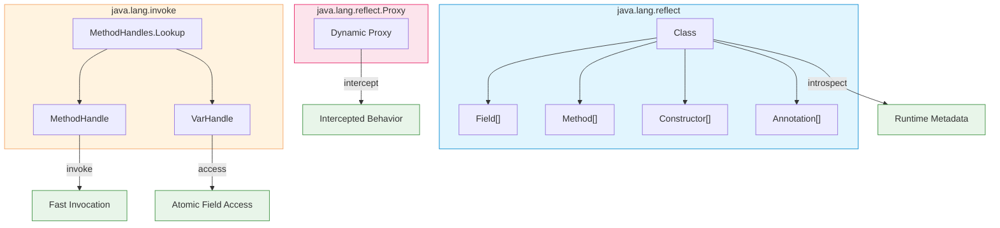
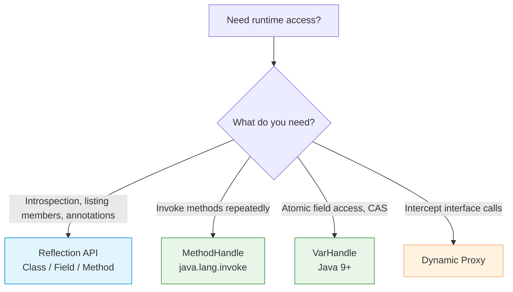

# Reflection API

Introduced in **Java 1.1 (1997)**. The Reflection API enables runtime
introspection and manipulation of classes, fields, methods, and constructors.
It is the foundation of frameworks (Spring, Hibernate, Jackson), dependency
injection, serialization, and dynamic proxies.



---

## Obtaining a `Class` object

```java
// 1. From an instance
String s = "hello";
Class<?> clazz1 = s.getClass();

// 2. From a class literal (compile-time checked, no initialization)
Class<String> clazz2 = String.class;

// 3. By name (triggers class loading and initialization)
Class<?> clazz3 = Class.forName("java.util.ArrayList");

// 4. From a class loader
Class<?> clazz4 = Thread.currentThread()
    .getContextClassLoader()
    .loadClass("java.util.HashMap");
```

| Approach | Checked at | Triggers init | Typical use |
|---|---|---|---|
| `obj.getClass()` | Runtime | No | Runtime type inspection |
| `TypeName.class` | Compile time | No | Type-safe references |
| `Class.forName(name)` | Runtime | Yes | Dynamic class loading |
| `ClassLoader.loadClass` | Runtime | No | Lazy loading |

---

## Introspecting members

```java
Class<Person> clazz = Person.class;

// Fields
Field[] allFields = clazz.getDeclaredFields();   // all fields (including private)
Field[] publicFields = clazz.getFields();        // public fields only
Field nameField = clazz.getDeclaredField("name"); // by name

// Methods
Method[] allMethods = clazz.getDeclaredMethods();
Method[] publicMethods = clazz.getMethods();     // includes inherited
Method greet = clazz.getMethod("greet", String.class); // by name + params

// Constructors
Constructor<Person>[] ctors = clazz.getDeclaredConstructors();
Constructor<Person> ctor = clazz.getConstructor(String.class, int.class);
```

### Class metadata

```java
clazz.getName();              // fully qualified name
clazz.getSimpleName();        // "Person"
clazz.getPackage();           // Package object
clazz.getSuperclass();        // direct superclass
clazz.getInterfaces();        // implemented interfaces
clazz.isInterface();          // is it an interface?
clazz.isEnum();               // is it an enum?
clazz.isRecord();             // is it a record? (Java 16+)
clazz.isAnnotation();         // is it an annotation?
clazz.isPrimitive();          // is it a primitive type?
clazz.isArray();              // is it an array type?
clazz.getModifiers();         // public, final, abstract, etc.
```

---

## Accessing and modifying fields

```java
class Person {
    private String name;
    public int age;
}

Person person = new Person();
Class<Person> clazz = Person.class;

// Access public field
Field ageField = clazz.getField("age");
ageField.set(person, 30);
int age = (int) ageField.get(person);

// Access private field (requires setAccessible)
Field nameField = clazz.getDeclaredField("name");
nameField.setAccessible(true);              // bypass access control
nameField.set(person, "Alice");
String name = (String) nameField.get(person);
```

### Static fields

```java
Field counterField = MyClass.class.getDeclaredField("counter");
counterField.setAccessible(true);
counterField.set(null, 42);        // null instance for static fields
int value = (int) counterField.get(null);
```

### Field type information

```java
Field field = clazz.getDeclaredField("items");
Class<?> type = field.getType();              // declared type (erased)
Type genericType = field.getGenericType();    // includes generic info

// If field is List<String>:
// type = List.class
// genericType = ParameterizedType(List, [String.class])
```

---

## Invoking methods

```java
class Calculator {
    public int add(int a, int b) { return a + b; }
    private int secret() { return 42; }
}

Calculator calc = new Calculator();
Class<Calculator> clazz = Calculator.class;

// Invoke public method
Method add = clazz.getMethod("add", int.class, int.class);
Object result = add.invoke(calc, 5, 3);   // 8

// Invoke private method
Method secret = clazz.getDeclaredMethod("secret");
secret.setAccessible(true);
int value = (int) secret.invoke(calc);    // 42

// Invoke static method
Method staticMethod = clazz.getMethod("compute", String.class);
Object result2 = staticMethod.invoke(null, "input");  // null instance
```

> `Method.invoke()` is **slower** than direct calls because:
> - It performs access checks on each call
> - It boxes primitive arguments and return values
> - It cannot be inlined by the JIT compiler
>
> For hot paths, use `MethodHandle` (see below) or generate bytecode.

---

## Creating instances

```java
Class<Person> clazz = Person.class;

// 1. Using Class.newInstance() — deprecated since Java 9
Person p1 = clazz.newInstance();  // requires no-arg constructor

// 2. Using Constructor — preferred
Constructor<Person> ctor = clazz.getConstructor(String.class, int.class);
Person p2 = ctor.newInstance("Alice", 30);

// 3. Using MethodHandle — fastest repeated invocation
MethodHandles.Lookup lookup = MethodHandles.privateLookupIn(
    clazz, MethodHandles.lookup()
);
MethodHandle mh = lookup.findConstructor(
    clazz, MethodType.methodType(void.class, String.class, int.class)
);
Person p3 = (Person) mh.invoke("Bob", 25);
```

---

## Annotations

```java
@Retention(RetentionPolicy.RUNTIME)
@interface Service {
    String value() default "";
}

@Service("user-service")
class UserService {}

// Read annotations at runtime
Class<UserService> clazz = UserService.class;

// Class-level annotation
if (clazz.isAnnotationPresent(Service.class)) {
    Service ann = clazz.getAnnotation(Service.class);
    System.out.println(ann.value());  // "user-service"
}

// All annotations
Annotation[] annotations = clazz.getAnnotations();

// Method-level annotation
Method method = clazz.getMethod("findById", long.class);
Transactional tx = method.getAnnotation(Transactional.class);
```

### Repeatable annotations

```java
@Repeatable(Roles.class)
@interface Role { String value(); }

@interface Roles { Role[] value(); }

@Role("ADMIN")
@Role("USER")
class Account {}

// Access repeated annotations
Role[] roles = Account.class.getAnnotationsByType(Role.class);
```

---

## Dynamic proxies

A **dynamic proxy** creates an object that implements one or more interfaces
at runtime, forwarding all method calls to an `InvocationHandler`.

```java
interface Greeting {
    String sayHello(String name);
}

// Invocation handler
class TimingHandler implements InvocationHandler {
    private final Object target;

    TimingHandler(Object target) { this.target = target; }

    @Override
    public Object invoke(Object proxy, Method method, Object[] args) throws Throwable {
        long start = System.nanoTime();
        Object result = method.invoke(target, args);
        long duration = System.nanoTime() - start;
        System.out.println(method.getName() + " took " + duration + " ns");
        return result;
    }
}

// Create proxy
Greeting real = new GreetingImpl();
Greeting proxy = (Greeting) Proxy.newProxyInstance(
    Greeting.class.getClassLoader(),
    new Class<?>[]{Greeting.class},
    new TimingHandler(real)
);

proxy.sayHello("World");  // calls TimingHandler.invoke, then delegates
```

> Dynamic proxies are used by Spring AOP, Hibernate lazy loading, and RPC
> frameworks (gRPC, RMI). They can only proxy **interfaces**, not classes.
> For class proxies, use bytecode generation libraries (ByteBuddy, CGLIB,
> ASM).

---

## Generics and type tokens

Due to type erasure, generic type parameters are not available at runtime
through `Class` objects. Use `Type` and its subinterfaces to recover them.

```java
// Custom abstract class that captures generic type
abstract class TypeToken<T> {
    @SuppressWarnings("unchecked")
    public Class<T> getType() {
        ParameterizedType superType = (ParameterizedType)
            getClass().getGenericSuperclass();
        return (Class<T>) superType.getActualTypeArguments()[0];
    }
}

// Usage: capture String from the anonymous subclass
Class<String> type = new TypeToken<String>() {}.getType();
// Works because the anonymous class bytecode retains the type argument
```

### Inspecting generic types

```java
// Field: List<String> items;
Field itemsField = clazz.getDeclaredField("items");
Type genericType = itemsField.getGenericType();

if (genericType instanceof ParameterizedType pt) {
    System.out.println(pt.getRawType());           // interface java.util.List
    for (Type arg : pt.getActualTypeArguments()) {
        System.out.println(arg);                   // class java.lang.String
    }
}

// Method: Map<String, Integer> process(List<String> input)
Method method = clazz.getMethod("process", List.class);
Type returnType = method.getGenericReturnType();
Type[] paramTypes = method.getGenericParameterTypes();
```

### Generic array creation workaround

```java
// Cannot do: new T[10] or new List<String>[10]
// Workaround using Array.newInstance
@SuppressWarnings("unchecked")
public static <T> T[] createArray(Class<T> clazz, int size) {
    return (T[]) Array.newInstance(clazz, size);
}

String[] arr = createArray(String.class, 10);
```

---

## Method Handles (Java 7)

The `java.lang.invoke` API provides a **faster, more flexible** alternative to
reflection for method invocation.

```java
MethodHandles.Lookup lookup = MethodHandles.lookup();

// Find a method
MethodHandle mh = lookup.findVirtual(
    String.class,
    "length",
    MethodType.methodType(int.class)   // return type, then parameter types
);

// Invoke
int len = (int) mh.invoke("hello");  // 5

// Find a static method
MethodHandle parseInt = lookup.findStatic(
    Integer.class,
    "parseInt",
    MethodType.methodType(int.class, String.class)
);
int n = (int) parseInt.invoke("42");  // 42

// Find a field getter
MethodHandle getter = lookup.findGetter(Person.class, "name", String.class);
String name = (String) getter.invoke(person);
```

### MethodHandle advantages

| Aspect | Reflection (`Method.invoke`) | `MethodHandle` |
|---|---|---|
| Access checks | Every invocation | Once at lookup time |
| Primitive handling | Boxing required | Direct (MethodType preserves types) |
| JIT optimization | Cannot inline | Can be inlined after warmup |
| Security | `setAccessible` bypasses | Controlled by Lookup capabilities |
| Performance | Slower | Faster after warmup |
| Currying / composition | Not supported | `bindTo`, `asType`, `foldArguments` |

### Lookup security levels

```java
MethodHandles.Lookup publicLookup = MethodHandles.publicLookup();
// Can only access public members

MethodHandles.Lookup lookup = MethodHandles.lookup();
// Can access public + private members of caller's module

MethodHandles.Lookup privateLookup = MethodHandles.privateLookupIn(
    TargetClass.class, lookup
);
// Can access private members of TargetClass's module
```

---

## VarHandle (Java 9)

`VarHandle` provides **atomic and ordered** access to fields and array elements
with performance comparable to `sun.misc.Unsafe` but with a safe, supported API.

```java
class Counter {
    volatile int value;
}

VarHandle vh = MethodHandles.lookup()
    .findVarHandle(Counter.class, "value", int.class);

Counter c = new Counter();

// Plain read/write (no ordering guarantees)
vh.set(c, 10);
int v = (int) vh.get(c);

// Volatile read/write (full memory barrier)
vh.setVolatile(c, 20);
int v2 = (int) vh.getVolatile(c);

// Atomic operations
vh.getAndAdd(c, 5);       // fetch-and-add
vh.compareAndSet(c, 20, 30);  // CAS
vh.getAndSet(c, 100);     // swap
```

### VarHandle vs AtomicFieldUpdater

```java
// VarHandle (modern, preferred)
VarHandle vh = MethodHandles.lookup()
    .findVarHandle(Counter.class, "value", int.class);
vh.compareAndSet(counter, expected, newValue);

// AtomicIntegerFieldUpdater (legacy)
AtomicIntegerFieldUpdater<Counter> updater =
    AtomicIntegerFieldUpdater.newUpdater(Counter.class, "value");
updater.compareAndSet(counter, expected, newValue);
```

| Feature | `Atomic*FieldUpdater` | `VarHandle` |
|---|---|---|
| Since | Java 5 | Java 9 |
| Access modes | Limited | Plain, opaque, acquire/release, volatile |
| Array element access | Separate updater | Single VarHandle with array form |
| ByteBuffer access | Not supported | `MemoryLayout` / FFM API |
| Performance | Good | Better (closer to Unsafe) |

---

## Reflection vs Method Handles vs VarHandle



| Use case | Best tool | Why |
|---|---|---|
| Framework scanning classes | Reflection | Rich introspection API |
| Reading annotations | Reflection | `getAnnotation()` is the only way |
| Dynamic method invocation | MethodHandle | Better JIT optimization |
| Atomic field operations | VarHandle | Fastest, most flexible |
| AOP / interception | Dynamic Proxy | Clean separation of concerns |
| Lambda metafactory | MethodHandle | How lambdas are implemented |

---

## Modules and reflection (JPMS)

In modular Java (Java 9+), reflection across module boundaries is restricted.

```java
// module-info.java of the framework module
module my.framework {
    requires my.application;

    // Opens a package for deep reflection (but not compile-time access)
    opens my.application.entities to my.framework;

    // Or open the entire module
    open module my.application { }
}
```

### setAccessible behavior

```java
Field privateField = clazz.getDeclaredField("secret");

// Java 8 and earlier: always works
// Java 9+ with modules:
//   - Same module or open package: works
//   - Closed package from another module: throws InaccessibleObjectException
privateField.setAccessible(true);
```

> `--add-opens module/package=target-module` JVM flag can open packages
> at runtime without modifying `module-info.java`. Many frameworks
> (Spring, Hibernate) require this flag when running on the module path.

---

## Common pitfalls

### Performance

```java
// BAD: re-lookup on every call
for (int i = 0; i < 1_000_000; i++) {
    Method m = clazz.getMethod("process");   // expensive!
    m.invoke(obj);
}

// GOOD: cache the Method/MethodHandle
Method m = clazz.getMethod("process");
for (int i = 0; i < 1_000_000; i++) {
    m.invoke(obj);
}

// BETTER: use MethodHandle for hot paths
MethodHandle mh = lookup.findVirtual(clazz, "process", MethodType.methodType(void.class));
for (int i = 0; i < 1_000_000; i++) {
    mh.invoke(obj);
}
```

### Security

- `setAccessible(true)` bypasses Java access control. Disabled by default
  under a SecurityManager (deprecated since Java 17).
- Strong encapsulation in JPMS prevents illegal reflective access.
- The `--illegal-access=permit` flag (Java 9–16) was removed in Java 17.

### Type safety

```java
// Unchecked casts are common with reflection
Method m = clazz.getMethod("getValue");
Object result = m.invoke(obj);
// Must cast manually — no compile-time type checking
String value = (String) result;  // ClassCastException at runtime if wrong

// MethodHandle preserves types via MethodType
MethodHandle mh = lookup.findVirtual(clazz, "getValue", MethodType.methodType(String.class));
String value = (String) mh.invoke(obj);  // type known at lookup time
```

### Records and sealed classes

```java
// Records expose canonical constructor and component accessors
Class<Point> clazz = Point.class;
clazz.isRecord();                          // true
RecordComponent[] components = clazz.getRecordComponents();
// [RecordComponent(name=x, type=int), RecordComponent(name=y, type=int)]

// Sealed classes: get permitted subclasses
Class<Shape> shapeClass = Shape.class;
Class<?>[] permitted = shapeClass.getPermittedSubclasses();
```

---

## Summary

| Feature | Class / API | Key Methods | Since |
|---|---|---|---|
| Class metadata | `Class<T>` | `getName`, `getMethods`, `getFields`, `getConstructors` | 1.1 |
| Field access | `Field` | `get`, `set`, `getType`, `getGenericType` | 1.1 |
| Method invocation | `Method` | `invoke`, `getReturnType`, `getParameterTypes` | 1.1 |
| Instance creation | `Constructor<T>` | `newInstance` | 1.1 |
| Annotations | `AnnotatedElement` | `getAnnotation`, `isAnnotationPresent` | 5 |
| Dynamic proxies | `Proxy` | `newProxyInstance` | 1.3 |
| Array creation | `Array` | `newInstance` | 1.1 |
| Method handles | `MethodHandle` | `invoke`, `bindTo` | 7 |
| Lookup | `MethodHandles.Lookup` | `findVirtual`, `findStatic`, `findConstructor` | 7 |
| VarHandle | `VarHandle` | `get`, `set`, `compareAndSet`, `getAndAdd` | 9 |
| Record introspection | `RecordComponent` | `getName`, `getType` | 16 |
| Sealed introspection | `Class<T>` | `getPermittedSubclasses` | 17 |
