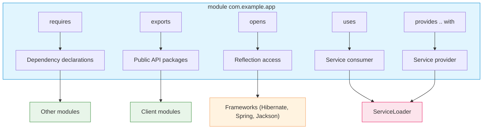
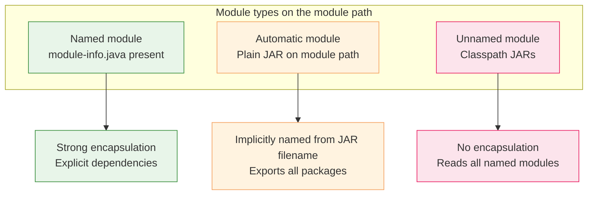
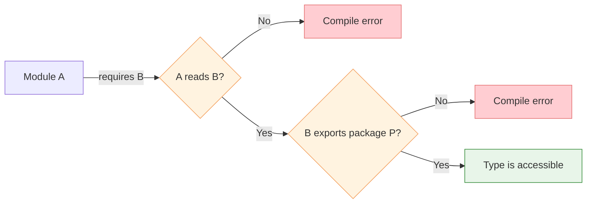

# Module System (JPMS)

Introduced in **Java 9 (2017)** as **Project Jigsaw**. The Java Platform Module
System (JPMS) adds a module layer on top of packages, providing strong
encapsulation, explicit dependencies, and a reliable configuration for both
application code and the JDK itself.

## Motivation: the problems JPMS solves

### Classpath hell

Before Java 9, the classpath was a flat list of JARs with no versioning or
isolation:

```
-classpath lib/a-1.0.jar:lib/b-2.0.jar:lib/c-1.0.jar
```

Problems:
- **No duplicate detection** — two versions of the same library silently shadow
each other (first wins)
- **Missing dependency discovery at startup** — `NoClassDefFoundError` at
runtime, not compile time
- **Everything is public** — any public class in any JAR is visible to all
other code on the classpath

### Weak encapsulation

Java packages are not a true encapsulation boundary. `public` classes in
internal packages (`com.library.internal`) are accessible to any code.
Frameworks rely on brittle internal APIs that break on upgrades.

### Monolithic JDK

The JDK was a single monolithic artifact. Even a "Hello World" program dragged
in Swing, CORBA, and XML libraries. JPMS modularized the JDK into ~95 modules
(`java.base`, `java.sql`, `java.desktop`, etc.), enabling:
- **Smaller runtime images** via `jlink`
- **Deprecation and removal** of obsolete APIs without breaking everything

---

## Declaring a module

A module is a named, self-describing collection of packages and resources. The
declaration lives in `module-info.java` at the root of the module's source tree.

```java
module com.example.app {
    requires java.base;        // implicitly required, can be omitted
    requires java.sql;
    requires com.example.lib;

    exports com.example.app.api;           // visible to other modules
    exports com.example.app.spi to com.example.plugin;  // qualified export

    opens com.example.app.entity;          // open for deep reflection
    opens com.example.app.entity to org.hibernate.orm.core;  // qualified open

    uses com.example.app.spi.LoggerFactory;
    provides com.example.app.spi.LoggerFactory
        with com.example.app.impl.ConsoleLoggerFactory;
}
```

### Module descriptor structure



---

## Directives

### `requires` — module dependencies

```java
module com.example.app {
    requires java.sql;                    // depends on java.sql module
    requires transitive com.example.lib;  // re-exported dependency
}
```

| Directive | Meaning |
|---|---|
| `requires M` | This module depends on module `M` |
| `requires transitive M` | Dependents of this module also read `M` automatically |
| `requires static M` | Optional dependency (needed at compile time, optional at runtime) |

`requires transitive` is used for API modules: if `com.example.lib` exposes
types from `java.sql` in its public API, clients should not need to add
`requires java.sql` themselves.

### `exports` — exposing packages

```java
module com.example.lib {
    exports com.example.lib.api;           // all modules can access
    exports com.example.lib.api to com.example.app;  // only specific module
}
```

Only `public` types in exported packages are accessible to other modules.
Non-exported packages are strongly encapsulated — inaccessible even via
reflection unless `opens` is used.

### `opens` — reflection access

```java
module com.example.app {
    opens com.example.app.model;           // open to all for deep reflection
    opens com.example.app.model to org.hibernate.orm.core;  // qualified
}
```

| Access type | Compile-time access | Reflection access |
|---|---|---|
| `exports P` | Yes (public types) | Yes (public types) |
| `opens P` | No | Yes (all types, including private) |
| `exports P` + `opens P` | Yes | Yes (all types) |
| Neither | No | No |

`opens` is required by frameworks that use reflection to access private fields
(Hibernate, Jackson, Spring). The `open module` modifier opens all packages:

```java
open module com.example.app {
    // all packages are open for reflection
    requires org.hibernate.orm.core;
}
```

### `uses` / `provides` — services

```java
module com.example.logger {
    exports com.example.logger;
}

module com.example.logger.console {
    requires com.example.logger;
    provides com.example.logger.Logger
        with com.example.logger.console.ConsoleLogger;
}

module com.example.app {
    requires com.example.logger;
    uses com.example.logger.Logger;  // will discover providers at runtime
}
```

```java
// Runtime discovery
ServiceLoader<Logger> loaders = ServiceLoader.load(Logger.class);
for (Logger logger : loaders) {
    logger.log("message");
}
```

> `provides .. with` decouples service consumers from service implementations.
> The consumer module only `uses` the interface; implementations are discovered
> via `ServiceLoader` at runtime. No compile-time dependency on providers.

---

## Types of modules



| Type | How created | Exports | Reads |
|---|---|---|---|
| **Named** | `module-info.java` on module path | Explicit `exports` | Explicit `requires` |
| **Automatic** | Plain JAR placed on module path | All packages | All named modules + `java.base` |
| **Unnamed** | JARs on classpath | All packages | All named modules |

### Named module

A JAR with `module-info.class` on the module path. Has strong encapsulation
and explicit dependencies.

### Automatic module

A plain JAR (without `module-info.java`) placed on the module path. The module
name is derived from `Automatic-Module-Name` in the manifest, or from the JAR
filename. It exports all packages and reads all other modules.

Useful for **migrating libraries**: place library JARs on the module path as
automatic modules while the application uses named modules.

### Unnamed module

All JARs on the classpath are combined into a single unnamed module. It exports
all packages and reads all named modules. This is the **backward compatibility
mode**.

---

## Readability and accessibility

Two distinct concepts:

| Concept | Definition | Controlled by |
|---|---|---|
| **Readability** | Module `A` reads module `B` | `requires` directive |
| **Accessibility** | Code in `A` can access types in `B` | `exports` directive + readability |



### The unnamed module reads everyone

Code in unnamed modules (classpath) can read all named modules. Named modules
cannot read the unnamed module unless they explicitly depend on it (which is
impossible by name). This is the **split-packages problem**: if a named module
and the unnamed module both contain the same package, the named module wins.

---

## ServiceLoader

The standard JDK mechanism for service discovery, enhanced by JPMS.

```java
// Service interface (in API module)
public interface PaymentProcessor {
    void process(BigDecimal amount);
}

// Provider module: com.example.payment.stripe
module com.example.payment.stripe {
    requires com.example.payment.api;
    provides com.example.payment.api.PaymentProcessor
        with com.example.payment.stripe.StripeProcessor;
}

// Consumer module
module com.example.app {
    requires com.example.payment.api;
    uses com.example.payment.api.PaymentProcessor;
}
```

```java
// Runtime discovery
ServiceLoader<PaymentProcessor> loader = ServiceLoader.load(
    PaymentProcessor.class,
    PaymentProcessor.class.getClassLoader()
);

for (PaymentProcessor processor : loader) {
    processor.process(amount);
}

// Or get the first available
Optional<PaymentProcessor> first = loader.findFirst();
```

> `ServiceLoader` reads `META-INF/services/` in non-modular JARs or
> `provides` declarations in `module-info.java`. In modular code, the latter
> is preferred.

---

## Migration strategies

### Bottom-up migration

1. Start with leaf libraries (no dependencies on your other code)
2. Add `module-info.java` to each
3. Work upward through the dependency graph

```
Leaf library A          Leaf library B
      ↓                       ↓
      └───→  Middle library C  ←──┘
                   ↓
            Application D
```

### Top-down migration

1. Convert the application module first (add `module-info.java`)
2. Place dependency JARs on the module path as automatic modules
3. Gradually convert dependencies to named modules

### Classpath → Module path

```java
// Before (classpath)
java -cp "lib/*" com.example.app.Main

// After (hybrid: named app + automatic dependencies)
java -p "lib:app.jar" -m com.example.app/com.example.app.Main
```

| Flag | Meaning |
|---|---|
| `-p` / `--module-path` | Where to find modules |
| `-m` / `--module` | Main module and class |
| `--add-modules` | Add modules not required by any other |
| `--add-opens` | Open a package for reflection at runtime |
| `--add-exports` | Export a package at runtime |
| `--illegal-access` | Deprecated in Java 17, removed; was `permit`/`warn`/`deny` |

### Common runtime flags

```bash
# Open package to framework for reflection
java --add-opens java.base/java.lang=ALL-UNNAMED \
     --add-opens com.example.app/com.example.app.model=org.hibernate.orm.core \
     -p lib:app.jar \
     -m com.example.app/com.example.app.Main

# Add a module not explicitly required (e.g., for ServiceLoader)
java --add-modules jdk.incubator.vector \
     -p lib:app.jar \
     -m com.example.app/com.example.app.Main
```

---

## jlink: custom runtime images

```bash
# Create a minimal runtime with only required modules
jlink --module-path $JAVA_HOME/jmods:lib \
      --add-modules com.example.app \
      --launcher app=com.example.app/com.example.app.Main \
      --output my-runtime

# The resulting runtime is self-contained
my-runtime/bin/app        # run the application
my-runtime/bin/java       # standard java command
```

A minimal "Hello World" runtime shrinks from ~200 MB (full JDK) to ~40 MB.
Docker images benefit significantly from this.

---

## JDK modularization

The JDK itself is modularized. Key modules:

| Module | Contents |
|---|---|
| `java.base` | Core: `Object`, `String`, collections, concurrency, IO, net, math. **Required by all modules** |
| `java.sql` | JDBC, `DriverManager`, `DataSource` |
| `java.desktop` | AWT, Swing, Java2D |
| `java.xml` | DOM, SAX, StAX, XPath |
| `java.logging` | `java.util.logging` |
| `java.management` | JMX |
| `jdk.unsupported` | `sun.misc.Unsafe` (deprecated for removal) |
| `jdk.incubator.*` | Incubator modules (preview APIs) |

```java
// List all available modules
ModuleLayer.boot().modules().forEach(m -> System.out.println(m.getName()));
```

---

## Comparison with alternatives

| Feature | JPMS | OSGi | Maven/Gradle |
|---|---|---|---|
| Granularity | Module (JAR-level) | Bundle (JAR-level) | Artifact (JAR-level) |
| Encapsulation | Strong (at JVM level) | Strong (via classloader isolation) | None (build-time only) |
| Versioning | Single version per module | Multiple versions simultaneously | Dependency resolution |
| Services | `ServiceLoader` | OSGi services | N/A |
| Runtime enforcement | Yes | Yes | No |
| Tooling | Native JDK (`jlink`, `jar`) | Framework required | Build plugins |
| Ecosystem adoption | JDK + growing | Mature but niche | Universal |

> JPMS is **not a replacement** for build tools (Maven/Gradle) or OSGi. It
> addresses runtime encapsulation and configuration reliability. Build tools
> still manage artifact resolution, versioning, and transitive dependencies.

---

## Summary

| Directive | Purpose | Example |
|---|---|---|
| `requires M` | Declare dependency on module `M` | `requires java.sql;` |
| `requires transitive M` | Re-export dependency | `requires transitive com.example.lib;` |
| `requires static M` | Optional compile-time dependency | `requires static org.junit;` |
| `exports P` | Make package `P` public API | `exports com.example.api;` |
| `exports P to M` | Qualified export to module `M` | `exports com.example.internal to com.example.test;` |
| `opens P` | Allow reflection on package `P` | `opens com.example.model;` |
| `opens P to M` | Qualified open | `opens com.example.model to org.hibernate.orm.core;` |
| `uses S` | Consume service interface `S` | `uses com.example.Logger;` |
| `provides S with I` | Provide implementation `I` of service `S` | `provides com.example.Logger with com.example.ConsoleLogger;` |

| Module type | Source | Exports | Reads |
|---|---|---|---|
| **Named** | `module-info.java` on module path | Explicit | Explicit |
| **Automatic** | Plain JAR on module path | All | All |
| **Unnamed** | Classpath JARs | All | All named modules |
