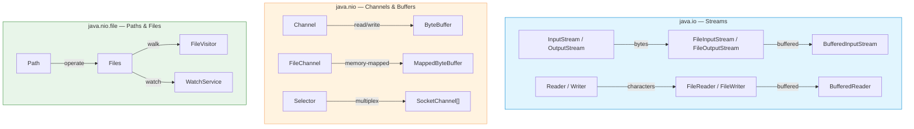
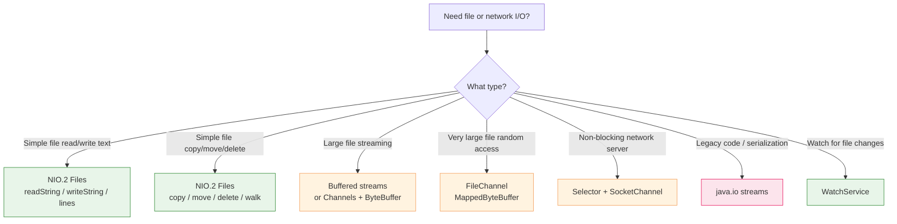

# I/O and NIO/NIO.2

Java's I/O APIs evolved through three major iterations:

| Generation | Package | Since | Key abstraction |
|---|---|---|---|
| **Classic I/O** | `java.io` | 1.0 | Stream-oriented byte/character I/O |
| **NIO** | `java.nio` | 1.4 | Channel and Buffer-based I/O, selectors |
| **NIO.2** | `java.nio.file` | 7 | Path-centric file operations, `Files` utility, `WatchService` |



---

## Classic I/O (`java.io`)

### Byte streams: `InputStream` / `OutputStream`

The foundation of Java I/O. All byte-oriented operations extend these abstract classes.

```java
// Copy file with byte streams (inefficient — no buffering)
try (InputStream in = new FileInputStream("source.bin");
     OutputStream out = new FileOutputStream("dest.bin")) {
    int b;
    while ((b = in.read()) != -1) {
        out.write(b);              // reads one byte at a time!
    }
}

// Copy with buffer (efficient)
try (InputStream in = new FileInputStream("source.bin");
     OutputStream out = new FileOutputStream("dest.bin")) {
    byte[] buffer = new byte[8192];
    int len;
    while ((len = in.read(buffer)) != -1) {
        out.write(buffer, 0, len);
    }
}
```

### Character streams: `Reader` / `Writer`

Handle text with proper character encoding. Always use these for text files.

```java
// Read text file with explicit encoding
try (BufferedReader reader = new BufferedReader(
        new InputStreamReader(
            new FileInputStream("data.txt"), StandardCharsets.UTF_8))) {
    String line;
    while ((line = reader.readLine()) != null) {
        System.out.println(line);
    }
}

// Simplified with FileReader (uses platform default encoding — avoid!)
// Prefer Files.newBufferedReader (NIO.2) instead
```

### Buffered streams

Decorator pattern: wrap an underlying stream with a buffer to reduce system calls.

```java
// Buffered byte stream
try (BufferedInputStream in = new BufferedInputStream(
        new FileInputStream("large.bin"))) {
    byte[] data = in.readAllBytes();   // efficient bulk read
}

// Buffered character stream — the standard way to read text
try (BufferedReader reader = new BufferedReader(new FileReader("data.txt"))) {
    reader.lines().forEach(System.out::println);   // Java 8+ stream API
}

// Buffered writer
try (BufferedWriter writer = new BufferedWriter(new FileWriter("out.txt"))) {
    writer.write("Hello");
    writer.newLine();                  // platform-independent newline
}
```

| Stream | Use when | Avoid when |
|---|---|---|
| `FileInputStream` / `FileOutputStream` | Raw byte I/O | Text processing |
| `FileReader` / `FileWriter` | Quick text I/O | You need explicit encoding control |
| `BufferedInputStream` / `BufferedOutputStream` | Large byte transfers | Tiny files |
| `BufferedReader` / `BufferedWriter` | Line-by-line text | Binary data |
| `DataInputStream` / `DataOutputStream` | Primitive types (`int`, `double`) | Complex objects |
| `ObjectInputStream` / `ObjectOutputStream` | Java serialization | Cross-language communication |

### `DataInputStream` / `DataOutputStream`

```java
// Write primitives
try (DataOutputStream out = new DataOutputStream(
        new BufferedOutputStream(new FileOutputStream("data.bin")))) {
    out.writeInt(42);
    out.writeDouble(3.14);
    out.writeUTF("hello");             // UTF-8 encoded string
}

// Read primitives back
try (DataInputStream in = new DataInputStream(
        new BufferedInputStream(new FileInputStream("data.bin")))) {
    int n = in.readInt();
    double d = in.readDouble();
    String s = in.readUTF();
}
```

### Serialization: `ObjectInputStream` / `ObjectOutputStream`

```java
public record Person(String name, int age) implements Serializable {}

// Serialize
Person person = new Person("Alice", 30);
try (ObjectOutputStream out = new ObjectOutputStream(
        new FileOutputStream("person.ser"))) {
    out.writeObject(person);
}

// Deserialize
try (ObjectInputStream in = new ObjectInputStream(
        new FileInputStream("person.ser"))) {
    Person restored = (Person) in.readObject();
}
```

> **Caution with serialization**: Java serialization is a persistent source of
> security vulnerabilities. Prefer JSON, Protocol Buffers, or FlatBuffers for
> cross-system communication. Use `transient` to exclude fields from
> serialization.

### `PrintWriter` — convenient text output

```java
try (PrintWriter writer = new PrintWriter("log.txt")) {
    writer.println("Line 1");
    writer.printf("Value: %d, Name: %s%n", 42, "test");
}
```

### `try-with-resources` (Java 7+)

```java
// Auto-closeable resources are closed in reverse order of opening
try (BufferedReader reader = new BufferedReader(new FileReader("in.txt"));
     BufferedWriter writer = new BufferedWriter(new FileWriter("out.txt"))) {
    String line;
    while ((line = reader.readLine()) != null) {
        writer.write(line.toUpperCase());
        writer.newLine();
    }
}
```

---

## NIO (`java.nio`) — Channels and Buffers

NIO introduced **channel-based** I/O and **memory-mapped files**. It is the
foundation for high-performance network servers and large file processing.

### Channels

A `Channel` is a connection to an entity capable of performing I/O operations.
Unlike streams, channels are bidirectional and can work in non-blocking mode.

```java
// FileChannel — read from file via ByteBuffer
try (FileChannel channel = FileChannel.open(Path.of("data.bin"),
        StandardOpenOption.READ)) {
    ByteBuffer buffer = ByteBuffer.allocate(1024);
    while (channel.read(buffer) > 0) {
        buffer.flip();                 // switch from write to read mode
        // process buffer contents
        while (buffer.hasRemaining()) {
            byte b = buffer.get();
        }
        buffer.clear();                // prepare for next read
    }
}
```

### ByteBuffer modes

```mermaid
flowchart LR
    subgraph Buffer["ByteBuffer state machine"]
        direction LR
        ALLOC["allocate()<br/>position=0<br/>limit=capacity"] -->|"put() / read from channel"| WRITE["Writing mode"]
        WRITE -->|flip()| READ["Reading mode<br/>limit=position<br/>position=0"]
        READ -->|get() / write to channel"| CONSUME["Consuming"]
        CONSUME -->|clear()| ALLOC
        CONSUME -->|compact()| WRITE
    end

    style Buffer fill:#e1f5fe,stroke:#0288d1
    style ALLOC fill:#e8f5e9,stroke:#388e3c
    style WRITE fill:#fff3e0,stroke:#f4a261
    style READ fill:#e8f5e9,stroke:#388e3c
    style CONSUME fill:#fff3e0,stroke:#f4a261
```

| Method | Action |
|---|---|
| `allocate(int)` | Create heap-backed buffer |
| `allocateDirect(int)` | Create off-heap (native) buffer — faster for I/O |
| `put(byte)` / `put(byte[])` | Write data into buffer |
| `flip()` | Switch to read mode: `limit = position`, `position = 0` |
| `get()` / `get(byte[])` | Read data from buffer |
| `hasRemaining()` | `position < limit` |
| `clear()` | Reset for writing: `position = 0`, `limit = capacity` |
| `compact()` | Move unread data to start, prepare for writing |
| `rewind()` | `position = 0`, keep limit — reread data |
| `mark()` / `reset()` | Save/restore position |

### Memory-mapped files

```java
// Map a large file into memory for fast random access
try (FileChannel channel = FileChannel.open(Path.of("huge.bin"),
        StandardOpenOption.READ, StandardOpenOption.WRITE)) {
    MappedByteBuffer mapped = channel.map(
        FileChannel.MapMode.READ_WRITE,  // or READ_ONLY
        0,                                 // start position
        channel.size()                     // size to map
    );

    // Access as if it were a byte array
    mapped.putInt(0, 42);
    mapped.putLong(4, 123456789L);
    int value = mapped.getInt(0);

    mapped.force();  // flush changes to disk
}
```

> Memory-mapped files delegate paging to the OS virtual memory manager.
> Ideal for very large files (> hundreds of MB) that exceed heap size.
> The JVM does not allocate heap memory for the mapped region.

### `Selector` — multiplexed non-blocking I/O

A single thread can manage multiple `Channel`s using a `Selector`.

```java
Selector selector = Selector.open();

ServerSocketChannel serverChannel = ServerSocketChannel.open();
serverChannel.bind(new InetSocketAddress(8080));
serverChannel.configureBlocking(false);
serverChannel.register(selector, SelectionKey.OP_ACCEPT);

while (true) {
    selector.select();  // blocks until at least one channel is ready

    Set<SelectionKey> keys = selector.selectedKeys();
    Iterator<SelectionKey> it = keys.iterator();

    while (it.hasNext()) {
        SelectionKey key = it.next();
        it.remove();

        if (key.isAcceptable()) {
            SocketChannel client = serverChannel.accept();
            client.configureBlocking(false);
            client.register(selector, SelectionKey.OP_READ);
        }
        if (key.isReadable()) {
            SocketChannel client = (SocketChannel) key.channel();
            ByteBuffer buffer = ByteBuffer.allocate(1024);
            client.read(buffer);
            // process buffer
        }
    }
}
```

> `Selector` is the foundation of high-performance network servers (Netty uses
> it under the hood). One thread handles thousands of connections.

### Channel types

| Channel | Direction | Blocking mode | Typical use |
|---|---|---|---|
| `FileChannel` | Bidirectional | Blocking | File read/write, memory mapping |
| `SocketChannel` | Bidirectional | Configurable | TCP client connections |
| `ServerSocketChannel` | Accept only | Configurable | TCP server accept loop |
| `DatagramChannel` | Bidirectional | Configurable | UDP communication |
| `Pipe.SourceChannel` / `SinkChannel` | Unidirectional | Blocking | Inter-thread communication |

---

## NIO.2 (`java.nio.file`) — Modern file operations

Introduced in **Java 7**. A complete redesign of file and filesystem operations.

### `Path` — replacing `File`

```java
// Creating paths
Path absolute = Path.of("/home/user/documents/file.txt");
Path relative = Path.of("src", "main", "java", "App.java");
Path fromUri = Path.of(URI.create("file:///home/user/file.txt"));

// Path operations
Path path = Path.of("/home/user/docs/report.txt");
path.getFileName();           // "report.txt"
path.getParent();             // "/home/user/docs"
path.getRoot();               // "/"
path.resolve("backup.txt");   // "/home/user/docs/backup.txt"
path.relativize(Path.of("/home/user/pics"));  // "../pics"
path.normalize();             // resolve "." and ".."
path.toAbsolutePath();        // resolve against current directory
```

### `Files` utility class

The `Files` class provides static methods for common file operations.

```java
// Read entire file
String content = Files.readString(Path.of("data.txt"));           // Java 11+
List<String> lines = Files.readAllLines(Path.of("data.txt"));
byte[] bytes = Files.readAllBytes(Path.of("data.bin"));

// Write entire file
Files.writeString(Path.of("out.txt"), "Hello, World!");           // Java 11+
Files.write(Path.of("out.txt"), lines, StandardOpenOption.CREATE,
            StandardOpenOption.TRUNCATE_EXISTING);

// Stream API for large files
try (Stream<String> stream = Files.lines(Path.of("huge.txt"))) {
    long count = stream.filter(line -> line.contains("ERROR")).count();
}

// Copy, move, delete
Files.copy(source, target, StandardCopyOption.REPLACE_EXISTING);
Files.move(source, target, StandardCopyOption.ATOMIC_MOVE);
Files.delete(path);                    // throws if not exists
Files.deleteIfExists(path);            // no-op if missing

// Create files and directories
Files.createFile(path);                // fails if exists
Files.createDirectory(path);           // single directory
Files.createDirectories(path);         // create parents if needed
Path tempFile = Files.createTempFile("prefix", ".tmp");
Path tempDir = Files.createTempDirectory("work");

// Metadata
boolean exists = Files.exists(path);
boolean isRegular = Files.isRegularFile(path);
boolean isDir = Files.isDirectory(path);
boolean readable = Files.isReadable(path);
boolean writable = Files.isWritable(path);
long size = Files.size(path);
FileTime modified = Files.getLastModifiedTime(path);

// Symbolic links
Path link = Path.of("link.txt");
Files.createSymbolicLink(link, Path.of("target.txt"));
Path target = Files.readSymbolicLink(link);
```

### Walking the file tree

```java
// Simple depth-first walk
Files.walk(Path.of("/home/user/docs"))
    .filter(Files::isRegularFile)
    .filter(p -> p.toString().endsWith(".txt"))
    .forEach(System.out::println);

// Walk with max depth
Files.walk(Path.of("/home/user"), 2)   // 2 levels deep
    .forEach(System.out::println);

// Find files matching a pattern
Path start = Path.of("/home/user");
try (Stream<Path> stream = Files.find(start, 10,
        (path, attrs) -> attrs.isRegularFile() && path.toString().endsWith(".java"))) {
    stream.forEach(System.out::println);
}
```

### `FileVisitor` — custom tree traversal

```java
Files.walkFileTree(Path.of("/home/user/docs"), new SimpleFileVisitor<Path>() {
    @Override
    public FileVisitResult preVisitDirectory(Path dir, BasicFileAttributes attrs) {
        System.out.println("Entering: " + dir);
        return FileVisitResult.CONTINUE;
    }

    @Override
    public FileVisitResult visitFile(Path file, BasicFileAttributes attrs) {
        System.out.println("File: " + file + " (" + attrs.size() + " bytes)");
        return FileVisitResult.CONTINUE;
    }

    @Override
    public FileVisitResult visitFileFailed(Path file, IOException exc) {
        System.err.println("Failed: " + file);
        return FileVisitResult.CONTINUE;   // or SKIP_SUBTREE, TERMINATE
    }

    @Override
    public FileVisitResult postVisitDirectory(Path dir, IOException exc) {
        System.out.println("Leaving: " + dir);
        return FileVisitResult.CONTINUE;
    }
});
```

### `WatchService` — monitoring file changes

```java
WatchService watchService = FileSystems.getDefault().newWatchService();

Path dir = Path.of("/home/user/watch");
dir.register(watchService,
    StandardWatchEventKinds.ENTRY_CREATE,
    StandardWatchEventKinds.ENTRY_MODIFY,
    StandardWatchEventKinds.ENTRY_DELETE
);

while (true) {
    WatchKey key = watchService.take();  // blocks until event
    for (WatchEvent<?> event : key.pollEvents()) {
        Path changed = (Path) event.context();
        System.out.println(event.kind() + ": " + changed);
    }
    key.reset();  // re-register for more events
}
```

### File attributes

```java
// Basic attributes (cross-platform)
BasicFileAttributes attrs = Files.readAttributes(path, BasicFileAttributes.class);
attrs.creationTime();
attrs.lastAccessTime();
attrs.lastModifiedTime();
attrs.size();
attrs.isRegularFile();
attrs.isDirectory();
attrs.isSymbolicLink();

// POSIX attributes (Unix/Linux/macOS)
PosixFileAttributes posix = Files.readAttributes(path, PosixFileAttributes.class);
posix.owner();
posix.group();
posix.permissions();  // Set<PosixFilePermission>

// Set POSIX permissions
Set<PosixFilePermission> perms = PosixFilePermissions.fromString("rw-r--r--");
Files.setPosixFilePermissions(path, perms);

// DOS attributes (Windows)
DosFileAttributes dos = Files.readAttributes(path, DosFileAttributes.class);
dos.isHidden();
dos.isReadOnly();
dos.isSystem();
dos.isArchive();
```

---

## Choosing the right API



### Decision table

| Task | Recommended API | Why |
|---|---|---|
| Read a text file into a `String` | `Files.readString()` (Java 11+) | One-liner, proper encoding |
| Read lines lazily | `Files.lines()` | Stream API, memory-efficient |
| Copy a file | `Files.copy()` | Platform-optimized, handles metadata |
| Walk a directory tree | `Files.walk()` or `FileVisitor` | Control depth, filtering |
| Monitor file changes | `WatchService` | OS-native event notification |
| Read a huge file sequentially | `BufferedInputStream` or `FileChannel` | Low memory footprint |
| Random access in a huge file | `FileChannel` + `MappedByteBuffer` | OS paging, no heap usage |
| Non-blocking TCP server | `Selector` + `SocketChannel` | Single thread, thousands of connections |
| Serialize Java objects | `ObjectInputStream` / `ObjectOutputStream` | Built-in, but consider JSON/Protobuf |
| Read/write primitives | `DataInputStream` / `DataOutputStream` | Portable binary format |

### `File` vs `Path`

| Aspect | `java.io.File` | `java.nio.file.Path` |
|---|---|---|
| Since | Java 1.0 | Java 7 |
| Mutability | Mutable | Immutable |
| Symbolic links | Limited | Full support |
| Metadata | Basic (`length`, `lastModified`) | Rich (`BasicFileAttributes`, `PosixFileAttributes`) |
| Error handling | `boolean` return | Throws `IOException` with detail |
| Path operations | Limited | `resolve`, `relativize`, `normalize`, `getParent` |
| Modern API | No | Integrates with `Files`, `FileVisitor`, `WatchService` |

> Prefer `Path` over `File` in all new code. `File.toPath()` and `Path.toFile()`
> allow interoperability during migration.

---

## Summary

| Class / Interface | Package | Since | Purpose |
|---|---|---|---|
| `InputStream` / `OutputStream` | `java.io` | 1.0 | Byte-oriented I/O base classes |
| `Reader` / `Writer` | `java.io` | 1.0 | Character-oriented I/O base classes |
| `BufferedReader` / `BufferedWriter` | `java.io` | 1.0 | Buffered text I/O |
| `FileInputStream` / `FileOutputStream` | `java.io` | 1.0 | File byte I/O |
| `DataInputStream` / `DataOutputStream` | `java.io` | 1.0 | Primitive type serialization |
| `ObjectInputStream` / `ObjectOutputStream` | `java.io` | 1.0 | Java object serialization |
| `PrintWriter` | `java.io` | 1.0 | Convenient formatted text output |
| `Channel` | `java.nio.channels` | 1.4 | Bidirectional I/O connection |
| `FileChannel` | `java.nio.channels` | 1.4 | File read/write, memory mapping |
| `ByteBuffer` | `java.nio` | 1.4 | NIO data container |
| `MappedByteBuffer` | `java.nio` | 1.4 | Memory-mapped file access |
| `Selector` | `java.nio.channels` | 1.4 | Multiplexed non-blocking I/O |
| `SocketChannel` / `ServerSocketChannel` | `java.nio.channels` | 1.4 | Non-blocking TCP |
| `Path` | `java.nio.file` | 7 | Immutable filesystem path |
| `Paths` | `java.nio.file` | 7 | Path factory methods (mostly replaced by `Path.of`) |
| `Files` | `java.nio.file` | 7 | Static file operation utilities |
| `FileVisitor` | `java.nio.file` | 7 | Custom directory tree traversal |
| `WatchService` | `java.nio.file` | 7 | File change monitoring |
| `FileSystem` | `java.nio.file` | 7 | Abstract filesystem (ZIP, memory, etc.) |
