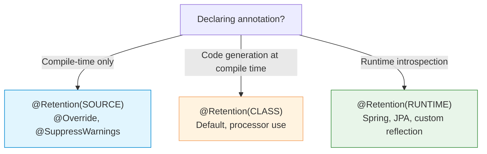

# Annotations and Metadata

Annotations provide metadata about program elements without directly affecting
program semantics. They are used by the compiler, runtime reflection, and
annotation processors to enforce constraints, generate code, or configure frameworks.

---

## Declaring Annotations

Annotations are declared with `@interface`:

```java
import java.lang.annotation.*;

@Retention(RetentionPolicy.RUNTIME)
@Target({ElementType.METHOD, ElementType.TYPE})
public @interface Validated {
    String value() default "";
    int maxRetries() default 3;
    Class<? extends Exception>[] retryOn() default {};
}
```

### Meta-annotations

| Meta-annotation | Purpose |
|---|---|
| `@Retention` | How long the annotation is kept (SOURCE, CLASS, RUNTIME) |
| `@Target` | Where the annotation can be applied |
| `@Documented` | Include in Javadoc |
| `@Inherited` | Subclasses inherit this annotation |
| `@Repeatable` | Allow multiple instances on the same element (Java 8+) |

### Retention policies

```java
@Retention(RetentionPolicy.SOURCE)   // Discarded by compiler (e.g., @Override)
@Retention(RetentionPolicy.CLASS)    // In class file, not available at runtime (default)
@Retention(RetentionPolicy.RUNTIME)  // Available via reflection at runtime
```

### Target element types

```java
@Target(ElementType.TYPE)            // Class, interface, enum, annotation
@Target(ElementType.FIELD)           // Field (including enum constants)
@Target(ElementType.METHOD)          // Method
@Target(ElementType.PARAMETER)       // Method/constructor parameter
@Target(ElementType.CONSTRUCTOR)     // Constructor
@Target(ElementType.LOCAL_VARIABLE)  // Local variable
@Target(ElementType.ANNOTATION_TYPE) // Annotation type (meta-annotation)
@Target(ElementType.PACKAGE)         // Package declaration
@Target(ElementType.TYPE_PARAMETER)  // Generic type parameter (Java 8+)
@Target(ElementType.TYPE_USE)        // Any type use (Java 8+)
@Target(ElementType.MODULE)          // Module declaration (Java 9+)
@Target(ElementType.RECORD_COMPONENT)// Record component (Java 16+)
```

---

## Built-in Annotations

### Java language annotations

```java
@Override              // Compiler checks method overrides a superclass method
@Deprecated           // Marks element as deprecated (since, forRemoval)
@SuppressWarnings     // Suppress compiler warnings ("unchecked", "rawtypes", etc.)
@SafeVarargs          // Suppress varargs warnings for final/static methods
@FunctionalInterface  // Ensures interface has exactly one abstract method
```

```java
// @Deprecated with details
@Deprecated(since = "11", forRemoval = true)
public void oldMethod() { }

// @SuppressWarnings examples
@SuppressWarnings("unchecked")
List<String> list = (List<String>) rawList;

@SuppressWarnings({"unchecked", "rawtypes"})
public void handleRawTypes() { }
```

---

## Using Custom Annotations

```java
@Validated(value = "user-service", maxRetries = 5)
public class UserService {

    @Validated(retryOn = {IOException.class, TimeoutException.class})
    public User findUser(String id) { ... }
}
```

### Default value shorthand

When the annotation has a single element named `value`, it can be used without the name:

```java
public @interface ServiceName {
    String value();   // no default, must be specified
}

@ServiceName("billing")   // shorthand — equivalent to @ServiceName(value = "billing")
public class BillingService { }
```

---

## Repeatable Annotations (Java 8+)

```java
// Define the container
@Retention(RetentionPolicy.RUNTIME)
@Target(ElementType.METHOD)
public @interface ScheduleContainer {
    Schedule[] value();
}

// Define the repeatable annotation
@Repeatable(ScheduleContainer.class)
@Retention(RetentionPolicy.RUNTIME)
@Target(ElementType.METHOD)
public @interface Schedule {
    String cron();
    String zone() default "UTC";
}

// Usage: multiple annotations on same element
@Schedule(cron = "0 0 * * * *", zone = "UTC")
@Schedule(cron = "0 0 12 * * *", zone = "America/New_York")
public void runReports() { ... }
```

---

## Reading Annotations via Reflection

```java
// Check if annotation is present
if (clazz.isAnnotationPresent(Validated.class)) { ... }

// Get annotation instance
Validated ann = clazz.getAnnotation(Validated.class);
String value = ann.value();
int retries = ann.maxRetries();

// Get all annotations
Annotation[] all = clazz.getAnnotations();        // includes inherited
Annotation[] declared = clazz.getDeclaredAnnotations(); // only directly declared

// Method annotations
Method method = UserService.class.getMethod("findUser", String.class);
Validated methodAnn = method.getAnnotation(Validated.class);

// Parameter annotations
for (Parameter param : method.getParameters()) {
    for (Annotation a : param.getAnnotations()) {
        System.out.println(param.getName() + ": " + a);
    }
}

// Reading repeatable annotations
Schedule[] schedules = method.getAnnotationsByType(Schedule.class);
for (Schedule s : schedules) {
    System.out.println(s.cron() + " in " + s.zone());
}
```

---

## Type Annotations (Java 8+)

Java 8 extended annotations to any type use, not just declarations:

```java
// Type use annotations
@NotNull String name;                           // field
List<@NotNull String> emails;                   // generic type argument
String @NotNull [] array;                       // array element type
@NotNull String getName();                      // return type
void process(@NotNull String input);            // parameter type

// Generic bounds
class Cache<@NonNull T extends @NonNull Object> { }

// Type casts
String s = (@NotNull String) obj;

// instanceof
if (obj instanceof @NotNull String) { ... }

// Create with type annotation
String s = new @NotNull String("hello");
```

> Type annotations are retained in class files but require an annotation processor
> or checker framework (like Checker Framework) to enforce at compile time.
> The JVM itself does not enforce type annotations.

---

## Annotation Processors

Annotation processors run at **compile time** to inspect annotations and generate
code, configuration files, or validation errors.

```java
// Processor implementation
@SupportedAnnotationTypes("com.example.Service")
@SupportedSourceVersion(SourceVersion.RELEASE_21)
public class ServiceProcessor extends AbstractProcessor {

    @Override
    public boolean process(Set<? extends TypeElement> annotations,
                           RoundEnvironment roundEnv) {
        for (Element element : roundEnv.getElementsAnnotatedWith(Service.class)) {
            // Generate code, validate, or emit errors
            processingEnv.getMessager().printMessage(
                Diagnostic.Kind.NOTE,
                "Found @Service on " + element.getSimpleName()
            );
        }
        return true;
    }
}
```

### Common use cases

| Framework | Annotation Processor Purpose |
|---|---|
| **Lombok** | Generate getters, setters, constructors at compile time |
| **MapStruct** | Generate type-safe bean mapping code |
| **Dagger / Hilt** | Generate dependency injection code |
| **Room (Android)** | Generate SQL queries and database access code |
| **AutoValue** | Generate immutable value classes |
| **jOOQ** | Generate type-safe SQL from database schema |

> Annotation processors integrate with the compiler via the `-processor` flag
> or automatically through `META-INF/services/javax.annotation.processing.Processor`.

---

## Common Framework Annotations

```java
// Spring / Jakarta EE
@Component, @Service, @Repository, @Controller  // Bean registration
@Autowired, @Inject                              // Dependency injection
@RequestMapping, @GetMapping                     // HTTP routing
@Transactional                                   // Transaction boundaries

// JPA
@Entity, @Table, @Column                         // ORM mapping
@Id, @GeneratedValue                             // Primary keys
@OneToMany, @ManyToOne, @ManyToMany              // Relationships

// JUnit 5
@Test, @BeforeEach, @AfterEach                   // Test lifecycle
@ParameterizedTest, @ValueSource                 // Parameterized tests

// Jackson
@JsonProperty, @JsonIgnore                       // JSON serialization
@JsonFormat                                      // Date/number formatting
```

---

## Retention Policy Decision Guide



| Retention | Use when | Examples |
|---|---|---|
| `SOURCE` | Compiler hint, no runtime need | `@Override`, `@SuppressWarnings` |
| `CLASS` | Annotation processors, bytecode tools | Framework processors |
| `RUNTIME` | Reflection-driven frameworks | `@Entity`, `@Component`, `@Validated` |

---

## Best Practices

| Practice | Recommendation |
|---|---|
| Retention | Use the weakest retention that satisfies your need |
| Target | Always specify `@Target` to document intended usage |
| Defaults | Provide sensible defaults for annotation elements |
| Naming | Use descriptive names; prefer `value()` for the primary element |
| Validation | Use annotation processors or reflection to validate at compile/runtime |
| Documentation | Mark custom annotations with `@Documented` if they are API-relevant |
