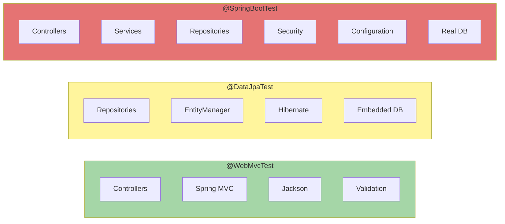

# Spring Boot Testing

|              |                                                                |
|--------------|----------------------------------------------------------------|
| **Type**     | Spring Boot test framework (test slices + full context)        |
| **Layers**   | `@SpringBootTest`, `@WebMvcTest`, `@DataJpaTest`, `@JsonTest`  |
| **Built on** | JUnit 5, Mockito, Spring TestContext                           |
| **Docs**     | https://docs.spring.io/spring-boot/reference/testing/          |

---

## Contents

- [Overview](#overview)
- [The Three Core Annotations](#the-three-core-annotations)
  - [`@SpringBootTest`](#springboottest)
  - [`@WebMvcTest`](#webmvctest)
  - [`@DataJpaTest`](#datajpatest)
- [Comparison Table](#comparison-table)
- [Mocking: `@Mock` vs `@MockBean`](#mocking-mock-vs-mockbean)
- [MockMvc — In-Process Controller Testing](#mockmvc--in-process-controller-testing)
- [Testcontainers — Real Databases in Tests](#testcontainers--real-databases-in-tests)
- [Performance: Context Caching](#performance-context-caching)
- [Decision Guide](#decision-guide)
- [Common Pitfalls](#common-pitfalls)
- [Related Topics](#related-topics)

---

## Overview

Spring Boot tests differ from plain JUnit tests in one critical way:
they may load part or all of a Spring `ApplicationContext`. The cost of
loading a context — bean instantiation, autoconfiguration, embedded
servers, datasources — dominates test time, often by orders of magnitude.

Spring Boot answers this with **test slices**: focused subsets of
autoconfiguration that load only what a particular layer needs. The three
most important annotations form a spectrum from heaviest to lightest:

- `@SpringBootTest` loads the full context.
- `@DataJpaTest` loads only the persistence slice.
- `@WebMvcTest` loads only the web slice.

Choosing the right annotation per test is the single largest lever for
suite speed. The general principle behind it — more fast tests at lower
levels, fewer slow ones at higher levels — is described in the
language-agnostic [Testing Pyramid](../../topics/testing/index.md#the-testing-pyramid).

---

## The Three Core Annotations



Green = fast slice, yellow = medium slice with embedded DB, red = full
context with all autoconfiguration.

### `@SpringBootTest`

**What it loads:** the full Spring context — controllers, services,
repositories, security, configuration, datasources, embedded server (if
requested).

**When to use:** integration tests that exercise multiple layers
together, security flows, or smoke tests verifying that the application
starts at all.

```java
@SpringBootTest
class UserServiceTest {

    @Autowired
    private UserService userService;

    @Test
    void shouldReturnUser() {
        userService.findById(1L);
    }
}
```

**Trade-off:** the most realistic test, but the slowest. Loading
hundreds of beans for a check that only needs one is wasteful — reserve
this annotation for tests that genuinely need the whole application.

> **Common pitfall:** Using `@SpringBootTest` for what could have been a
> plain Mockito unit test. If a class under test has no Spring
> dependencies, it does not need a Spring context.

### `@WebMvcTest`

**What it loads:** the web slice only — controllers, Spring MVC
infrastructure, Jackson, Bean Validation, error handlers. Services and
repositories are **not** instantiated.

**When to use:** controller-focused tests that verify HTTP behavior
(status codes, request mapping, JSON serialization, validation) in
isolation from business logic.

```java
@WebMvcTest(UserController.class)
class UserControllerTest {

    @Autowired
    private MockMvc mockMvc;

    @MockBean
    private UserService userService;

    @Test
    void shouldReturnUser() throws Exception {
        mockMvc.perform(get("/users/1"))
               .andExpect(status().isOk());
    }
}
```

Because services are not loaded, every collaborator the controller depends
on must be supplied as a `@MockBean`.

> **Common pitfall:** Forgetting to register `@MockBean` for a
> dependency. The test fails at context startup with "no qualifying bean
> of type" — Spring is telling you that a slice is missing what would
> normally be wired by the full context.

### `@DataJpaTest`

**What it loads:** the persistence slice — JPA repositories,
`EntityManager`, Hibernate, and an embedded test database (H2 by
default). Controllers and services are **not** instantiated.

**When to use:** repository tests, custom `@Query` methods, JPQL or
native SQL verification, mapping behavior.

```java
@DataJpaTest
class UserRepositoryTest {

    @Autowired
    private UserRepository userRepository;

    @Test
    void shouldFindUserByUsername() {
        User user = new User();
        user.setUsername("john");
        userRepository.save(user);

        Optional<User> result = userRepository.findByUsername("john");

        assertThat(result).isPresent();
    }
}
```

Each test method runs inside a transaction that is rolled back at the
end, so tests do not pollute each other's state.

> **Common pitfall:** Trusting H2 to behave like the production
> database. H2 silently accepts SQL that real Postgres or Oracle reject,
> and lacks vendor-specific features. Pair `@DataJpaTest` with
> Testcontainers (see below) when SQL fidelity matters.

---

## Comparison Table

| Annotation        | Loads                       | Controllers | DB             | Speed       | Typical use                   |
|-------------------|-----------------------------|-------------|----------------|-------------|-------------------------------|
| `@SpringBootTest` | Full application            | Yes         | Real / config  | Slow        | Integration, smoke, security  |
| `@WebMvcTest`     | Web slice only              | Yes         | None           | Fast        | Controller behavior, JSON     |
| `@DataJpaTest`    | JPA slice + embedded DB     | No          | Embedded (H2)  | Fast        | Repositories, JPQL, mapping   |

---

## Mocking: `@Mock` vs `@MockBean`

Both produce a Mockito mock, but they differ in how the mock reaches the
class under test.

`@MockBean` registers the mock as a Spring bean in the
`ApplicationContext`, replacing any matching real bean during dependency
injection. It only works in tests that load a Spring context
(`@SpringBootTest`, `@WebMvcTest`, etc.) and contributes to the cache
key — different `@MockBean` sets produce different contexts.

`@Mock` creates a plain Mockito instance with no Spring awareness. It is
used in pure unit tests with `@ExtendWith(MockitoExtension.class)` and
injected via `@InjectMocks`.

| Characteristic     | `@Mock`                              | `@MockBean`                                  |
|--------------------|--------------------------------------|----------------------------------------------|
| **Library**        | Mockito                              | Spring Boot Test                             |
| **Spring context** | Not required                         | Required                                     |
| **Injection**      | `@InjectMocks`                       | `@Autowired` (bean lookup)                   |
| **Speed**          | Microseconds                         | Bound by context startup                     |
| **Cache impact**   | None                                 | Different mocks → different cached contexts  |

For the broader taxonomy of dummies, stubs, spies, mocks, and fakes that
informs which tool to reach for, see [Test Doubles](../../topics/testing/index.md#test-doubles).

---

## MockMvc — In-Process Controller Testing

`MockMvc` exercises Spring MVC controllers without starting a servlet
container. Requests are dispatched in-process directly into the Spring
`DispatcherServlet`, so tests skip the network entirely.

What it can verify:

- HTTP status (`isOk()`, `isBadRequest()`, `isCreated()`)
- Response body and structure (via `jsonPath`)
- Headers and content type
- Redirects and forwarded views

```java
mockMvc.perform(get("/api/users/1"))
       .andExpect(status().isOk())
       .andExpect(jsonPath("$.username").value("john_doe"));
```

For tests against the reactive WebFlux stack, use `WebTestClient` instead
— it follows the same fluent assertion model but is built on the reactive
runtime.

---

## Testcontainers — Real Databases in Tests

Embedded H2 has long been the default for `@DataJpaTest` and integration
tests, but H2 diverges from production databases in subtle ways:
identifier quoting, JSON support, vendor-specific functions, isolation
behavior. Tests pass on H2 and fail in production.

[Testcontainers](https://testcontainers.com/) replaces H2 with the real
database, run inside a Docker container that the test framework manages:

```java
@Testcontainers
@SpringBootTest
class UserServiceIntegrationTest {

    @Container
    static PostgreSQLContainer<?> postgres =
        new PostgreSQLContainer<>("postgres:16");

    @DynamicPropertySource
    static void configure(DynamicPropertyRegistry registry) {
        registry.add("spring.datasource.url", postgres::getJdbcUrl);
        registry.add("spring.datasource.username", postgres::getUsername);
        registry.add("spring.datasource.password", postgres::getPassword);
    }

    // Tests run against real Postgres
}
```

Testcontainers is the modern default for any test where SQL fidelity
matters. Mark the container `static` so it starts once per JVM and is
reused across tests in the suite.

---

## Performance: Context Caching

Spring's `TestContext` framework caches loaded application contexts and
reuses them across tests with matching configuration. A suite of fifty
`@SpringBootTest` classes that share the same configuration loads the
context **once**, not fifty times.

The cache key includes:

- The test class's contributing configuration classes and resources
- Active profiles
- The set of `@MockBean` and `@SpyBean` declarations
- `@TestPropertySource` values
- Web environment selection

Anything that diverges between two tests forces Spring to evict and
rebuild the context. The most common cache-breakers are:

- **`@DirtiesContext`** — explicitly tells Spring to throw the context
  away. Use only when truly needed (e.g., singleton state that test
  cleanup cannot reset).
- **Asymmetric `@MockBean` use** — one test mocks `PaymentGateway`,
  another does not; both produce different cache keys and therefore
  different contexts.
- **Profile or property differences** between tests.

The standard mitigation is a shared abstract base class:

```java
@SpringBootTest
@ActiveProfiles("test")
public abstract class BaseIntegrationTest {
    // Common Testcontainers, properties, mock beans
}
```

Subclasses inherit the configuration unchanged, so all of them hit the
same cached context. This single discipline often turns a 10-minute
suite into a 2-minute suite.

> **Key takeaway:** Slice tests (`@WebMvcTest`, `@DataJpaTest`) and
> careful context caching are why modern Spring suites can stay fast
> even with hundreds of integration tests.

---

## Decision Guide

| Testing…                                  | Use                                                              |
|-------------------------------------------|------------------------------------------------------------------|
| A REST controller in isolation            | `@WebMvcTest` + MockMvc                                          |
| A JPA repository or custom query          | `@DataJpaTest`                                                   |
| A service class with no Spring needs      | Plain JUnit + `@Mock`                                            |
| A service that needs a Spring bean        | `@SpringBootTest` + `@MockBean`                                  |
| Full HTTP flow against a real database    | `@SpringBootTest(webEnvironment = RANDOM_PORT)` + Testcontainers |
| Just JSON serialization                   | `@JsonTest`                                                      |

---

## Common Pitfalls

| Pitfall                                       | Why it hurts                                                                | Fix                                                          |
|-----------------------------------------------|-----------------------------------------------------------------------------|--------------------------------------------------------------|
| Using `@SpringBootTest` for everything        | Suite slows by 10–100×; contexts duplicate                                  | Use the narrowest slice that fits the test                   |
| Mixing `@Mock` and `@MockBean` arbitrarily    | One ignores Spring DI, the other depends on it — silent bugs in wiring     | Use `@Mock` only outside Spring; `@MockBean` only inside      |
| `@DirtiesContext` as a default                | Forces context reload on every test — multiplies suite time                 | Reserve for truly stateful singletons; prefer test reset code |
| H2 standing in for Postgres                   | SQL passes locally, fails in production                                     | Use Testcontainers with the real DB image                    |
| Different `@MockBean` sets per test           | Each variation creates a new cached context                                 | Centralize mocks in a base class or test configuration       |

---

## Related Topics

- [Testing](../../topics/testing/index.md) — TDD, Pyramid, Test Doubles, PBT, BDD, mutation, fuzzing
- [Testing Pyramid](../../topics/testing/index.md#the-testing-pyramid) — language-agnostic framing for why slice tests matter
- [Test Doubles](../../topics/testing/index.md#test-doubles) — taxonomy of dummies, stubs, spies, mocks, fakes
- [Maven](../../topics/process/build-systems/maven.md) and [Gradle](../../topics/process/build-systems/gradle.md) — wiring `spring-boot-starter-test` into a build
- [Java — Testing Ecosystem](index.md#testing-ecosystem) — the broader JVM testing toolchain
- [`examples/java/10-testing/`](../../../examples/java/10-testing/README.md) — runnable JUnit 5 + Mockito examples
