# Transaction Management in Spring: The Complete Guide

## Overview of All Methods

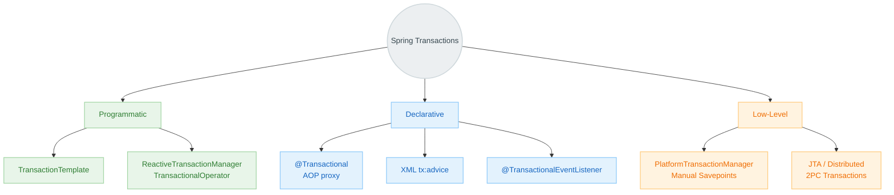

---

## 1. Spring Abstraction Hierarchy

All transaction management in Spring relies on a single marker interface: `TransactionManager`. The architecture is clearly separated into blocking (Platform) and reactive (Reactive) stacks.

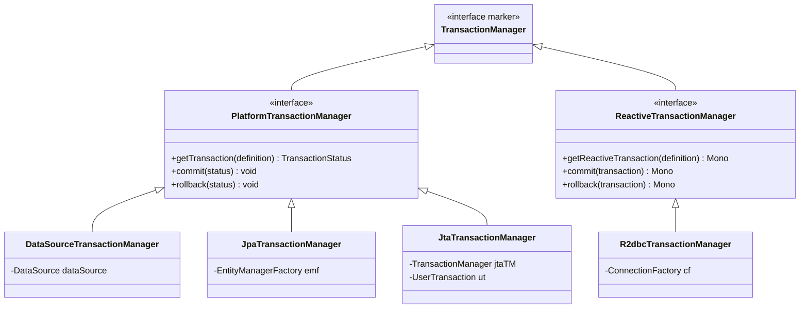

---

## 2. Method 1: `@Transactional` (Declarative AOP)

The most popular approach. Spring wraps the target bean in a proxy object, intercepts method calls, and handles connection and transaction management automatically.

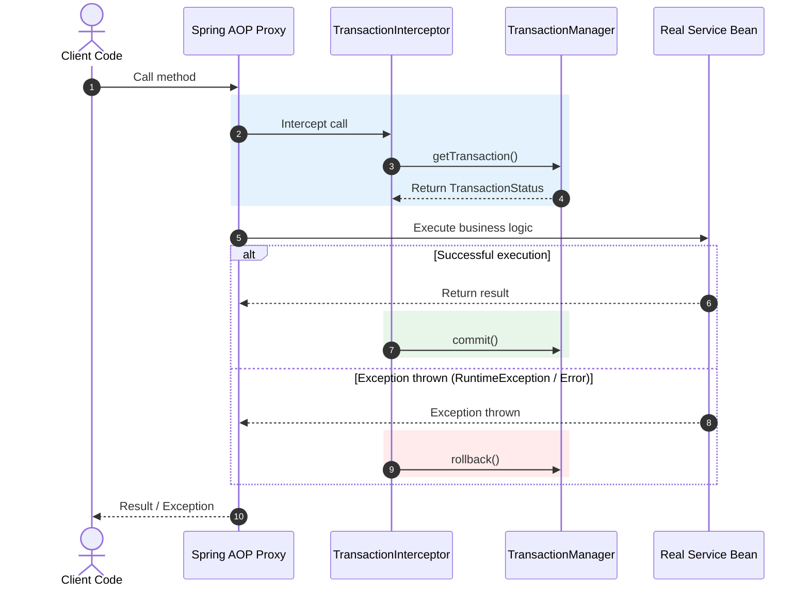

### Annotation Parameter Configuration

```java
@Service
public class OrderService {

    // Standard usage
    @Transactional
    public void createOrder(Order order) {
        orderRepo.save(order);
        inventoryService.reduce(order.getItems());
    }

    // Fine-tuning transaction parameters
    @Transactional(
        propagation    = Propagation.REQUIRED,       // Propagation behavior
        isolation      = Isolation.READ_COMMITTED,   // Isolation level
        timeout        = 30,                         // Timeout in seconds
        readOnly       = false,                      // true optimizes Hibernate session (disables dirty checking)
        rollbackFor    = {BusinessException.class},  // Roll back on checked exceptions
        noRollbackFor  = {NotFoundException.class}   // Ignore rollback for specified exceptions
    )
    public Order processOrder(Long id) {
        return orderRepo.findById(id).orElseThrow(NotFoundException::new);
    }
}
```

### Transaction Propagation Behavior (Propagation)

```mermaid
flowchart TD
    %% Group styles
    classDef groupStyle fill:#F5F5F5,stroke:#E0E0E0,stroke-width:1px;
    classDef nodeStyle fill:#FFF,stroke:#90A4AE,stroke-width:1.5px;
    classDef activeStyle fill:#E3F2FD,stroke:#1565C0,stroke-width:1.5px;
    classDef newStyle fill:#E8F5E9,stroke:#2E7D32,stroke-width:1.5px;
    classDef alertStyle fill:#FFEBEE,stroke:#C62828,stroke-width:1.5px;

    subgraph REQUIRED [REQUIRED - Default]
        R1[Transaction exists?] -->|Yes| R2(Join existing):::activeStyle
        R1 -->|No| R3(Create new):::newStyle
    end

    subgraph REQUIRES_NEW [REQUIRES_NEW]
        RN1[Transaction exists?] -->|Yes| RN2(Suspend existing &<br/>Create new):::newStyle
        RN1 -->|No| RN3(Create new):::newStyle
    end

    subgraph NESTED [NESTED]
        N1[Transaction exists?] -->|Yes| N2(Create Savepoint<br/>within existing):::activeStyle
        N1 -->|No| N3(Create new):::newStyle
    end

    subgraph MANDATORY [MANDATORY]
        M1[Transaction exists?] -->|Yes| M2(Use existing):::activeStyle
        M1 -->|No| M3(Throw Exception):::alertStyle
    end

    %% Apply general styles
    class REQUIRED,REQUIRES_NEW,NESTED,MANDATORY groupStyle;
    class R1,RN1,N1,M1 nodeStyle;
```

---

## 3. Method 2: `TransactionTemplate` (Programmatic)

A high-level design pattern. It helps avoid self-invocation issues and provides explicit control over transaction boundaries.

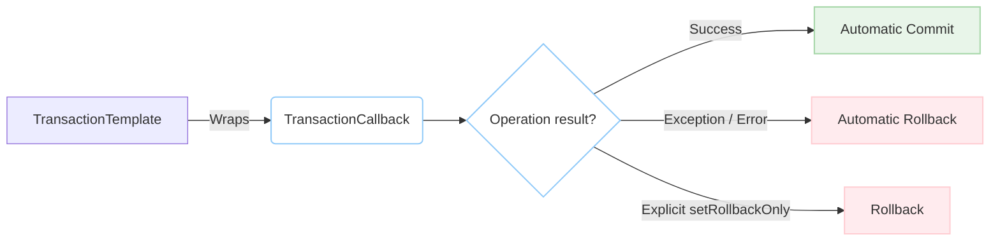

```java
@Service
@RequiredArgsConstructor
public class PaymentService {

    private final TransactionTemplate txTemplate;

    // With a return value
    public Payment processPayment(PaymentRequest request) {
        return txTemplate.execute(status -> {
            Payment payment = paymentRepo.save(new Payment(request));
            try {
                externalGateway.charge(payment);
            } catch (GatewayException e) {
                // Soft rollback without throwing a RuntimeException
                status.setRollbackOnly();
                return null;
            }
            return payment;
        });
    }

    // Without a return value (void)
    public void transfer(Long fromId, Long toId, BigDecimal amount) {
        txTemplate.executeWithoutResult(status -> {
            accountRepo.debit(fromId, amount);
            accountRepo.credit(toId, amount);
        });
    }
}
```

---

## 4. Method 3: `PlatformTransactionManager` (Low-Level)

Direct usage of the transaction manager. It offers maximum flexibility and complete control over the process, including manual `Savepoint` management.

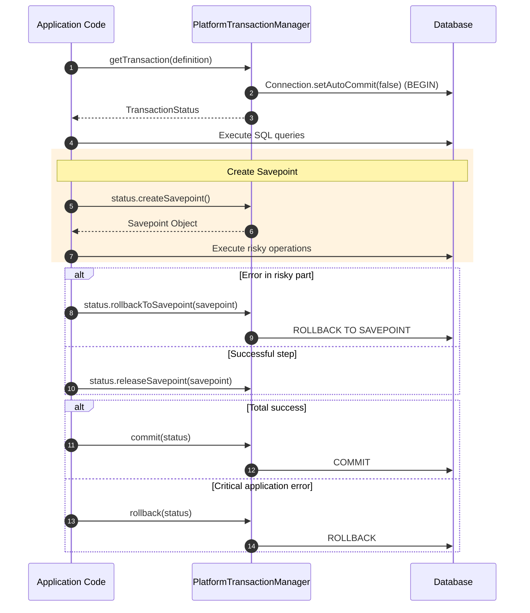

```java
@Service
@RequiredArgsConstructor
public class BulkOperationService {

    private final PlatformTransactionManager txManager;

    public void executeComplexImport() {
        DefaultTransactionDefinition def = new DefaultTransactionDefinition();
        def.setName("bulkImportTransaction");
        def.setPropagationBehavior(TransactionDefinition.PROPAGATION_REQUIRED);
        def.setIsolationLevel(TransactionDefinition.ISOLATION_READ_COMMITTED);

        TransactionStatus status = txManager.getTransaction(def);

        try {
            stepOneMainImport();

            // Manual Savepoint management within the transaction
            Object savepoint = status.createSavepoint();
            try {
                stepTwoOptionalImport();
            } catch (Exception e) {
                // Roll back only to the Savepoint
                status.rollbackToSavepoint(savepoint);
            } finally {
                status.releaseSavepoint(savepoint);
            }

            stepThreeFinalize();
            txManager.commit(status);
        } catch (Exception e) {
            txManager.rollback(status);
            throw e;
        }
    }
}
```

---

## 5. Method 4: XML Configuration (Legacy)

A popular method during the Spring 2.x/3.x era. It allows configuring transactional behavior declaratively without modifying the Java code (highly convenient for legacy systems or third-party libraries).

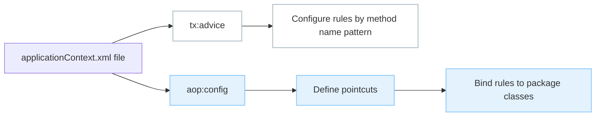

```xml
<tx:advice id="txAdvice" transaction-manager="txManager">
    <tx:attributes>
        <!-- Read-only optimization for all find/get methods -->
        <tx:method name="find*" read-only="true"/>
        <tx:method name="get*" read-only="true"/>
        <!-- Standard transactions for all other methods -->
        <tx:method name="*" propagation="REQUIRED" rollback-for="java.lang.Exception"/>
    </tx:attributes>
</tx:advice>

<aop:config>
    <aop:pointcut id="serviceMethods"
                  expression="execution(* com.example.service.*.*(..))"/>
    <aop:advisor advice-ref="txAdvice" pointcut-ref="serviceMethods"/>
</aop:config>
```

---

## 6. Method 5: Reactive Transactions

In non-blocking stacks (Spring WebFlux + R2DBC), you cannot use `ThreadLocal` variables to hold transaction context. Therefore, `ReactiveTransactionManager` and Reactor context are utilized instead.

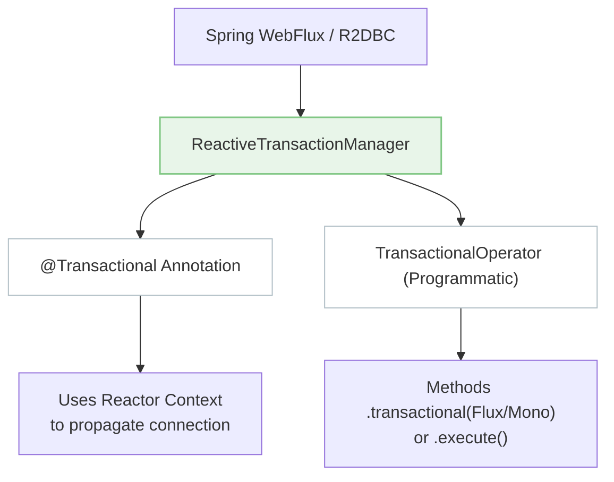

```java
@Service
@RequiredArgsConstructor
public class ReactiveOrderService {

    private final TransactionalOperator txOperator;
    private final ReactiveOrderRepository orderRepo;

    // Option A: Using @Transactional in a reactive stream
    @Transactional
    public Mono<Order> createOrder(Order order) {
        return orderRepo.save(order)
            .flatMap(savedOrder -> inventoryService.reduce(savedOrder.getItems())
                .thenReturn(savedOrder));
    }

    // Option B: Using TransactionalOperator for a reactive chain
    public Flux<Order> processBatch(List<Order> orders) {
        Flux<Order> savedOrders = Flux.fromIterable(orders)
            .flatMap(orderRepo::save);

        // Apply reactive transaction to the entire stream
        return txOperator.transactional(savedOrders);
    }
}
```

---

## 7. Method 6: JTA (Distributed 2PC Transactions)

Used to coordinate changes across multiple physical databases or JMS message brokers within a single two-phase commit (2PC) protocol.

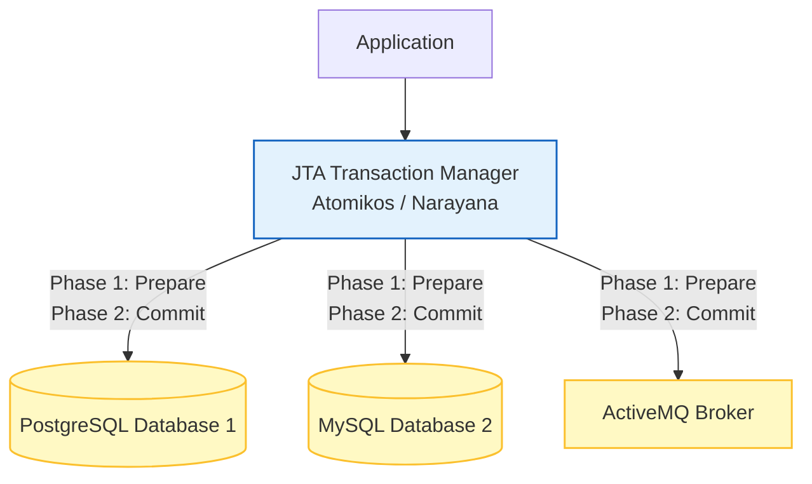

```java
@Configuration
public class DistributedJtaConfig {

    @Bean
    public UserTransactionManager atomikosTransactionManager() {
        UserTransactionManager manager = new UserTransactionManager();
        manager.setForceShutdown(false);
        return manager;
    }

    @Bean
    public JtaTransactionManager transactionManager() {
        return new JtaTransactionManager(
            atomikosTransactionManager(),
            atomikosTransactionManager()
        );
    }
}

@Service
public class DistributedService {

    // Spring uses the configured JtaTransactionManager under the hood
    @Transactional
    public void executeGlobalTx() {
        primaryDatabase.save(new UserEntity());    // Database #1
        archiveDatabase.save(new LogEntity());     // Database #2
        jmsTemplate.convertAndSend("queue", "ok"); // Message Queue (JMS)
    }
}
```

---

## 8. Method 7: `@TransactionalEventListener`

Allows building a loosely coupled architecture based on Domain Events. The listener responds to application events depending on the outcome phase of the transaction.

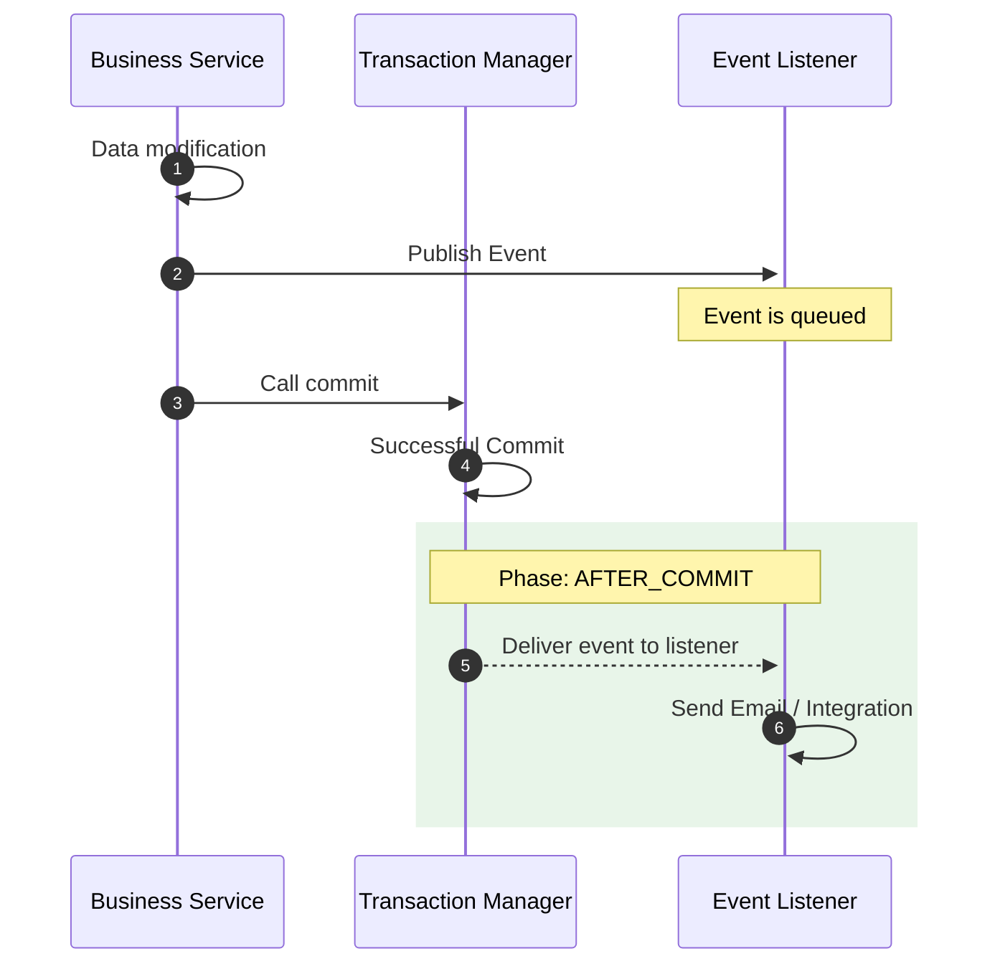

```java
@Service
@RequiredArgsConstructor
public class UserService {

    private final ApplicationEventPublisher publisher;
    private final UserRepository userRepo;

    @Transactional
    public void registerUser(User user) {
        userRepo.save(user);
        // Publish the event. The transaction is NOT committed yet!
        publisher.publishEvent(new UserRegisteredEvent(user));
    }
}

@Component
public class WelcomeEmailSender {

    // Listener fires only after the user record is physically saved in the DB
    @TransactionalEventListener(phase = TransactionPhase.AFTER_COMMIT)
    public void sendEmail(UserRegisteredEvent event) {
        emailService.sendWelcome(event.getUser());
    }

    // Listener fires if the transaction rolls back
    @TransactionalEventListener(phase = TransactionPhase.AFTER_ROLLBACK)
    public void cleanupFailedRegistration(UserRegisteredEvent event) {
        log.warn("User registration failed, cleaning up temporary caches");
    }
}
```

---

## Transaction Management Methods Comparison

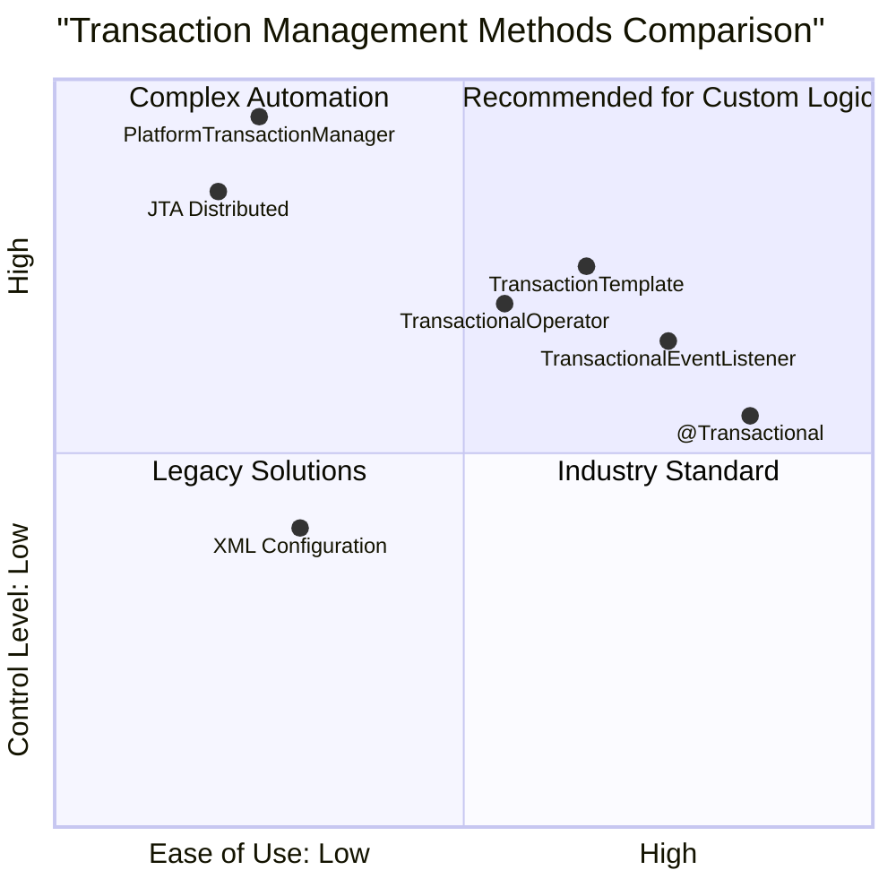

| Method | When to Use | Pros | Cons |
| :--- | :--- | :--- | :--- |
| **`@Transactional`** | In 90% of standard business cases. | Clean code, rapid development. | Implicit magic (AOP proxy), self-invocation issue. |
| **`TransactionTemplate`** | When precise transaction execution is needed on a specific code block. | Avoids proxy issues, clear transactional boundaries. | Slightly litters the code with boilerplate templates. |
| **`PlatformTransactionManager`** | Complex infrastructure operations (migrations, dynamic savepoints). | Complete control over transactions at any stage. | High amount of manual/boilerplate code. |
| **`TransactionalOperator`** | Reactive stack (WebFlux, R2DBC). | Non-blocking reactive transactions. | Higher learning curve (Reactor context). |
| **`JTA (2PC)`** | Coordinating multiple databases/brokers within a single business flow. | ACID guarantees across multiple distinct resources. | Heavyweight, slow commits, complex configuration. |
| **`@TransactionalEventListener`** | Event-Driven architectures. | Decoupled side-effects (emails, queues) from DB transaction. | Asynchronous errors can be hard to handle. |

---

## Common Pitfall: The Self-Invocation Issue

If a method calls another method annotated with `@Transactional` within the same class, **the transaction will not start**. The call bypasses the generated Spring AOP proxy class.

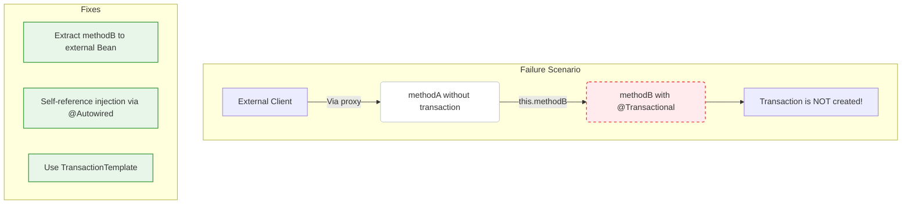

### Faulty Code Example and Solutions:

```java
// ❌ FAULTY: Transaction in methodB will NOT start
@Service
public class OrderService {

    public void createOrder(Order order) {
        // ... some logic
        this.saveOrder(order); // Direct call bypasses Spring Proxy!
    }

    @Transactional
    public void saveOrder(Order order) {
        orderRepo.save(order);
    }
}

// ==========================================

// ✅ SOLUTION: Proxy self-injection
@Service
public class CorrectOrderService {

    @Autowired
    private CorrectOrderService self; // Spring will inject the proxy version of the bean

    public void createOrder(Order order) {
        // ... some logic
        self.saveOrder(order); // The call goes through the proxy; the transaction will start!
    }

    @Transactional
    public void saveOrder(Order order) {
        orderRepo.save(order);
    }
}
```