# Java

|                              |                                                                                                                        |
|------------------------------|------------------------------------------------------------------------------------------------------------------------|
| **Year**                     | 1995                                                                                                                   |
| **Creator(s)**               | James Gosling (Sun Microsystems)                                                                                       |
| **Paradigm(s)**              | Object-oriented, imperative, (functional features since Java 8)                                                        |
| **Typing**                   | Static, nominal, strong                                                                                                |
| **Platform**                 | JVM (bytecode)                                                                                                         |
| **Key features**             | Garbage collection, interfaces, generics, lambdas, streams, records, sealed classes, pattern matching, virtual threads |
| **Current LTS (as of 2025)** | Java 25                                                                                                                |

---

## Contents

1. [Overview](#overview)
2. [Historical Context](#historical-context)
3. [Language Evolution](#language-evolution)
4. [Core Features](#core-features)
   - [Classes and Objects](#classes-and-objects)
   - [Interfaces](#interfaces)
   - [Exception Handling](#exception-handling)
5. [Key Features In Depth](#key-features-in-depth)
   - [01. Generics](#01-generics)
   - [02. Stream API](#02-stream-api)
   - [03. Lambdas and Functional Interfaces](#03-lambdas-and-functional-interfaces)
   - [04. Optional](#04-optional)
   - [05. Records](#05-records)
   - [06. Sealed Classes](#06-sealed-classes)
   - [07. Pattern Matching](#07-pattern-matching)
   - [08. Virtual Threads](#08-virtual-threads)
   - [09. Future and CompletableFuture](#09-future-and-completablefuture)
   - [10. Thread States](#10-thread-states)
   - [11. Foreign Function & Memory API](#11-foreign-function--memory-api)
   - [12. Scoped Values and Structured Concurrency](#12-scoped-values-and-structured-concurrency)
   - [13. Working with Dates and Times](#13-working-with-dates-and-times)
   - [14. Collections Framework](#14-collections-framework)
   - [15. Concurrency Utilities](#15-concurrency-utilities)
   - [16. Reflection API](#16-reflection-api)
   - [17. Module System (JPMS)](#17-module-system-jpms)
   - [18. Networking (HttpClient)](#18-networking-httpclient)
   - [19. I/O and NIO/NIO.2](#19-io-and-nionio2)
   - [20. String API and Text Processing](#20-string-api-and-text-processing)
   - [21. Regular Expressions](#21-regular-expressions)
   - [22. Annotations and Metadata](#22-annotations-and-metadata)
6. [Projects](#projects)
   - [Project Loom](#project-loom) (Virtual Threads, Structured Concurrency, Scoped Values)
   - [Project Panama](#project-panama) (FFM API, Vector API)
   - [Project Amber](#project-amber) (Records, Sealed Classes, Pattern Matching)
   - [Project Valhalla](#project-valhalla) (Value Types & Primitive Generics)
   - [Project Jigsaw](#project-jigsaw) (JPMS Modules)
   - [Project Leyden](#project-leyden) (Startup & AOT Optimizations)
   - [Project Detroit](#project-detroit) (Desktop Application Packaging)
   - [Project Lilliput](#project-lilliput) (Compact Object Headers)
7. [Other Language Features](#other-language-features)
8. [Runtime Memory Layout](#runtime-memory-layout)
9. [Java Memory Model (JMM)](#java-memory-model-jmm)
10. [Ecosystem and Tools](#ecosystem-and-tools)
11. [Influence](#influence)
12. [Strengths and Weaknesses](#strengths-and-weaknesses)
13. [Code Examples](#code-examples)
14. [Related Authors](#related-authors)
15. [Related Topics](#related-topics)
16. [Further Reading](#further-reading)

---

## Overview

Java is a class-based, object-oriented programming language designed
by James Gosling at Sun Microsystems, released in 1995. Its defining
promise was **"Write Once, Run Anywhere"** — Java source compiles to
bytecode that runs on any platform hosting the Java Virtual Machine (JVM).

Java's core design philosophy:

- **Safety and predictability** — no raw pointers, automatic garbage collection,
  strong type checking at compile time
- **Portability** — the JVM abstraction layer enables platform independence
- **Backward compatibility** — strong compatibility guarantees; much old Java
  code still compiles and runs with minimal changes
- **Explicit over implicit** — Java generally favors readability, explicit
  declarations, and tooling-friendly structure over terse syntax

---

## Historical Context

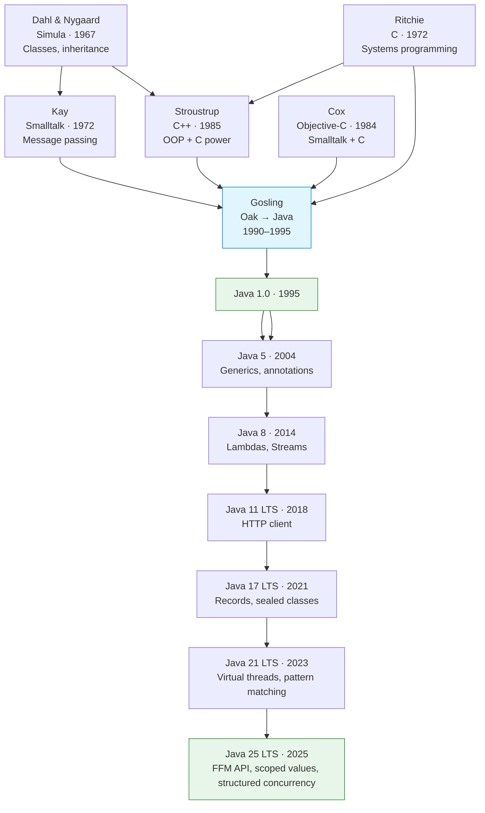

### Key Design Decisions vs C++

| Aspect               | C++                              | Java                                                   |
|----------------------|----------------------------------|--------------------------------------------------------|
| Memory management    | Manual (`new`/`delete`)          | Garbage collection                                     |
| Pointers             | Raw pointers, pointer arithmetic | References only                                        |
| Multiple inheritance | Classes + virtual tables         | Single class inheritance, multiple interfaces          |
| Portability          | Native binaries per platform     | JVM bytecode                                           |
| Error handling       | Return codes, SEH, exceptions    | Checked + unchecked exceptions                         |
| Templates / Generics | C++ templates (compile-time)     | Generics (type erasure, runtime)                       |
| Undefined behavior   | Common                           | Largely avoided by the language and JVM specifications |

---

## Language Evolution

| Version    | Year | Key additions                                                                                                                                                |
|------------|------|--------------------------------------------------------------------------------------------------------------------------------------------------------------|
| **1.0**    | 1995 | Initial release: classes, interfaces, threads, applets                                                                                                       |
| **5**      | 2004 | **Generics**, enhanced for-each, autoboxing, annotations, enums, varargs                                                                                     |
| **8 LTS**  | 2014 | **Lambdas**, **Stream API**, `Optional`, default methods, `java.time`                                                                                        |
| **11 LTS** | 2018 | `var` in lambda parameters, HTTP client, new `String` methods                                                                                                |
| **17 LTS** | 2021 | **Sealed classes**, Records, pattern matching for `switch` (preview)                                                                                         |
| **21 LTS** | 2023 | **Virtual threads** (Project Loom), pattern matching for `switch` (final), record patterns                                                                   |
| **25 LTS** | 2025 | Scoped Values (final), FFM API (final since 22), Structured Concurrency (5th preview), Class‑File API                                                        |

---

## Core Features

### Classes and Objects

Java is fundamentally class-based: executable code is defined in methods associated with classes or interfaces.

```java
class Animal {
    private final String name;
    private int age;

    public Animal(String name, int age) {
        this.name = name;
        this.age = age;
    }

    public void speak() {
        System.out.println(name + " makes a sound");
    }
}
```

### Interfaces

Interfaces define contracts — what an object can do, not how. Since Java 8, interfaces can contain default methods.

```java
interface Drawable {
    void draw();
    default String describe() { return "A drawable shape"; }
}
```

### Exception Handling

Java distinguishes checked (must handle or declare) and unchecked (runtime) exceptions.

```java
try (var reader = new BufferedReader(new FileReader("data.txt"))) {
    String line = reader.readLine();
} catch (IOException e) {
    System.err.println("Error reading file: " + e.getMessage());
}
```

---

## Key Features In Depth

### 01. Generics

| Section | Content |
| :--- | :--- |
| **Description** | Generics provide strong compile-time type safety for collections and algorithms, eliminating the need for manual casting and preventing type-mismatch errors at runtime. |
| **API Purpose** | Creating reusable, parameterized classes, interfaces, and methods without code duplication across different data types. |
| **Terminology** | Type parameters (`T`, `E`, `K`, `V`), wildcards (`? extends T`, `? super T`), covariance, contravariance, invariance, PECS. |
| **Notes** | Implemented via type erasure, which makes type parameter information unavailable at runtime and imposes certain restrictions (e.g., inability to instantiate arrays of type `T[]` or use `instanceof` with a parameterized type). |

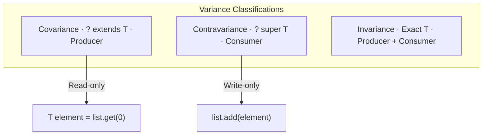

Read more: **[Detailed description and examples](./01-generics.md)**  
Examples: [Variance & Generics](../../../examples/java/14-variance-generics/README.md)

---

### 02. Stream API

| Section | Content |
| :--- | :--- |
| **Description** | The Stream API provides a declarative, functional approach to processing sequences of elements, enabling the construction of lazy computational pipelines made up of intermediate and terminal operations. |
| **API Purpose** | Efficient and expressive data processing, aggregation, grouping, filtering, and transformation without imperative loops. |
| **Terminology** | `Stream<T>`, `Collectors`, `filter`, `map`, `flatMap`, `reduce`, `collect`, `takeWhile`, `mapMulti`. |
| **Notes** | Streams are lazy (computations do not start until a terminal operation is called) and single-use (traversing a stream twice throws an exception); parallel streams are primarily effective for large CPU-bound tasks. |

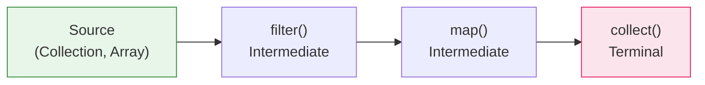

Read more: **[Detailed description and examples](./02-stream-api.md)**  
Examples: [Streams Advanced](../../../examples/java/11-streams-advanced/README.md), [FP Features](../../../examples/java/07-fp-features/README.md)

---

### 03. Lambdas and Functional Interfaces

| Section | Content |
| :--- | :--- |
| **Description** | Lambda expressions allow passing behavior as data, providing a concise syntax to implement functional interfaces (interfaces with exactly one abstract method) without creating anonymous inner classes. |
| **API Purpose** | Supporting functional programming paradigms, dynamic behavior configuration, and concise declaration of callbacks and event handlers. |
| **Terminology** | `@FunctionalInterface`, `Predicate<T>`, `Function<T,R>`, `Consumer<T>`, `Supplier<T>`, method references (`System.out::println`). |
| **Notes** | Lambdas can only capture external local variables if they are final or effectively final. |

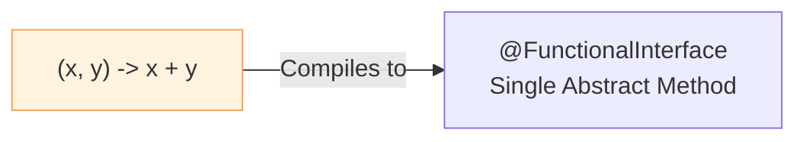

Read more: **[Detailed description and examples](./03-lambdas.md)**  
Examples: [FP Features](../../../examples/java/07-fp-features/README.md)

---

### 04. Optional

| Section | Content |
| :--- | :--- |
| **Description** | `Optional` is an immutable container object that may or may not contain a non-null value, designed specifically as a method return type to prevent silent `NullPointerException` errors. |
| **API Purpose** | Declarative handling of potentially absent values, eliminating redundant `null` checks, and explicitly documenting the method's return contract. |
| **Terminology** | `Optional<T>`, `empty()`, `of()`, `ofNullable()`, `orElse()`, `orElseGet()`, `orElseThrow()`, `ifPresent()`. |
| **Notes** | Not recommended for class fields, method parameters, or collection elements due to object allocation overhead; designed exclusively for return values. |

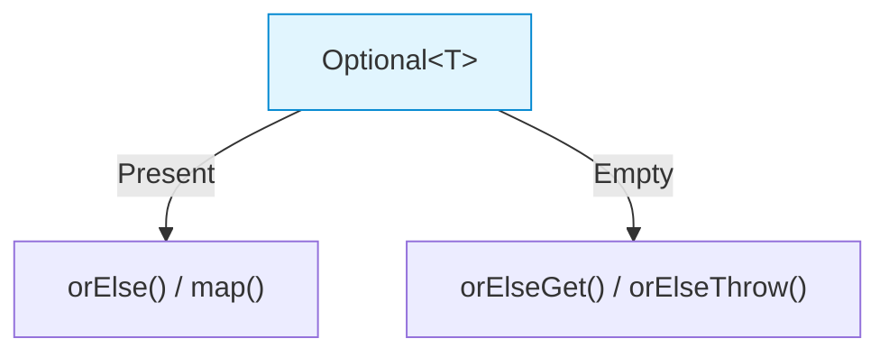

Read more: **[Detailed description and examples](./04-optional.md)**

---

### 05. Records

| Section | Content |
| :--- | :--- |
| **Description** | Records are a compact class declaration form designed solely for transporting immutable data, where the compiler automatically generates the constructor, getters, `equals()`, `hashCode()`, and `toString()`. |
| **API Purpose** | Reducing boilerplate code when creating DTOs (Data Transfer Objects), immutable tuples, and Value Objects. |
| **Terminology** | `record`, canonical/compact constructor, immutability, record components. |
| **Notes** | Records cannot extend other classes (they implicitly extend `java.lang.Record` and are final) but can implement interfaces; all of their fields are implicitly final. |

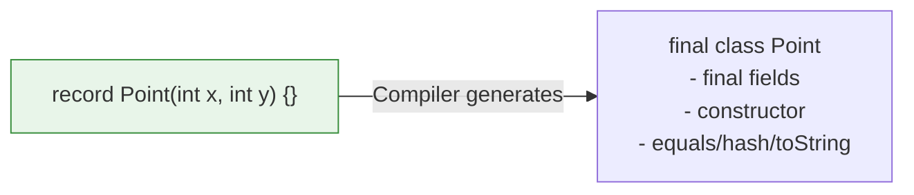

Read more: **[Detailed description and examples](./05-records.md)**

---

### 06. Sealed Classes

| Section | Content |
| :--- | :--- |
| **Description** | Sealed classes and interfaces restrict which other classes or interfaces may extend or implement them, giving developers precise control over the type hierarchy within a module or package. |
| **API Purpose** | Modeling closed domain-driven structures, creating safe and controlled hierarchies, and enabling exhaustiveness checks during pattern matching. |
| **Terminology** | `sealed`, `permits`, `non-sealed`, `final`, closed hierarchy. |
| **Notes** | All permitted subclasses must belong to the same module or package (in non-modular setups) and must explicitly declare themselves as `final`, `sealed`, or `non-sealed`. |

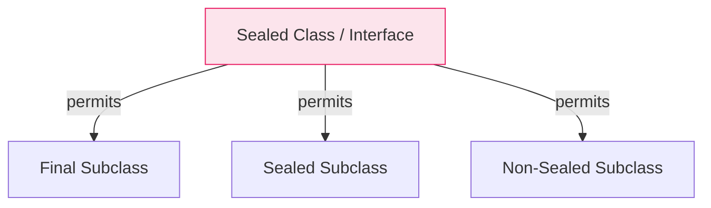

Read more: **[Detailed description and examples](./06-sealed-classes.md)**

---

### 07. Pattern Matching

| Section | Content |
| :--- | :--- |
| **Description** | Pattern matching extends conditional branch capabilities by testing an object's type and binding its fields or values to local variables in a single operation, without explicit casting. |
| **API Purpose** | Simplifying type testing, eliminating type casting, improving readability, and ensuring safety through compiler exhaustiveness checks in `switch` blocks. |
| **Terminology** | Pattern matching for `instanceof`, `switch` expressions, record patterns (deconstruction), guarded patterns (`when`). |
| **Notes** | When combined with sealed classes, the compiler verifies that a `switch` expression covers all possible subtypes, making the `default` branch redundant and generating compilation errors if a new subclass is added without updating the switch. |

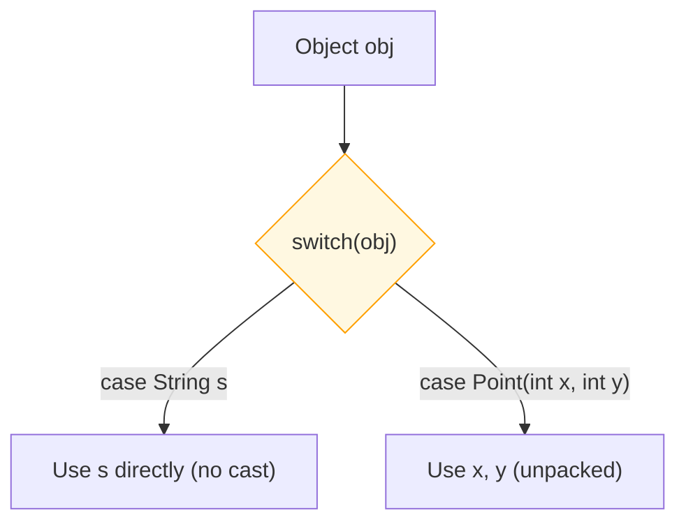

Read more: **[Detailed description and examples](./07-pattern-matching.md)**

---

### 08. Virtual Threads

| Section | Content |
| :--- | :--- |
| **Description** | Virtual threads (Project Loom) are lightweight threads managed by the JVM instead of the operating system, allowing applications to run millions of concurrent tasks with minimal resource consumption. |
| **API Purpose** | Achieving high scalability for synchronous blocking I/O applications while maintaining the simple "thread-per-request" programming model. |
| **Terminology** | `Thread.ofVirtual()`, `Executors.newVirtualThreadPerTaskExecutor()`, Carrier Thread, JVM scheduler (ForkJoinPool). |
| **Notes** | Unsuitable for CPU-bound tasks; susceptible to "thread pinning" (blocking the carrier platform thread) when holding monitor locks within `synchronized` blocks or during native system calls. |

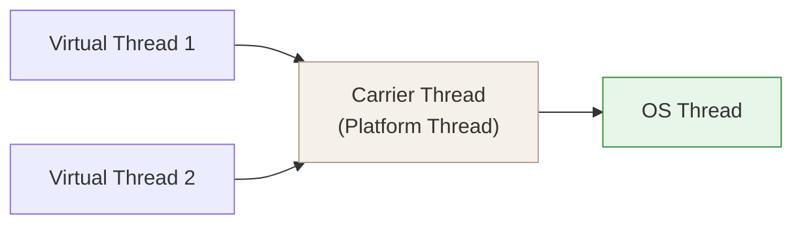

Read more: **[Detailed description and examples](./08-virtual-threads.md)**  
→ Delivered by: [Project Loom](./projects/loom/index.md)  
Examples: [Concurrency](../../../examples/java/09-concurrency/README.md), [Structured Concurrency](../../../examples/java/13-concurrency-structured/README.md)

---

### 09. Future and CompletableFuture

| Section | Content |
| :--- | :--- |
| **Description** | `CompletableFuture` provides a rich, functional API for asynchronous non-blocking programming, supporting chaining, combining, error recovery, and orchestrating multiple concurrent tasks. |
| **API Purpose** | Writing clean asynchronous code, building complex pipelines without "callback hell", and running parallel independent calls that merge into a unified result. |
| **Terminology** | `CompletableFuture`, `Future`, `CompletionStage`, `thenApply`, `thenCompose`, `thenCombine`, `exceptionally`, `allOf`, `anyOf`. |
| **Notes** | Calling `Async` methods without an explicit executor submits tasks to `ForkJoinPool.commonPool()`, which can degrade performance if tasks perform blocking operations. |

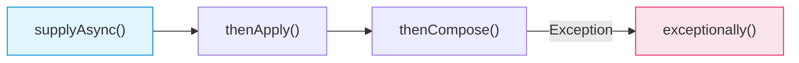

Read more: **[Detailed description and examples](./09-completable-future.md)**  
Examples: [Concurrency](../../../examples/java/09-concurrency/README.md)

---

### 10. Thread States

| Section | Content |
| :--- | :--- |
| **Description** | The thread states model in Java defines the lifecycle of a thread inside the JVM as it interacts with monitor locks, the OS scheduler, and system resources. |
| **API Purpose** | Diagnosing deadlocks, debugging multithreaded code, analyzing thread dumps, and optimizing parallel computation performance. |
| **Terminology** | `Thread.State`, `NEW`, `RUNNABLE`, `BLOCKED`, `WAITING`, `TIMED_WAITING`, `TERMINATED`, `synchronized`, `wait`/`notify`. |
| **Notes** | The `BLOCKED` state exclusively represents waiting for a `synchronized` monitor lock, whereas waiting for modern locks in the `java.util.concurrent.locks` package (like `ReentrantLock`) puts the thread in `WAITING` or `TIMED_WAITING`. |

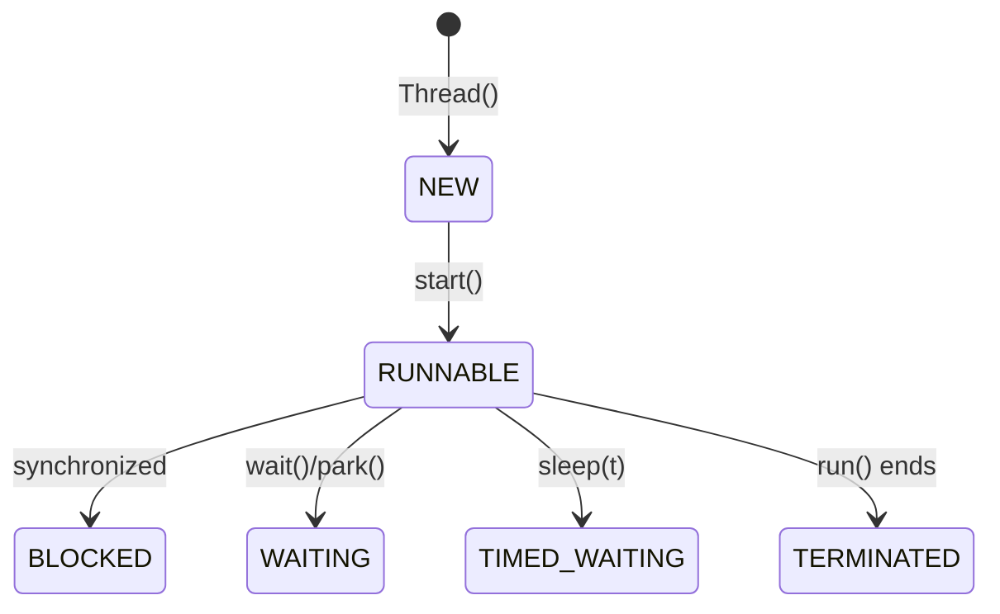

Read more: **[Detailed description and examples](./10-thread-states.md)**  
Examples: [Thread States](../../../examples/java/12-concurrency-thread-states/README.md), [Concurrency](../../../examples/java/09-concurrency/README.md)

---

### 11. Foreign Function & Memory API

| Section | Content |
| :--- | :--- |
| **Description** | The Foreign Function & Memory (FFM) API provides a modern, safe, and efficient interface to invoke native code (such as C/C++ libraries) and safely access off-heap memory, bypassing the legacy limitations of JNI. |
| **API Purpose** | Interoperating with native libraries (e.g., machine learning, graphics, databases) without writing complex C wrappers, and managing large off-heap data. |
| **Terminology** | `Linker`, `SymbolLookup`, `Arena`, `MemorySegment`, `ValueLayout`, Project Panama. |
| **Notes** | Although safer than JNI, incorrect native pointer operations or premature closing of an `Arena` can still cause JVM instability and native crashes. |

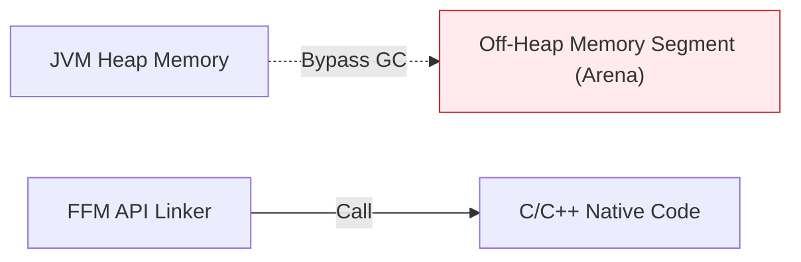

Read more: **[Detailed description and examples](./11-ffm-api.md)**  
→ Delivered by: [Project Panama](./projects/panama/index.md)

---

### 12. Scoped Values and Structured Concurrency

| Section | Content |
| :--- | :--- |
| **Description** | Structured Concurrency and Scoped Values organize concurrent tasks into cohesive lifecycle blocks and allow safe, lightweight propagation of immutable context across threads. |
| **API Purpose** | Simplifying thread lifecycle management, propagating cancellation automatically if child threads fail, and avoiding memory leak vulnerabilities of `ThreadLocal`. |
| **Terminology** | `StructuredTaskScope`, `ShutdownOnFailure`, `ShutdownOnSuccess`, `ScopedValue`. |
| **Notes** | `ScopedValue` — finalized in Java 25 (JEP 506). `StructuredTaskScope` — 5th preview in Java 25 (JEP 505), not yet a final feature. |

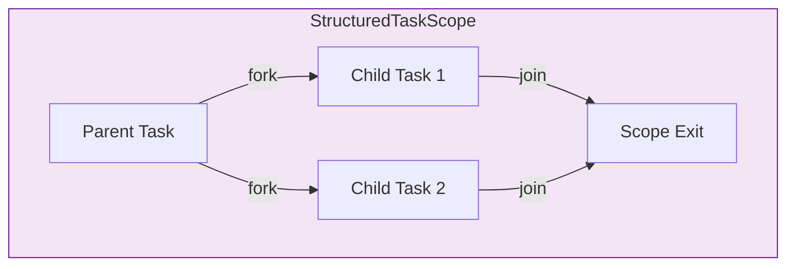

Read more: **[Detailed description and examples](./12-structured-concurrency.md)**  
→ Delivered by: [Project Loom](./projects/loom/index.md)  
Examples: [Structured Concurrency](../../../examples/java/13-concurrency-structured/README.md)

---

### 13. Working with Dates and Times

| Section | Content |
| :--- | :--- |
| **Description** | The modern `java.time` package provides an immutable, thread-safe time model that distinguishes machine timeline representation (UTC timestamps) from human-centric civil time (zones, dates, times, and periods). |
| **API Purpose** | Eliminating legacy `Date` and `Calendar` flaws, resolving time-zone DST conversion issues, and ensuring thread-safe date parsing and formatting. |
| **Terminology** | `Instant`, `LocalDate`, `LocalTime`, `LocalDateTime`, `ZonedDateTime`, `OffsetDateTime`, `Duration`, `Period`, `DateTimeFormatter`. |
| **Notes** | Always prefer `Instant` for logs, event recording, and DB storage. Completely avoid legacy classes (`java.util.Date`, `Calendar`) in modern code bases. |

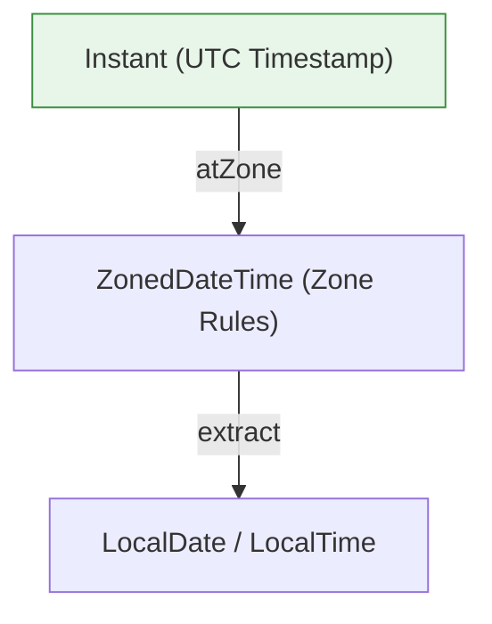

Read more: **[Detailed description and examples](./13-date-time.md)**

---

### 14. Collections Framework

| Section | Content |
| :--- | :--- |
| **Description** | The Collections Framework provides a unified architecture for storing and manipulating groups of objects through a hierarchy of interfaces (`List`, `Set`, `Queue`, `Map`) and reusable implementations. |
| **API Purpose** | Managing ordered sequences, unique elements, key-value mappings, and priority queues with predictable performance characteristics. |
| **Terminology** | `ArrayList`, `LinkedList`, `HashSet`, `TreeSet`, `HashMap`, `TreeMap`, `LinkedHashMap`, `ArrayDeque`, `PriorityQueue`, `Iterator`, `Comparable`, `Comparator`. |
| **Notes** | Prefer `ArrayList` over `LinkedList`; prefer `ArrayDeque` over `Stack` for LIFO. Use immutable factories `List.of()`, `Set.of()`, `Map.of()` (Java 9+) over `Collections.unmodifiable*`. |

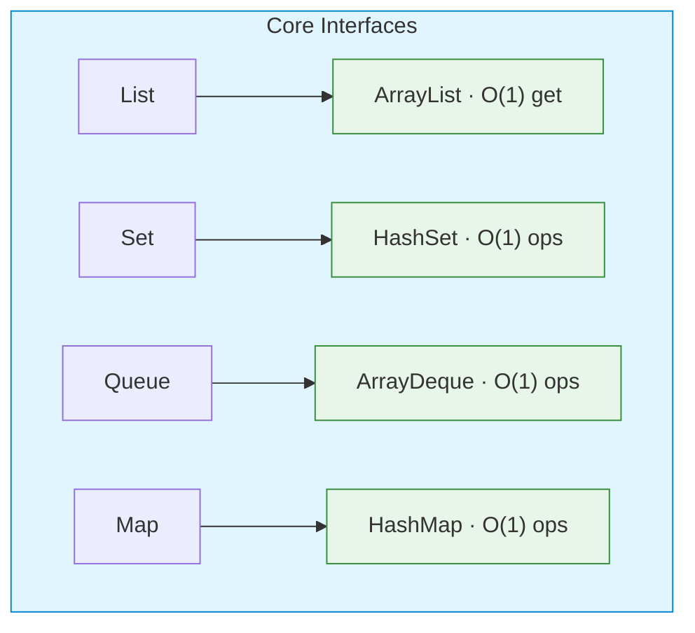

Read more: **[Detailed description and examples](./14-collections.md)**  
Examples: [Data Structures](../../../examples/java/05-data-structures/README.md)

---

### 15. Concurrency Utilities

| Section | Content |
| :--- | :--- |
| **Description** | The `java.util.concurrent` package provides high-level concurrency building blocks — thread pools, non-blocking collections, locks, synchronizers, and atomic variables — eliminating the need for manual `synchronized`/`wait`/`notify` in most scenarios. |
| **API Purpose** | Managing concurrent execution, shared mutable state, thread coordination, and lock-free algorithms with predictable performance and safety. |
| **Terminology** | `ExecutorService`, `ThreadPoolExecutor`, `ConcurrentHashMap`, `BlockingQueue`, `CountDownLatch`, `CyclicBarrier`, `Semaphore`, `ReentrantLock`, `ReadWriteLock`, `StampedLock`, `ForkJoinPool`, `AtomicInteger`, `LongAdder`. |
| **Notes** | Always use `java.util.concurrent` over `Vector`/`Hashtable`/`Collections.synchronized*`. Prefer `ConcurrentHashMap.compute*` for atomic updates. Use `LongAdder` instead of `AtomicLong` under high contention. |

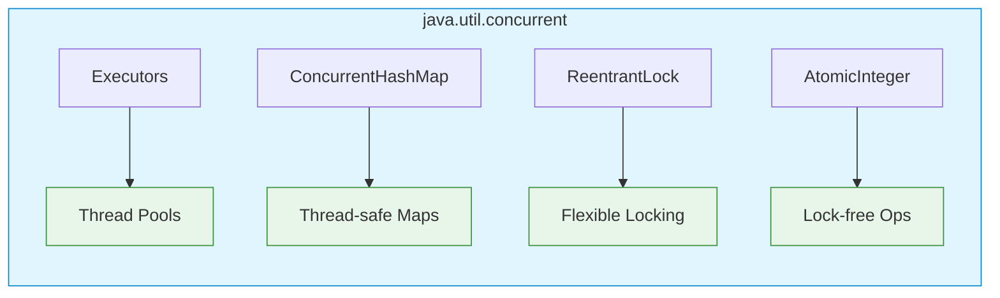

Read more: **[Detailed description and examples](./15-concurrent.md)**  
Examples: [Concurrency](../../../examples/java/09-concurrency/README.md), [Thread States](../../../examples/java/12-concurrency-thread-states/README.md)

---

### 16. Reflection API

| Section | Content |
| :--- | :--- |
| **Description** | The Reflection API enables runtime introspection and manipulation of classes, fields, methods, and constructors. It is the foundation of dependency injection frameworks, serialization libraries, and dynamic proxies. |
| **API Purpose** | Discovering type metadata at runtime, invoking methods and accessing fields dynamically, creating instances without compile-time type knowledge, and implementing cross-cutting concerns via proxies. |
| **Terminology** | `Class<T>`, `Field`, `Method`, `Constructor<T>`, `Proxy`, `MethodHandle`, `VarHandle`, `MethodHandles.Lookup`, `ParameterizedType`, `Annotation`. |
| **Notes** | Reflection is slow for hot paths — cache `Method`/`Field` objects. Prefer `MethodHandle` for repeated invocations and `VarHandle` for atomic field access. In modular Java (JPMS), use `opens` or `--add-opens` for deep reflection across modules. |

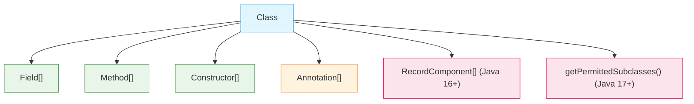

Read more: **[Detailed description and examples](./16-reflection.md)**

---

### 17. Module System (JPMS)

| Section | Content |
| :--- | :--- |
| **Description** | The Java Platform Module System (Project Jigsaw) adds a module layer on top of packages, providing strong encapsulation, explicit dependencies, and reliable configuration for both application code and the JDK itself. |
| **API Purpose** | Eliminating classpath hell, enforcing true encapsulation of internal packages, enabling smaller custom runtime images via `jlink`, and supporting service-oriented decoupling with `ServiceLoader`. |
| **Terminology** | `module-info.java`, `exports`, `requires`, `requires transitive`, `opens`, `provides` / `uses`, named module, automatic module, unnamed module, readability, accessibility. |
| **Notes** | The unnamed module (classpath) reads all named modules but cannot be read by them. Use `--add-opens` for frameworks requiring reflection. Automatic modules ease migration from plain JARs. |

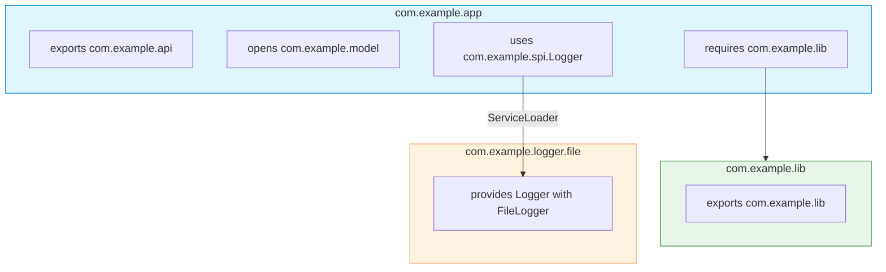

Read more: **[Detailed description and examples](./17-modules.md)**  
Examples: [OOP and Modules](../../../examples/java/06-oop-modules/README.md)

→ Delivered by: [Project Jigsaw](./projects/jigsaw/index.md)

---

### 18. Networking (HttpClient)

| Section | Content |
| :--- | :--- |
| **Description** | `HttpClient` (Java 11+) is a modern, fluent API for HTTP/1.1 and HTTP/2 communication. It supports synchronous and asynchronous execution, request/response streaming, connection pooling, and WebSocket connections. |
| **API Purpose** | Sending HTTP requests, handling responses with various body strategies, executing requests asynchronously via `CompletableFuture`, and establishing WebSocket connections without external dependencies. |
| **Terminology** | `HttpClient`, `HttpRequest`, `HttpResponse`, `BodyHandlers`, `BodyPublishers`, `send`, `sendAsync`, `WebSocket`. |
| **Notes** | `HttpClient` is immutable and thread-safe — create one instance and reuse it. Use `sendAsync` with `CompletableFuture` chaining for concurrent or non-blocking I/O. Default HTTP version is HTTP/2 with fallback to HTTP/1.1. |

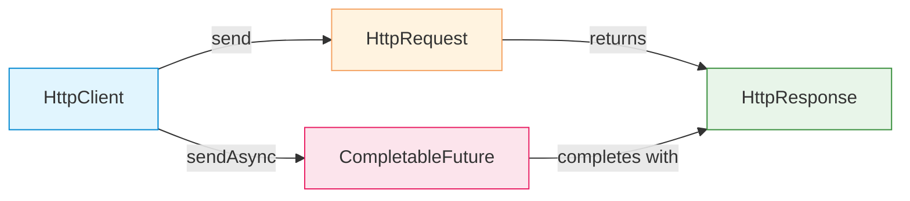

Read more: **[Detailed description and examples](./18-http-client.md)**

---

### 19. I/O and NIO/NIO.2

| Section | Content |
| :--- | :--- |
| **Description** | Java's I/O evolved through three generations: classic stream-based I/O (`java.io`), NIO with channels and buffers (`java.nio`), and NIO.2 with path-centric file operations (`java.nio.file`). Each layer serves different performance and usability requirements. |
| **API Purpose** | Reading and writing byte/character data, processing files and directories, high-performance network servers with non-blocking I/O, memory-mapped files, and filesystem monitoring. |
| **Terminology** | `InputStream`, `OutputStream`, `Reader`, `Writer`, `Channel`, `ByteBuffer`, `Selector`, `Path`, `Files`, `FileVisitor`, `WatchService`, `MappedByteBuffer`. |
| **Notes** | Prefer `Files.readString()` / `Files.writeString()` (Java 11+) for simple text I/O. Use `FileChannel` + `MappedByteBuffer` for very large files. Use `Selector` for high-concurrency network servers. Avoid `FileReader`/`FileWriter` — they use the platform default encoding. |

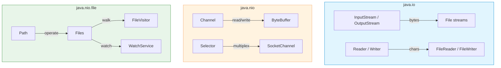

Read more: **[Detailed description and examples](./19-io-nio.md)**

---

### 20. String API and Text Processing

| Section | Content |
| :--- | :--- |
| **Description** | Java provides a comprehensive API for text manipulation, from the immutable `String` class with its pool-based interning, to mutable `StringBuilder`/`StringBuffer`, text blocks, formatting utilities, and parsing tools. |
| **API Purpose** | Efficient string construction, transformation, formatting, and parsing while avoiding common performance pitfalls like loop concatenation and excessive object creation. |
| **Terminology** | `String` (immutable, pool), `StringBuilder`, `StringBuffer`, `StringJoiner`, `String.format`, `Formatter`, `MessageFormat`, `Scanner`, text blocks `"""`, `strip()`/`isBlank()`, string templates. |
| **Notes** | Always prefer `StringBuilder` over `String` concatenation in loops. Use `String.strip()` (Java 11+) instead of `trim()` for Unicode-aware whitespace handling. Pre-compile `Pattern` objects when using regex repeatedly. |

```mermaid
flowchart TD
    subgraph Immutable["Immutable"]
        STR["String<br/>Pool, shareable"]
    end
    subgraph Mutable["Mutable"]
        SB["StringBuilder<br/>Fast, not thread-safe"]
        SBF["StringBuffer<br/>Synchronized"]
    end
    subgraph Formatting["Formatting"]
        FMT["String.format<br/>MessageFormat"]
        TB["Text Blocks &quot;&quot;&quot;"]
    end
    STR -->|Build in loop| SB
    style STR fill:#e1f5fe,stroke:#0288d1
    style SB fill:#e8f5e9,stroke:#388e3c
    style SBF fill:#fff3e0,stroke:#f4a261
    style FMT fill:#f5f0e8,stroke:#b0a090
    style TB fill:#f5f0e8,stroke:#b0a090
```

Read more: **[Detailed description and examples](./20-string-api.md)**

---

### 21. Regular Expressions

| Section | Content |
| :--- | :--- |
| **Description** | The `java.util.regex` package provides pattern matching, search, replace, and split capabilities through compiled `Pattern` objects and `Matcher` engines, supporting groups, lookahead/lookbehind, and flags. |
| **API Purpose** | Validating input formats, extracting structured data from text, transforming strings via pattern-based replacement, and tokenizing input with custom delimiters. |
| **Terminology** | `Pattern`, `Matcher`, `group()`, `find()`, `matches()`, `replaceAll()`, `split()`, lookahead `(?=...)`, lookbehind `(?<=...)`, capturing groups, `Pattern.compile()` flags. |
| **Notes** | `String.matches()` and `String.replaceAll()` compile the regex on every call — always pre-compile `Pattern` for repeated operations. Use non-capturing groups `(?:...)` when backreferences are not needed. |

```mermaid
flowchart LR
    subgraph Regex["java.util.regex"]
        P["Pattern.compile(regex)"]
        M["Matcher(input)"]
        OP["find() · matches() · replaceAll()"]
    end
    P --> M
    M --> OP
    style P fill:#e1f5fe,stroke:#0288d1
    style M fill:#fff3e0,stroke:#f4a261
    style OP fill:#e8f5e9,stroke:#388e3c
```

Read more: **[Detailed description and examples](./21-regex.md)**

---

### 22. Annotations and Metadata

| Section | Content |
| :--- | :--- |
| **Description** | Annotations provide declarative metadata on program elements. They drive compiler behavior, runtime reflection, and compile-time code generation through annotation processors, forming the foundation of modern Java frameworks. |
| **API Purpose** | Enforcing constraints at compile time, configuring frameworks (Spring, JPA), generating boilerplate code, and enabling runtime introspection of program structure and intent. |
| **Terminology** | `@interface`, `@Retention`, `@Target`, `RetentionPolicy`, `ElementType`, `@Repeatable`, `@Inherited`, `@Documented`, reflection (`getAnnotation`), type annotations, annotation processors. |
| **Notes** | Use the weakest retention policy that satisfies the use case: `SOURCE` for compiler hints, `CLASS` for processors, `RUNTIME` for reflection. Always specify `@Target` to document intended usage and catch misplaced annotations early. |

```mermaid
flowchart TD
    subgraph Decl["Annotation Declaration"]
        D["@interface"]
        META["@Retention · @Target · @Repeatable"]
    end
    subgraph Use["Usage"]
        R["Reflection at RUNTIME"]
        P["Processor at compile time"]
        C["Compiler checks at SOURCE"]
    end
    D --> META
    META --> R
    META --> P
    META --> C
    style D fill:#e1f5fe,stroke:#0288d1
    style META fill:#fff3e0,stroke:#f4a261
    style R fill:#e8f5e9,stroke:#388e3c
    style P fill:#e8f5e9,stroke:#388e3c
    style C fill:#e8f5e9,stroke:#388e3c
```

Read more: **[Detailed description and examples](./22-annotations.md)**

---

## Projects

OpenJDK umbrella projects that drive major Java platform evolution.
Each project lives in its own subfolder with locally numbered technology pages.

| Project | Status | Folder | Delivered features (in this doc) |
|---|---|---|---|
| **Loom** | ✅ Partially finalized (Virtual Threads — Java 21 final; Scoped Values — Java 25 final; Structured Concurrency — Java 25 **5th preview**) | [projects/loom/](./projects/loom/index.md) | Virtual Threads · Structured Concurrency · Scoped Values |
| **Panama** | ✅ FFM API finalized (Java 22); Vector API — Java 25 **10th incubator** (waiting for Valhalla) | [projects/panama/index.md](./projects/panama/index.md) | Foreign Function & Memory API · Vector API |
| **Amber** | 🔄 Ongoing — actively evolving | [projects/amber/](./projects/amber/index.md) | Records · Sealed Classes · Pattern Matching · Text Blocks · `var` |
| **Valhalla** | 🔬 In progress — JEP 401 (Value Classes) in early-access preview for JDK 26 | [projects/valhalla/](./projects/valhalla/index.md) | Value types · Primitive generics (upcoming) |
| **Jigsaw** | ✅ Released (Java 9) | [projects/jigsaw/](./projects/jigsaw/index.md) | Module System (JPMS) |
| **Leyden** | 🔄 Actively evolving — officially part of the JDK. JEP 483 (JDK 24), JEP 514/515 (JDK 25) released. | [projects/leyden/](./projects/leyden/index.md) | AOT class loading · AOT CLI ergonomics · AOT profiling |
| **Detroit** | 🔴 Early proposal — no implemented features in JDK as of March 2026. Polyglot interop research. | [projects/detroit/](./projects/detroit/index.md) | Java ↔ JS interop · Java ↔ Python interop · FFM bridge |
| **Lilliput** | 🟢 Actively developing — JEP 519 product feature (JDK 25); JEP 450 experimental (JDK 24). | [projects/lilliput/](./projects/lilliput/index.md) | Compact headers · Ultra-compact headers · Memory reduction |

---

### Project Loom

> **Status:** ⚠️ Partially finalized.
> - **Virtual Threads** — ✅ Final feature, Java 21 (JEP 444)
> - **Scoped Values** — ✅ Final feature, Java 25 (JEP 506)
> - **Structured Concurrency** — 🔬 5th preview, Java 25 (JEP 505); finalization expected in one of the upcoming releases
>
> **Goal:** Scalable concurrency with the simple thread-per-request model, without reactive plumbing.

| #  | Technology             | Java version     | Status     | Page                                                                         |
|----|------------------------|------------------|------------|------------------------------------------------------------------------------|
| 01 | Virtual Threads        | 21 (final)       | ✅ Released | [01-virtual-threads.md](./projects/loom/01-virtual-threads.md)               |
| 02 | Structured Concurrency | 25 (5th preview) | 🔬 Preview | [02-structured-concurrency.md](./projects/loom/02-structured-concurrency.md) |
| 03 | Scoped Values          | 25 (final)       | ✅ Released | [03-scoped-values.md](./projects/loom/03-scoped-values.md)                   |

Full overview → **[projects/loom/index.md](./projects/loom/index.md)**

---

### Project Panama

> **Status:** ⚠️ Partially finalized.
> - **FFM API** — ✅ Final feature, Java 22 (JEP 454)
> - **Vector API** — 🔬 10th incubator, Java 25 (JEP 508); finalization blocked until Value Types preview from Project Valhalla becomes available
>
> **Goal:** Efficient, safe interop between Java and native code / off-heap memory, replacing JNI.

| #  | Technology                    | Java version        | Status       | Page                                                   |
|----|-------------------------------|---------------------|--------------|--------------------------------------------------------|
| 01 | Foreign Function & Memory API | 22 (final)          | ✅ Released   | [01-ffm-api.md](./projects/panama/01-ffm-api.md)       |
| 02 | Vector API                    | 25 (10th incubator) | 🔬 Incubator | [02-vector-api.md](./projects/panama/02-vector-api.md) |

Full overview → **[projects/panama/index.md](./projects/panama/index.md)**

---

### Project Amber

> **Status:** 🔄 Ongoing — delivers incremental language productivity improvements across releases.  
> **Goal:** Reduce Java verbosity and boilerplate through expressive language features.

| #  | Technology                      | Java version           | Status      | Page                                                                                    |
|----|---------------------------------|------------------------|-------------|-----------------------------------------------------------------------------------------|
| 01 | Records                         | 16 (final)             | ✅ Released  | [01-records.md](./projects/amber/01-records.md)                                         |
| 02 | Sealed Classes                  | 17 (final)             | ✅ Released  | [02-sealed-classes.md](./projects/amber/02-sealed-classes.md)                           |
| 03 | Pattern Matching (`instanceof`) | 16 (final)             | ✅ Released  | [03-pattern-matching-instanceof.md](./projects/amber/03-pattern-matching-instanceof.md) |
| 04 | Pattern Matching (`switch`)     | 21 (final)             | ✅ Released  | [04-pattern-matching-switch.md](./projects/amber/04-pattern-matching-switch.md)         |
| 05 | Text Blocks                     | 15 (final)             | ✅ Released  | [05-text-blocks.md](./projects/amber/05-text-blocks.md)                                 |
| 06 | `var` (local type inference)    | 10 (final)             | ✅ Released  | [06-var.md](./projects/amber/06-var.md)                                                 |
| 07 | String Templates                | — (withdrawn/reworked) | 🔄 Reworked | [07-string-templates.md](./projects/amber/07-string-templates.md)                       |
| 08 | Unnamed Variables & Patterns    | 22 (final)             | ✅ Released  | [08-unnamed-variables.md](./projects/amber/08-unnamed-variables.md)                     |

Full overview → **[projects/amber/index.md](./projects/amber/index.md)**

---

### Project Valhalla

> **Status:** 🔬 In progress.
> - **JEP 401 (Value Classes and Objects)** — returned to candidate status; early-access build available for JDK 26.
> - **Primitive / Specialized Generics** — in development, depends on finalization of Value Classes.
> - Full delivery (value types + primitive generics) will span several upcoming releases.
>
> **Goal:** Bring value types and specialized generics to the JVM for better performance and memory layout.

| # | Technology | Java version | Status | Page |
|---|---|---|---|---|
| 01 | Value Classes | JDK 26 (early-access preview, JEP 401) | 🔬 In progress | [01-value-classes.md](./projects/valhalla/01-value-classes.md) |
| 02 | Primitive / Specialized Generics | TBD | 🔬 In progress | [02-primitive-generics.md](./projects/valhalla/02-primitive-generics.md) |

Full overview → **[projects/valhalla/index.md](./projects/valhalla/index.md)**

---

### Project Jigsaw

> **Status:** ✅ Released — finalized in Java 9 (2017), stable since.  
> **Goal:** Modularize the JDK itself and provide a module system for application code — strong encapsulation, explicit dependencies, smaller runtime images.

| #  | Technology           | Java version | Status     | Page                                       |
|----|----------------------|--------------|------------|--------------------------------------------|
| 01 | Module System (JPMS) | 9 (final)    | ✅ Released | [01-jpms.md](./projects/jigsaw/01-jpms.md) |

Full overview → **[projects/jigsaw/index.md](./projects/jigsaw/index.md)**

---

### Project Leyden

> **Status:** 🔄 Actively evolving — officially part of the JDK. JEP 483 (JDK 24), JEP 514 (JDK 25), and JEP 515 (JDK 25) are released. Prototypes continue for AOT method compilation and dynamic proxy generation.
>
> **Goal:** "Shift-left" optimizations: move work from runtime to build/training time to dramatically improve startup, time-to-peak performance, and footprint.

| #  | Technology                                 | Java version | Status    | Page                                                                                     |
|----|--------------------------------------------|--------------|-----------|------------------------------------------------------------------------------------------|
| 01 | AOT Class Loading & Linking (JEP 483)      | JDK 24       | Released  | [01-aot-class-loading.md](./projects/leyden/01-aot-class-loading.md)                     |
| 02 | AOT Command-Line Ergonomics (JEP 514)      | JDK 25       | Released  | [02-aot-cli-ergonomics.md](./projects/leyden/02-aot-cli-ergonomics.md)                   |
| 03 | AOT Method Profiling (JEP 515)             | JDK 25       | Released  | [03-aot-method-profiling.md](./projects/leyden/03-aot-method-profiling.md)               |
| 04 | AOT Method Compilation                     | N/A          | Prototype | [04-aot-method-compilation.md](./projects/leyden/04-aot-method-compilation.md)           |
| 05 | Dynamic Proxy & Reflection Data Generation | N/A          | Prototype | [05-proxy-reflection-generation.md](./projects/leyden/05-proxy-reflection-generation.md) |
| 06 | AOT Class Lookup Optimization              | N/A          | Prototype | [06-aot-class-lookup.md](./projects/leyden/06-aot-class-lookup.md)                       |

Full overview → **[projects/leyden/index.md](./projects/leyden/index.md)**

---

### Project Detroit

> **Status:** 🔴 Early proposal — no implemented features in JDK as of March 2026 (JavaOne 2026).
>
> **Goal:** Fast interoperability between Java, JavaScript, and Python via the `javax.script` API and embedded language runtimes (V8 / CPython) using the FFM API.

| #  | Technology                | Java version | Status   | Page                                                                  |
|----|---------------------------|--------------|----------|-----------------------------------------------------------------------|
| 01 | Java ↔ JavaScript Interop | N/A          | Proposal | [01-js-interop.md](./projects/detroit/01-js-interop.md)               |
| 02 | Java ↔ Python Interop     | N/A          | Proposal | [02-python-interop.md](./projects/detroit/02-python-interop.md)       |
| 03 | `javax.script` API Bridge | N/A          | Proposal | [03-script-api-bridge.md](./projects/detroit/03-script-api-bridge.md) |

Full overview → **[projects/detroit/index.md](./projects/detroit/index.md)**

---

### Project Lilliput

> **Status:** 🟢 Actively developing — JEP 519 promoted compact headers to a product feature in JDK 25. JEP Draft for default headers is in progress.
>
> **Goal:** Reduce Java object header size from 128 bits to 64 bits (or even 32 bits), dramatically lowering memory footprint for applications with many small objects.

| #  | Technology                               | Java version | Status       | Page                                                                               |
|----|------------------------------------------|--------------|--------------|------------------------------------------------------------------------------------|
| 01 | Compact Object Headers (JEP 450)         | JDK 24       | Experimental | [01-compact-headers-jep450.md](./projects/lilliput/01-compact-headers-jep450.md)   |
| 02 | Compact Object Headers Product (JEP 519) | JDK 25       | Released     | [02-compact-headers-jep519.md](./projects/lilliput/02-compact-headers-jep519.md)   |
| 03 | Compact Object Headers by Default        | TBD          | JEP Draft    | [03-compact-headers-default.md](./projects/lilliput/03-compact-headers-default.md) |
| 04 | Ultra-Compact Headers (Lilliput 2)       | N/A          | Research     | [04-ultra-compact-headers.md](./projects/lilliput/04-ultra-compact-headers.md)     |

Full overview → **[projects/lilliput/index.md](./projects/lilliput/index.md)**

---

## Other Language Features

| Feature                | Version | Description                                            | Example                                                |
|------------------------|---------|--------------------------------------------------------|--------------------------------------------------------|
| **Enums**              | 5       | Type-safe named constants, can have fields and methods | `enum Day { MON, TUE }`                                |
| **Annotations**        | 5       | Metadata on declarations                               | `@Override`, `@Deprecated`                             |
| **Autoboxing**         | 5       | Automatic conversion between primitives and wrappers   | `Integer i = 42;`                                      |
| **Varargs**            | 5       | Variable-length argument lists                         | `void log(String... msgs)`                             |
| **Enhanced for**       | 5       | Iterate over `Iterable` or array                       | `for (String s : list)`                                |
| **Try-with-resources** | 7       | Auto-close `AutoCloseable`                             | `try (var r = ...) {}`                                 |
| **Diamond operator**   | 7       | Infer generic type from context                        | `List<String> l = new ArrayList<>()`                   |
| **`var`**              | 10      | Local variable type inference                          | `var map = new HashMap<String, Integer>()`             |
| **Switch expressions** | 14      | `switch` returns a value, arrow syntax                 | `int x = switch(day) { case MON -> 1; default -> 0; }` |
| **Text blocks**        | 15      | Multi-line string literals                             | `"""{"key": "value"}"""`                               |
| **Unnamed variables**  | 22      | `_` for intentionally unused bindings                  | `catch (IOException _) { ... }`                        |
| **Stream Gatherers**   | 24      | Custom intermediate operations in streams              | `stream.gather(windowFixed(3))`                        |
| **Class‑File API**     | 25      | Standard API for parsing/generating bytecode           | `ClassFile.of().parse(bytes)`                          |

---

## Runtime Memory Layout

### Complete JVM Memory Picture

```mermaid
graph TB
    subgraph OS["🖥️ OPERATING SYSTEM"]
        subgraph PROCESS["⚙️ JVM PROCESS (java.exe)"]
            
            subgraph NATIVE_MEM["📦 Process Native Memory"]
                
                subgraph HEAP_AREA["🟢 JVM HEAP (shared by all threads)"]
                    direction TB
                    subgraph YOUNG["Young Generation"]
                        EDEN["Eden Space\n(new objects)"]
                        S0["Survivor 0"]
                        S1["Survivor 1"]
                    end
                    subgraph OLD["Old Generation (Tenured)"]
                        OLD_OBJ["Long-lived objects"]
                    end
                end

                subgraph METASPACE_AREA["🟣 METASPACE (native memory)"]
                    CLASS_META["Class Metadata"]
                    STATIC_VARS["⚡ Static Variables"]
                    CONST_POOL["Constant Pool"]
                end

                subgraph THREADS_MEM["🔴 THREAD MEMORY"]
                    subgraph THREAD1["🧵 Thread-1 (main)"]
                        subgraph STACK1["Thread STACK"]
                            FRAME2["Stack Frame: calculate()"]
                            FRAME1["Stack Frame: process()"]
                        end
                        PC1["PC Register"]
                    end
                end

            end
        end
    end
    style HEAP_AREA fill:#e8f5e9,stroke:#4CAF50,color:#1b5e20
    style METASPACE_AREA fill:#f3e5f5,stroke:#9C27B0,color:#4a148c
    style THREADS_MEM fill:#fbe9e7,stroke:#FF5722,color:#bf360c
```

### Main runtime areas

| Area | Shared? | Typical contents | Reclaimed how |
| :--- | :--- | :--- | :--- |
| **Thread stack** | No, per thread | Stack frames, local variables, references | Automatically on method return / thread exit |
| **Heap** | Yes | Most Java objects and arrays | Garbage collection |
| **Metaspace** | Yes | Class metadata, method metadata | Class unloading / JVM runtime shutdown |
| **Direct memory** | Yes | Off-heap allocations, foreign segments | Explicit/Cleaner lifecycle |

---

## Java Memory Model (JMM)

The **Java Memory Model** defines the rules for **visibility**, **ordering**, and **synchronization** between threads.

Key ideas:
- Without synchronization, one thread may not immediately see another thread's writes.
- **`synchronized`**, **`volatile`**, thread start/join establish **happens-before** relationships.

```mermaid
flowchart LR
    A["Thread A<br/>write x = 42"] --> B["volatile write / unlock"]
    B --> C["volatile read / lock"]
    C --> D["Thread B<br/>sees x = 42"]
```

---

## Ecosystem and Tools

### Build and Dependency Management
- **Maven**: Declarative build + dependency management (`pom.xml`).
- **Gradle**: Scriptable build with Groovy/Kotlin DSL (`build.gradle`).

### Major Frameworks
- **Spring Boot**: Industry-standard web and microservices framework.
- **Quarkus / Micronaut**: Cloud-native, high-performance frameworks with AOT compiler support.

### Testing
- **[Spring Boot Testing](spring-testing.md)** — Test slices (`@SpringBootTest`, `@WebMvcTest`, `@DataJpaTest`), MockMvc, Testcontainers, context caching.

---

## Influence

- **JVM as a compilation target**: Languages like Kotlin, Scala, Groovy, Clojure compile to JVM bytecode.
- **Generics with type erasure**: Influenced how subsequent languages designed their generics models.
- **Checked exceptions**: Highly debated, mostly avoided in newer languages like Kotlin and Scala.

---

## Strengths and Weaknesses

### Strengths
- **Platform independence** ("Write once, run anywhere").
- **Industrial ecosystem** (hundreds of thousands of libraries on Maven Central).
- **Strong backward compatibility**.
- **Virtual Threads** for simple, highly scalable concurrency.

### Weaknesses
- **Verbosity** (historically high boilerplate, though modern versions actively mitigate this).
- **Type erasure** for generics.
- **Cold start** (JVM startup latency, though mitigated by GraalVM Native Image).

---

## Code Examples

| Example | Focus |
| :--- | :--- |
| [01 Hello World](../../../examples/java/01-hello-world/README.md) | Basic program structure, compilation, execution |
| [02 Variables and Types](../../../examples/java/02-variables-and-types/README.md) | Primitive types, wrappers, arrays, var |
| [03 Functions](../../../examples/java/03-functions/README.md) | Methods, overloading, recursion, varargs |
| [04 Control Flow](../../../examples/java/04-control-flow/README.md) | Conditionals, loops, switch, break/continue |
| [05 Data Structures](../../../examples/java/05-data-structures/README.md) | Lists, Sets, Maps, Queues, iteration, ordering |
| [06 OOP and Modules](../../../examples/java/06-oop-modules/README.md) | Classes, inheritance, encapsulation, packages |
| [07 FP Features](../../../examples/java/07-fp-features/README.md) | Lambdas, method references, functional interfaces |
| [08 Error Handling](../../../examples/java/08-error-handling/README.md) | Exceptions, try-catch-finally, custom exceptions |
| [09 Concurrency](../../../examples/java/09-concurrency/README.md) | Threads, executors, virtual threads, CompletableFuture |
| [10 Testing](../../../examples/java/10-testing/README.md) | JUnit basics, assertions, test structure |
| [11 Streams Advanced](../../../examples/java/11-streams-advanced/README.md) | Advanced Stream operations: reduce, mapMulti, takeWhile |
| [12 Thread States](../../../examples/java/12-concurrency-thread-states/README.md) | Thread lifecycle, synchronization, locks |
| [13 Structured Concurrency](../../../examples/java/13-concurrency-structured/README.md) | StructuredTaskScope, ScopedValue, shutdown policies |
| [14 Variance and Generics](../../../examples/java/14-variance-generics/README.md) | Invariance, covariance, contravariance, PECS |

---

## Related Topics
- [OOP & Design](../../topics/design/index.md) — SOLID, GoF patterns in Java
- [Concurrency](../../topics/concurrency/index.md) — Multi-threading models, JMM
- [Testing](../../topics/testing/index.md) — JUnit, Mockito, AssertJ

---

*See [Languages Index](../../languages/index.md) for other language profiles.*