# Java

|                              |                                                                                                                        |
|------------------------------|------------------------------------------------------------------------------------------------------------------------|
| **Year**                     | 1995                                                                                                                   |
| **Creator(s)**               | James Gosling (Sun Microsystems)                                                                                       |
| **Paradigm(s)**              | Object-oriented, imperative, (functional features since Java 8)                                                        |
| **Typing**                   | Static, nominal, strong                                                                                                |
| **Platform**                 | JVM (bytecode)                                                                                                         |
| **Key features**             | Garbage collection, interfaces, generics, lambdas, streams, records, sealed classes, pattern matching, virtual threads |
| **Current LTS (as of 2025)** | Java 25                                                                                                                |

---

## Contents

1. [Overview](#overview)
2. [Historical Context](#historical-context)
3. [Language Evolution](#language-evolution)
4. [Core Features](#core-features)
   - [Classes and Objects](#classes-and-objects)
   - [Interfaces](#interfaces)
   - [Exception Handling](#exception-handling)
5. [Key Features In Depth](#key-features-in-depth)
   - [Generics](#generics)
   - [Stream API](#stream-api)
   - [Lambdas and Functional Interfaces](#lambdas-and-functional-interfaces)
   - [Optional](#optional)
   - [Records](#records)
   - [Sealed Classes](#sealed-classes)
   - [Pattern Matching](#pattern-matching)
   - [Virtual Threads](#virtual-threads)
   - [Thread States](#thread-states)
   - [Foreign Function & Memory API](#foreign-function--memory-api)
   - [Scoped Values and Structured Concurrency](#scoped-values-and-structured-concurrency)
   - [Working with Dates and Times](#working-with-dates-and-times)
6. [Other Language Features](#other-language-features)
7. [Runtime Memory Layout](#runtime-memory-layout)
8. [Java Memory Model (JMM)](#java-memory-model-jmm)
9. [Ecosystem and Tools](#ecosystem-and-tools)
10. [Influence](#influence)
11. [Strengths and Weaknesses](#strengths-and-weaknesses)
12. [Code Examples](#code-examples)
13. [Related Authors](#related-authors)
14. [Related Topics](#related-topics)
15. [Further Reading](#further-reading)

---

## Overview

Java is a class-based, object-oriented programming language designed
by James Gosling at Sun Microsystems, released in 1995. Its defining
promise was **"Write Once, Run Anywhere"** — Java source compiles to
bytecode that runs on any platform hosting the Java Virtual Machine (JVM).

Java's core design philosophy:

- **Safety and predictability** — no raw pointers, automatic garbage collection,
  strong type checking at compile time
- **Portability** — the JVM abstraction layer enables platform independence
- **Backward compatibility** — strong compatibility guarantees; much old Java
  code still compiles and runs with minimal changes
- **Explicit over implicit** — Java generally favors readability, explicit
  declarations, and tooling-friendly structure over terse syntax

Java powers:

- **Enterprise applications** — banking, insurance, ERP systems
- **Android** — historically Java-based, now heavily Kotlin-oriented, but still
  deeply influenced by Java syntax, libraries, and tooling
- **Big Data** — Hadoop, Spark, Flink, Kafka ecosystems
- **Web backends** — Spring Boot, Jakarta EE, Quarkus, Micronaut

---

## Historical Context


### Key Design Decisions vs C++

| Aspect               | C++                              | Java                                                   |
|----------------------|----------------------------------|--------------------------------------------------------|
| Memory management    | Manual (`new`/`delete`)          | Garbage collection                                     |
| Pointers             | Raw pointers, pointer arithmetic | References only                                        |
| Multiple inheritance | Classes + virtual tables         | Single class inheritance, multiple interfaces          |
| Portability          | Native binaries per platform     | JVM bytecode                                           |
| Error handling       | Return codes, SEH, exceptions    | Checked + unchecked exceptions                         |
| Templates / Generics | C++ templates (compile-time)     | Generics (type erasure, runtime)                       |
| Undefined behavior   | Common                           | Largely avoided by the language and JVM specifications |

---

## Language Evolution

| Version    | Year | Key additions                                                                                                                                                |
|------------|------|--------------------------------------------------------------------------------------------------------------------------------------------------------------|
| **1.0**    | 1995 | Initial release: classes, interfaces, threads, applets                                                                                                       |
| **1.1**    | 1997 | Inner classes, JDBC, RMI, reflection                                                                                                                         |
| **1.2**    | 1998 | Collections framework, Swing, JIT compiler                                                                                                                   |
| **1.4**    | 2002 | `assert`, regex, NIO                                                                                                                                         |
| **5**      | 2004 | **Generics**, enhanced for-each, autoboxing, annotations, enums, varargs                                                                                     |
| **6**      | 2006 | Scripting API, JAXB improvements                                                                                                                             |
| **7**      | 2011 | Try-with-resources, diamond operator `<>`, `switch` on strings                                                                                               |
| **8 LTS**  | 2014 | **Lambdas**, **Stream API**, `Optional`, default methods, `java.time`                                                                                        |
| **9**      | 2017 | **JPMS modules**, `jshell`, `List.of()` factory methods                                                                                                      |
| **10**     | 2018 | `var` local variable type inference                                                                                                                          |
| **11 LTS** | 2018 | `var` in lambda parameters, HTTP client, new `String` methods                                                                                                |
| **14**     | 2020 | **Records** (preview), `switch` expressions                                                                                                                  |
| **16**     | 2021 | Records (stable), `instanceof` pattern matching                                                                                                              |
| **17 LTS** | 2021 | **Sealed classes**, pattern matching for `switch` (preview)                                                                                                  |
| **21 LTS** | 2023 | **Virtual threads** (Project Loom), pattern matching for `switch` (final), record patterns                                                                   |
| **22**     | 2024 | Foreign Function & Memory API (final), Unnamed Variables & Patterns                                                                                          |
| **23**     | 2024 | Stream Gatherers (preview), Implicitly Declared Classes (second preview), Scoped Values (preview)                                                            |
| **24**     | 2025 | Scoped Values (final), Structured Concurrency (final), Implicitly Declared Classes (final), Primitive type patterns (preview)                                |
| **25 LTS** | 2025 | Consolidates recent additions such as FFM API, Scoped Values, Structured Concurrency, and the Class‑File API; preview/incubator features continue separately |

> **LTS** = Long-Term Support release — recommended for production use.  
> As of 2025, Java 25 is the current LTS release.

---

## Core Features

### Classes and Objects

Java is fundamentally class-based: executable code is defined in methods
associated with classes or interfaces.

```java
class Animal {
    // Fields (state)
    private final String name;
    private int age;

    // Constructor
    public Animal(String name, int age) {
        this.name = name;
        this.age = age;
    }

    // Methods (behavior)
    public String getName() { return name; }
    public int getAge()     { return age; }

    public void speak() {
        System.out.println(name + " makes a sound");
    }

    @Override
    public String toString() {
        return "Animal{name='" + name + "', age=" + age + "}";
    }
}

// Subclass — single inheritance only
class Dog extends Animal {
    private final String breed;

    public Dog(String name, int age, String breed) {
        super(name, age);          // call parent constructor
        this.breed = breed;
    }

    @Override
    public void speak() {
        System.out.println(getName() + " barks");
    }
}
```

Single inheritance avoids the classic C++-style multiple-inheritance
diamond for classes. Reuse across hierarchies is achieved via interfaces.

### Interfaces

Interfaces define contracts — what an object can do, not how:

```java
interface Drawable {
    void draw();

    default String describe() {      // default method since Java 8
        return "A drawable shape";
    }
}

interface Resizable {
    void resize(double factor);
}

// A class can implement multiple interfaces
class Circle implements Drawable, Resizable {
    private double radius;

    public Circle(double radius) { this.radius = radius; }

    @Override public void draw() {
        System.out.println("Drawing circle r=" + radius);
    }

    @Override public void resize(double factor) {
        radius *= factor;
    }
}

// Polymorphic use — client depends on interface, not implementation
class Renderer {
    static void renderAll(List<Drawable> shapes) {
        shapes.forEach(Drawable::draw);    // method reference
    }
}
```

A class may implement multiple interfaces. Since Java 8, interfaces may
also contain **default methods**, which provide reusable behavior without
full multiple inheritance of classes.

### Exception Handling

Java distinguishes **checked** (must handle or declare) and **unchecked**
(runtime) exceptions:

```java
// Checked exception — compiler enforces handling
public static String readFile(String path) throws IOException {
    return Files.readString(Path.of(path));    // throws IOException
}

// Handling
try {
    String content = readFile("data.txt");
    process(content);
} catch (IOException e) {
    System.err.println("File error: " + e.getMessage());
} finally {
    cleanup();    // always runs
}

// Try-with-resources (Java 7+) — auto-closes resources
try (var reader = new BufferedReader(new FileReader("data.txt"))) {
    String line = reader.readLine();
} // reader.close() called automatically

// Custom exception
class InsufficientFundsException extends RuntimeException {
    private final double amount;

    public InsufficientFundsException(double amount) {
        super("Insufficient funds: needed " + amount);
        this.amount = amount;
    }

    public double getAmount() { return amount; }
}
```

---

## Key Features In Depth

### Generics

Introduced in **Java 5 (2004)**. Generics allow classes, interfaces, and
methods to operate on types specified as parameters — providing type safety
without casting.

**Before generics (Java 1.4):**

```java
List list = new ArrayList();
list.add("hello");
list.add(42);                          // compiles — no type check!
String s = (String) list.get(1);       // ClassCastException at runtime
```

**With generics:**

```java
List<String> list = new ArrayList<>();
list.add("hello");
// list.add(42);                        // compile error — type-safe
String s = list.get(0);                // no cast needed
```

#### Generic classes

```java
// A generic container
public class Box<T> {
    private T value;

    public Box(T value) { this.value = value; }
    public T get()      { return value; }

    @Override public String toString() {
        return "Box[" + value + "]";
    }
}

Box<String>  strBox = new Box<>("hello");
Box<Integer> intBox = new Box<>(42);

String s = strBox.get();   // no cast
int    n = intBox.get();   // auto-unboxing
```

#### Generic methods

```java
// T is inferred from argument type at call site
public static <T> List<T> repeat(T element, int times) {
    List<T> result = new ArrayList<>();
    for (int i = 0; i < times; i++) result.add(element);
    return result;
}

List<String>  words = repeat("hi", 3);   // ["hi", "hi", "hi"]
List<Integer> nums  = repeat(0, 5);      // [0, 0, 0, 0, 0]
```

#### Bounded type parameters and wildcards (visual)

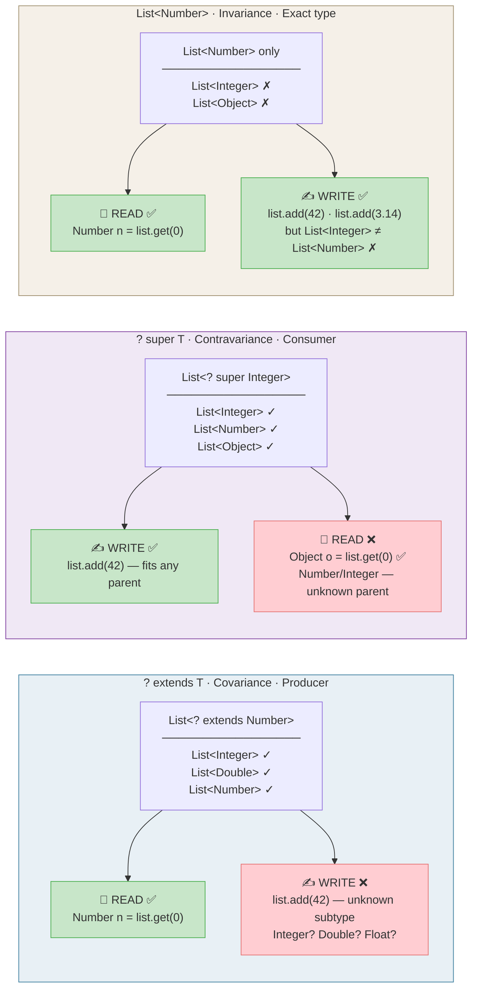

## Summary Table: Variance in Java Generics

| Criteria             | `List<? extends Number>`                                                                              | `List<? super Integer>`                                                                               | `List<Number>`                                                                   |
|----------------------|-------------------------------------------------------------------------------------------------------|-------------------------------------------------------------------------------------------------------|----------------------------------------------------------------------------------|
| **Name**             | Covariance                                                                                            | Contravariance                                                                                        | Invariance                                                                       |
| **Role**             | Producer                                                                                              | Consumer                                                                                              | Producer + Consumer                                                              |
| **Input (examples)** | `List<Integer>` ✓<br/>`List<Double>` ✓<br/>`List<Number>` ✓<br/>`List<Object>` ✗<br/>`List<String>` ✗ | `List<Integer>` ✓<br/>`List<Number>` ✓<br/>`List<Object>` ✓<br/>`List<Double>` ✗<br/>`List<String>` ✗ | `List<Number>` ✓<br/>`List<Integer>` ✗<br/>`List<Object>` ✗<br/>`List<Double>` ✗ |
| **Write**            | ❌ Forbidden<br/>Compiler doesn't know<br/>the exact subtype                                           | ✅ Allowed<br/>`list.add(42)`<br/>Integer fits any ancestor                                            | ✅ Allowed<br/>`list.add(42)`<br/>`list.add(3.14)`                                |
| **Read**             | ✅ Allowed<br/>`Number n = list.get(0)`<br/>At least `T` is guaranteed                                 | ⚠️ Only `Object`<br/>`Object o = list.get(0)` ✅<br/>`Number n = list.get(0)` ❌                        | ✅ Allowed<br/>`Number n = list.get(0)`<br/>Exact type is known                   |
| **null in add()**    | ❌ add() unavailable                                                                                   | ✅ `list.add(null)`                                                                                    | ✅ `list.add(null)`                                                               |
| **Mnemonic (PECS)**  | **P**roducer — **E**xtends                                                                            | **C**onsumer — **S**uper                                                                              | —                                                                                |
| **Typical use-case** | Read data from collection                                                                             | Write data into collection                                                                            | Exact API contract                                                               |
| **Method example**   | `copy(List<? extends T> src)`                                                                         | `copy(List<? super T> dst)`                                                                           | `sort(List<T> list)`                                                             |
| **Kotlin analogue**  | `out T`                                                                                               | `in T`                                                                                                | `T`                                                                              |
| **C# analogue**      | `IEnumerable<out T>`                                                                                  | `IEnumerable<in T>`                                                                                   | `List<T>`                                                                        |

---

```java
// Upper bound: T must extend Comparable<T>
public static <T extends Comparable<T>> T max(T a, T b) {
    return a.compareTo(b) >= 0 ? a : b;
}

max(3, 7);               // 7
max("apple", "mango");   // "mango"

// Upper-bounded wildcard: read from collection of T or subtypes
public static double sumList(List<? extends Number> list) {
    return list.stream().mapToDouble(Number::doubleValue).sum();
}

// Lower-bounded wildcard: write Integer values into collection
public static void addNumbers(List<? super Integer> list) {
    list.add(1);
    list.add(2);
}
```

**PECS mnemonic:** **P**roducer **E**xtends, **C**onsumer **S**uper

- Use `<? extends T>` when you only **read** (produce) from a structure
- Use `<? super T>` when you only **write** (consume) into a structure
- If you both read and write, don't use wildcards (invariant)

```java
// Classic PECS example: Collections.copy()
public static <T> void copy(
    List<? super T> dest,      // Consumer → super (writes)
    List<? extends T> src      // Producer → extends (reads)
) {
    for (T item : src) {       // read from producer
        dest.add(item);        // write to consumer
    }
}

List<Integer> integers = List.of(1, 2, 3);
List<Number> numbers = new ArrayList<>();
copy(numbers, integers);  // ✅ integers produce, numbers consume
```

> See [Variance & Generics example](../../../examples/java/14-variance-generics/README.md) for comprehensive tests demonstrating invariance, covariance, and contravariance in Java generics.

#### Things You Cannot Do Due to Type Erasure
**Seven things you cannot do because of type erasure in Java**

Java generics are implemented via type erasure: generic type parameters are removed at compile time. At runtime, `List<String>` and `List<Integer>` are both just `List`. This causes several restrictions.

**Arrays vs generics**  
Arrays know their element type at runtime; generics do not. That’s why some operations are forbidden.

**1. Cannot create an array of a parameterized type**  
```java
List<String>[] array = new List<String>[10]; // compile error: generic array creation
```

**2. Cannot create an array from a type parameter**  
```java
class Box<T> {
    T[] array = new T[10]; // error: cannot create array of T
}
```

**3. Cannot directly instantiate a type parameter**  
```java
class Box<T> {
    T value = new T(); // error: cannot instantiate T
}
```

**4. Cannot overload methods if erasure makes signatures identical**  
```java
void print(List<String> items) {}
void print(List<Integer> items) {} // error: both erasure to print(List)
```

**5. Cannot use `instanceof` with a concrete parameterized type**  
```java
if (obj instanceof List<String>) // error: illegal generic type for instanceof
```

**6. Cannot get a `Class` literal for a parameterized type**  
```java
Class<?> clazz = List<String>.class; // error: no such class
```

**7. Cannot create a parameterized exception class**  
```java
class MyException<T> extends Exception { } // error: generic class may not extend Throwable
```

---

### Stream API

Introduced in **Java 8 (2014)**. Streams provide a declarative,
pipeline-based approach to processing sequences of data — inspired by
functional programming. Streams are **lazy**: intermediate operations
are not evaluated until a terminal operation is called.

#### Stream pipeline anatomy

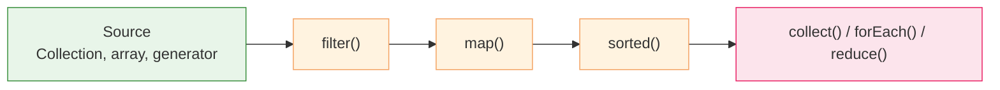

#### Basic pipeline

```java
List<Integer> numbers = List.of(1, 2, 3, 4, 5, 6, 7, 8, 9, 10);

int sumOfEvenSquares = numbers.stream()
    .filter(n -> n % 2 == 0)      // keep 2, 4, 6, 8, 10
    .map(n -> n * n)              // square: 4, 16, 36, 64, 100
    .reduce(0, Integer::sum);     // sum: 220

System.out.println(sumOfEvenSquares);  // 220
```

#### Collectors

`Collectors` provide flexible terminal aggregation:

```java
List<String> words = List.of("apple", "banana", "avocado", "blueberry", "cherry");

// Group by first letter
Map<Character, List<String>> byLetter = words.stream()
    .collect(Collectors.groupingBy(w -> w.charAt(0)));
// {a=[apple, avocado], b=[banana, blueberry], c=[cherry]}

// Count per group
Map<Character, Long> countByLetter = words.stream()
    .collect(Collectors.groupingBy(w -> w.charAt(0), Collectors.counting()));
// {a=2, b=2, c=1}

// Join to string
String joined = words.stream()
    .filter(w -> w.length() > 5)
    .collect(Collectors.joining(", ", "[", "]"));
// [banana, avocado, blueberry]
```

#### FlatMap

Flatten nested structures:

```java
List<List<Integer>> nested = List.of(
    List.of(1, 2, 3),
    List.of(4, 5),
    List.of(6, 7, 8, 9)
);

List<Integer> flat = nested.stream()
    .flatMap(Collection::stream)   // flatten
    .filter(n -> n > 4)
    .collect(Collectors.toList()); // [5, 6, 7, 8, 9]
```

#### Parallel streams

Transparent parallelism via the fork/join pool:

```java
long count = LongStream.rangeClosed(1, 1_000_000)
    .parallel()
    .filter(n -> n % 2 == 0)
    .count();
```

> ⚠️ Parallel streams benefit mainly for CPU-bound, stateless operations on
> large data sets. For I/O-bound work, prefer virtual threads (Java 21+).

#### Advanced Stream Operations

**Reduce** combines stream elements into a single result:

```java
List<Integer> numbers = List.of(5, 3, 8, 1, 6);

// Sum reduction
int sum = numbers.stream().reduce(0, Integer::sum);        // 23

// Max reduction
int max = numbers.stream().reduce(Integer::max).orElse(0); // 8

// Concatenation
String joined = words.stream().reduce("", (s1, s2) -> s1 + s2);
```

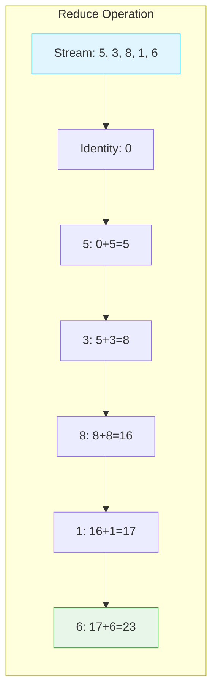

**TakeWhile / DropWhile** (Java 9+) for conditional termination:

```java
List<Integer> nums = List.of(1, 2, 3, 4, 5, 4, 3, 2, 1);

// Take while predicate is true, then stop
List<Integer> taken = nums.stream()
    .takeWhile(n -> n < 4).toList();  // [1, 2, 3]

// Drop while predicate is true, then take rest
List<Integer> dropped = nums.stream()
    .dropWhile(n -> n < 4).toList(); // [4, 5, 4, 3, 2, 1]
```

**MapMulti** (Java 16+) for efficient one-to-many transformation:

```java
// More efficient than flatMap for custom transformations
List<Integer> expanded = List.of(1, 2, 3).stream()
    .<Integer>mapMulti((n, consumer) -> {
        consumer.accept(n);      // include n
        consumer.accept(n * 2);  // include n*2
    })
    .toList(); // [1, 2, 2, 4, 3, 6]
```

**Sorted** with custom comparators:

```java
// By length
List<String> byLength = words.stream()
    .sorted(Comparator.comparing(String::length)).toList();

// Multi-level: by length, then alphabetically
List<String> multi = words.stream()
    .sorted(Comparator.comparing(String::length)
        .thenComparing(Comparator.naturalOrder())).toList();
```

**Merge operations** for handling key collisions:

```java
// toMap with merge function - keep most expensive per category
Map<String, Double> maxPrice = products.stream()
    .collect(Collectors.toMap(
        Product::category,   // key
        Product::price,      // value
        Double::max));       // merge: keep higher price
```

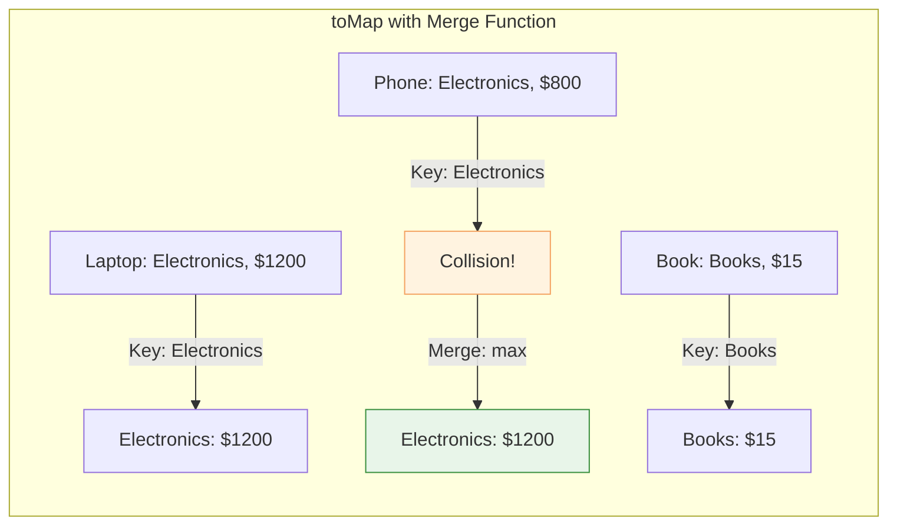

---

### Lambdas and Functional Interfaces

**Java 8** introduced lambda expressions as a concise way to implement
**functional interfaces** — interfaces with exactly one abstract method.

```java
// Functional interface (can be a lambda target)
@FunctionalInterface
interface Transformer<T, R> {
    R transform(T input);
}

// Lambda implementation
Transformer<String, Integer> length = s -> s.length();
Transformer<Integer, Integer> square = n -> n * n;

System.out.println(length.transform("hello"));   // 5
System.out.println(square.transform(7));         // 49
```

#### Built-in functional interfaces (`java.util.function`)

| Interface           | Signature     | Description       |
|---------------------|---------------|-------------------|
| `Predicate<T>`      | `T → boolean` | Test / filter     |
| `Function<T,R>`     | `T → R`       | Transform         |
| `Consumer<T>`       | `T → void`    | Side effect       |
| `Supplier<T>`       | `() → T`      | Produce value     |
| `BiFunction<T,U,R>` | `T, U → R`    | Two-arg transform |

---

### Optional

`Optional<T>` is a container that may or may not hold a value —
a type-safe alternative to returning `null`, mainly for return types.

```java
// Creation
Optional<String> present = Optional.of("hello");
Optional<String> empty   = Optional.empty();
Optional<String> maybe   = Optional.ofNullable(possiblyNull);

// Consuming
present.ifPresent(System.out::println);        // prints "hello"

String result = maybe.orElse("default");       // "default" if empty
String result2 = maybe.orElseGet(() -> computeDefault());
String result3 = maybe.orElseThrow(() -> new IllegalStateException("missing"));

// Transforming
Optional<Integer> length = present.map(String::length);   // Optional[5]
```

In idiomatic Java, `Optional` is most commonly used as a return type,
not as a field type or a method parameter.

---

### Records

Introduced in **Java 16** (stable). Records are immutable data carriers —
the compiler auto-generates constructor, accessors, `equals`, `hashCode`,
and `toString`:

```java
// Declaration — compact, no boilerplate
record Point(double x, double y) {}

// Usage
Point p = new Point(3.0, 4.0);
System.out.println(p.x());           // 3.0 — accessor (not getX())
System.out.println(p);               // Point[x=3.0, y=4.0]
```

---

### Sealed Classes

Introduced in **Java 17** (stable). Sealed classes restrict which classes
can extend or implement them — enabling better modeling of closed hierarchies
and supporting exhaustive pattern matching:

```java
sealed interface Shape permits Circle, Rectangle, Triangle {}
record Circle(double radius) implements Shape {}
record Rectangle(double w, double h) implements Shape {}
record Triangle(double b, double h) implements Shape {}
```

---

### Pattern Matching

Java has been progressively adding pattern matching since Java 14.

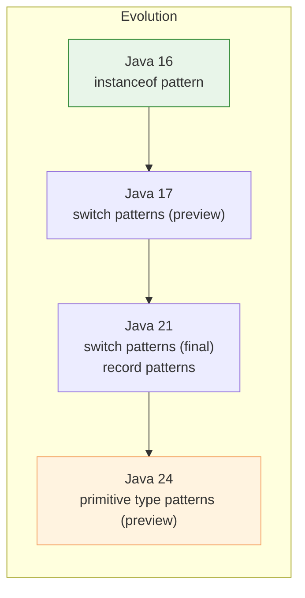

#### `instanceof` patterns (Java 16)

```java
// Old style
if (obj instanceof String) {
    String s = (String) obj;
    System.out.println(s.length());
}

// Pattern matching — bind variable inline
if (obj instanceof String s) {
    System.out.println(s.length());   // s is already String here
}
```

#### Switch patterns (Java 21)

```java
static String describe(Object obj) {
    return switch (obj) {
        case Integer i -> "integer: " + i;
        case String s  -> "string of length " + s.length();
        case null      -> "null";
        default        -> "unknown: " + obj;
    };
}
```

---

### Virtual Threads

Introduced in **Java 21** (Project Loom). Virtual threads are lightweight
threads managed by the JVM rather than mapped one-to-one to OS threads,
enabling high-throughput concurrency with familiar blocking code.

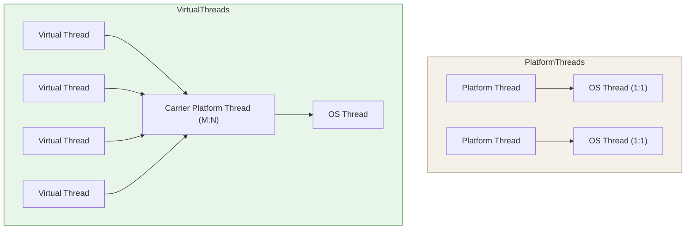

```java
// Traditional platform thread (OS-managed, higher per-thread overhead)
Thread platformThread = new Thread(() -> handleRequest());
platformThread.start();

// Virtual thread (cheap, JVM-scheduled)
Thread virtualThread = Thread.ofVirtual().start(() -> handleRequest());

// Using ExecutorService — same API, virtual threads underneath
try (var executor = Executors.newVirtualThreadPerTaskExecutor()) {
    for (int i = 0; i < 100_000; i++) {
        executor.submit(() -> {
            try {
                Thread.sleep(1000);   // illustrative blocking call
                return processRequest();
            } catch (InterruptedException e) {
                Thread.currentThread().interrupt();
                throw new RuntimeException(e);
            }
        });
    }
}  // executor.close() waits for submitted tasks to complete
```

> Virtual threads make the traditional one-request-per-thread style viable
> at much higher concurrency levels, especially for I/O-heavy workloads.

---

### Thread States

Java threads transition through six states during their lifecycle. Understanding
these states is essential for debugging concurrency issues.

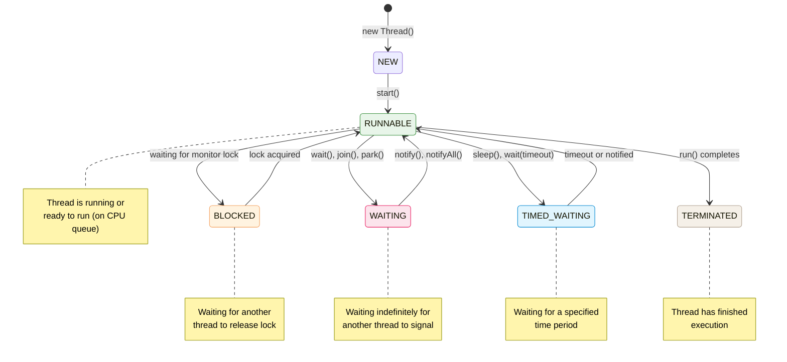

#### BLOCKED state

Occurs when a thread tries to acquire a monitor lock held by another thread:

```java
Object lock = new Object();

Thread t1 = new Thread(() -> {
    synchronized (lock) {
        Thread.sleep(1000);  // holds lock
    }
});

Thread t2 = new Thread(() -> {
    synchronized (lock) {
        // t2 becomes BLOCKED here, waiting for t1 to release lock
    }
});

t1.start();
t2.start();
```

#### WAITING state

Thread waits indefinitely for another thread's action. Always use `wait()`
inside a synchronized block and check condition in a while loop:

```java
synchronized (lock) {
    while (!condition) {              // while loop handles spurious wakeups
        lock.wait();                  // WAITING state
    }
    // process when condition is true
}

// In another thread:
synchronized (lock) {
    condition = true;
    lock.notify();                    // wakes one waiting thread
}
```

#### TIMED_WAITING state

Thread waits for a specified time period:

```java
// Thread.sleep() - most common
Thread.sleep(3000);  // TIMED_WAITING for 3 seconds

// wait with timeout
synchronized (lock) {
    lock.wait(2000);  // TIMED_WAITING for 2 seconds
}

// join with timeout
Thread other = new Thread(() -> ...);
other.start();
other.join(1000);  // TIMED_WAITING for 1 second
```

#### Producer-Consumer pattern

Classic synchronization pattern demonstrating state transitions:

```java
synchronized (lock) {
    while (available) {               // buffer is full
        lock.wait();                  // WAITING
    }
    buffer = item;                     // produce
    available = true;
    lock.notify();                     // wake consumer
}

// Consumer:
synchronized (lock) {
    while (!available) {              // buffer is empty
        lock.wait();                  // WAITING
    }
    item = buffer;                    // consume
    available = false;
    lock.notify();                     // wake producer
}
```

> ⚠️ Always use `while (condition)` with `wait()` to handle spurious wakeups.
> Never call `wait()`, `notify()`, or `notifyAll()` without holding the monitor lock.

---

### Foreign Function & Memory API

**Final in Java 22** (Project Panama). It allows Java programs to interoperate
with native code and memory outside the JVM heap in a safer, more explicit way
than traditional JNI.

```java
try (Arena arena = Arena.ofConfined()) {
    MemorySegment segment = arena.allocate(8);   // allocate 8 bytes off-heap
    segment.set(ValueLayout.JAVA_LONG, 0, 42L);
    long value = segment.get(ValueLayout.JAVA_LONG, 0);
    System.out.println(value); // 42
}
```

The API supports both:
- **foreign memory access** — off-heap memory with explicit lifetime control
- **foreign function calls** — calling native libraries via method handles

---

### Scoped Values and Structured Concurrency

**Final in Java 24** (Project Loom). These features together enable
cleaner, more structured concurrent programming.

#### Scoped Values

Scoped values provide immutable, inheritable context for a bounded
execution scope — a disciplined alternative to many `ThreadLocal` use cases:

```java
private static final ScopedValue<String> USER = ScopedValue.newInstance();

ScopedValue.where(USER, "alice").run(() -> {
    // All code in this lambda can access USER.get()
    System.out.println("User: " + USER.get()); // alice

    // Child virtual threads inherit the scoped value
    Thread.ofVirtual().start(() -> {
        System.out.println("Child sees: " + USER.get()); // alice
    });
});
```

#### Structured Concurrency

Structured concurrency treats related concurrent tasks as a single unit of work.
Forked tasks are automatically joined before scope exit.

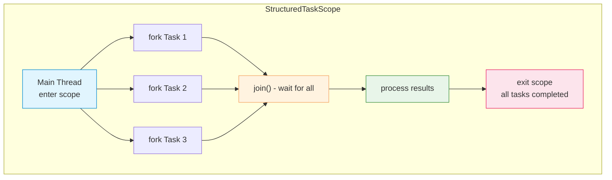

**Scope types:**

```java
// 1. Basic scope - wait for all tasks
try (var scope = new StructuredTaskScope<String>()) {
    Future<String> f1 = scope.fork(() -> fetchUser());
    Future<String> f2 = scope.fork(() -> fetchOrders());
    scope.join();  // waits for both
    System.out.println(f1.resultNow() + ", " + f2.resultNow());
}

// 2. ShutdownOnFailure - fail fast
try (var scope = new StructuredTaskScope.ShutdownOnFailure()) {
    scope.fork(() -> serviceA());
    scope.fork(() -> serviceB());
    scope.join();
    scope.throwIfFailed();  // cancels remaining if any fail
}

// 3. ShutdownOnSuccess - first success wins
try (var scope = new StructuredTaskScope.ShutdownOnSuccess<String>()) {
    scope.fork(() -> primaryServer());
    scope.fork(() -> fallbackServer());
    scope.join();
    String result = scope.result();  // first successful
}

// 4. Timeout handling
try (var scope = new StructuredTaskScope<String>()) {
    Future<String> f = scope.fork(() -> longOperation());
    scope.joinUntil(Instant.now().plusSeconds(3));
    if (f.state() != Future.State.SUCCESS) {
        scope.shutdown();  // cancel timed-out tasks
    }
}
```

### Working with Dates and Times

Java has two distinct APIs for working with dates and times: the **legacy API** (pre-Java 8) and the **modern `java.time` API** (Java 8+).

#### Legacy Date/Time API (avoid in new code)

Before Java 8, date/time handling was problematic:

```java
// Legacy API — mutable, thread-unsafe, confusing
java.util.Date date = new java.util.Date();
java.util.Calendar cal = java.util.Calendar.getInstance();
cal.set(2024, 0, 15);  // months are 0-based! January = 0

// SimpleDateFormat — not thread-safe
SimpleDateFormat sdf = new SimpleDateFormat("yyyy-MM-dd");
String formatted = sdf.format(date);
```

**Problems with legacy API:**

- **Mutability** — `Date` and `Calendar` are mutable, causing concurrency issues
- **Poor design** — months are 0-based, days are 1-based
- **Thread-safety** — `SimpleDateFormat` is not thread-safe
- **Mixing concerns** — `Date` conflates instant and local time

> ⚠️ Use legacy API only when required for backward compatibility with old libraries.

---

#### Modern `java.time` API (Java 8+)

The `java.time` package provides immutable, thread-safe, well-designed date/time classes.

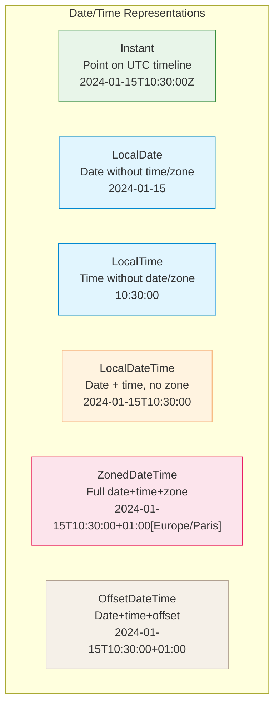

#### Choosing the Right Type

| Type                 | Use when                                                  | Example                                        |
|----------------------|-----------------------------------------------------------|------------------------------------------------|
| **`Instant`**        | Timestamp on UTC timeline, logging, database audit fields | `Instant.now()`                                |
| **`LocalDate`**      | Date only, no time or timezone (birthdate, holiday)       | `LocalDate.of(1995, 5, 23)`                    |
| **`LocalTime`**      | Time only, no date or timezone (opening hours)            | `LocalTime.of(9, 30)`                          |
| **`LocalDateTime`**  | Date + time, no timezone (meeting in local context)       | `LocalDateTime.now()`                          |
| **`ZonedDateTime`**  | Full date+time+timezone (cross-timezone scheduling)       | `ZonedDateTime.now(ZoneId.of("Europe/Paris"))` |
| **`OffsetDateTime`** | Date+time+UTC offset (ISO-8601, APIs, serialization)      | `OffsetDateTime.now()`                         |

---

#### Common Operations

**Creating dates:**

```java
// Current date/time
Instant now = Instant.now();                          // UTC timestamp
LocalDate today = LocalDate.now();                    // 2024-01-15
LocalDateTime dateTime = LocalDateTime.now();         // 2024-01-15T10:30:00

// Specific date/time
LocalDate birthday = LocalDate.of(1995, Month.MAY, 23);
LocalTime morning = LocalTime.of(9, 30, 0);
LocalDateTime meeting = LocalDateTime.of(2024, 1, 15, 14, 30);

// With timezone
ZonedDateTime parisTime = ZonedDateTime.now(ZoneId.of("Europe/Paris"));
ZonedDateTime specific = ZonedDateTime.of(
    LocalDateTime.of(2024, 1, 15, 10, 30),
    ZoneId.of("America/New_York")
);

// Parsing from string
LocalDate parsed = LocalDate.parse("2024-01-15");
Instant instant = Instant.parse("2024-01-15T10:30:00Z");
```

**Manipulating dates:**

```java
LocalDate date = LocalDate.of(2024, 1, 15);

// Adding/subtracting
LocalDate nextWeek = date.plusWeeks(1);               // 2024-01-22
LocalDate lastMonth = date.minusMonths(1);            // 2023-12-15
LocalDateTime later = dateTime.plusHours(3).plusMinutes(30);

// Using TemporalAdjusters
LocalDate firstDay = date.with(TemporalAdjusters.firstDayOfMonth());
LocalDate nextMonday = date.with(TemporalAdjusters.next(DayOfWeek.MONDAY));
LocalDate lastFriday = date.with(TemporalAdjusters.lastInMonth(DayOfWeek.FRIDAY));
```

**Comparing and measuring:**

```java
LocalDate start = LocalDate.of(2024, 1, 1);
LocalDate end = LocalDate.of(2024, 12, 31);

// Comparison
boolean isBefore = start.isBefore(end);               // true
boolean isAfter = start.isAfter(end);                 // false

// Duration between times (hours, minutes, seconds)
LocalTime t1 = LocalTime.of(9, 30);
LocalTime t2 = LocalTime.of(17, 45);
Duration duration = Duration.between(t1, t2);         // PT8H15M
long hours = duration.toHours();                      // 8

// Period between dates (years, months, days)
Period period = Period.between(start, end);           // P11M30D
int days = period.getDays();                          // 30
long totalDays = ChronoUnit.DAYS.between(start, end); // 365
```

**Formatting and parsing:**

```java
// Built-in formatters
LocalDate date = LocalDate.of(2024, 1, 15);
String iso = date.format(DateTimeFormatter.ISO_DATE); // "2024-01-15"

// Custom patterns
DateTimeFormatter formatter = DateTimeFormatter.ofPattern("dd/MM/yyyy");
String formatted = date.format(formatter);            // "15/01/2024"

// Parsing with custom format
LocalDate parsed = LocalDate.parse("15/01/2024", formatter);

// Localized formatting
DateTimeFormatter germanFormat = 
    DateTimeFormatter.ofLocalizedDate(FormatStyle.LONG)
                     .withLocale(Locale.GERMANY);
String german = date.format(germanFormat);            // "15. Januar 2024"
```

---

#### Timezone Handling

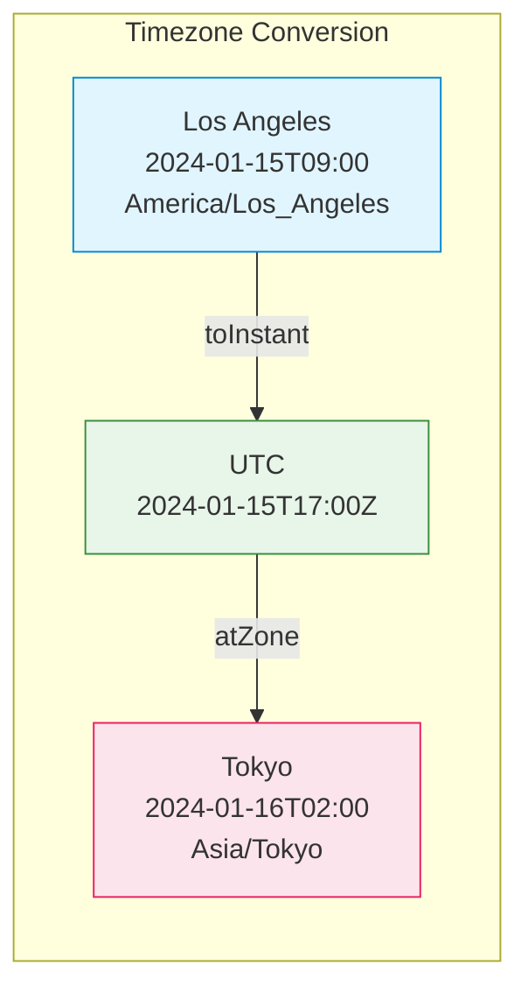

```java
// Convert between timezones
ZonedDateTime la = ZonedDateTime.of(
    LocalDateTime.of(2024, 1, 15, 9, 0),
    ZoneId.of("America/Los_Angeles")
);

ZonedDateTime tokyo = la.withZoneSameInstant(ZoneId.of("Asia/Tokyo"));
// 2024-01-16T02:00+09:00[Asia/Tokyo]

// To/from Instant (UTC timeline)
Instant instant = la.toInstant();
ZonedDateTime paris = instant.atZone(ZoneId.of("Europe/Paris"));
```

**Working with daylight saving time:**

```java
// DST transition example
ZoneId newYork = ZoneId.of("America/New_York");
ZonedDateTime beforeDST = ZonedDateTime.of(
    LocalDateTime.of(2024, 3, 10, 1, 30),  // Before DST
    newYork
);

ZonedDateTime afterDST = beforeDST.plusHours(2);      // Skips to 3:30
// DST transition at 2:00 AM — 2:00-2:59 doesn't exist!
```

---

#### Interoperability: Legacy ↔ Modern

When working with legacy code or libraries:

```java
// Legacy → Modern
Date legacyDate = new Date();
Instant instant = legacyDate.toInstant();
LocalDateTime ldt = LocalDateTime.ofInstant(instant, ZoneId.systemDefault());

// Modern → Legacy
LocalDateTime modern = LocalDateTime.now();
Instant inst = modern.atZone(ZoneId.systemDefault()).toInstant();
Date legacy = Date.from(inst);

// Calendar → Modern
Calendar cal = Calendar.getInstance();
Instant calInstant = cal.toInstant();
ZonedDateTime zdt = ZonedDateTime.ofInstant(calInstant, ZoneId.systemDefault());
```

---

#### Quick Decision Guide

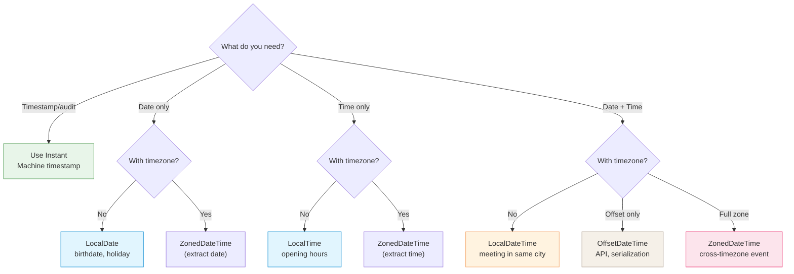

**Rules of thumb:**

1. **Use `Instant`** for:
   - Database timestamps
   - Audit logs
   - Event timestamps in distributed systems

2. **Use `LocalDate`/`LocalTime`/`LocalDateTime`** for:
   - User-facing dates (birthdays, appointments)
   - Business logic without timezone concerns
   - Internal application state

3. **Use `ZonedDateTime`** for:
   - Cross-timezone scheduling
   - User-specific timezone display
   - Calendar applications

4. **Use `OffsetDateTime`** for:
   - REST API responses (ISO-8601)
   - Serialization/deserialization
   - When you need offset but not full zone rules

5. **Avoid legacy `Date`/`Calendar`** unless:
   - Interfacing with old libraries
   - Required by external APIs

---

#### Common Patterns

**Birthday calculation:**

```java
public static int calculateAge(LocalDate birthDate) {
    return Period.between(birthDate, LocalDate.now()).getYears();
}

LocalDate birthday = LocalDate.of(1995, 5, 23);
int age = calculateAge(birthday);  // 28 (in 2024)
```

**Business days calculation:**

```java
public static long countBusinessDays(LocalDate start, LocalDate end) {
    return Stream.iterate(start, date -> date.plusDays(1))
        .limit(ChronoUnit.DAYS.between(start, end) + 1)
        .filter(date -> {
            DayOfWeek day = date.getDayOfWeek();
            return day != DayOfWeek.SATURDAY && day != DayOfWeek.SUNDAY;
        })
        .count();
}
```

**Recurring events:**

```java
// Every Monday at 10:00 for next 4 weeks
LocalDate start = LocalDate.now().with(TemporalAdjusters.next(DayOfWeek.MONDAY));
List<LocalDateTime> meetings = Stream.iterate(
        start.atTime(10, 0),
        dt -> dt.plusWeeks(1)
    )
    .limit(4)
    .toList();
```

**Database storage:**

```java
// Store as Instant (UTC) in database
Instant now = Instant.now();
// SQL: INSERT INTO events (timestamp) VALUES (?)
// Use PreparedStatement with Timestamp.from(now)

// Retrieve and convert to user's timezone
Instant dbInstant = resultSet.getTimestamp("timestamp").toInstant();
ZonedDateTime userTime = dbInstant.atZone(ZoneId.of("Europe/London"));
```

---

#### Performance Considerations

- **`Instant`** — Most efficient, uses `long` seconds + `int` nanos
- **`LocalDate`** — Three `int` fields (year, month, day)
- **`ZonedDateTime`** — Heavier due to zone rules lookup
- **Immutability** — All `java.time` objects are immutable, safe for caching

**Avoid:**

```java
// ❌ Creating formatters repeatedly
for (LocalDate date : dates) {
    String s = date.format(DateTimeFormatter.ofPattern("yyyy-MM-dd"));
}

// ✅ Reuse formatter (thread-safe)
DateTimeFormatter formatter = DateTimeFormatter.ofPattern("yyyy-MM-dd");
for (LocalDate date : dates) {
    String s = date.format(formatter);
}
```

---

## Other Language Features

| Feature                | Version | Description                                            | Example                                                |
|------------------------|---------|--------------------------------------------------------|--------------------------------------------------------|
| **Enums**              | 5       | Type-safe named constants, can have fields and methods | `enum Day { MON, TUE }`                                |
| **Annotations**        | 5       | Metadata on declarations                               | `@Override`, `@Deprecated`                             |
| **Autoboxing**         | 5       | Automatic conversion between primitives and wrappers   | `Integer i = 42;`                                      |
| **Varargs**            | 5       | Variable-length argument lists                         | `void log(String... msgs)`                             |
| **Enhanced for**       | 5       | Iterate over `Iterable` or array                       | `for (String s : list)`                                |
| **Try-with-resources** | 7       | Auto-close `AutoCloseable`                             | `try (var r = ...) {}`                                 |
| **Diamond operator**   | 7       | Infer generic type from context                        | `List<String> l = new ArrayList<>()`                   |
| **`var`**              | 10      | Local variable type inference                          | `var map = new HashMap<String, Integer>()`             |
| **Switch expressions** | 14      | `switch` returns a value, arrow syntax                 | `int x = switch(day) { case MON -> 1; default -> 0; }` |
| **Text blocks**        | 15      | Multi-line string literals                             | `"""{"key": "value"}"""`                               |
| **Unnamed variables**  | 22      | `_` for intentionally unused bindings                  | `catch (IOException _) { ... }`                        |
| **Stream Gatherers**   | 24      | Custom intermediate operations in streams              | `stream.gather(windowFixed(3))`                        |
| **Class‑File API**     | 25      | Standard API for parsing/generating bytecode           | `ClassFile.of().parse(bytes)`                          |

---

## Runtime Memory Layout

Java programs run inside an operating-system process. That process uses both
**JVM-managed memory** and **native process memory**.

It is useful to distinguish:

- **Process memory** — the total memory used by the Java process from the OS perspective
- **JVM runtime areas** — logical areas used by the JVM implementation
- **Heap** — where most Java objects live and where garbage collection operates

### Java process memory (high level)

## 1. Complete JVM Memory Picture

```mermaid
graph TB
    subgraph OS["🖥️ OPERATING SYSTEM"]
        subgraph PROCESS["⚙️ JVM PROCESS (java.exe)"]
            
            subgraph NATIVE_MEM["📦 Process Native Memory (Virtual Address Space)"]
                
                subgraph HEAP_AREA["🟢 JVM HEAP (shared by all threads)"]
                    direction TB
                    subgraph YOUNG["Young Generation"]
                        EDEN["Eden Space\n(new objects)"]
                        S0["Survivor 0"]
                        S1["Survivor 1"]
                    end
                    subgraph OLD["Old Generation (Tenured)"]
                        OLD_OBJ["Long-lived objects"]
                    end
                    
                    OBJ1["🔵 Object: Person\n{ name='Alice', age=30 }"]
                    OBJ2["🔵 Object: int[]\n{ 1,2,3,4,5 }"]
                    OBJ3["🔵 Object: String\n'Hello World'"]
                end

                subgraph METASPACE_AREA["🟣 METASPACE (native memory)"]
                    CLASS_META["Class Metadata"]
                    METHODS["Method Bytecode"]
                    STATIC_VARS["⚡ Static Variables\nClass.staticField"]
                    CONST_POOL["Constant Pool"]
                    STRING_POOL["String Pool (interned strings)"]
                end

                subgraph CODE_CACHE["🟡 CODE CACHE"]
                    JIT["JIT-compiled\nnative code"]
                end

                subgraph THREADS_MEM["🔴 THREAD MEMORY (separate for each thread)"]
                    
                    subgraph THREAD1["🧵 Thread-1 (main)"]
                        subgraph STACK1["Thread STACK (512KB-1MB)"]
                            direction TB
                            FRAME3["┌─ Stack Frame: main()\n│  args: String[] → REF→HEAP\n│  person → REF→HEAP\n│  numbers → REF→HEAP\n└─────────────────────"]
                            FRAME2["┌─ Stack Frame: calculate()\n│  x: int = 42  ← PRIMITIVE\n│  y: int = 10  ← PRIMITIVE\n│  result: int = 420\n└────────────────────"]
                            FRAME1["┌─ Stack Frame: process()\n│  obj → REF→HEAP\n│  flag: boolean = true\n│  count: long = 100L\n└────────────────────"]
                        end
                        PC1["PC Register\n(address of next instruction)"]
                        NATIVE_STACK1["Native Method Stack"]
                    end

                    subgraph THREAD2["🧵 Thread-2 (worker)"]
                        subgraph STACK2["Thread STACK (512KB-1MB)"]
                            FRAME4["┌─ Stack Frame: run()\n│  task → REF→HEAP\n│  i: int = 0\n└────────────────"]
                        end
                        PC2["PC Register"]
                        NATIVE_STACK2["Native Method Stack"]
                    end

                    subgraph THREAD3["🧵 Thread-3 (gc)"]
                        subgraph STACK3["Thread STACK"]
                            FRAME5["GC frames..."]
                        end
                        PC3["PC Register"]
                    end
                end

            end

            subgraph GC_ENGINE["♻️ GARBAGE COLLECTOR"]
                GC_LOGIC["Tracks references\nStack REF → Heap Objects\nCollects unreachable objects"]
            end
        end

        subgraph OS_KERNEL["🔧 OS KERNEL"]
            VMALLOC["Virtual Memory Allocator\n(mmap / VirtualAlloc)"]
            PHYS_MEM["Physical Memory Manager\n(RAM Pages)"]
            SWAP["💾 SWAP / Page File"]
        end
    end

    subgraph RAM["🔋 PHYSICAL MEMORY (RAM)"]
        RAM_PAGES["Memory Pages\n(4KB pages)"]
    end

    %% Connections: JVM requests memory from OS
    HEAP_AREA -->|"-Xms (start)\n-Xmx (max)\nmmap/VirtualAlloc"| VMALLOC
    THREADS_MEM -->|"-Xss per thread\nwhen creating a thread"| VMALLOC
    METASPACE_AREA -->|"-XX:MaxMetaspaceSize\nnative calls"| VMALLOC
    CODE_CACHE -->|"-XX:ReservedCodeCacheSize"| VMALLOC

    VMALLOC -->|"allocates virtual\npages"| PHYS_MEM
    PHYS_MEM -->|"mapping"| RAM_PAGES
    PHYS_MEM <-->|"page swapping"| SWAP

    %% Connections: Stack REF → Heap Objects
    FRAME3 -.->|"person REF"| OBJ1
    FRAME3 -.->|"numbers REF"| OBJ2
    FRAME1 -.->|"obj REF"| OBJ3
    FRAME4 -.->|"task REF"| OBJ1

    %% GC monitors
    GC_ENGINE -->|"scans Roots\n(Stack Frames)"| STACK1
    GC_ENGINE -->|"scans Roots"| STACK2
    GC_ENGINE -->|"manages"| HEAP_AREA

    %% Classes in Metaspace
    STATIC_VARS -.->|"static REF\nto objects"| HEAP_AREA

    %% Styles
    style HEAP_AREA fill:#e8f5e9,stroke:#4CAF50,color:#1b5e20
    style YOUNG fill:#f1f8e9,stroke:#66BB6A,color:#33691e
    style OLD fill:#e8f5e9,stroke:#388E3C,color:#1b5e20
    style METASPACE_AREA fill:#f3e5f5,stroke:#9C27B0,color:#4a148c
    style CODE_CACHE fill:#fff8e1,stroke:#FFA000,color:#3e2723
    style THREAD1 fill:#ffebee,stroke:#f44336,color:#b71c1c
    style THREAD2 fill:#ffebee,stroke:#f44336,color:#b71c1c
    style THREAD3 fill:#ffebee,stroke:#f44336,color:#b71c1c
    style STACK1 fill:#fce4ec,stroke:#EF9A9A,color:#880e4f
    style STACK2 fill:#fce4ec,stroke:#EF9A9A,color:#880e4f
    style STACK3 fill:#fce4ec,stroke:#EF9A9A,color:#880e4f
    style OS_KERNEL fill:#e8eaf6,stroke:#3F51B5,color:#1a237e
    style RAM fill:#e0f7fa,stroke:#00BCD4,color:#004d40
    style PROCESS fill:#fafafa,stroke:#78909C,color:#263238
    style OS fill:#eceff1,stroke:#546e7a,color:#263238
    style GC_ENGINE fill:#fffde7,stroke:#FDD835,color:#3e2723
    style THREADS_MEM fill:#fbe9e7,stroke:#FF5722,color:#bf360c
    style NATIVE_MEM fill:#eceff1,stroke:#607D8B,color:#263238
```

---

## 2. Relative Sizes of Heap Regions

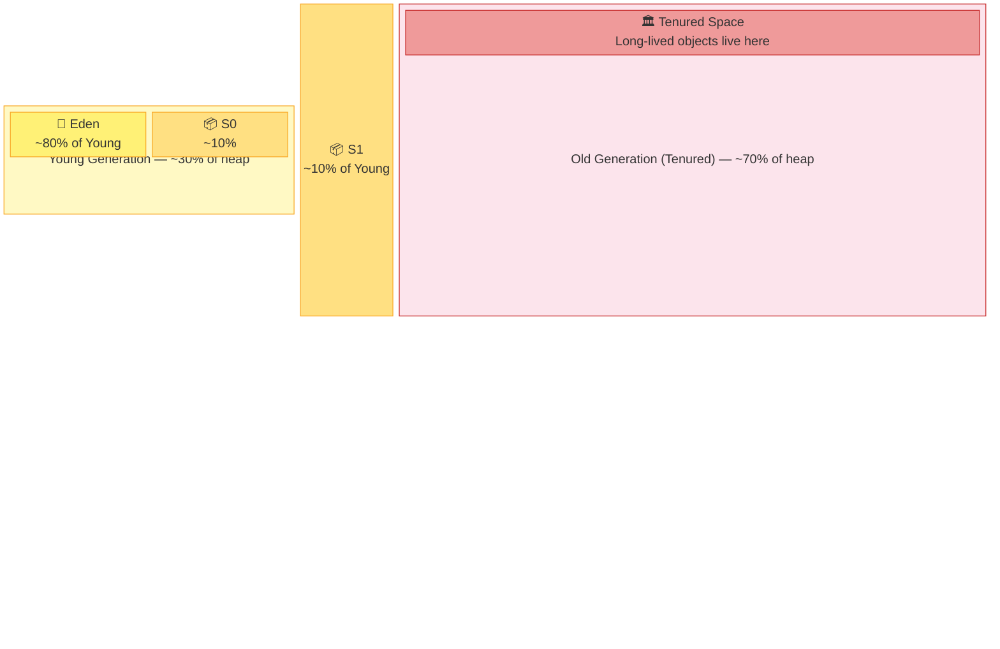

> **Typical defaults with G1GC**: The heap is divided dynamically into equal-sized regions
> (e.g., 2048 regions × some MB each), and G1 assigns them logically to Eden, Survivor,
> or Old. The old-to-young ratio adapts at runtime. The numbers above reflect typical
> initial proportions or the behavior of Parallel GC.

---

## 3. Object Lifecycle — What Lives Where and When Objects Move

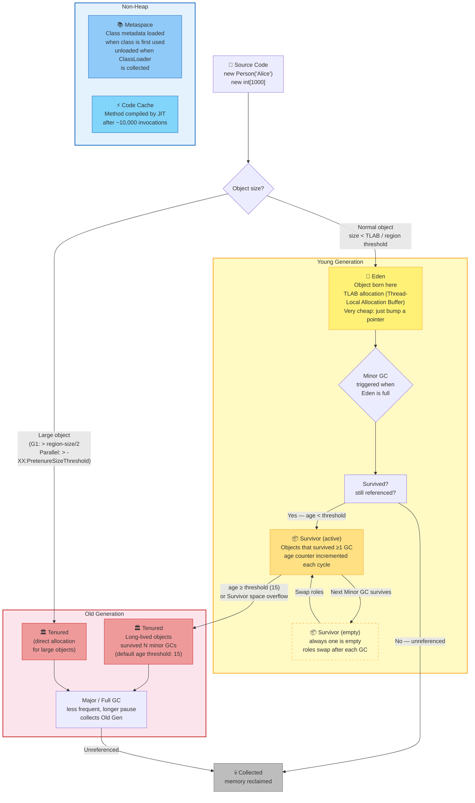

---

## 4. Stack Frame ↔ Heap: What Lives Where

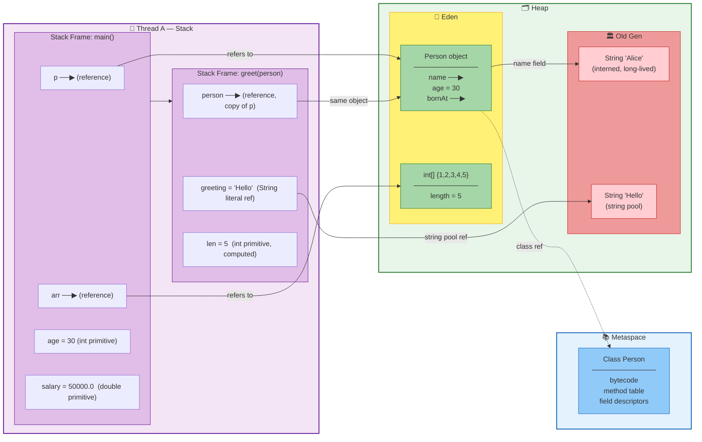

---

## 5. What Goes Where — Reference Table

| What                            | Where                                    | Rationale                                           |
|---------------------------------|------------------------------------------|-----------------------------------------------------|
| `new MyObject()`                | Eden (heap)                              | All new objects start in Eden                       |
| `new byte[50_000_000]`          | Old Gen directly                         | Large object threshold bypassed Young Gen           |
| `int x = 42` (local)            | Stack frame                              | Primitive local variable — no heap allocation       |
| `Integer x = 42`                | Eden (heap)                              | Autoboxed to object; cached −128..127 may be pooled |
| Object reference `p` (local)    | Stack frame                              | The reference itself; the object is in heap         |
| `static final String X = "hi"`  | String Pool → Old Gen                    | Interned strings are long-lived                     |
| `"literal"`                     | String Pool (Old Gen / Metaspace border) | Deduplicated by JVM                                 |
| Class metadata (`Person.class`) | Metaspace                                | Loaded once per ClassLoader                         |
| JIT-compiled method code        | Code Cache                               | After warm-up threshold (~10k invocations)          |
| `ByteBuffer.allocateDirect(n)`  | Off-heap (Direct)                        | Bypasses GC, managed by Cleaner                     |
| `Arena.allocate(n)` (FFM API)   | Off-heap (Direct)                        | Explicit lifetime via `Arena.close()`               |
| Surviving object after 15 GCs   | Old Gen (Tenured)                        | Age threshold crossed                               |

---

## 6. Survivor Space Rotation Across Minor GCs

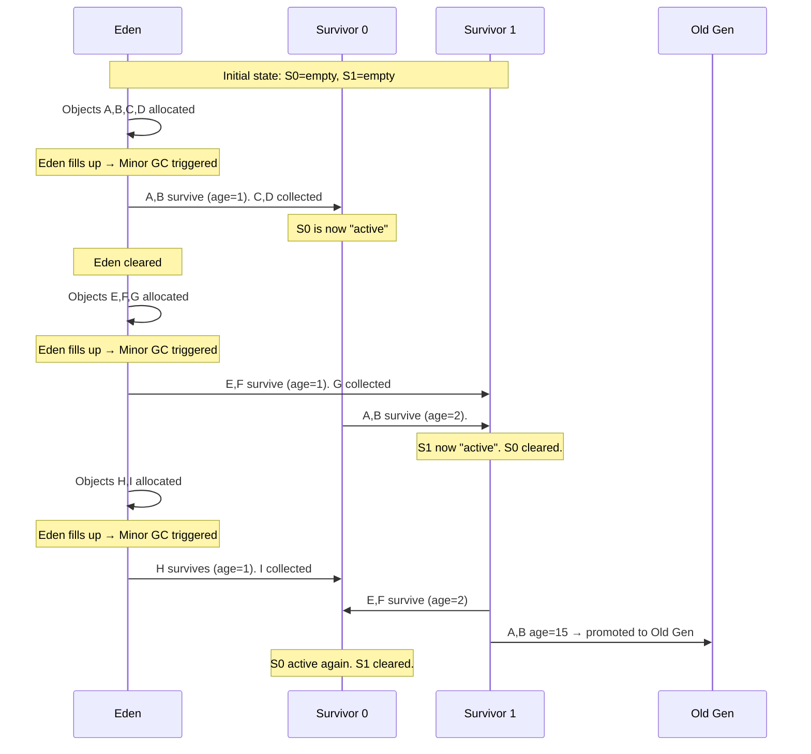

---

## 7. Minor GC vs Major GC vs Full GC

```mermaid
flowchart TD
    subgraph TRIGGERS["GC Trigger Conditions"]
        T1["Eden full\n→ Minor GC"]
        T2["Old Gen full / threshold\n→ Major GC (concurrent\nwith G1/ZGC/Shenandoah)"]
        T3["System.gc() call\nor JVM decision\n→ Full GC (stop-the-world)"]
    end

    subgraph MINOR["⚡ Minor GC"]
        M1["Stop-the-world pause\n(very short, ms range)"]
        M2["Scan Young Gen only"]
        M3["Copy live objects\nEden + active Survivor\n→ empty Survivor"]
        M4["Promote aged objects\n→ Old Gen"]
        M1 --> M2 --> M3 --> M4
    end

    subgraph MAJOR["🔄 Major / Concurrent GC (G1, ZGC)"]
        G1["Concurrent marking\n(runs alongside app)"]
        G2["Identify garbage regions\nin Old Gen"]
        G3["Mixed collections:\ncollect Young + some Old regions"]
        G4["Short evacuation pauses\nfor live objects"]
        G1 --> G2 --> G3 --> G4
    end

    subgraph FULL["🛑 Full GC (stop-the-world)"]
        F1["Pause ALL threads"]
        F2["Collect Young + Old + Metaspace"]
        F3["Compact heap"]
        F4["Resume threads"]
        F1 --> F2 --> F3 --> F4
    end

    T1 --> MINOR
    T2 --> MAJOR
    T3 --> FULL

    style MINOR fill:#e8f5e9,stroke:#2e7d32
    style MAJOR fill:#fff9c4,stroke:#f9a825
    style FULL fill:#fce4ec,stroke:#c62828
    style TRIGGERS fill:#e3f2fd,stroke:#1565c0
```

---

## 8. Code Annotation: What Goes Where

```java
public class MemoryExample {

    // ✅ Class metadata → Metaspace
    // ✅ Static field reference → Method Area / Old Gen
    private static final String GREETING = "Hello";

    // ✅ Instance fields — part of object layout on Heap
    private final String name;
    private int age;

    public MemoryExample(String name, int age) {
        // ✅ 'this' reference — on stack (current frame)
        // ✅ new object — allocated in Eden
        this.name = name;
        this.age = age;
    }

    public static void main(String[] args) {
        // ✅ 'example' reference — on stack (main frame)
        // ✅ new MemoryExample object — allocated in Eden
        MemoryExample example = new MemoryExample("Alice", 30);

        // ✅ 'age' — primitive, lives on stack (main frame)
        int age = example.age;

        // ✅ Large array — may go directly to Old Gen
        byte[] bigBuffer = new byte[100 * 1024 * 1024];

        // ✅ Direct buffer — off-heap, not GC-managed
        ByteBuffer direct = ByteBuffer.allocateDirect(4096);

        // ✅ After many GCs, 'example' may be promoted to Old Gen
        // ✅ 'age' (primitive) is always on the stack — never on heap
        // ✅ Boxed: goes to Eden, may be cached (-128..127)
        Integer boxed = age;
    }
}
// When main() returns:
// → stack frame for main() is destroyed
// → 'age' (int) is gone immediately
// → 'example', 'bigBuffer', 'direct' references are gone
// → objects they pointed to become eligible for GC
```

### Stack vs Heap

A useful mental model:

- **Local primitive values** such as `int x = 42` live in the current stack frame
- **Object instances** usually live on the heap
- **References** to objects may live in local variables, fields, or other objects

```java
Person p = new Person("Alice");
int age = 30;
```

Typical conceptual interpretation:

- `age` is a primitive local value in the current stack frame
- `p` is a reference stored in that frame
- the `Person` object itself lives on the heap

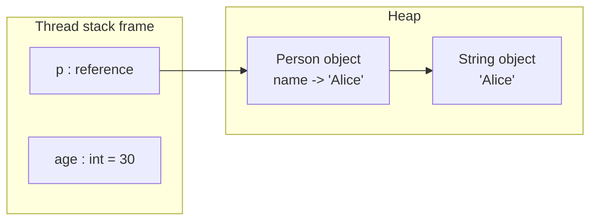

In practice, the JIT compiler may optimize this model using techniques such as
**escape analysis** and **scalar replacement**, so the low-level machine layout
does not always match the simple source-level picture.

### Main runtime areas

| Area                       | Shared?        | Typical contents                                                    | Reclaimed how                                        |
|----------------------------|----------------|---------------------------------------------------------------------|------------------------------------------------------|
| **Thread stack**           | No, per thread | Stack frames, local variables, references, partial results          | Automatically on method return / thread exit         |
| **Heap**                   | Yes            | Most Java objects and arrays                                        | Garbage collection                                   |
| **Young generation**       | Yes            | Newly allocated objects                                             | Minor GC                                             |
| **Old generation**         | Yes            | Long-lived objects                                                  | Major/mixed/concurrent GC depending on collector     |
| **Metaspace**              | Yes            | Class metadata, method metadata, runtime class structures           | Class unloading / JVM runtime                        |
| **Code cache**             | Yes            | JIT-compiled native machine code                                    | JVM runtime management                               |
| **Direct/off-heap memory** | Usually shared | NIO direct buffers, foreign memory segments, JNI/native allocations | Cleaner/arena/native lifecycle, not ordinary heap GC |

### Garbage Collectors

| GC             | JDK              | Best for                            |
|----------------|------------------|-------------------------------------|
| **G1**         | 9+ (default)     | Balanced throughput and latency     |
| **ZGC**        | 15+ (production) | Ultra-low pause, large heaps        |
| **Shenandoah** | 12+              | Low-pause, concurrent compaction    |
| **Serial**     | All              | Single-threaded, small heaps        |
| **Parallel**   | All              | Maximum throughput, batch workloads |

---

## Java Memory Model (JMM)

The **Java Memory Model** is not mainly about heap layout. It defines the rules
for **visibility**, **ordering**, and **synchronization** between threads.

Key ideas:

- Without synchronization, one thread may not immediately see another thread's writes
- The compiler, CPU, and JVM may reorder operations as long as single-thread semantics are preserved
- **`synchronized`**, **`volatile`**, thread start/join, and utilities in
  `java.util.concurrent` establish **happens-before** relationships
- Correct concurrent Java code depends on these guarantees, not on accidental timing

### Happens-before intuition

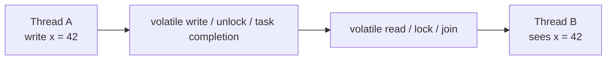

### Example with `volatile`

```java
class FlagExample {
    private static volatile boolean ready = false;
    private static int value = 0;

    static void writer() {
        value = 42;
        ready = true;   // volatile write
    }

    static void reader() {
        if (ready) {    // volatile read
            System.out.println(value); // guaranteed to see 42
        }
    }
}
```

A write to `ready` happens-before a subsequent read of `ready` in another thread,
so the earlier write to `value` becomes visible as well.

### Common synchronization tools

| Mechanism                                                      | Purpose                                        |
|----------------------------------------------------------------|------------------------------------------------|
| `synchronized`                                                 | Mutual exclusion + visibility guarantees       |
| `volatile`                                                     | Visibility and ordering for a single variable  |
| `final` fields                                                 | Safe publication guarantees after construction |
| `AtomicInteger`, `AtomicReference`, etc.                       | Lock-free atomic operations                    |
| `Lock`, `ReadWriteLock`, `StampedLock`                         | Explicit locking APIs                          |
| `ExecutorService`, `CompletableFuture`, structured concurrency | Higher-level coordination                      |

---

## Ecosystem and Tools

### Build and Dependency Management

| Tool       | Role                                                     |
|------------|----------------------------------------------------------|
| **Maven**  | Declarative build + dependency management (`pom.xml`)    |
| **Gradle** | Scriptable build with Groovy/Kotlin DSL (`build.gradle`) |
| **javac**  | Java compiler                                            |
| **java**   | JVM launcher                                             |
| **jar**    | Package Java archives                                    |
| **jshell** | REPL (Java 9+)                                           |

### Major Frameworks

| Framework           | Domain                   |
|---------------------|--------------------------|
| **Spring Boot**     | Web, REST, microservices |
| **Quarkus**         | Cloud-native, GraalVM    |
| **Micronaut**       | Fast startup, serverless |
| **Hibernate / JPA** | ORM, database mapping    |
| **Jakarta EE**      | Enterprise standards     |

### Testing Ecosystem

| Tool               | Role                                   |
|--------------------|----------------------------------------|
| **JUnit 5**        | Unit testing                           |
| **Mockito**        | Mocking framework                      |
| **AssertJ**        | Fluent assertions                      |
| **Testcontainers** | Integration tests with real containers |

---

## Influence

### Languages on the JVM (or inspired by Java)

| Language    | Year | Relation                                                         |
|-------------|------|------------------------------------------------------------------|
| **Groovy**  | 2003 | Dynamic JVM language, scripting                                  |
| **Scala**   | 2004 | JVM, FP + OOP, Akka ecosystem                                    |
| **Clojure** | 2007 | JVM, Lisp, immutability first                                    |
| **Kotlin**  | 2011 | JVM, concise Java, null safety, coroutines                       |
| **Dart**    | 2011 | Java-like syntax, Flutter frontend                               |
| **C#**      | 2000 | .NET parallel: similar exception model, generics, evolution path |

### Java's Impact on Platform Design

- **JVM as a compilation target** — Scala, Kotlin, Clojure, Groovy all
  compile to JVM bytecode, benefiting from Java's tooling and GC
- **Generics with type erasure** — a trade-off that influenced how later
  languages (Kotlin reified generics, C# reified generics) made different
  choices
- **Checked exceptions** — widely debated and mostly abandoned in successor
  languages; Kotlin, Scala, and Groovy do not adopt them in the same way

---

## Strengths and Weaknesses

### Strengths

| Strength                   | Detail                                             |
|----------------------------|----------------------------------------------------|
| **Platform independence**  | Write once, run anywhere — JVM abstraction         |
| **Backward compatibility** | Strong long-term compatibility across releases     |
| **Ecosystem depth**        | Maven Central contains a vast library ecosystem    |
| **Tooling**                | IntelliJ IDEA, JUnit, profilers, monitoring        |
| **Safety**                 | No raw pointers, strong typing, GC                 |
| **Concurrency**            | `java.util.concurrent`, virtual threads (Java 21+) |
| **Enterprise adoption**    | Standard in banking, finance, large-scale systems  |
| **GraalVM**                | Ahead-of-time native compilation for fast startup  |

### Weaknesses

| Weakness                  | Detail                                                                                    |
|---------------------------|-------------------------------------------------------------------------------------------|
| **Verbosity**             | Getters/setters, checked exceptions, boilerplate (mitigated by records and modern syntax) |
| **JVM startup**           | Slower cold start vs native binaries (mitigated by GraalVM, CDS, AOT options)             |
| **Type erasure**          | Generic type info not generally available at runtime                                      |
| **Primitive boxing**      | Performance cost converting between `int` and `Integer`                                   |
| **Null**                  | `null` is still part of the language                                                      |
| **Slow feature adoption** | Some major features arrived later than in competing languages                             |

---

## Code Examples

See [`examples/java/`](../../../examples/java/index.md) for runnable code:

| Example                                                                                 | Focus                                        |
|-----------------------------------------------------------------------------------------|----------------------------------------------|
| [01 Hello World](../../../examples/java/01-hello-world/README.md)                       | Class structure, `main` method               |
| [02 Variables & Types](../../../examples/java/02-variables-and-types/README.md)         | Primitives, wrappers, `var`                  |
| [03 Functions](../../../examples/java/03-functions/README.md)                           | Methods, overloading, recursion              |
| [04 Control Flow](../../../examples/java/04-control-flow/README.md)                     | Loops, conditionals, switch expressions      |
| [05 Data Structures](../../../examples/java/05-data-structures/README.md)               | Lists, Maps, Sets, records                   |
| [06 OOP / Modules](../../../examples/java/06-oop-modules/README.md)                     | Packages, interfaces, inheritance            |
| [07 FP Features](../../../examples/java/07-fp-features/README.md)                       | Lambdas, streams, `Optional`                 |
| [08 Error Handling](../../../examples/java/08-error-handling/README.md)                 | Checked/unchecked, try-with-resources        |
| [09 Concurrency](../../../examples/java/09-concurrency/README.md)                       | Threads, executors, virtual threads          |
| [10 Testing](../../../examples/java/10-testing/README.md)                               | JUnit 5, Mockito, AssertJ                    |
| [11 Advanced Streams](../../../examples/java/11-streams-advanced/README.md)             | Reduce, mapMulti, takeWhile, merge           |
| [12 Thread States](../../../examples/java/12-concurrency-thread-states/README.md)       | BLOCKED, WAITING, TIMED_WAITING              |
| [13 Structured Concurrency](../../../examples/java/13-concurrency-structured/README.md) | ShutdownOnFailure, ShutdownOnSuccess         |
| [14 Variance & Generics](../../../examples/java/14-variance-generics/README.md)         | Invariance, covariance, contravariance, PECS |

---

## Related Authors

- [James Gosling](../../authors/james-gosling.md) — creator of Java
- [Ole-Johan Dahl](../../authors/ole-johan-dahl.md) — Simula, the OOP foundation
- [Alan Kay](../../authors/alan-kay.md) — Smalltalk, message-passing OOP
- [Bjarne Stroustrup](../../authors/bjarne-stroustrup.md) — C++, syntactic ancestor
- [Barbara Liskov](../../authors/barbara-liskov.md) — CLU, ADT, LSP (influences Java interfaces)
- [Martin Fowler](../../authors/martin-fowler.md) — Refactoring patterns in Java

---

## Related Topics

- [OOP & Design](../../topics/design/index.md) — SOLID, GoF patterns, interfaces in practice
- [Type Systems](../../topics/types/index.md) — static nominal typing, generics, type erasure
- [Architecture](../../topics/architecture/index.md) — Java in enterprise, DDD, microservices
- [Concurrency](../../topics/concurrency/index.md) — threads, executors, virtual threads, CSP comparison
- [Testing & Delivery](../../topics/process/index.md) — JUnit, TDD, CI/CD on JVM

---

## Further Reading

| Author                       | Title                             | Year       | Focus                            |
|------------------------------|-----------------------------------|------------|----------------------------------|
| Gosling, Joy, Steele, Bracha | *The Java Language Specification* | 1996       | Language reference               |
| Bloch                        | *Effective Java*                  | 2001, 2018 | Idiomatic usage, best practices  |
| Goetz et al.                 | *Java Concurrency in Practice*    | 2006       | Threading, memory model          |
| Evans                        | *Domain-Driven Design*            | 2003       | DDD patterns often in Java       |
| Fowler                       | *Refactoring*                     | 1999, 2018 | Java-centric refactoring catalog |
| Gamma et al.                 | *Design Patterns*                 | 1994       | GoF patterns, Java examples      |

---

## Quotes

> "Java is C++ without the guns, knives, and clubs."
> — James Gosling

> "Compatibility is a constraint, not a goal."
> — Brian Goetz, on balancing evolution and stability

> "Make illegal states unrepresentable."
> — Yaron Minsky — a principle Java Records and Sealed Classes move toward

---

*See [Languages Index](../../languages/index.md) for other language profiles.*  
*See [Language Genealogy Map](../../maps/languages-genealogy.md) for the family tree.*
