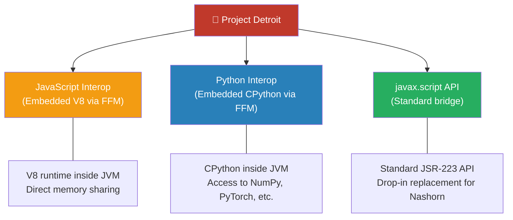
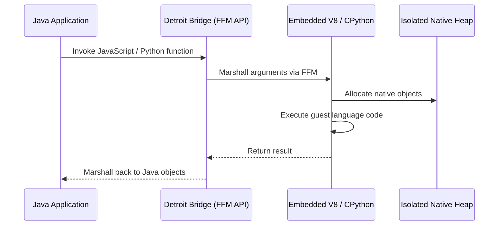
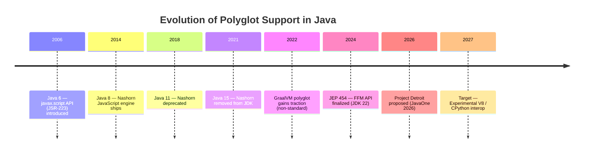
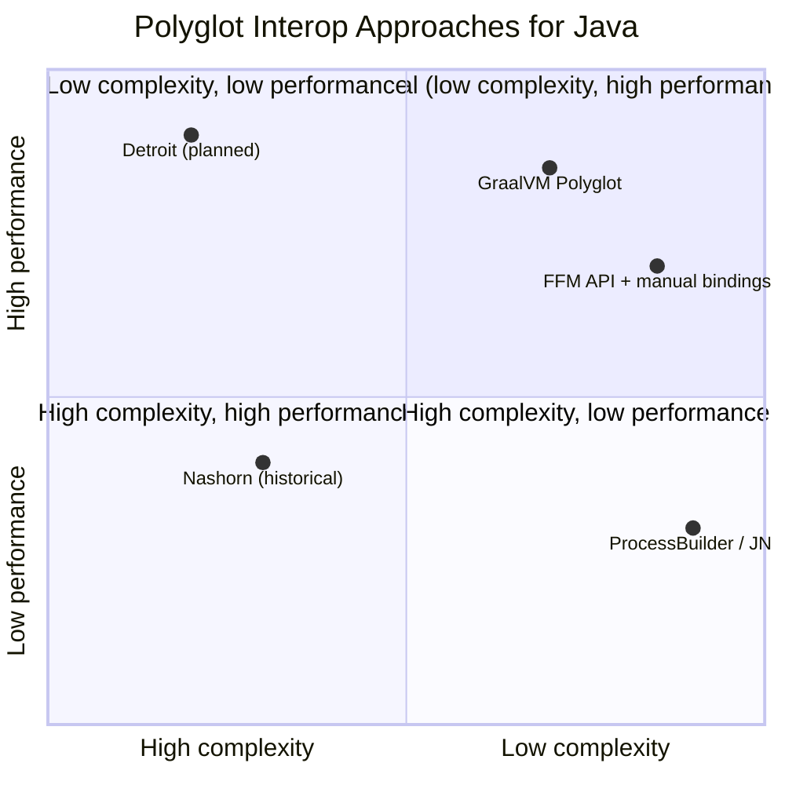

# Project Detroit

> **Status:** 🔴 Early proposal — no implemented features in JDK as of March 2026 (JavaOne 2026).  
> **Goal:** Fast interoperability between Java, JavaScript, and Python via the `javax.script` API and embedded language runtimes.

Project Detroit aims to provide fast, seamless interoperability between Java and other popular languages — specifically JavaScript and Python. Unlike previous approaches (Nashorn, GraalVM polyglot) that required separate tooling or complex native bridges, Detroit embeds V8 and CPython runtimes directly inside the JVM process using the Foreign Function & Memory (FFM) API, enabling native-language compatibility with clear heap isolation.

The key insight: with the rise of AI and data science, there is strong demand to access Python-based AI libraries and JavaScript ecosystems from Java applications. Detroit bridges that gap by providing a first-class, high-performance polyglot interop layer built on standard OpenJDK APIs.

---

## Planned Technologies

| # | Technology | Java version | Status | Page |
|---|---|---|---|---|
| 01 | Java ↔ JavaScript Interop | N/A | Proposal | [01-js-interop.md](01-js-interop.md) |
| 02 | Java ↔ Python Interop | N/A | Proposal | [02-python-interop.md](02-python-interop.md) |
| 03 | `javax.script` API Bridge | N/A | Proposal | [03-script-api-bridge.md](03-script-api-bridge.md) |

---

## Architectural Overview

### The Problem Before Detroit

Current polyglot interop in the Java ecosystem requires developers to choose between suboptimal approaches:

- **GraalVM Polyglot** – Powerful but requires GraalVM distribution, not available in standard OpenJDK.
- **JEP 454 (FFM API) + Manual Bindings** – Flexible but requires hand-written native bindings for every language runtime.
- **ProcessBuilder / JNI** – High overhead, complex memory management, fragile cross-platform support.
- **Nashorn (removed in JDK 15)** – No longer available; previous `javax.script` implementation abandoned.

The result: Java developers lack a standard, high-performance way to call JavaScript and Python code from within the JVM.

### The Three Pillars of Detroit

### How Cross-Language Calls Work

---

## Evolution of Polyglot Support in Java

---

## Comparison of Polyglot Approaches

---

## Relationship with Other OpenJDK Projects

| Project | Area | Interaction with Detroit |
|---|---|---|
| **Panama** | Native interop | Detroit builds directly on the FFM API (JEP 454) for embedding V8 and CPython. |
| **Loom** | Virtual threads | Guest language callbacks can be scheduled on virtual threads for massive concurrency. |
| **Amber** | Language features | Pattern matching and records simplify marshalling data between Java and guest languages. |
| **Leyden** | Startup | Pre-linked native runtimes can be cached in AOT images for sub-second polyglot startup. |

---

## See Also

- [FFM API](../../11-foreign-function-memory-api.md) — Foreign Function & Memory API (Panama)
- [JEP 454](https://openjdk.org/jeps/454) — FFM API final specification
- [javax.script documentation](https://docs.oracle.com/en/java/javase/21/docs/api/java.script/javax/script/package-summary.html) — Standard scripting API
- [GraalVM Polyglot](https://www.graalvm.org/latest/reference-manual/polyglot-programming/) — Comparison with GraalVM approach
