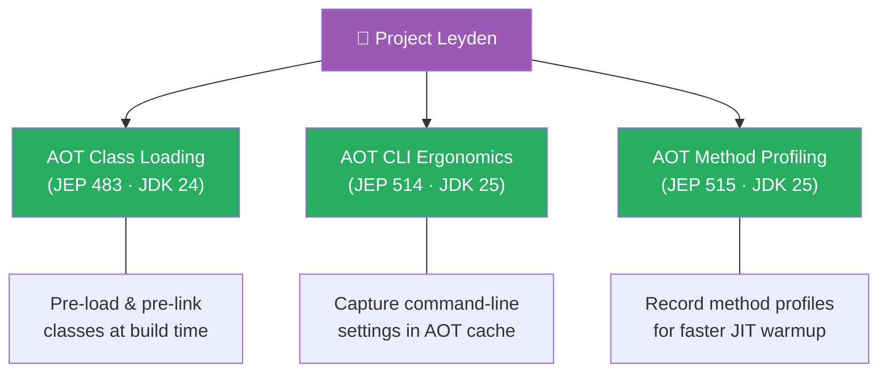
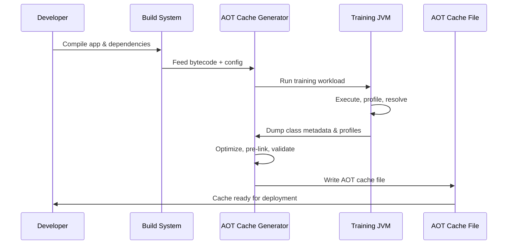
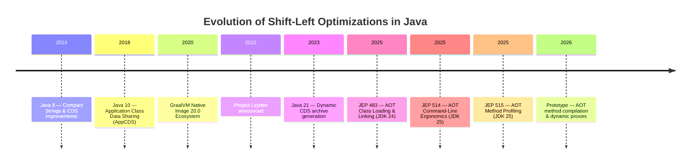
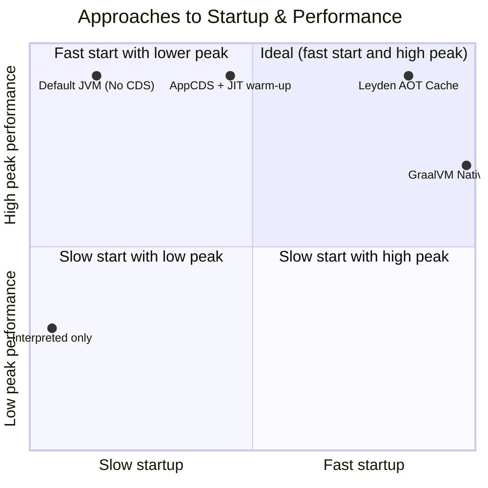

# Project Leyden

> **Status:** 🔄 Actively evolving — officially part of the JDK, integration of new capabilities continues.  
> **Goal:** "Shift-left" optimizations: move work from runtime to build/training time to dramatically improve startup, time-to-peak performance, and footprint.

Project Leyden explores a holistic approach to optimizing Java application startup, warm-up, and footprint. Instead of relying solely on Just-In-Time (JIT) compilation at runtime, it introduces ahead-of-time (AOT) optimizations that process the application before deployment — shifting class loading, profiling, and other runtime work to build or training time.

The key insight: many runtime operations (such as class loading, bytecode verification, and early profiling) are repeated identical actions every time an application starts. By shifting these computations to earlier compilation or training phases, we eliminate redundant runtime overhead and reach peak performance faster.

---

## Delivered & In-Progress Technologies

| # | Technology | Java version | Status | Page |
|---|---|---|---|---|
| 01 | AOT Class Loading & Linking (JEP 483) | JDK 24 | Released | [01-aot-class-loading.md](01-aot-class-loading.md) |
| 02 | AOT Command-Line Ergonomics (JEP 514) | JDK 25 | Released | [02-aot-cli-ergonomics.md](02-aot-cli-ergonomics.md) |
| 03 | AOT Method Profiling (JEP 515) | JDK 25 | Released | [03-aot-method-profiling.md](03-aot-method-profiling.md) |
| 04 | AOT Method Compilation | N/A | Prototype | [04-aot-method-compilation.md](04-aot-method-compilation.md) |
| 05 | Dynamic Proxy & Reflection Data Generation | N/A | Prototype | [05-proxy-reflection-generation.md](05-proxy-reflection-generation.md) |
| 06 | AOT Class Lookup Optimization | N/A | Prototype | [06-aot-class-lookup.md](06-aot-class-lookup.md) |

---

## Architectural Overview

### The Problem Before Leyden

The standard Java Virtual Machine execution model performs significant heavy lifting at launch and during the "warm-up" phase:

- **Class Loading & Verification** – Re-parsed and validated on every single execution.
- **Interpretation & Profiling** – Hundreds of thousands of methods must execute interpreted before Tier-4 JIT compilation triggers.
- **Dynamic Reflection & Annotation Scanning** – Enterprise frameworks scan classpaths dynamically at runtime boot.
- **Large Memory Footprint** – The JIT's code cache, profiling data structures, and metadata consume precious resident memory.

These factors delay time-to-peak performance and inflate initial resource consumption, presenting obstacles in containerized serverless or scale-to-zero environments.

### The Three Pillars of Leyden

### How AOT Caching Works

---

## Evolution of "Shift-Left" Optimizations in Java

---

## Comparison of Startup Approaches

---

## Relationship with Other OpenJDK Projects

| Project | Area | Interaction with Leyden |
|---|---|---|
| **Loom** | Virtual threads | AOT caches can pre-warm virtual thread schedulers and thread-local structures. |
| **Valhalla** | Value types | Flat object arrays and value objects simplify constant folding during AOT preparation. |
| **GraalVM** | AOT compiler | Leyden targets common interfaces to unify HotSpot JIT optimization metadata and Graal-style static analysis. |
| **Lilliput** | Object headers | Reduced object headers further shrink the metadata footprint within AOT cache files. |

---

## See Also

- [JEP 483: Ahead-of-Time Class Loading and Linking](https://openjdk.org/jeps/483) — First integrated Leyden milestone
- [JEP 514: Ahead-of-Time Command-Line Ergonomics](https://openjdk.org/jeps/514) — CLI settings in AOT cache
- [JEP 515: Ahead-of-Time Method Profiling](https://openjdk.org/jeps/515) — Method profiles for faster JIT warmup
- [Class Data Sharing (CDS)](/java/class-data-sharing) — Foundation serialization technology
- [GraalVM Native Image](https://www.graalvm.org/) — Enterprise closed-world AOT comparison
- [Performance examples](../../../examples/java/15-performance/README.md)
