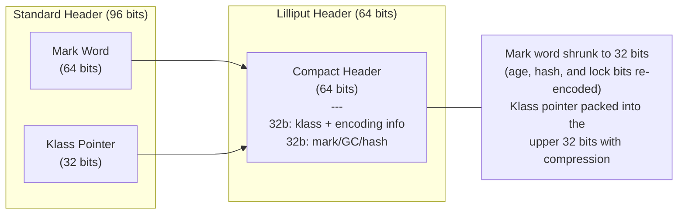
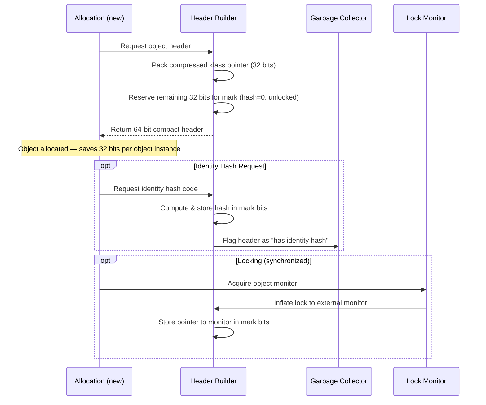
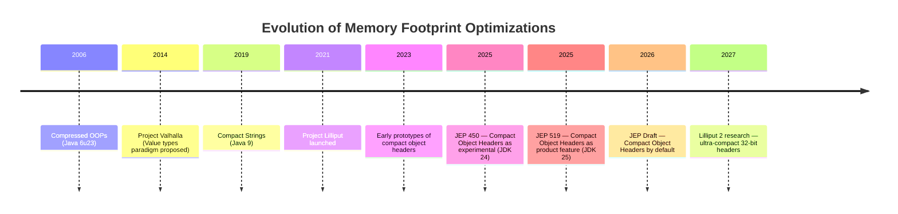
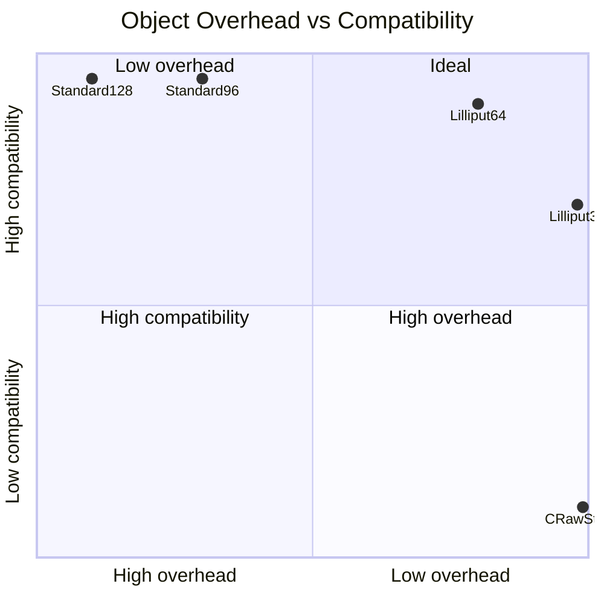

# Project Lilliput

> **Status:** 🟢 Actively developing — moving toward compact object headers by default. Compact headers are now a product feature in JDK 25.  
> **Goal:** Reduce Java object header size from 128 bits to 64 bits (or even 32 bits in certain configurations), dramatically lowering memory footprint for applications with many small objects.

Project Lilliput attacks one of the most fundamental memory overheads in the JVM: every Java object carries an implicit header containing a mark word and a klass pointer. In standard 64-bit JVMs, this header is 128 bits; even with compressed ordinary object pointers (oops) enabled, the metadata overhead remains at 96 bits. Lilliput shrinks this total header to 64 bits (32-bit mark word + 32-bit compressed klass pointer) — and eventually down to 32 bits — without sacrificing platform features like locking, GC tracking, identity hash code, and dynamic type checks.

The key insight: applications handling millions of small objects (such as high-throughput microservices and real-time streaming pipelines) spend a significant portion of their heap on headers. Halving this overhead can yield overall heap savings of 10% to 20% while boosting CPU cache line efficiency.

---

## Delivered & Planned Technologies

| # | Technology | Java version | Status | Page |
|---|---|---|---|---|
| 01 | Compact Object Headers (JEP 450) | JDK 24 | Experimental | [01-compact-headers-jep450.md](01-compact-headers-jep450.md) |
| 02 | Compact Object Headers Product (JEP 519) | JDK 25 | Released | [02-compact-headers-jep519.md](02-compact-headers-jep519.md) |
| 03 | Compact Object Headers by Default | TBD | JEP Draft | [03-compact-headers-default.md](03-compact-headers-default.md) |
| 04 | Ultra-Compact Headers (Lilliput 2) | N/A | Research | [04-ultra-compact-headers.md](04-ultra-compact-headers.md) |

---

## Architectural Overview

### The Problem Before Lilliput

A typical Java object layout on a 64-bit JVM with compressed oops:

```
|   0..7   |   8..15  |  16..19  |  20..23  |  24..    |
|----------|----------|----------|----------|----------|
|  mark    |  klass   |  field1  |  field2  |  ...     |
64 bits    32 bits    32 bits    32 bits
```

- **Mark Word (64 bits):** Stores locking status, GC age, and identity hash code.
- **Klass Pointer (32 bits compressed):** References class metadata.
- **Total Header:** 96 bits (128 bits without compressed oops).

For a small object with a single `int` field, the header requires **96 bits** of overhead to store a **32-bit** payload — an efficiency loss of 75%.

### The Compact Header Layout

Lilliput's 64-bit compact header merges mark and klass information into a single word:



### How Object Allocation Changes



---

## Evolution of Memory Footprint Optimizations in Java



---

## Comparison of Object Overhead



---

## Relationship with Other OpenJDK Projects

| Project | Area | Interaction with Lilliput |
|---|---|---|
| **Valhalla** | Value types | Non-identity value objects can bypass object headers entirely. Lilliput provides maximum benefit to legacy identity-bound objects. |
| **Leyden** | Static images | Compact headers reduce AOT cache runtime memory layout footprint and decrease snapshot sizes. |
| **ZGC / G1** | Garbage collectors | Reducing the header requires changes to GC marking protocols. The project is developed in close coordination with GC teams. |
| **Loom** | Virtual threads | Smaller object headers reduce the overhead of thread-local carrier structures and virtual thread frames. |

---

## See Also

- [JEP 450: Compact Object Headers](https://openjdk.org/jeps/450) — Experimental feature in JDK 24
- [JEP 519](https://openjdk.org/jeps/519) — Compact Object Headers promoted to product feature in JDK 25
- [Object Layout in the JVM](/java/memory-layout) — Deep-dive layout reference
- [Compressed OOPs](/java/compressed-oops) — Pointer compression implementation details
- [Memory footprint examples](../../../examples/java/14-memory-footprint/README.md)
