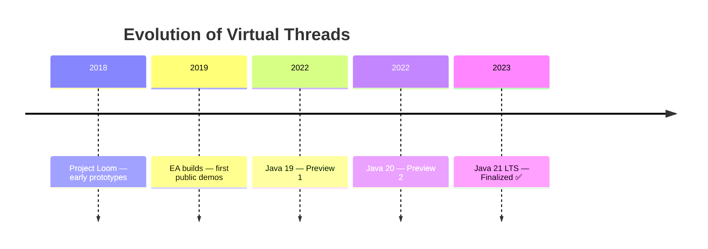
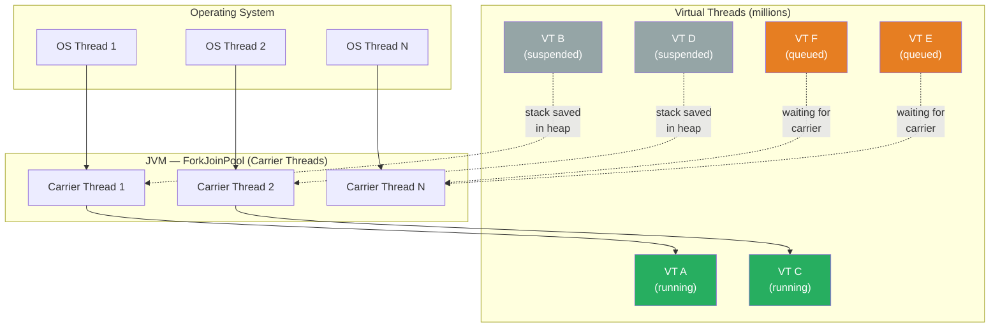
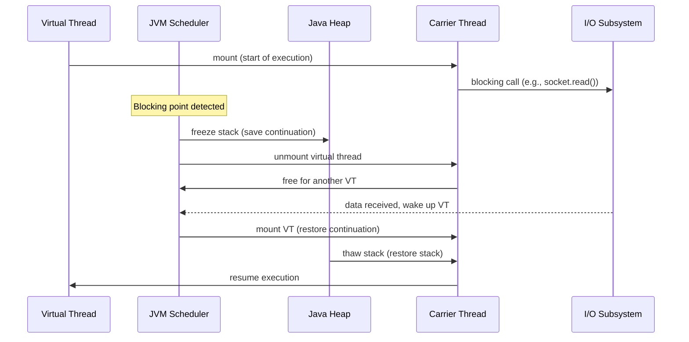
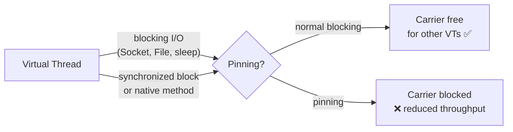
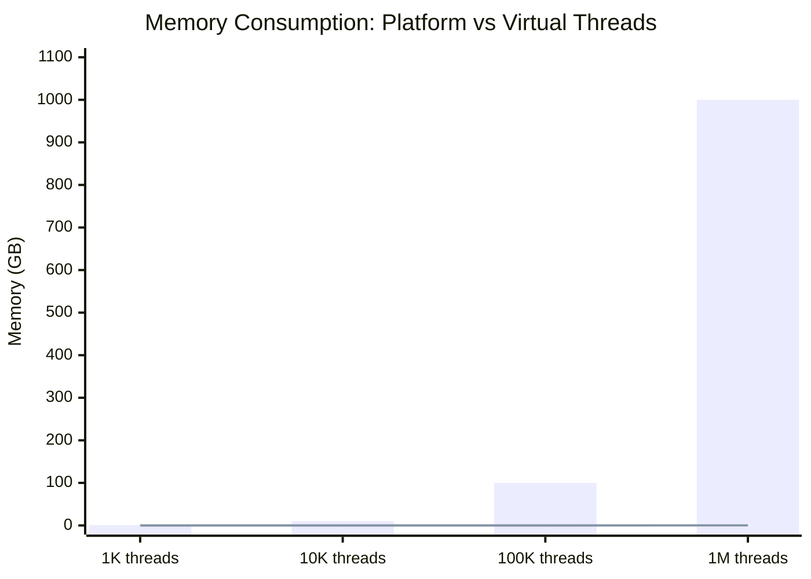

# Virtual Threads

> **Project:** Loom
> **Java version:** 21 (final)
> **Status:** Released

Virtual threads are the flagship feature of Project Loom. They are lightweight threads managed by the JVM rather than the operating system, enabling applications to handle millions of concurrent tasks with minimal overhead.

For the complete API reference and usage patterns, see the main feature page: [Virtual Threads](../../08-virtual-threads.md).

---

## History and Evolution

### The Problem: Expensive OS Threads

Java's original threading model (since 1.0) uses **platform threads** — each `Thread` object maps to one OS thread. This 1:1 mapping creates a fundamental scalability ceiling:

- **Memory**: ~1 MB stack per thread × 10,000 threads = ~10 GB
- **Creation**: hundreds of microseconds per thread
- **Context switching**: through the OS kernel, expensive

The traditional answer was thread pools. But they introduce their own complexity: sizing, saturation policies, deadlocks from nested pool exhaustion.

### The Reactive Alternative (2013–2015)

The Java ecosystem came to reactive programming (`CompletableFuture`, RxJava, Project Reactor, Vert.x). Reactive frameworks avoid blocking threads by building callback chains:

```java
// Reactive style — no blocking, but hard to read and debug
fetchUser(id)
    .thenCompose(user -> fetchOrders(user))
    .thenAccept(orders -> process(orders));
```

Reactive code scales but has well-known drawbacks:
- **Callback hell** — deeply nested chains
- **Lost stack traces** — errors propagate through framework internals
- **Infectious** — once you start writing reactively, the whole codebase must adapt

### The Loom Solution (2018–2026)

Project Loom asked: what if we could have the scalability of reactive with the simplicity of blocking code?

The answer — virtual threads. First previewed in Java 19 (2022), finalized in Java 21 (2023).



Key design decisions:
- **No new language constructs** — `Thread.ofVirtual()` and `Executors.newVirtualThreadPerTaskExecutor()`
- **Compatible with existing code** — any blocking I/O automatically frees the carrier thread
- **Cooperative scheduling** — the JVM manages suspension/resumption at known blocking points

---

## Architecture: Carrier Thread Model

### M:N Scheduling Diagram



### Lifecycle During Blocking



---

## Continuations Under the Hood

Virtual threads are built on a low-level JVM construct — **continuations** (not part of the public API). A continuation is a suspendable computation: a snapshot of a thread's call stack that can be saved and resumed later.

The JVM team modified the interpreter and JIT compiler to support efficient stack copying:
- **Frozen stacks** are copied to the Java heap
- **Hot paths** are optimized by the JIT to minimize copy overhead
- **Pinning** occurs when native code or `synchronized` blocks prevent stack migration

---

## Thread Pinning

Virtual threads can become "pinned" to a carrier thread, defeating the purpose:



| Cause | Why it pins | Mitigation |
|---|---|---|
| `synchronized` block | Monitor held on the carrier thread | Use `ReentrantLock` |
| Native method call | Native stack cannot be migrated | Minimize blocking in native code |

When a thread is pinned, the carrier cannot serve other virtual threads until the pinning operation completes. The JVM detects and logs pinning events with the flag `-Djdk.tracePinnedThreads=full`.

> **Java 21+**: `synchronized` blocks no longer cause pinning in most cases — the JVM learned to unmount virtual threads inside `synchronized`. Pinning remains a problem only for native methods and old JNI code.

---

## Migration Path

### For Code with Fixed Thread Pools

```java
// Before: carefully tuned pool size
ExecutorService executor = Executors.newFixedThreadPool(200);

// After: unlimited, each task gets its own virtual thread
ExecutorService executor = Executors.newVirtualThreadPerTaskExecutor();
```

### For Reactive Code

Reactive code can be migrated gradually:
1. Replace `CompletableFuture` chains with direct blocking calls inside virtual threads
2. Keep reactivity at the boundaries (framework integration) where it provides value
3. Use `StructuredTaskScope` (also from Loom) for parallel subtasks

---

## Performance Characteristics

| Metric | Platform Thread | Virtual Thread |
|---|---|---|
| Creation time | ~1 ms | ~1 µs (1000× faster) |
| Memory per thread | ~1 MB | ~200 bytes (stack on heap) |
| Max concurrent | ~10,000 | Millions |
| Context switch | OS kernel | JVM user space |
| Best for | CPU-bound, long-lived | I/O-bound, short-lived |



---

## See Also

- [Virtual Threads — main feature page](../../08-virtual-threads.md)
- [Structured Concurrency](02-structured-concurrency.md) — another key Loom feature
- [Scoped Values](03-scoped-values.md) — context for virtual threads
- [Concurrency Utilities](../../15-concurrent.md) — traditional `java.util.concurrent`
- [Examples: Concurrency](../../../examples/java/09-concurrency/README.md)
