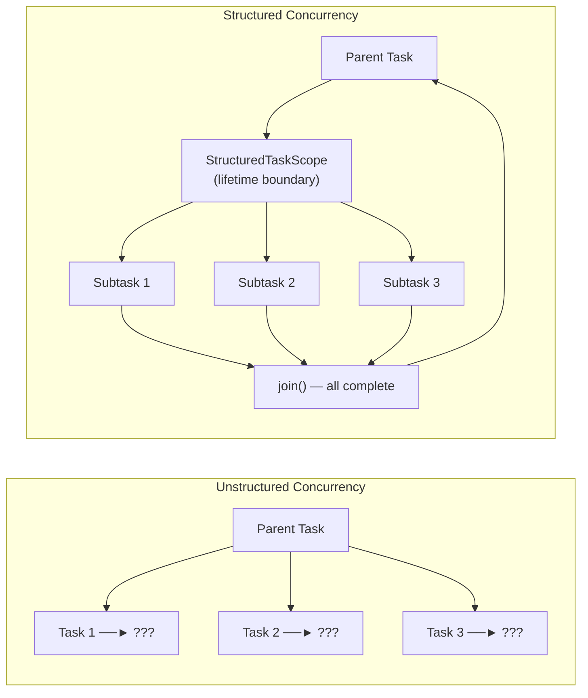
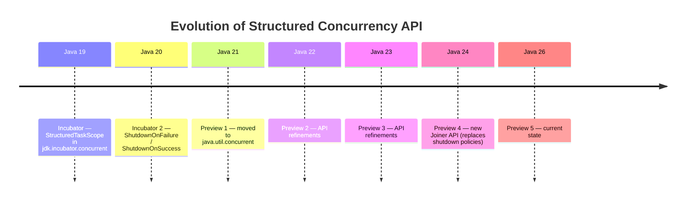
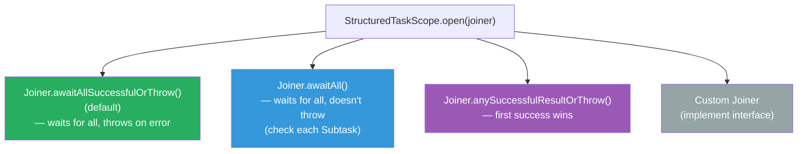
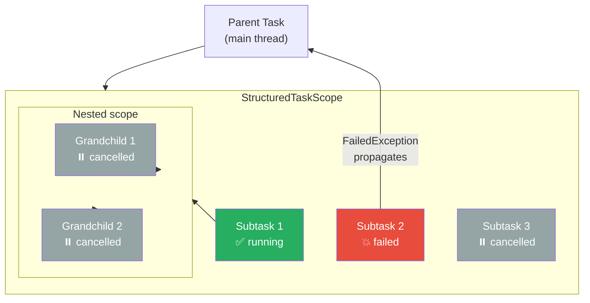
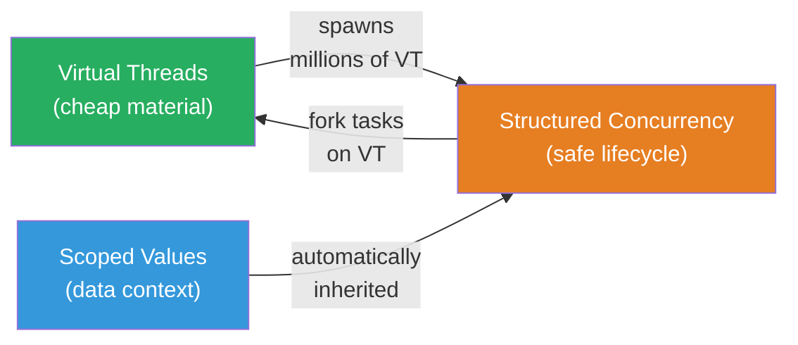

# Structured Concurrency

> **Project:** Loom
> **Java version:** 26
> **Status:** Preview 5

Structured Concurrency treats a group of related concurrent tasks as a single unit of work. Tasks are forked, joined, and cleaned up together within a well-defined scope. This eliminates the "fire and forget" anti-pattern that leads to resource leaks and orphaned threads.

> ⚠️ **Preview API**: Usage in Java 26 requires `--enable-preview` flags at compile and runtime. The API may change in future versions before finalization.

For the complete API reference and usage patterns, see the main feature page: [Scoped Values and Structured Concurrency](../../12-structured-concurrency.md).

---

## History and Evolution

### The Problem of Unstructured Concurrency

Traditional concurrent Java code looks like this:

```java
Future<String> f1 = executor.submit(() -> fetchUser());
Future<String> f2 = executor.submit(() -> fetchOrders());
// What if f1 fails? f2 keeps running, consuming resources.
// What if the caller is interrupted? f1 and f2 are orphaned.
// What if a timeout is needed? Writing it correctly is a whole quest.
```

This is **unstructured concurrency**: tasks are launched into the void with no lifecycle tied to their parent. Problems:

- **Orphaned tasks** — a crashed parent leaves children running forever
- **Resource leaks** — cancelled tasks don't free connections and file descriptors
- **Lost errors** — an exception in one task may never reach the caller
- **No composition** — nested concurrency turns into a tangle of `Future` objects

### Analogy with Structured Programming

In the 1960s, Dijkstra in "Go To Statement Considered Harmful" argued that unstructured control flow (`goto`) makes programs impossible to understand. The solution — structured programming: `if/then/else`, `while`, `for` — constructs with explicit entry and exit points.

Structured Concurrency applies the same principle to concurrent code:



No task can outlive its scope. Just as a `for` loop's counter variable cannot escape the loop, a structured task cannot escape its scope.

### API Development History



> **Important change in Java 24**: `ShutdownOnFailure` and `ShutdownOnSuccess` were replaced by the **Joiner API** (`StructuredTaskScope.open(joiner)`). The old classes were removed from the preview API. The code below is current for Java 26.

---

## Implementation: Java 26 Preview API

### Core Model: Scope as Lifetime Boundary

```java
// Java 26 — current syntax
try (var scope = StructuredTaskScope.<Object>open()) {
    Subtask<String> user    = scope.fork(() -> fetchUser());
    Subtask<Orders> orders  = scope.fork(() -> fetchOrders());

    scope.join(); // waits for ALL tasks; on error — FailedException

    return new Response(user.get(), orders.get());
} // scope.close() guarantees cleanup
```

The `try-with-resources` block defines the lifetime. Even if:
- `fetchUser()` throws an exception
- The thread is interrupted
- `join()` completes by timeout

...the scope guarantees cancellation of all forked tasks and resource cleanup before exiting the block.

### Joiner API: Waiting Strategies (Java 24+)

The Joiner replaced the separate `ShutdownOnFailure` / `ShutdownOnSuccess` classes. Now the strategy is passed to `open()`:



#### 1. awaitAllSuccessfulOrThrow — "all must succeed"

```java
// If any task fails — all others are cancelled, FailedException is thrown
try (var scope = StructuredTaskScope.open()) {
    Subtask<Void> payment   = scope.fork(() -> chargePayment());
    Subtask<Void> inventory = scope.fork(() -> updateInventory());
    Subtask<Void> email     = scope.fork(() -> sendEmail());

    scope.join(); // throws FailedException if any task failed
    // All three succeeded — continue
} catch (FailedException e) {
    // One of the tasks failed; e.getCause() — original exception
}
```

Scenario: atomic transactions where partial success is unacceptable.

#### 2. anySuccessfulResultOrThrow — "first success wins"

```java
// Cancels remaining tasks as soon as one completes successfully
try (var scope = StructuredTaskScope.open(
        Joiner.<String>anySuccessfulResultOrThrow())) {
    scope.fork(() -> queryPrimaryServer());
    scope.fork(() -> queryBackupServer());
    scope.fork(() -> queryCache());

    String result = scope.join(); // returns first successful result
}
```

Scenario: redundant queries where any successful response is sufficient.

#### 3. awaitAll — "wait for all, check individually"

```java
try (var scope = StructuredTaskScope.open(Joiner.awaitAll())) {
    Subtask<String> f1 = scope.fork(() -> task1());
    Subtask<String> f2 = scope.fork(() -> task2());

    scope.join();

    // Check each task individually
    if (f1.state() == Subtask.State.SUCCESS) {
        use(f1.get());
    }
    if (f2.state() == Subtask.State.FAILED) {
        log.warn("task2 failed", f2.exception());
    }
}
```

Scenario: parallel aggregation where partial results are still useful.

### Full Example from Real Code (Java 26)

```java
// From tests: two parallel pipelines with different result types
try (var scope = StructuredTaskScope.<Object>open()) {

    // Pipeline 1: get user → get role
    Subtask<String> pipeline1 = scope.fork(() -> {
        String user = fetchUser();        // throws InterruptedException — OK!
        return fetchUserRole(user);       // clean blocking code
    });

    // Pipeline 2: get product → calculate discount
    Subtask<Double> pipeline2 = scope.fork(() -> {
        String product = fetchProduct();
        return calculateDiscount(product);
    });

    scope.join(); // waits for both; on error of either — FailedException

    String role  = pipeline1.get();
    Double price = pipeline2.get();
    System.out.println("Role: " + role + ", Price: " + price);

} catch (InterruptedException e) {
    Thread.currentThread().interrupt();
} catch (FailedException e) {
    // In Java 26 all subtask errors are wrapped in FailedException
    System.err.println("Failed: " + e.getCause());
}
```

> **Why `<Object>`?** When subtasks return different types (`String` and `Double`), declare the scope with the common type `Object`. Concrete types are obtained through typed `Subtask<String>` and `Subtask<Double>`.

---

## Cancellation Propagation

Structured Concurrency defines a clear cancellation hierarchy:



Cancellation is cooperative: a task receives `InterruptedException` at the next blocking point. Well-written tasks should periodically check `Thread.interrupted()` and perform cleanup.

---

## Relationship with Virtual Threads

Structured Concurrency and virtual threads are designed to work together:



```java
// Recommended pattern: VT + SC + SV
private static final ScopedValue<String> REQUEST_ID = ScopedValue.newInstance();

ScopedValue.where(REQUEST_ID, "req-123").run(() -> {
    try (var scope = StructuredTaskScope.<Object>open()) {
        // REQUEST_ID is automatically available in both subtasks
        scope.fork(() -> fetchUser(REQUEST_ID.get()));
        scope.fork(() -> logRequest(REQUEST_ID.get()));
        scope.join();
    }
});
```

This combination is the recommended replacement for:
- Thread pools with manual `Future` management
- Reactive frameworks for I/O-bound concurrent tasks
- `CompletableFuture.allOf()` / `anyOf()` patterns

---

## Comparison: Structured Concurrency vs CompletableFuture

| Aspect | `CompletableFuture` | `StructuredTaskScope` |
|---|---|---|
| Code style | Callback chains | Direct blocking code |
| Error handling | Complex (`.exceptionally()`) | `catch (FailedException e)` |
| Cancellation | Manual | Automatic through scope |
| Stack traces | Fragmented | Full, readable |
| Resource leaks | Possible | Prevented by architecture |
| Debugging | Difficult | Simple thread dump |
| Preview | No (stable) | Yes (Java 26 Preview 5) |

---

## See Also

- [Scoped Values and Structured Concurrency — main feature page](../../12-structured-concurrency.md)
- [Virtual Threads](01-virtual-threads.md) — another Loom pillar
- [Scoped Values](03-scoped-values.md) — context within scopes
- [CompletableFuture](../../09-completable-future.md) — comparison with async style
- [Examples: Structured Concurrency](../../../examples/java/13-concurrency-structured/README.md)
