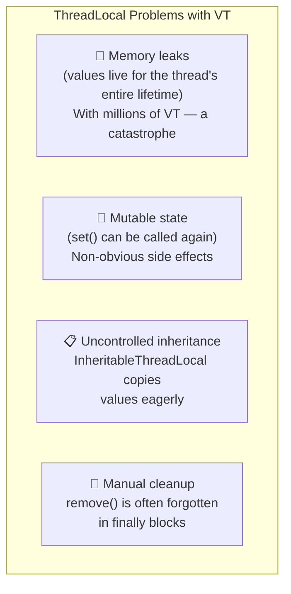
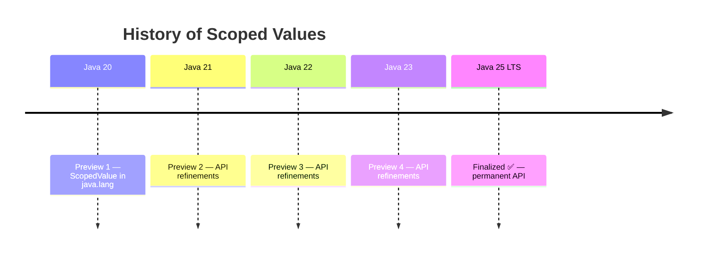
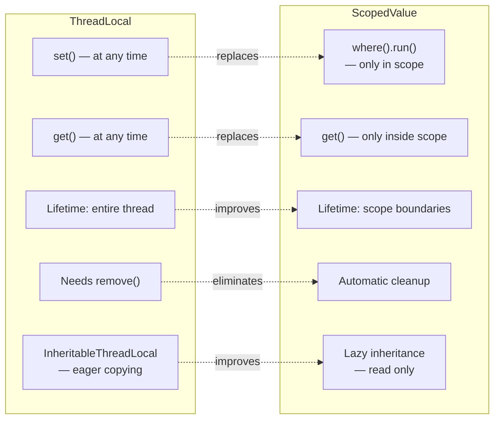
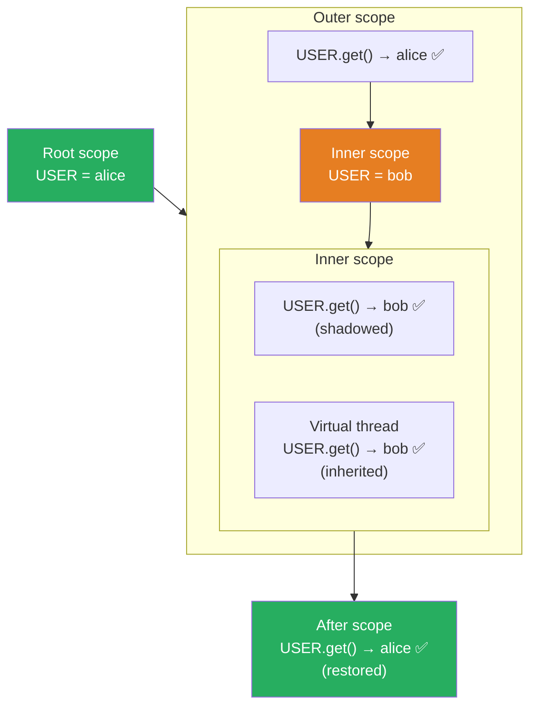
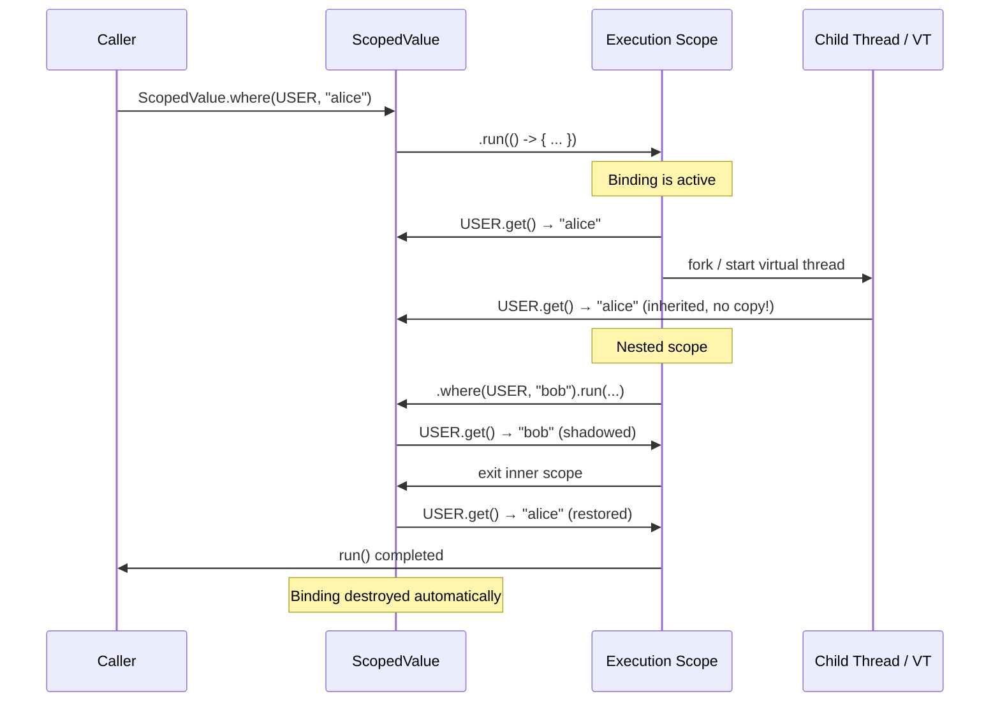
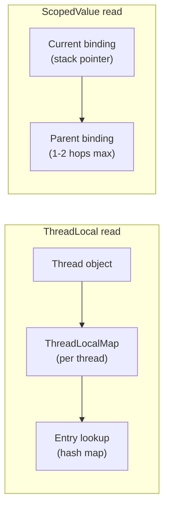

# Scoped Values

> **Project:** Loom
> **Java version:** 25 (final)
> **Status:** Released

Scoped Values provide immutable, inheritable context for a bounded execution scope. They are a modern replacement for `ThreadLocal` that works correctly with virtual threads and Structured Concurrency — without the memory leaks and mutability issues of the legacy approach.

---

## History and Evolution

### The ThreadLocal Problem

`ThreadLocal` has been part of Java since version 1.2, providing thread-local variables:

```java
private static final ThreadLocal<String> currentUser = new ThreadLocal<>();

currentUser.set("alice");
// ... later in the same thread ...
String user = currentUser.get(); // "alice"
```

With platform threads this works. With virtual threads — it doesn't:



### API Evolution



Scoped Values were developed in parallel with Structured Concurrency, as these two features are complementary: Scoped Values provide the *data context*, Structured Concurrency provides the *execution context*.

---

## Comparison: ThreadLocal vs ScopedValue



| Aspect | `ThreadLocal` | `ScopedValue` |
|---|---|---|
| Mutability | Mutable (`set()` at any time) | Immutable (once per scope) |
| Lifetime | Entire thread lifetime | Bounded scope (`run()` / `call()`) |
| Cleanup | Manual `remove()` | Automatic on scope exit |
| Memory leaks | Common | Architecturally impossible |
| Child thread inheritance | Eager copying | Lazy, read only |
| Virtual thread friendly | No | Yes |

---

## Architecture: Binding Model

### Scope Hierarchy



### Binding Lifecycle



---

## Implementation: API and Patterns

### Basic Usage

```java
private static final ScopedValue<String> USER = ScopedValue.newInstance();

// Bind a value to a scope
ScopedValue.where(USER, "alice").run(() -> {
    System.out.println(USER.get()); // alice

    // Child threads inherit the value
    Thread.ofVirtual().start(() -> {
        System.out.println(USER.get()); // alice — inherited!
    });

    // Nested scopes can override (shadowing)
    ScopedValue.where(USER, "bob").run(() -> {
        System.out.println(USER.get()); // bob — shadowed
    });

    System.out.println(USER.get()); // alice — outer scope unchanged
});

// USER.get() throws NoSuchElementException outside the scope
```

### Multiple Scoped Values at Once

```java
ScopedValue.where(USER, "alice")
           .where(REQUEST_ID, "req-123")
           .where(TRACE_ID, "trace-456")
           .run(() -> {
               // All three are available
               processRequest();
           });
```

### Integration with Structured Concurrency

```java
private static final ScopedValue<String> USER = ScopedValue.newInstance();

public UserData getUserData(String userId) {
    return ScopedValue.where(USER, userId).call(() -> {
        try (var scope = StructuredTaskScope.<Object>open()) {
            Subtask<Profile>     profile = scope.fork(() -> fetchProfile(USER.get()));
            Subtask<List<Order>> orders  = scope.fork(() -> fetchOrders(USER.get()));

            scope.join(); // FailedException if something failed

            return new UserData(profile.get(), orders.get());
        }
    });
}
```

`USER` is automatically inherited by all tasks inside the structured scope. No manual parameter passing, no `ThreadLocal` pollution.

---

## Performance Model



- **Fast reads**: walking the binding chain (usually 1–2 steps)
- **No allocation on read**: unlike `ThreadLocal`, which may allocate `ThreadLocalMap` entries
- **No cleanup cost**: bindings are stack-disciplined, `remove()` is not needed
- **Lazy inheritance**: child threads don't copy values, they read from the parent's binding table

---

## Comparison of Context Passing Approaches

| Approach | When to use | Limitation |
|---|---|---|
| Explicit parameter passing | Short call chains | Pollutes every method signature |
| `ThreadLocal` | Legacy code, platform threads only | Memory leaks, mutability, not for VT |
| `ScopedValue` | Modern code with VT / SC | Requires bounding all reads within a scope |
| Context objects | Complex multi-value context | Manual propagation, no automatic inheritance |

---

## See Also

- [Scoped Values and Structured Concurrency — main feature page](../../12-structured-concurrency.md)
- [Virtual Threads](01-virtual-threads.md) — designed to work with Scoped Values
- [Structured Concurrency](02-structured-concurrency.md) — execution context companion
- [Examples: Structured Concurrency](../../../examples/java/13-concurrency-structured/README.md)
