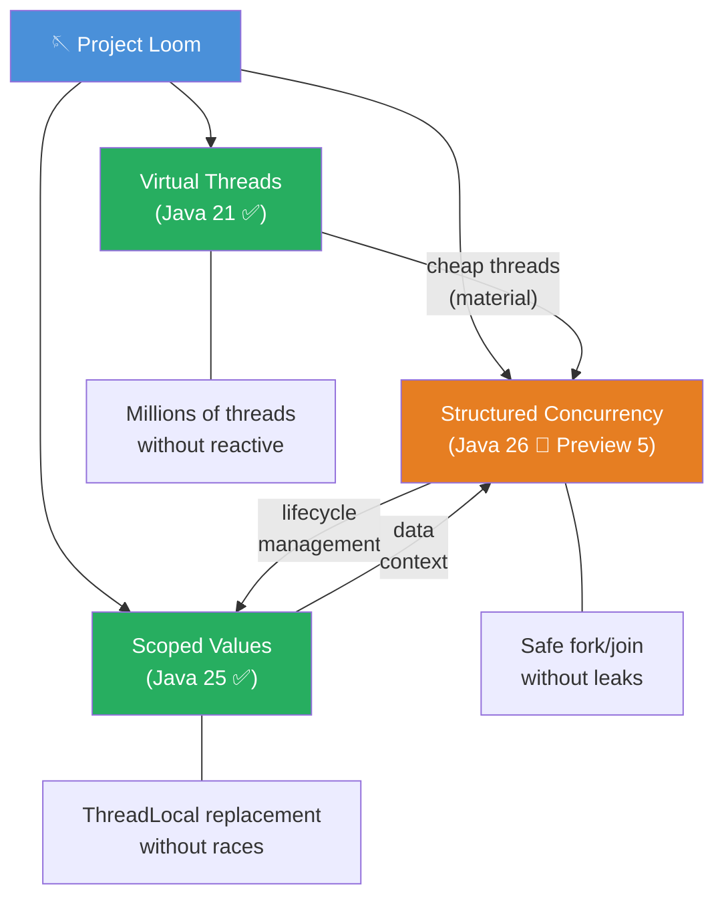
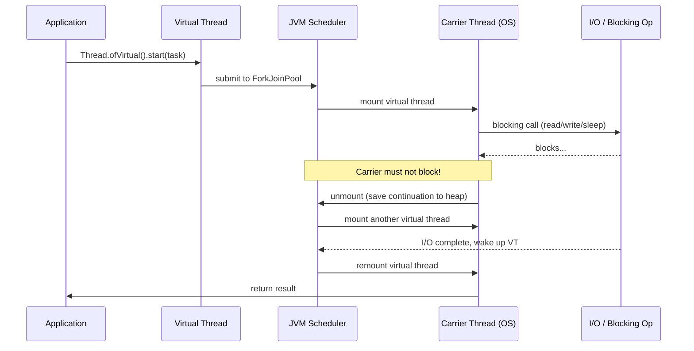
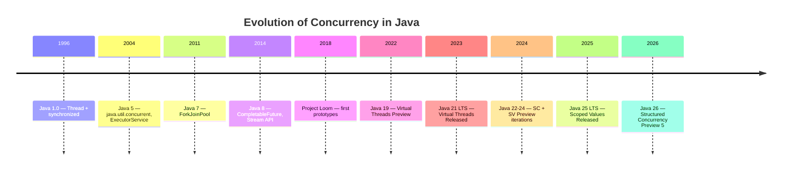

# Project Loom

> **Status:** Actively evolving — core finalized in Java 21 LTS, Scoped Values in Java 25 LTS, Structured Concurrency continues to evolve.
> **Goal:** Scalable concurrency with the simple "one thread per request" model, without reactive abstractions.

Project Loom introduces lightweight concurrency constructs to the Java Platform, enabling developers to write highly concurrent code in the familiar imperative style with blocking I/O. Instead of requiring a switch to complex reactive APIs, Loom makes the traditional "one thread per request" model viable at massive scale.

The key insight: virtual threads are so cheap that they can be created by the millions — and blocking a thread ceases to be an expensive operation. This removes the main motivation for async/reactive programming in I/O-bound applications.

---

## Delivered Technologies

| # | Technology | Java version | Status | Page |
|---|---|---|---|---|
| 01 | Virtual Threads | 21 (final) | Released | [01-virtual-threads.md](01-virtual-threads.md) |
| 02 | Structured Concurrency | 26 | Preview 5 | [02-structured-concurrency.md](02-structured-concurrency.md) |
| 03 | Scoped Values | 25 (final) | Released | [03-scoped-values.md](03-scoped-values.md) |

---

## Architectural Overview

### The Problem Before Loom

Traditional Java concurrency relies on platform threads, which map 1:1 to operating system threads. OS threads are expensive:

- **Memory**: Each thread consumes ~1 MB of stack space
- **Creation**: Slow, requires a system call
- **Context switching**: Handled by the OS kernel

This gave rise to two undesirable patterns:
1. **Thread pools** — complex sizing, saturation policies, deadlocks
2. **Reactive programming** — callback chains, `CompletableFuture`, hard-to-debug stack traces

### The Three Pillars of Loom



### How the Scheduler Works



---

## Evolution of the Concurrency Model in Java



---

## Comparison of Approaches

```mermaid
quadrantChart
    title Approaches to Concurrency in Java
    x-axis Code simplicity --> Code complexity
    y-axis Low scalability --> High scalability
    quadrant-1 Ideal
    quadrant-2 Scalable but complex
    quadrant-3 Simple but not scalable
    quadrant-4 Poor everywhere

    Virtual Threads: [0.15, 0.90]
    Reactive (Reactor/RxJava): [0.85, 0.85]
    CompletableFuture: [0.65, 0.70]
    Thread Pool (fixed): [0.30, 0.45]
    Raw Threads (new Thread): [0.20, 0.20]
```

---

## Relationship with Other OpenJDK Projects

| Project | Area | Interaction with Loom |
|---|---|---|
| **Panama** | Native interop | FFM API + virtual threads for native I/O |
| **Valhalla** | Value types | Lightweight data carriers in concurrent code |
| **Amber** | Language features | Records and pattern matching simplify task processing code |

---

## See Also

- [Virtual Threads](../../08-virtual-threads.md) — main feature page
- [Structured Concurrency](../../12-structured-concurrency.md) — main feature page
- [CompletableFuture](../../09-completable-future.md) — comparison with async style
- [Concurrency Utilities](../../15-concurrent.md) — `java.util.concurrent` primitives
- [Examples: Concurrency](../../../examples/java/09-concurrency/README.md)
- [Examples: Structured Concurrency](../../../examples/java/13-concurrency-structured/README.md)
