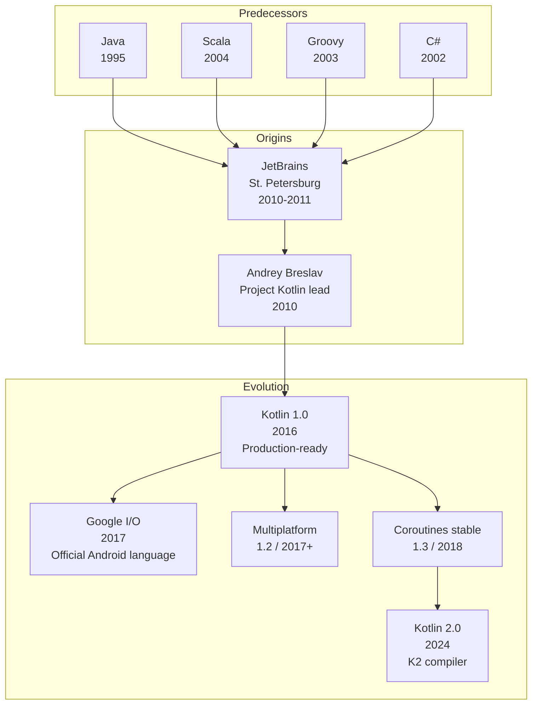
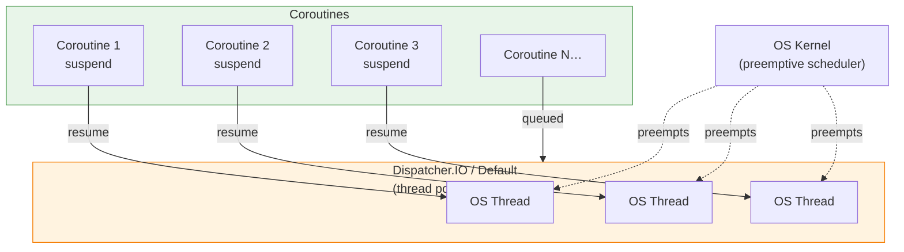

# Kotlin

| | |
|---|---|
| **Year** | 2011 (announced) · 2016 (1.0) |
| **Creator(s)** | JetBrains (Andrey Breslav, Roman Elizarov) |
| **Paradigm(s)** | Multi-paradigm (object-oriented, functional) |
| **Typing** | Static, strong, type-inferred, null-safe |
| **Platform** | JVM · Android · Native (LLVM) · JS · Wasm |
| **Key features** | Null safety, data classes, coroutines, multiplatform, Java interop |
| **Current version** | Kotlin 2.x (K2 compiler) |
| **Official site** | [kotlinlang.org](https://kotlinlang.org) |

---

## Contents

1. [Overview](#overview)
2. [Historical Context](#historical-context)
3. [Design Philosophy](#design-philosophy)
4. [Key Ideas](#key-ideas)
   - [Null Safety](#null-safety)
   - [Data Classes](#data-classes)
   - [Sealed Classes](#sealed-classes)
   - [Extension Functions](#extension-functions)
   - [Smart Casts](#smart-casts)
5. [Concurrency Model](#concurrency-model)
   - [Coroutines](#coroutines)
   - [Dispatchers](#dispatchers)
   - [Structured Concurrency](#structured-concurrency)
   - [Channels and Flow](#channels-and-flow)
   - [Scheduling Model](#scheduling-model)
6. [Type System](#type-system)
7. [Multiplatform](#multiplatform)
8. [Java Interop](#java-interop)
9. [Influence](#influence)
10. [Strengths and Weaknesses](#strengths-and-weaknesses)
11. [Code Examples](#code-examples)
12. [Related Topics](#related-topics)
13. [Further Reading](#further-reading)

---

## Overview

Kotlin is a **statically typed, multi-paradigm language** created by JetBrains
to be a pragmatic replacement for Java on the JVM. It compiles to JVM bytecode,
JavaScript, native binaries, and WebAssembly, sharing code across platforms
through **Kotlin Multiplatform (KMP)**.

Kotlin's distinctive characteristics:
- **100% Java interop** — drop into any Java project, call Java from Kotlin and vice versa
- **Null safety in the type system** — the compiler distinguishes nullable `T?` from non-null `T`
- **Coroutines** — lightweight, cooperative concurrency built around suspend functions
- **Concise syntax** — extension functions, smart casts, data classes, lambdas
- **Tooling-first** — built by the makers of IntelliJ, deep IDE integration from day one

Kotlin powers:
- **Android** — official language for Android development since 2017
- **Server-side JVM** — Spring, Ktor, Micronaut, Quarkus all support Kotlin first-class
- **Multiplatform mobile** — sharing business logic between iOS and Android
- **Build tooling** — Gradle's Kotlin DSL is the recommended build script format

---

## Historical Context



| Year | Event | Note |
|------|-------|------|
| 2010 | JetBrains starts internal "Project Kotlin" | Frustration with Java verbosity in IntelliJ codebase |
| 2011 | Public announcement at JVM Language Summit | Named after Kotlin Island near St. Petersburg |
| 2012 | Open-sourced under Apache 2.0 | |
| 2016 | **Kotlin 1.0 released** | First production-ready version |
| 2017 | Google announces official Android support | I/O keynote; Kotlin becomes Android's preferred language |
| 2018 | Coroutines reach stable (1.3) | Cooperative concurrency, no callback hell |
| 2019 | Google: "Kotlin-first for Android" | New Android APIs documented in Kotlin first |
| 2021 | Kotlin 1.5 — JVM records, sealed interfaces, inline classes | |
| 2024 | **Kotlin 2.0 — K2 compiler** | Faster compilation, foundation for future features |

The name comes from **Kotlin Island** in the Gulf of Finland, mirroring the
tradition of naming JVM languages after islands (Java → Java island).

---

## Design Philosophy

Kotlin's design is shaped by four pragmatic goals:

1. **Pragmatism over purity** — borrow good ideas from Scala, C#, Groovy,
   but stay readable and approachable to Java developers
2. **Java interop is non-negotiable** — every Kotlin feature must work
   seamlessly with existing Java code and libraries
3. **Null safety in the type system** — fail at compile time, not in production
4. **Tooling matters** — the language is designed alongside the IDE that
   provides refactorings, completion, and inspections

Kotlin deliberately avoids the "kitchen sink" feel of Scala — fewer features,
each carefully chosen for clarity and Java compatibility.

---

## Key Ideas

### Null Safety

Nullability is part of the type system. `String` cannot be null; `String?` can.

```kotlin
var a: String = "hello"
// a = null   // compile error

var b: String? = "hello"
b = null      // OK

// Safe call — returns null if b is null
val length: Int? = b?.length

// Elvis operator — fallback value
val safeLength: Int = b?.length ?: 0

// Not-null assertion — throws if b is null
val forced: Int = b!!.length
```

This eliminates the most common runtime error in JVM history.
Calls into Java are marked as "platform types" — Kotlin can't know whether
a Java method may return null, so it leaves the choice to the caller.

### Data Classes

A one-line declaration that generates `equals`, `hashCode`, `toString`,
`copy`, and component functions for destructuring.

```kotlin
data class User(val name: String, val email: String, val age: Int)

val alice = User("Alice", "alice@example.com", 30)
val older = alice.copy(age = 31)
val (name, _, age) = alice  // destructuring
```

### Sealed Classes

Closed hierarchies — the compiler knows every subtype, enabling exhaustive
`when` expressions without an `else` branch.

```kotlin
sealed interface Result<out T> {
    data class Success<T>(val value: T) : Result<T>
    data class Failure(val error: Throwable) : Result<Nothing>
}

fun <T> render(r: Result<T>): String = when (r) {
    is Result.Success -> "ok: ${r.value}"
    is Result.Failure -> "fail: ${r.error.message}"
    // no else — compiler verifies exhaustiveness
}
```

### Extension Functions

Add methods to types you don't own, without inheritance.

```kotlin
fun String.toSlug(): String =
    lowercase().replace(Regex("[^a-z0-9]+"), "-").trim('-')

"Hello, World!".toSlug()  // "hello-world"
```

Extension functions are resolved statically and compile to plain static
methods — no runtime overhead.

### Smart Casts

After a successful `is` check or null check, the compiler narrows the type
automatically.

```kotlin
fun describe(x: Any): String {
    if (x is String) return "string of length ${x.length}"  // x is String here
    if (x is Int && x > 0) return "positive int $x"
    return "something else"
}
```

---

## Concurrency Model

Kotlin's concurrency story is built around **coroutines** — lightweight,
cooperative tasks that yield at well-defined suspension points. Unlike Java
virtual threads (which are runtime-managed continuations), Kotlin coroutines
rely on a **compile-time CPS transform** of suspending functions.

### Coroutines

A `suspend` function may suspend execution without blocking its underlying thread.
Suspension points are explicit — they're calls to other suspending functions.

```kotlin
import kotlinx.coroutines.*

suspend fun fetchUser(id: Int): User {
    delay(100)                        // suspension point — does NOT block a thread
    return User("user-$id", "...", 0)
}

fun main() = runBlocking {
    val user = fetchUser(42)         // suspends, but no thread is parked
    println(user)
}
```

**Coroutine builders** start coroutines from regular code:

| Builder | Returns | Purpose |
|---|---|---|
| `launch` | `Job` | Fire-and-forget concurrent task |
| `async` | `Deferred<T>` | Concurrent task with a result, await later |
| `runBlocking` | `T` | Bridge from blocking to suspending — used in `main`, tests |
| `withContext` | `T` | Switch dispatcher, suspend until result |

### Dispatchers

A dispatcher decides **which thread pool** runs a coroutine. This is where
the cooperative coroutine world meets the preemptive OS-thread world.

| Dispatcher | Backing | Use |
|---|---|---|
| `Dispatchers.Default` | Shared pool sized to CPU cores | CPU-bound work |
| `Dispatchers.IO` | Elastic pool (up to 64+ threads) | Blocking I/O, file/network calls |
| `Dispatchers.Main` | Platform UI thread (Android, Swing) | UI updates |
| `Dispatchers.Unconfined` | Caller thread until first suspension | Tests, narrow control |

```kotlin
suspend fun loadAndRender() = coroutineScope {
    val data = withContext(Dispatchers.IO) { httpGet("...") }
    withContext(Dispatchers.Main) { ui.render(data) }
}
```

### Structured Concurrency

Every coroutine belongs to a `CoroutineScope`. Cancelling the scope cancels
all child coroutines. This eliminates the "leaked task" class of bugs.

```kotlin
suspend fun loadDashboard(): Dashboard = coroutineScope {
    val user    = async { fetchUser(currentId) }
    val orders  = async { fetchOrders(currentId) }
    val news    = async { fetchNews() }
    Dashboard(user.await(), orders.await(), news.await())
    // if ANY child fails, the others are cancelled automatically
}
```

`supervisorScope` provides the same lifetime semantics but isolates failures —
a failing child doesn't cancel its siblings.

### Channels and Flow

For communication between coroutines Kotlin provides two abstractions:

- **`Channel<T>`** — CSP-style synchronous queue, conceptually similar to
  a Go channel
- **`Flow<T>`** — cold, reactive stream with operators (`map`, `filter`,
  `collect`, `flatMapMerge`), comparable to RxJava but built on coroutines

```kotlin
// Channel — producer / consumer
val ch = Channel<Int>()
launch {
    repeat(5) { ch.send(it * it); }
    ch.close()
}
for (v in ch) println(v)

// Flow — declarative stream
val ticks: Flow<Int> = flow {
    var i = 0
    while (true) { emit(i++); delay(1000) }
}
ticks.take(3).collect { println(it) }
```

`StateFlow` and `SharedFlow` are hot variants commonly used for UI state and
event broadcasts on Android.

### Scheduling Model

Kotlin sits at the same crossroads as Java virtual threads: **cooperative
tasks on top of preemptive OS threads**.



- **Coroutines themselves are cooperative** — they yield only at `suspend`
  calls. A tight CPU loop without any `suspend` call holds its thread until
  it returns.
- **The dispatcher's threads are preemptively scheduled by the OS** — so the
  *Kotlin process* still receives fair CPU time, but coroutines on the same
  dispatcher do not preempt each other.
- **Continuation-passing style at compile time** — the compiler rewrites every
  `suspend` function into a state machine that takes an extra `Continuation<T>`
  parameter. This is the key difference from Java virtual threads, which use
  *runtime* continuations from the JVM.

**Comparison with Java virtual threads:**

| Aspect | Kotlin coroutines | Java virtual threads |
|---|---|---|
| When introduced | Stable 1.3 (2018) | Stable in Java 21 (2023) |
| Continuation | Compile-time CPS transform | JVM-managed runtime continuation |
| Marking | Explicit `suspend` keyword | Transparent (regular code) |
| Cancellation | Built-in, propagates through scope | `Thread.interrupt()` semantics |
| Cross-platform | JVM, Native, JS, Wasm | JVM only |

→ [Scheduling: Preemptive vs Cooperative](../../topics/concurrency/index.md#scheduling-preemptive-vs-cooperative)

---

## Type System

Beyond null safety, Kotlin's type system includes:

- **Declaration-site variance** — `interface List<out T>` (covariant in `T`),
  `interface Comparator<in T>` (contravariant). Removes most use-site `? extends T`
  / `? super T` noise from Java generics.
- **Reified generics** in `inline` functions — type parameters survive at runtime:

  ```kotlin
  inline fun <reified T> Any.castOrNull(): T? = this as? T
  ```

- **Function types are first-class** — `(Int, String) -> Boolean` is a type,
  with literal syntax `{ x, s -> ... }`.
- **Inline / value classes** — zero-overhead wrappers for primitive-like types:

  ```kotlin
  @JvmInline value class UserId(val raw: Long)
  ```

- **Type aliases** — local renames without creating new types.

---

## Multiplatform

Kotlin compiles to **four target families** from a shared source set:

| Target | Backend | Typical use |
|---|---|---|
| **Kotlin/JVM** | JVM bytecode | Server, Android, desktop |
| **Kotlin/Native** | LLVM | iOS, embedded, CLI tools |
| **Kotlin/JS** | JavaScript | Browser, Node.js |
| **Kotlin/Wasm** | WebAssembly | Browser, edge runtimes |

**Kotlin Multiplatform (KMP)** lets a project share business logic
(networking, persistence, domain models) across platforms while keeping
UI native (SwiftUI on iOS, Jetpack Compose on Android).

`expect` / `actual` declarations define platform-specific implementations
of a shared API.

---

## Java Interop

Java interop was the founding constraint and remains airtight:

- Call any Java class from Kotlin and vice versa
- Kotlin classes appear as ordinary classes to Java tools (Maven, Gradle, JaCoCo)
- Annotations like `@JvmStatic`, `@JvmField`, `@JvmOverloads`, `@JvmName` tune
  the generated JVM signatures for Java consumers
- Mixed Java/Kotlin modules are routine — most large codebases adopt Kotlin
  incrementally rather than migrating wholesale

```kotlin
// Kotlin
class Greeter(val name: String) {
    @JvmStatic companion object {
        fun create(name: String) = Greeter(name)
    }
    @JvmOverloads
    fun greet(prefix: String = "Hello"): String = "$prefix, $name"
}
```

```java
// Java — sees Kotlin code naturally
Greeter g = Greeter.create("World");
g.greet();           // uses default "Hello"
g.greet("Hi");
```

---

## Influence

### Influenced by

- **[Java](../java/index.md)** — JVM target, syntax baseline, ecosystem
- **Scala** — type inference, function literals, multiparadigm approach
- **C#** — properties, extension methods, data classes, `async`-style scoping
- **Groovy** — builder DSLs, named arguments
- **Python** — concise syntax, default arguments, ranges

### Influenced

- **Java JEPs** — record classes, pattern matching, sealed types arrived
  in Java after appearing in Kotlin (and Scala)
- **Swift** — overlapping design space (null safety, value types, structured
  concurrency); cross-pollination via mobile development

---

## Strengths and Weaknesses

### Strengths

- **Pragmatic balance** of expressiveness and approachability for Java developers
- **First-class Android support** with deep tooling integration
- **Coroutines** as a unified concurrency model across all targets
- **Java interop** lets teams adopt incrementally with no rewrites
- **Multiplatform** is unique among mainstream JVM languages

### Weaknesses

- **Compile times** historically slower than Java (improving with K2)
- **Binary size** on JVM slightly larger due to the standard library
- **Native and JS backends** less mature than JVM
- **K2 transition** has caused churn in plugins and Gradle scripts
- **Learning curve for coroutines** — `suspend`, dispatchers, scope discipline
  take time

---

## Code Examples

Runnable Kotlin examples are not yet part of the atlas. Once added, they
will live in `examples/kotlin/`.

| # | Example | Status |
|---|---|---|
| 01 | Hello World | 🔲 |
| 02 | Variables & types | 🔲 |
| 03 | Functions and lambdas | 🔲 |
| 04 | Classes and data classes | 🔲 |
| 05 | Null safety | 🔲 |
| 06 | Collections | 🔲 |
| 07 | Sealed classes & pattern matching | 🔲 |
| 08 | Coroutines | 🔲 |
| 09 | Channels & Flow | 🔲 |

---

## Related Topics

- [Concurrency](../../topics/concurrency/index.md) — including the
  [Scheduling section](../../topics/concurrency/index.md#scheduling-preemptive-vs-cooperative)
- [Java](../java/index.md) — JVM sibling and interop target
- [Functional Programming](../../topics/functional/index.md) — immutability,
  higher-order functions, expression-based design
- [Languages Genealogy Map](../../maps/languages-genealogy.md)

---

## Further Reading

- [Official documentation](https://kotlinlang.org/docs/home.html)
- [Kotlin Coroutines guide](https://kotlinlang.org/docs/coroutines-guide.html)
- *Kotlin in Action* — Dmitry Jemerov, Svetlana Isakova (Manning, 2017)
- *Atomic Kotlin* — Bruce Eckel, Svetlana Isakova (2021)
- *Kotlin Coroutines: Deep Dive* — Marcin Moskała (2022)
